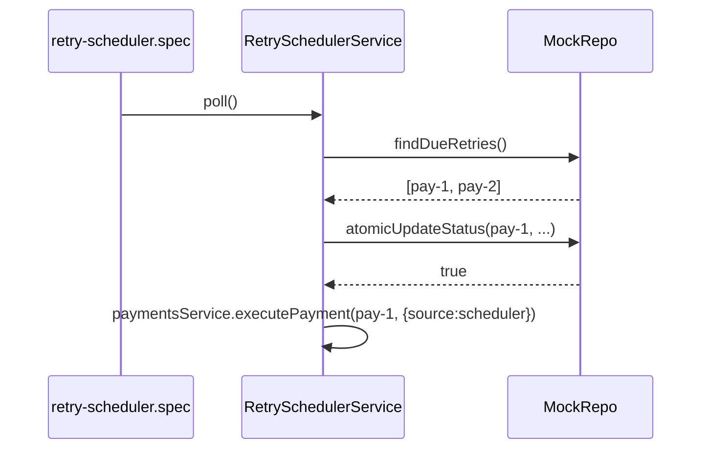
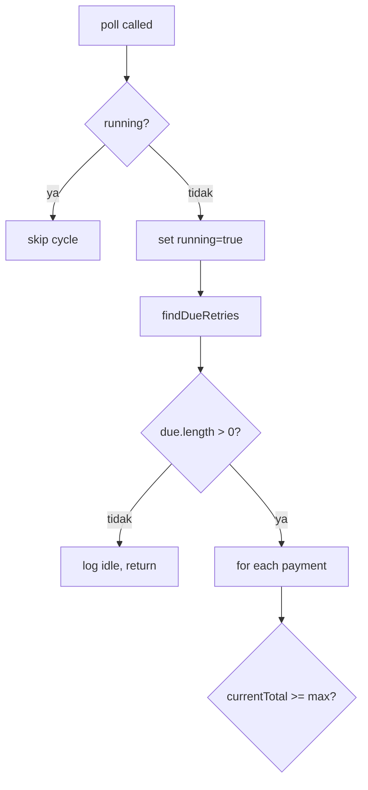
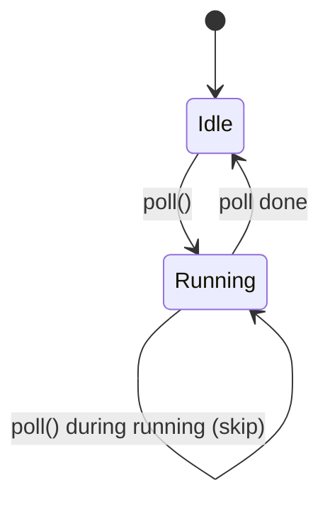

saya butuh diagram agar memperjelas skenario tiap unit test, apakah itu bisa disebut penambahan dari task retry-failure/docs/tasks/TASK-15-documentation.md ? atau harus mengerjakan task retry-failure/docs/tasks/TASK-15-documentation.md terlebih dahulu? 
kita diskusi dlu, beri masukan dan pertimbangan

Mari saya baca TASK-15-documentation.md dulu untuk paham konteksnya:
Saya sudah punya context. Mari saya juga cek test files untuk paham scope "diagram per unit test":
Saya sudah punya cukup context. Mari saya berikan analisis dan masukan diskusi.

---

# 💭 Diskusi: Diagram untuk Unit Test Skenario

## 📋 Analisis Situasi

### 1. Apa yang Anda Mau

Diagram yang memperjelas skenario tiap unit test — kemungkinan besar visualisasi flow seperti:

- Test name → setup → action → assertion yang divalidasi
- Atau sequence diagram untuk test yang kompleks (e.g., scheduler poll + service executePayment + audit record)
- Atau state diagram untuk test yang verify state transitions

### 2. Status TASK-15

Saya baca TASK-15-documentation.md (1054 lines). Tujuan utamanya:

- 4 file dokumen final: `README.md`, `DEMO_SCENARIOS.md`, `PRODUCTION_CAVEATS.md`, `ADAPTATION_NOTES.md`
- Cross-link dari `tasks/README.md`
- **Scope eksplisit**: 5 demo scenario A-E (Transient Retry, Permanent, Circuit Breaker, Idempotency HERO, Retry-After)
- **Fokus business impact** untuk stakeholder, bukan test internals
- **Out of scope (line 42)**: "Architecture diagram (Mermaid / PlantUML)" — visual diagram adalah future work

### 3. Mismatch Fokus

| TASK-15 (existing plan) | Diagram yang Anda mau |
|---|---|
| Business-facing (5 demo A-E) | Engineering-facing (142 tests internals) |
| Stakeholder / next engineer | Developer yang maintain test |
| Demo via Vue dashboard atau curl | Test execution flow |
| Out of scope: visual diagram | Inti yang Anda mau: visual diagram |

**TASK-15 tidak cocok sebagai wadah untuk diagram unit test** karena:
- Scope-nya different audience (stakeholder vs developer)
- Eksplisit exclude visual diagram
- Tidak menyentuh test internals

---

## 🎯 Opsi yang Bisa Kita Diskusi

### Opsi A: Buat Task Baru "TASK-16-test-documentation.md"

**Konten**:
- Diagram per test suite (3 tier: unit, integration, e2e)
- Sequence diagram untuk test kompleks (scheduler re-entrancy, idempotency replay flow, breaker state transitions)
- Decision tree untuk test maintenance (sudah ada di TEST_MAINTENANCE_RULES.md, tinggal di-diagram-kan)
- Mock parity diagram (real adapter ↔ mock file mapping)

**Plus**:
- ✅ Bersih — TASK-15 tetap fokus business docs, TASK-16 fokus engineering docs
- ✅ Bisa jadi referensi cepat saat onboarding developer baru
- ✅ Diagram visual lebih mudah dipahami dari pada baca 200+ baris test code
- ✅ Bisa pakai Mermaid (sudah umum di Markdown, render di GitHub/GitLab)

**Minus**:
- ❌ Tambah 1 task baru — perlu tracking terpisah
- ❌ Maintenance burden: kalau test berubah, diagram juga harus di-update

---

### Opsi B: Tambahkan ke TEST_MAINTENANCE_RULES.md (extension)

**Konten**: Tambah section "Test Scenario Diagrams" di akhir `docs/TEST_MAINTENANCE_RULES.md`

**Plus**:
- ✅ Satu tempat untuk semua test-related docs
- ✅ TEST_MAINTENANCE_RULES.md sudah exist dan well-linked dari CONTRIBUTING + README
- ✅ Tidak tambah file baru

**Minus**:
- ❌ TEST_MAINTENANCE_RULES.md fokusnya "rule", bukan "documentation"
- ❌ Bisa jadi terlalu panjang dan campur aduk antara rule + diagram

---

### Opsi C: Kerjakan TASK-15 Dulu, Lalu Task Baru untuk Test Diagrams

**Urutan**:
1. Kerjakan TASK-15 (business docs: README, DEMO_SCENARIOS, PRODUCTION_CAVEATS, ADAPTATION_NOTES) — sesuai plan
2. Buat TASK-16 (test documentation + diagrams) sebagai post-TASK-15 work

**Plus**:
- ✅ TASK-15 adalah task terakhir yang sudah didefinisikan PLAN1 — closure untuk plan rev 2
- ✅ Setelah TASK-15 selesai, "plan rev 2 complete" (sesuai yang ditulis di TASK-15 line 21)
- ✅ Test diagram adalah value-add di luar plan — bisa iterative setelah plan complete

**Minus**:
- ❌ Tunda kebutuhan Anda untuk diagram test
- ❌ Kalau TASK-15 ternyata banyak revisi (karena ada input baru), test diagram bisa tertunda lama

---

### Opsi D: Hybrid — Kerjakan TASK-15 + Sisipkan Section Diagram Test di TASK-15

**Konten**: TASK-15 tetap fokus business docs, tapi di `docs/ADAPTATION_NOTES.md` atau `README.md` tambah section "Engineering Documentation" yang reference ke TEST_MAINTENANCE_RULES.md + diagram summary test scenario.

**Plus**:
- ✅ TASK-15 selesai sesuai plan
- ✅ Test diagram dapat tempat (di file baru `docs/TEST_SCENARIO_DIAGRAMS.md`)
- ✅ Cross-link dari TASK-15 deliverables

**Minus**:
- ❌ Bisa bikin TASK-15 scope jadi kabur
- ❌ Test diagram detail bukan bagian plan rev 2 (out of original scope)

---

## 💡 Rekomendasi Saya: **Opsi A (Task Baru TASK-16)**

Alasan:

### 1. **Separation of Concerns yang Bersih**

- **TASK-15** = dokumen business untuk stakeholder/next engineer — narasi demo, production caveats, adaptation notes
- **TASK-16** = dokumen engineering untuk developer yang maintain test — diagram skenario, mock parity, decision flow

Dua-duanya valid, tapi audience-nya berbeda. Campur aduk bikin keduanya kurang optimal.

### 2. **TASK-15 Tidak Bisa Dipecah untuk Akomodasi Diagram**

TASK-15 sudah didefinisikan plan rev 2 sebagai "documentation final + closure". Out of scope-nya eksplisit menyebut "Architecture diagram (Mermaid / PlantUML)". Memaksakan test diagram ke TASK-15 = break plan commitment.

### 3. **Test Diagram Bisa Iteratif Setelah TASK-15 Complete**

Kalau kita kerjakan TASK-15 dulu (2-3 jam estimated), plan rev 2 resmi complete. Lalu buat TASK-16 sebagai "post-plan documentation" — bebas dari plan constraint, bisa iteratif sesuai kebutuhan.

### 4. **Diagram yang Anda Mau Bisa Mulai dari yang Paling Berharga**

Kalau saya usul prioritas diagram (sebelum mulai TASK-16):

| Prioritas | Diagram | Tujuan | Test Files Terkait |
|---|---|---|---|
| **1** | Scheduler flow + re-entrancy guard | Memperjelas processOne flow + atomicUpdateStatus + re-entrancy check | `retry-scheduler.service.spec.ts` |
| **2** | Idempotency replay flow (succeed-but-drop-response) | Hero scenario — kenapa actualCharges ≤ 1 walaupun calls ≥ 2 | `idempotency.spec.ts`, `http-adapter.spec.ts` |
| **3** | Resilient adapter: classify → retry vs permanent | Decision tree Cockatiel retry vs scheduler | `resilient-adapter.spec.ts`, `composition.spec.ts` |
| **4** | Circuit breaker state machine | CLOSED ↔ OPEN ↔ HALF_OPEN transitions | `composition.spec.ts` (breaker tests) |
| **5** | Test maintenance decision tree | Visualisasi flow dari TEST_MAINTENANCE_RULES.md | (cross-cutting) |

### 5. **Tidak Block TASK-15**

Kalau Anda urgent butuh diagram untuk test sekarang, kita bisa kerjakan paralel:
- Subagent A → TASK-15 (business docs)
- Subagent B → TASK-16 (test diagrams)

Tapi saya rekomendasi **sequential** supaya quality-nya terjaga — tidak ada context switching.

---

## 🤔 Pertanyaan untuk Anda

Sebelum kita decide, beberapa pertanyaan klarifikasi:

1. **Target audience diagram** — untuk Anda sendiri (future-self)? Untuk tim? Untuk onboarding developer baru? Untuk handover ke stakeholder?

2. **Format diagram** — Mermaid (text-based, render di GitHub)? Atau visual image (PNG/SVG via Excalidraw/draw.io)? Atau sequence diagram interactive (WebSequenceDiagrams)?

3. **Scope test yang mau di-diagram-kan** — semua 142 tests? Atau hanya yang skenarionya kompleks (e.g., scheduler, idempotency, breaker)? Atau hanya 7 yang barusan kita fix?

4. **Level of detail** — high-level (1 diagram per test suite, 9 diagrams total)? Atau detailed (1 diagram per individual test case, 142 diagrams)? Atau middle (per describe block)?

5. **Output location** — di `docs/test-scenarios/` folder baru? Atau embedded di tiap test file sebagai header comment? Atau satu file `docs/TEST_SCENARIO_DIAGRAMS.md`?

---

## 📝 Kalau Anda Setuju Opsi A, Draft Task Plan

Saya bisa draft `docs/tasks/TASK-16-test-documentation.md` dengan struktur:

```text
# TASK-16 - Test Documentation & Scenario Diagrams

## Goal
Dokumentasikan skenario test dengan visual diagram untuk memudahkan
maintenance dan onboarding developer baru.

## Scope
- 1 file: docs/TEST_SCENARIO_DIAGRAMS.md
- Mermaid diagrams untuk 5 area prioritas (lihat tabel di atas)
- Cross-link dari TEST_MAINTENANCE_RULES.md + CONTRIBUTING.md

## Out of scope
- TASK-15 business docs (separate task)
- Implementation code changes
- Test coverage reports (jest --coverage)

## Acceptance criteria
- 5+ Mermaid diagrams yang render di GitHub
- Setiap diagram punya narasi pendek yang explain flow
- Cross-link dari CONTRIBUTING + TEST_MAINTENANCE_RULES
```

**Effort estimate**: M (~2-3 jam) untuk 5 diagram + narasi.

---

**Apa pendapat Anda? Mau saya:**

1. **Draft TASK-16** sekarang (plan only, no implementation) supaya Anda bisa review scope dulu
2. **Mulai kerjakan TASK-15** dulu sesuai plan, lalu TASK-16 setelahnya
3. **Diskusi lebih lanjut** — Anda kasih input ke pertanyaan 1-5 di atas, baru kita decide

Mau yang mana?

Diskusi lebih lanjut sebelum membuat draft task-16, jika ada ambigu silahkan tanyaka dulu
1. Target audience diagram: untuk saya dan tim agar mudah memahami.
2. Format diagram: mermaid saja, seperti sequence diagram (kalau tidak salah) pada task retry-failure/docs/tasks/TASK-13a-vue-improvements.md
3. Scope test yang mau di-diagram-kan :  hanya yang skenarionya kompleks namun bisa ditambah suatu saat
4. Level of detail : detailed 
5. Output location: docs/skenario buat dalam bentuk md file. tiap format penamaan file sesuai module contoh test file retry-scheduler.service.spec, jadi nama file nnya retry-scheduler-service-scenario.md


Pertanyaan klarifikasi yang bagus. Mari saya pahami lebih dalam sebelum draft task:

## 🔍 Klarifikasi yang Saya Perlu

### Klarifikasi 1: Urutan Output per Module vs Per Test Suite

Anda bilang "tiap format penamaan file sesuai module, contoh `retry-scheduler.service.spec` → `retry-scheduler-service-scenario.md`". Mari saya konfirmasi pemetaannya:
Bagus, 12 file spec total. Tapi Anda bilang "hanya yang skenarionya kompleks namun bisa ditambah suatu saat" — artinya **tidak semua 12 file langsung dapat diagram**, tapi start dengan yang kompleks, sisanya bisa tambah belakangan.

**Pertanyaan**: dari 12 file ini, mana yang Anda anggap "kompleks" untuk prioritas awal? Saya tanya supaya tidak salah asumsi. Berikut kandidat berdasarkan analisis saya:

| File | Tests | Complexity Signal | Saya Prioritaskan? |
|---|---|---|---|
| `retry-scheduler.service.spec.ts` | 8 | Re-entrancy guard + atomicUpdateStatus + MAX_TOTAL_RETRIES check + scheduler/service boundary | ✅ **YA** (baru saja kita fix 4 failure di sini) |
| `idempotency.spec.ts` | (perlu cek) | Hero scenario — anti-double-charge logic | ✅ **YA** |
| `resilient-adapter.spec.ts` | (perlu cek) | Cockatiel policy composition + onAttempt callback + audit integration | ✅ **YA** |
| `composition.spec.ts` (resilience pkg) | 58 | Retry + timeout + breaker composition + DelegateBackoff | ✅ **YA** (paling kompleks di resilience pkg) |
| `payments.service.spec.ts` | 13 | State transitions + audit graceful degradation + manualRetry | ⚠️ Sedang |
| `http-adapter.spec.ts` | 8 | Mapping axios response → ChargeResult + idempotency-key header | ⚠️ Sedang (baru saja fix 1 failure) |
| `state-machine.spec.ts` | (perlu cek) | Pure state transition logic | ⚠️ Mungkin |
| `audit.service.spec.ts` | (perlu cek) | recordAttempt + listAttempts | ❌ Sederhana |
| `idempotency-key.spec.ts` | (perlu cek) | Pure function (derive key from paymentId) | ❌ Sederhana |
| `payments.controller.spec.ts` | (perlu cek) | HTTP layer | ❌ Sederhana |
| `classifier.spec.ts` (resilience pkg) | (perlu cek) | Error classification pure function | ❌ Sederhana |
| `retry-after.spec.ts` (resilience pkg) | (perlu cek) | Retry-After header parsing pure function | ❌ Sederhana |

**Pertanyaan 1**: Apakah Anda setuju dengan 4 prioritas awal (retry-scheduler, idempotency, resilient-adapter, composition)? Atau mau tambah/kurangi?

---

### Klarifikasi 2: "Level of detail: detailed" — Per Test atau Per Suite?

Anda pilih "detailed" — tapi saya perlu konfirmasi yang mana:

**Opsi A — Per Test Case** (paling detailed):
```
docs/skenario/retry-scheduler-service-scenario.md
├── Mermaid: poll() flow overview (1 diagram)
├── Mermaid: processOne() flow with atomicUpdateStatus (1 diagram)
├── Test #1 "does nothing when no due payments" → Mermaid sequence (1 diagram)
├── Test #2 "processes due payments via executePayment" → Mermaid sequence (1 diagram)
├── Test #3 "continues to next payment when one fails" → Mermaid sequence (1 diagram)
├── Test #4 "skips cycle when already running (re-entrancy)" → Mermaid sequence (1 diagram)
├── Test #5 "catches DB query error without crashing" → Mermaid sequence (1 diagram)
├── Test #6 "marks payment as failed when MAX_TOTAL_RETRIES exceeded" → Mermaid sequence (1 diagram)
└── Test #7-8 "getStats + onApplicationBootstrap" → simple (no diagram needed)
```

Per module: ~5-8 diagrams. Total 4 module × ~6 = ~24 diagrams. Effort: ~4-6 jam.

**Opsi B — Per Describe Block** (middle detailed):
```
docs/skenario/retry-scheduler-service-scenario.md
├── Mermaid: poll() flow overview (1 diagram)
├── Mermaid: processOne() flow with atomicUpdateStatus (1 diagram)
├── describe "RetrySchedulerService - poll" → 1 diagram (gabungan test #1-#5)
├── describe "RetrySchedulerService - getStats" → 1 diagram (optional)
└── describe "RetrySchedulerService - onApplicationBootstrap" → 1 diagram
```

Per module: ~3-4 diagrams. Total 4 module × ~4 = ~16 diagrams. Effort: ~2-3 jam.

**Opsi C — Per Concept** (paling minimal detailed):
```
docs/skenario/retry-scheduler-service-scenario.md
├── Mermaid: poll() flow overview (1 diagram, cover semua poll tests)
├── Mermaid: processOne() flow with atomicUpdateStatus + MAX_TOTAL_RETRIES (1 diagram)
└── Mermaid: re-entrancy guard mechanism (1 diagram, spesifik untuk test #4)
```

Per module: ~2-3 diagrams. Total 4 module × ~3 = ~12 diagrams. Effort: ~1.5-2 jam.

**Pertanyaan 2**: Yang mana? Saya rekomendasi **Opsi A** karena Anda bilang "detailed", tapi kalau terlalu banyak diagram, Opsi B juga OK.

---

### Klarifikasi 3: Format Mermaid — Sequence atau Ada yang Lain?

Anda sebut "sequence diagram". Tapi kadang skenario test lebih cocok pakai **flowchart** (decision tree) atau **state diagram**. Contoh:

**Sequence diagram** (interaksi antar object, waktu):


**Flowchart** (decision tree, tanpa waktu):


**State diagram** (state machine, seperti payment status):


**Pertanyaan 3**: Hanya sequence diagram untuk semua, atau mix sesuai konteks? Saya rekomendasi **mix**:
- Sequence: untuk test yang melibatkan interaksi antar multiple components (e.g., scheduler → repo → service)
- Flowchart: untuk decision tree (e.g., re-entrancy guard, MAX_TOTAL_RETRIES check)
- State diagram: untuk state transitions (e.g., payment status transitions)

Anda mau mix atau strict sequence?

---

### Klarifikasi 4: Narasi di Setiap Diagram

**Opsi A — Minimal**: Hanya judul + diagram + 1-2 baris caption.
```markdown
## Test #4: skips cycle when already running

```mermaid
sequenceDiagram
    ...
```

Figure 4: Re-entrancy guard test flow.
```

**Opsi B — Sedang**: Judul + diagram + caption + bullet points key assertions.
```markdown
## Test #4: skips cycle when already running

```mermaid
sequenceDiagram
    ...
```

**Key assertions**:
- `executePayment` called only 1 time (first poll)
- Second `poll()` returns immediately (running=true)
- `running` flag reset after first poll completes
```

**Opsi C — Lengkap**: Judul + diagram + caption + setup + action + assertions + common pitfalls + PLAN1 reference.
```markdown
## Test #4: skips cycle when already running (re-entrancy guard)

### Setup
- 1 due payment (pay-1) with totalRetryCount=0
- paymentsService.executePayment mocked to await firstCall promise (manual control)

### Flow
```mermaid
sequenceDiagram
    ...
```

### Key assertions
- `executePayment` called 1 time (first poll processes pay-1)
- Second `poll()` returns immediately (running flag is true)
- `running` flag reset after first poll completes

### Common pitfalls
- Without `await Promise.resolve()` ×2, test will fail because processOne now awaits
  atomicUpdateStatus (added in PLAN1 section 12) before executePayment
- See TASK-test-sync-failures.md failure #3 for details

### PLAN1 reference
- Section 10.2: scheduler increments durable retry count
- Section 12: scheduler single-instance + atomic update
```

**Pertanyaan 4**: Mana yang Anda mau? Saya rekomendasi **Opsi C** karena "detailed" + target audience tim Anda (perlu context untuk maintenance).

---

### Klarifikasi 5: Index File + Cross-Link

Apakah perlu `docs/skenario/README.md` sebagai index?

```markdown
# Test Scenario Diagrams

> Visual diagrams untuk skenario test yang kompleks.
> Tujuan: memudahkan tim memahami flow test untuk maintenance.

## Available diagrams

| Module | File | Diagrams | Complexity |
|---|---|---|---|
| retry-scheduler | [retry-scheduler-service-scenario.md](./retry-scheduler-service-scenario.md) | 8 | High |
| idempotency | [idempotency-scenario.md](./idempotency-scenario.md) | 6 | High |
| resilient-adapter | [resilient-adapter-scenario.md](./resilient-adapter-scenario.md) | 5 | High |
| composition (resilience pkg) | [composition-scenario.md](./composition-scenario.md) | 7 | High |

## Conventions
- 1 file per spec module
- Format: Mermaid (sequence + flowchart + state)
- Naming: `<spec-name-without-.spec.ts>-scenario.md`

## Adding new diagrams
1. Identify spec file with complex scenarios
2. Read tests, identify flows worth diagramming
3. Create `<spec-name>-scenario.md` using existing template
4. Add entry to this index
```

**Pertanyaan 5**: Perlu index file atau tidak? Saya rekomendasi **YA** supaya discoverable.

---

### Klarifikasi 6: PLAN1 Reference — Wajib atau Opsional?

Di narasi diagram, apakah setiap test harus mention PLAN1 section yang relevan?

**Plus**: Konsisten dengan TEST_MAINTENANCE_RULES Rule #1 (PLAN1 = source of truth)
**Minus**: Bisa redundant kalau test-nya tidak relate ke PLAN1 langsung (e.g., audit.service.spec.ts lebih detail implementation, bukan domain PLAN1)

**Pertanyaan 6**: Wajib mention PLAN1 kalau relevan saja (case-by-case), atau selalu cari reference meski test-nya pure implementation?

---

### Klarifikasi 7: E2E Tests Termasuk Scope Awal?

Ada 7 E2E test files (`payments.circuit-breaker.e2e-spec.ts`, dll). Skenario E2E sudah didocument di `docs/tasks/TASK-14-e2e-scenarios.md` dan `docs/e2e-results.md`.

**Pertanyaan 7**: Apakah E2E tests juga perlu scenario diagram, atau cukup unit tests saja? Saya rekomendasi **tidak perlu** di TASK-16 awal karena:
- E2E test scenario sudah terdokumentasi di TASK-14 + e2e-results.md
- E2E lebih ke "demo scenario" (sudah di TASK-15 scope) daripada "test internals"
- Fokus awal TASK-16 = unit test yang kompleks

Anda setuju E2E out of scope TASK-16 awal?

---

### Klarifikasi 8: Maintenance Policy

Kalau test file berubah (misal: tambah test case baru, atau refactor skenario), bagaimana update diagram-nya?

**Opsi A**: Manual — developer yang ubah test bertanggung jawab update diagram (rule di CONTRIBUTING.md)
**Opsi B**: Automation via CI — script yang check apakah diagram masih match dengan test (rumit, mungkin overkill)
**Opsi C**: Best effort — diagram di-create saat TASK-16, update kalau ada yang ingat (rapuh)

**Pertanyaan 8**: Mana? Saya rekomendasi **Opsi A** + tambah rule di CONTRIBUTING.md: "Kalau ubah test yang punya scenario diagram, update diagram juga".

---

## 📝 Setelah Anda Jawab 8 Klarifikasi

Saya akan draft `docs/tasks/TASK-16-test-scenario-diagrams.md` dengan:

1. **Goal** — clear, sesuai jawaban Anda
2. **Scope** — list 4 (atau N) prioritas module, eksplisit
3. **Files to create** — `docs/skenario/*.md` per module + `docs/skenario/README.md` index
4. **Diagram convention** — Mermaid format pilihan Anda (mix atau sequence only)
5. **Narasi template** — level of detail yang Anda pilih (A/B/C)
6. **Cross-link** — dari CONTRIBUTING + TEST_MAINTENANCE_RULES
7. **Maintenance policy** — sesuai klarifikasi 8
8. **Acceptance criteria** — checklist konkret
9. **Effort estimate** — based on jumlah diagram

Baru kemudian kita eksekusi TASK-16-nya.

**Bagaimana? Bisa jawab 8 klarifikasi di atas? Atau ada yang ambigu juga yang mau Anda tanyakan balik?**

Klarifikasi 1: Urutan Output per Module vs Per Test Suite
Pertanyaan 1: Apakah Anda setuju dengan 4 prioritas awal (retry-scheduler, idempotency, resilient-adapter, composition)? Atau mau tambah/kurangi?
setuju dengan 4 prioritas awal sisanya buat jadi catatan untuk rencana kedepan

Klarifikasi 2: "Level of detail: detailed" — Per Test atau Per Suite?
Opsi B — Per Describe Block (middle detailed)

Klarifikasi 3: Format Mermaid — Sequence atau Ada yang Lain?
mix

Klarifikasi 4: Narasi di Setiap Diagram
opsi c

Klarifikasi 5: Index File + Cross-Link
Pertanyaan 5: Perlu index file atau tidak? Saya rekomendasi YA supaya discoverable.
YA

Klarifikasi 6: PLAN1 Reference — Wajib atau Opsional?
Wajib mention PLAN1 kalau relevan saja (case-by-case)

Klarifikasi 7: E2E Tests Termasuk Scope Awal?
tidak termasuk, dan itu sudah ada task khusus yang menjelaskannya

Klarifikasi 8: Maintenance Policy
Opsi A
