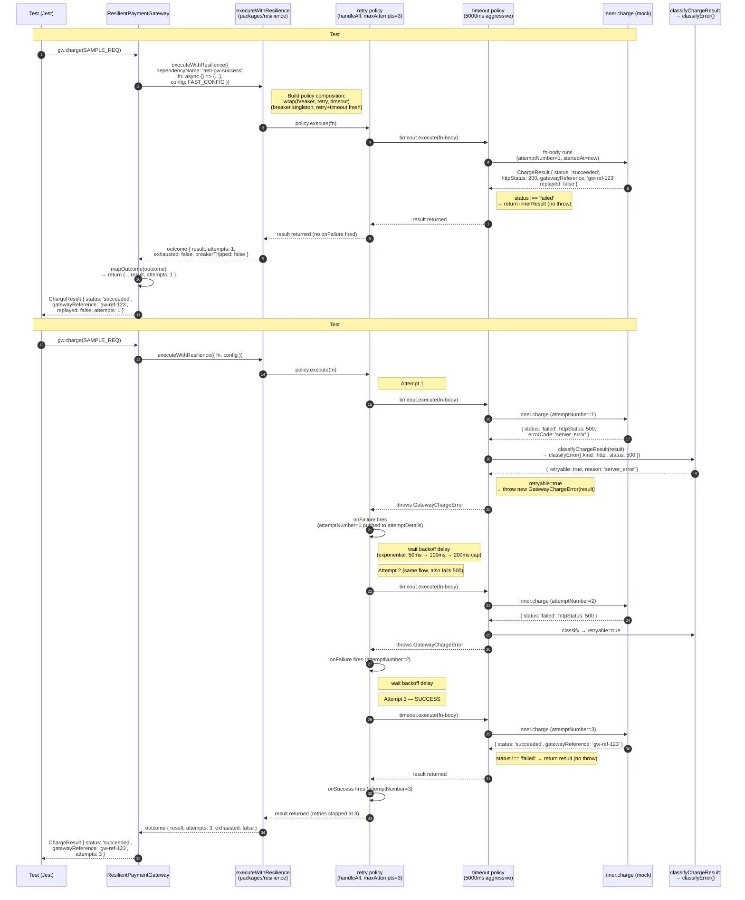
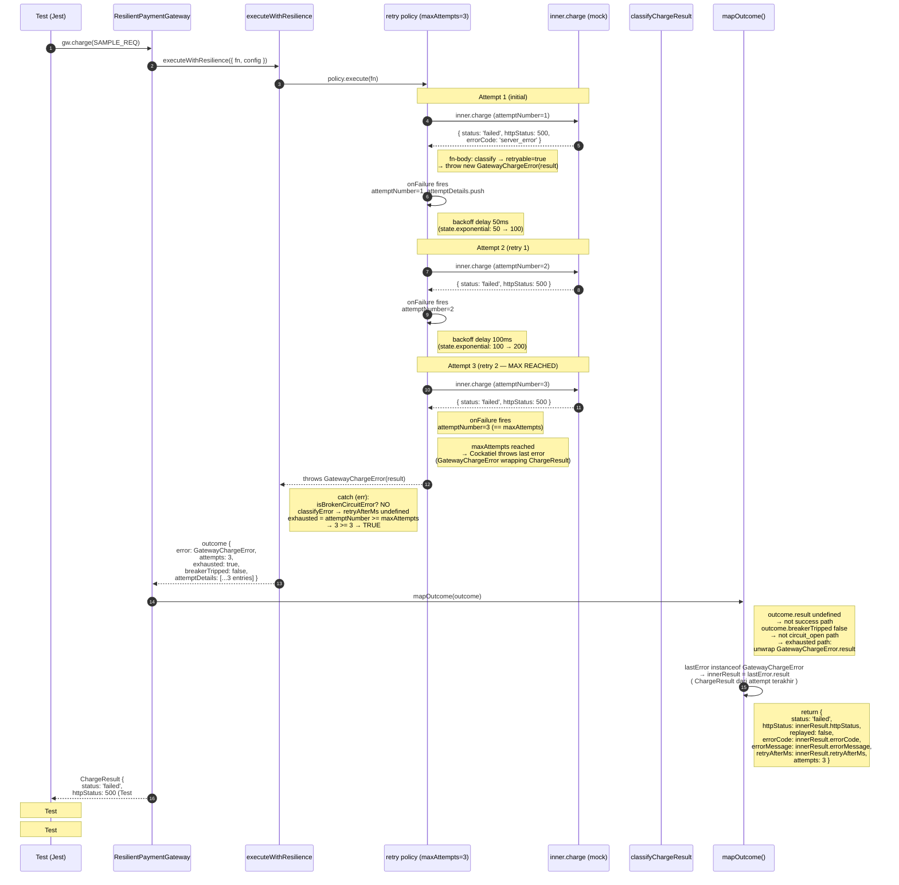
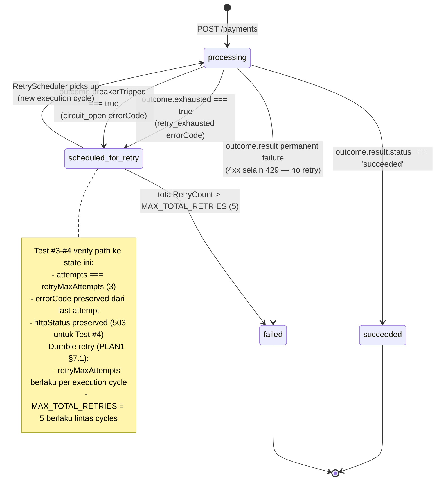
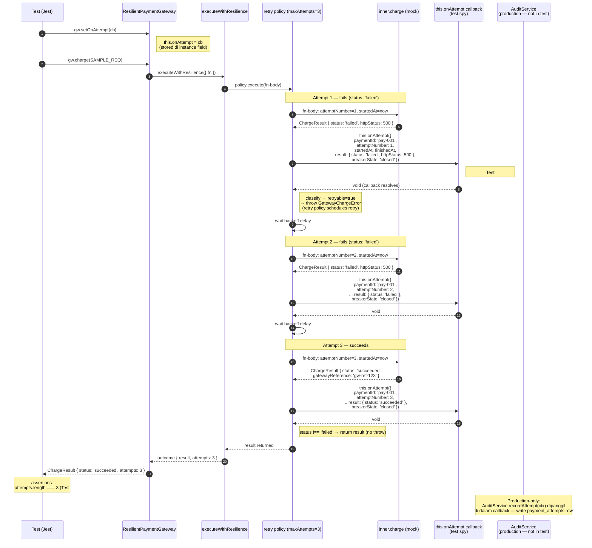
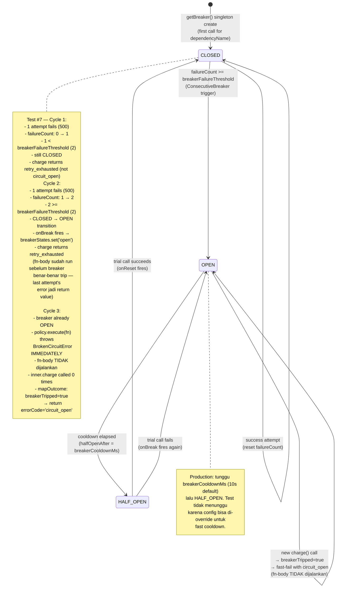
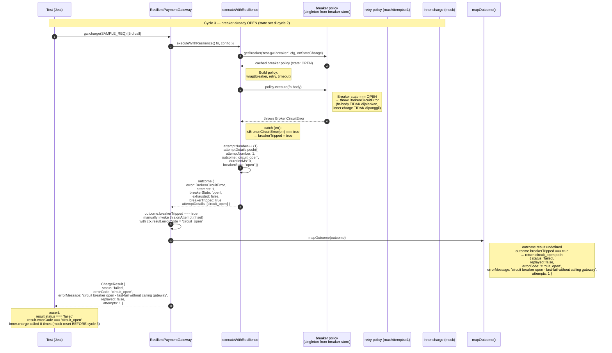
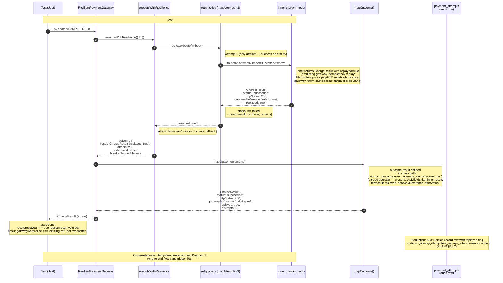

# Scenario: resilient-adapter.spec.ts

> **Source**: `apps/payment-api/tests/modules/gateway/resilient-adapter.spec.ts`
> **Tests**: 8 tests, 5 describe blocks (`success path`, `retry exhaustion`, `onAttempt callback`, `circuit breaker`, `replayed flag passthrough`)
> **Implementation**: `apps/payment-api/src/modules/gateway/resilient-adapter.ts` (`ResilientPaymentGateway` class + `GatewayChargeError`)
> **Underlying composition**: `packages/resilience/src/policies/composition.ts` (`executeWithResilience`)

Scenario ini memvisualkan flow test untuk `ResilientPaymentGateway` — adapter yang membungkus `PaymentGatewayPort` (biasanya `HttpPaymentGateway`) dengan Cockatiel policy composition (breaker → retry → timeout). Adapter inilah yang menerjemahkan `ChargeResult` domain ke error throw / return decision yang dipahami Cockatiel retry policy.

---

## Shared Setup (semua 5 describe blocks)

```ts
// Test config — disengaja dibuat cepat supaya test suite tidak sleep menit-menit:
const FAST_CONFIG: ResilienceConfig = {
  retryMaxAttempts: 3,         // 1 initial + 2 retries (Cockatiel maxAttempts = total attempts)
  retryBaseDelayMs: 50,        // exponential base
  retryMaxDelayMs: 200,        // exponential cap
  retryJitterRatio: 0,         // deterministic — no jitter (reproducible delays)
  gatewayTimeoutMs: 5000,      // generous — hanya test #7 yang override
  breakerFailureThreshold: 5,  // default — tidak di-trigger di test #1-#6, #8
  breakerCooldownMs: 10000,
};

const SAMPLE_REQ: ChargeRequest = {
  paymentId: 'pay-001',
  orderId: 'ORD-001',
  amount: '100.00',
  currency: 'IDR',
};

beforeEach(() => {
  resetBreakerStore();  // singleton breaker reset antar test — isolasi state
});

// Inner gateway = mock — `PaymentGatewayPort` minimal impl (hanya method `charge`)
const inner: PaymentGatewayPort = {
  charge: jest.fn(async () => makeSucceededResult() | makeFailedResult(...)),
};

// ResilientPaymentGateway constructed per-test:
const gw = new ResilientPaymentGateway({
  inner,
  resilienceConfig: FAST_CONFIG,
  dependencyName: 'test-gw-<unique-suffix>',  // unik per test supaya breaker singleton terpisah
});
```

**Key implementation invariant** (lihat `resilient-adapter.ts` line 46-122):

- `gw.charge(req)` memanggil `executeWithResilience({ fn: async () => {...} })` dari package `@retry-failure/resilience`.
- `fn` body: (a) increment attemptNumber, (b) capture `startedAt`/`finishedAt`, (c) call `this.inner.charge(req)`, (d) invoke `this.onAttempt?.(ctx)` dengan full context (incl. `result` + `breakerState`), (e) **klasifikasi**: bila `result.status === 'failed'` dan classifier anggap permanent → return result (no throw) → retry policy berhenti; bila retryable → `throw new GatewayChargeError(result)` → retry policy lanjut.
- `mapOutcome()` di akhir: bila `outcome.result` ada → return with `attempts`. Bila `outcome.breakerTripped` → return `{ errorCode: 'circuit_open', attempts }`. Bila exhausted → unwrap `GatewayChargeError.result` untuk preserve `httpStatus`/`errorCode`/`errorMessage`.

---

## Diagram 1 — ResilientPaymentGateway - success path (Tests #1-#2)

Cover tests:
- #1 `returns succeeded result on first attempt`
- #2 `returns succeeded after retryable failures (fail-first-n)`

### Setup

```ts
// Test #1: inner.charge always succeeds on call 1
const inner = { charge: jest.fn(async () => makeSucceededResult()) };
// expect: result.status === 'succeeded', attempts === 1, inner.charge called 1x

// Test #2: inner.charge fails 2 times then succeeds on call 3 (fail-first-n pattern)
let calls = 0;
const inner = {
  charge: jest.fn(async () => {
    calls++;
    if (calls < 3) return makeFailedResult(500, 'server_error', 'server down');
    return makeSucceededResult();
  }),
};
// expect: result.status === 'succeeded', attempts === 3, inner.charge called 3x
//   (gatewayReference === 'gw-ref-123' dari makeSucceededResult())
```

### Flow — sequence diagram



### Key assertions

- **Test #1**: `result.status === 'succeeded'`, `result.gatewayReference === 'gw-ref-123'` (passed through dari inner), `result.attempts === 1`, `inner.charge` dipanggil **tepat 1x**. Tidak ada retry triggered karena `status !== 'failed'`.
- **Test #2**: `result.status === 'succeeded'`, `result.attempts === 3` (1 initial + 2 retries — Cockatiel `maxAttempts: 3` berarti total 3 attempts), `inner.charge` dipanggil **tepat 3x**. `gatewayReference` final adalah dari attempt ke-3 (`'gw-ref-123'`), bukan dari failed attempt 1-2.
- **Implicit assertions** (via behavior): `onAttempt` callback (jika di-set) akan terima 3 context objects — 2 dengan `result.status === 'failed'` dan 1 dengan `result.status === 'succeeded'`. Test #1-#2 tidak set `onAttempt`, tapi Test #5-#6 akan verify ini.
- **Classifier integration** (tidak langsung di-test di Test #1-#2 tapi implicit): `classifyChargeResult` map HTTP 500 → `classifyError({ kind: 'http', status: 500 })` → `{ retryable: true, reason: 'server_error' }` → throw GatewayChargeError → Cockatiel retry triggered.

### Common pitfalls

- **`maxAttempts` semantics**: `retryMaxAttempts: 3` artinya **3 total attempts** (1 initial + 2 retries), BUKAN 3 retries + 1 initial = 4. Test #2 explicitly assert `attempts === 3` dan `inner.charge` called 3x. Kalau implementation salah mengira maxAttempts = retries count, akan ada off-by-one bug di sini.
- **Classifier wajib di-fn-body, bukan di Cockatiel `handleAll` filter**: `handleAll` (lihat `policies.ts` line 92) meretry **semua thrown error**. Mekanisme filter retryable vs permanent ada di `resilient-adapter.ts` fn-body: bila permanent → `return result` (tidak throw, Cockatiel tidak retry). Kalau lupa cek classifier dan asumsi Cockatiel filter, 4xx error akan di-retry padahal permanent.
- **`GatewayChargeError` membungkus `result`**: Throw `new GatewayChargeError(innerResult)` — bukan `throw innerResult` langsung. Cockatiel v4 failure reason shape: `{ error: unknown }`. Saat `DelegateBackoff` di `policies.ts` baca `context.result.error`, ia cek `'result' in err` untuk extract `retryAfterMs`. Kalau throw raw `ChargeResult`, DelegateBackoff fallback ke `classifyError` path — masih works tapi kehilangan info `retryAfterMs` yang sudah terpasang di ChargeResult.
- **`onSuccess` vs `onFailure` di Cockatiel**: `retryPolicy.onSuccess` fires pada success attempt (di `composition.ts` line 93-103), `retryPolicy.onFailure` fires pada failure attempt (line 85-90). Keduanya increment `attemptNumber`. Test tidak langsung assert ini, tapi kalau `onAttempt` count mismatch (e.g., 2 bukan 3 untuk fail-first-n pattern), penyebabnya biasanya salah wiring `onSuccess`.
- **`onAttempt` di sini berbeda dengan `onAttempt` di `composition.ts`**: Adapter `setOnAttempt(cb)` (lihat `port.ts` `AttemptObservable`) menerima callback dengan `GatewayAttemptContext` shape (full `result` field). Composition `executeWithResilience({ onAttempt })` menerima `AttemptDetail` shape (hanya metadata, tidak ada `gatewayReference`). Adapter invoke callback-nya sendiri **di dalam fn-body**, BUKAN di-wiring ke composition `onAttempt` — ini disengaja supaya audit row punya akses ke `result.gatewayReference` dan `result.replayed`.

### PLAN1 reference

- **Section 5.1 (line 216-248)** — Resilience architecture: composition order `Circuit Breaker → Retry → Timeout → HTTP call`. Diagram 1 memvisualkan `Retry → Timeout → inner.charge` slice dari composition ini (breaker tidak terlihat karena masih CLOSED — tidak ada failure yang memenuhi threshold di Test #1-#2).
- **Section 5.3 (line 277-300)** — Error classification:
  ```
  5xx              -> retryable
  429              -> retryable
  timeout          -> retryable
  ECONNREFUSED     -> retryable
  ECONNRESET       -> retryable
  4xx selain 429   -> permanent
  ```
  Test #2 pakai HTTP 500 (`server_error`) — masuk kategori `5xx → retryable` → throw GatewayChargeError → Cockatiel retry. Bila Test #2 pakai HTTP 400, retry tidak akan terjadi (permanent), dan `attempts === 1` padahal `inner.charge` dipanggil 1x.
- **Section 7.1 (line 374-388)** — `RETRY_MAX_ATTEMPTS = 3` berlaku untuk **satu execution cycle**. Test #1-#2 verify ini — adapter.charge satu call = satu execution cycle = max 3 attempts.

---

## Diagram 2 — ResilientPaymentGateway - retry exhaustion (Tests #3-#4)

Cover tests:
- #3 `returns failed with retry_exhausted after maxAttempts`
- #4 `preserves errorCode + httpStatus from last attempt`

### Setup

```ts
// Test #3: inner.charge always fails with 500
const inner = { charge: jest.fn(async () => makeFailedResult(500, 'server_error', 'always fail')) };
const gw = new ResilientPaymentGateway({ inner, resilienceConfig: FAST_CONFIG, dependencyName: 'test-gw-exhaust' });
// expect: result.status === 'failed', result.attempts === 3 (FAST_CONFIG.retryMaxAttempts),
//         inner.charge called 3x

// Test #4: inner.charge always fails with 503 service_unavailable
const inner = { charge: jest.fn(async () => makeFailedResult(503, 'service_unavailable', 'gateway down')) };
const gw = new ResilientPaymentGateway({ inner, resilienceConfig: FAST_CONFIG, dependencyName: 'test-gw-preserve' });
// expect: result.httpStatus === 503, result.errorCode === 'service_unavailable',
//         result.errorMessage === 'gateway down'
// (preserved dari last attempt — bukan dari first attempt)
```

### Flow — sequence diagram (4 attempts → exhausted)



### Flow — payment status transition (state diagram)

> State diagram menggambarkan transisi status `Payment` di application layer (`PaymentsService`), BUKAN state internal Cockatiel. Resilient adapter mengembalikan `ChargeResult` dan `PaymentsService` yang menerjemahkan ke status DB. Diagram ini relevan untuk PLAN1 §10.1 (flow `retry exhausted → scheduled_for_retry`).



### Key assertions

- **Test #3**: `result.status === 'failed'`, `result.attempts === FAST_CONFIG.retryMaxAttempts` (= 3), `inner.charge` dipanggil **tepat 3x** (= `retryMaxAttempts`). Tidak ada attempt ke-4 karena Cockatiel stop di maxAttempts.
- **Test #4**: `result.httpStatus === 503`, `result.errorCode === 'service_unavailable'`, `result.errorMessage === 'gateway down'` — semua **preserved dari attempt terakhir** (attempt #3), bukan dari attempt #1. Ini verify bahwa `GatewayChargeError` wrap `ChargeResult` dan `mapOutcome()` unwrap dengan benar.
- **Implicit assertions**:
  - `outcome.exhausted === true` (tidak di-assert langsung di test #3, tapi behavior yang implicit — `attempts === maxAttempts` adalah proxy indicator).
  - `outcome.breakerTripped === false` (breaker tidak ter-trigger di Test #3-#4 karena 3 failures < `breakerFailureThreshold: 5` default).
  - `outcome.attemptDetails` array berisi 3 entries (jika di-extract via `onAttempt`, tidak dilakukan di Test #3-#4).

### Common pitfalls

- **`attempts` vs `retryCount`**: `outcome.attempts === 3` artinya 3 total attempts (initial + 2 retries). `total_retry_count` di `payments` table adalah durable retry count (lintas scheduler cycles), **berbeda** dengan `attempts`. Test #3 explicitly check `result.attempts === FAST_CONFIG.retryMaxAttempts` — kalau adapter return `attempts = retryMaxAttempts - 1` (off-by-one), test fail.
- **`errorCode` default fallback `'retry_exhausted'`**: `mapOutcome()` line 152: `errorCode: innerResult?.errorCode ?? 'retry_exhausted'`. Kalau `GatewayChargeError.result` gagal di-unwrap (e.g., throw raw Error bukan GatewayChargeError), errorCode akan fallback ke `'retry_exhausted'`. Test #4 assert exact `'service_unavailable'` — verify unwrap works.
- **`breakerFailureThreshold: 5` default di FAST_CONFIG**: 3 failures (Test #3-#4) tidak cukup trigger breaker. Kalau test config pakai `breakerFailureThreshold: 2` (seperti Test #7), 3 failures akan trigger breaker dan `breakerTripped` jadi true → behavior berbeda. Pastikan config konsisten dengan skenario test.
- **State `processing → scheduled_for_retry` vs `processing → failed`**: PLAN1 §10.2 (line 497-534) specify bahwa `retry exhausted` → `scheduled_for_retry` (BUKAN `failed` langsung). Tapi `permanent failure` (4xx selain 429) → `failed` langsung. Adapter hanya return `ChargeResult` — `PaymentsService` yang decide state transition. Test #3-#4 hanya verify adapter behavior, bukan state transition. State transition di-test di `payments.service.spec.ts`.
- **`onAttempt` tidak di-invoke bila fn-body throw**: Sebenarnya **di-invoke** di `resilient-adapter.ts` line 61-70 (inside fn-body, **sebelum** throw GatewayChargeError). Jadi audit row tetap tercipta untuk setiap failed attempt. Tapi `onAttempt` dari composition (via `retryPolicy.onFailure`) juga ter-trigger — keduanya berbeda callback. Bila test assume hanya satu `onAttempt` fires, akan muncul double-counting. Lihat Diagram 3 untuk detail.
- **`attemptDetails[0].outcome === 'retryable_failure'`**: Classifier di `composition.ts` line 205-224 (`buildAttemptDetail`) set `outcome: classification.retryable ? 'retryable_failure' : 'permanent_failure'`. Test #3-#4 tidak langsung assert `attemptDetails`, tapi composition test #4 (di `composition.spec.ts`) assert `attemptDetails?.[0].outcome === 'retryable_failure'` untuk scenario yang sama.

### PLAN1 reference

- **Section 5.1 (line 244-246)** — "Exhaustion dikembalikan ke application layer untuk menentukan durable retry." Diagram 2 verify ini: adapter return `ChargeResult` dengan `errorCode` preserved, application layer (`PaymentsService`) yang decide transition ke `scheduled_for_retry`.
- **Section 7.1 (line 374-388)** — `RETRY_MAX_ATTEMPTS = 3` berlaku untuk satu execution cycle; `MAX_TOTAL_RETRIES = 5` berlaku lintas cycles. State diagram menunjukkan path `scheduled_for_retry → processing` (scheduler picks up) → ... → `failed` (setelah MAX_TOTAL_RETRIES).
- **Section 10.1 (line 485-533)** — Payment API endpoint + flow:
  ```
  POST /payments
     +--> payment execution
            +--> retry exhausted
                   +--> scheduled_for_retry
  RetryScheduler
     +--> find due payment
     +--> execute payment flow again
     +--> increment durable retry count
     +--> if exceeds MAX_TOTAL_RETRIES -> failed
  ```
  State diagram Diagram 2 menggambarkan subset flow ini: `processing → scheduled_for_retry` (via `outcome.exhausted`) dan `scheduled_for_retry → failed` (via `totalRetryCount > MAX_TOTAL_RETRIES`).
- **Section 11.2 (line 559-578)** — `payment_attempts` schema, `outcome` enum `success/retryable_failure/permanent_failure/timeout/circuit_open`. Diagram 2 sequence menunjukkan 3 entries dengan `outcome: 'retryable_failure'` akan tertulis ke audit table (via `onAttempt` di fn-body).

---

## Diagram 3 — ResilientPaymentGateway - onAttempt callback (Tests #5-#6)

Cover tests:
- #5 `invokes onAttempt for each attempt (success + failures)`
- #6 `passes paymentId in attempt context`

### Setup

```ts
// Test #5: fail-first-n (2 failures + 1 success)
let calls = 0;
const inner = {
  charge: jest.fn(async () => {
    calls++;
    if (calls < 3) return makeFailedResult(500);
    return makeSucceededResult();
  }),
};
const gw = new ResilientPaymentGateway({ inner, resilienceConfig: FAST_CONFIG, dependencyName: 'test-gw-callback' });

const attempts: Array<{ attemptNumber: number; status: string }> = [];
gw.setOnAttempt((ctx) => {
  attempts.push({
    attemptNumber: ctx.attemptNumber,
    status: ctx.result.status,
  });
});

await gw.charge(SAMPLE_REQ);
// expect: attempts.length === 3
// expect: attempts[0] === { attemptNumber: 1, status: 'failed' }
// expect: attempts[1] === { attemptNumber: 2, status: 'failed' }
// expect: attempts[2] === { attemptNumber: 3, status: 'succeeded' }

// Test #6: success on first attempt — just verify paymentId passed
const inner = { charge: jest.fn(async () => makeSucceededResult()) };
const gw = new ResilientPaymentGateway({ inner, resilienceConfig: FAST_CONFIG, dependencyName: 'test-gw-paymentId' });

let capturedPaymentId: string | undefined;
gw.setOnAttempt((ctx) => {
  capturedPaymentId = ctx.paymentId;
});

await gw.charge(SAMPLE_REQ);
// expect: capturedPaymentId === 'pay-001'
```

### Flow — sequence diagram



### Key assertions

- **Test #5 — 3 callback invocations**: `attempts.length === 3`. Setiap attempt (baik success maupun failed) trigger tepat 1 `onAttempt` call. Total = 3 (1 success + 2 failures untuk Test #5 pattern).
- **Test #5 — exact sequence**: `attempts[0] === { attemptNumber: 1, status: 'failed' }`, `attempts[1] === { attemptNumber: 2, status: 'failed' }`, `attempts[2] === { attemptNumber: 3, status: 'succeeded' }`. Order matters — `attemptNumber` monotonically increasing, `status` mengikuti result dari masing-masing attempt.
- **Test #6 — `paymentId` passed in context**: `capturedPaymentId === 'pay-001'`. Verify bahwa `SAMPLE_REQ.paymentId` di-pass ke callback via `GatewayAttemptContext.paymentId`. Penting supaya audit row di DB bisa link attempt ke payment yang benar.
- **Implicit assertions**:
  - `breakerState: 'closed'` di context (test tidak assert langsung, tapi ctx shape includes this field — production bisa pakai untuk observability).
  - `startedAt` dan `finishedAt` adalah `Date` instances (test tidak assert type, tapi kalau production code depend on `.toISOString()`, Date instance diperlukan).
  - `result` field ada di context — full `ChargeResult` (termasuk `httpStatus`, `errorCode`, `gatewayReference`, `replayed`). Adapter `onAttempt` callback ini berbeda dengan composition `onAttempt` yang hanya terima `AttemptDetail` (subset metadata).

### Common pitfalls

- **`onAttempt` fires BEFORE throw, tidak setelah**: `resilient-adapter.ts` line 61-70 — callback di-invoke di fn-body **sebelum** classifier check `if (innerResult.status === 'failed')` dan `throw GatewayChargeError`. Jadi setiap failed attempt tetap menghasilkan 1 audit row, meskipun Cockatiel akan retry. Kalau implementation salah urutan (callback setelah throw), audit row untuk attempt terakhir (yang gagal sebelum retry) tidak akan tercipta.
- **`onAttempt` di adapter vs composition — dua callback berbeda**:
  - **Adapter `setOnAttempt(cb)`** (`GatewayAttemptContext` shape): full `result`, `paymentId`, `startedAt`, `finishedAt`, `breakerState`. Di-invoke di fn-body.
  - **Composition `executeWithResilience({ onAttempt })`** (`AttemptDetail` shape): `attemptNumber`, `outcome`, `httpStatus`, `errorCode`, `delayBeforeNextMs`, `breakerState`, `durationMs`. Di-invoke di `retryPolicy.onFailure` / `onSuccess`.
  - Test #5-#6 menggunakan adapter callback (via `gw.setOnAttempt(cb)`). Adapter tidak pass `onAttempt` ke composition — jadi composition `attemptDetails` array tetap terisi (diisi via `retryPolicy.onFailure`), tapi tidak ada callback consumer di composition level untuk test ini.
- **Async callback**: `OnAttemptCallback` type signature: `(ctx: GatewayAttemptContext) => void | Promise<void>`. Implementation: `await this.onAttempt?.(ctx)` (line 62). Kalau callback throw, exception akan propagate dan menggagalkan charge. Test #5-#6 callback sync (`push` dan assignment) — tidak ada await pitfall. Tapi production `AuditService.recordAttempt` async dan bisa throw — wrap dengan try/catch di production code untuk avoid crash.
- **`onAttempt` untuk `circuit_open` case — special handling**: `resilient-adapter.ts` line 104-119 — bila `outcome.breakerTripped === true`, adapter manually invoke `onAttempt` dengan context `{ attemptNumber: 1, result: { errorCode: 'circuit_open', ... }, breakerState: 'open' }`. Ini di-invoke setelah `executeWithResilience` return, BUKAN di fn-body (karena fn-body tidak jalan kalau breaker open). Test #5-#6 tidak cover case ini (lihat Diagram 4).
- **`onSuccess` di Cockatiel juga trigger callback** — implementation `resilient-adapter.ts` selalu invoke `onAttempt` setelah `inner.charge` resolve, baik result success maupun failed. Tapi di composition level, `retryPolicy.onSuccess` dan `onFailure` adalah dua callback berbeda. Pastikan tidak double-invoke bila kedua mechanism dipakai bersamaan.
- **Test #6 simple success — paymentId verify**: Test #6 hanya capture `paymentId` di attempt pertama (dan satu-satunya, karena success on first attempt). Kalau test lupa bahwa callback fire untuk success juga (bukan hanya failure), test akan fail dengan `capturedPaymentId === undefined`.

### PLAN1 reference

- **Section 8 (line 392-432)** — Payment Gateway Mock: failure modes termasuk `fail-first-n` (Test #5 pattern — fail N kali lalu success). Mock mode ini yang memungkinkan test scenario `success + failures` di Test #5.
- **Section 11.2 (line 559-578)** — `payment_attempts` schema: setiap row = 1 attempt. Adapter `onAttempt` callback adalah source of truth untuk `payment_attempts` rows di production (di-wire ke `AuditService.recordAttempt`). Test #5 verify 3 callback invocations = 3 audit rows akan tertulis.
- **Section 13.1 (line 614-632)** — Logging: event minimal mencakup "attempt start/finish". Adapter `onAttempt` adalah hook untuk emit log events ini (selain audit DB write). Test #5 tidak assert log calls, tapi production code bisa pakai callback yang sama untuk log + audit.
- **Section 13.2 (line 634-648)** — Metrics `retry_attempts_total` counter dengan label `outcome, payment_status`. Adapter `onAttempt` ctx punya `result.status` yang bisa jadi label source. Test tidak assert metrics, tapi wiring di production pakai callback ini.

---

## Diagram 4 — ResilientPaymentGateway - circuit breaker (Test #7)

Cover test:
- #7 `returns circuit_open errorCode when breaker is open`

### Setup

```ts
// Config override: retryMaxAttempts=1 (1 attempt per cycle),
// breakerFailureThreshold=2 (2 failures = open)
const cfg: ResilienceConfig = {
  ...FAST_CONFIG,
  retryMaxAttempts: 1,
  breakerFailureThreshold: 2,
};
const depName = 'test-gw-breaker';

// Inner always fails (500) — will exhaust retry + trip breaker
const inner: PaymentGatewayPort = {
  charge: jest.fn(async () => makeFailedResult(500)),
};
const gw = new ResilientPaymentGateway({ inner, resilienceConfig: cfg, dependencyName: depName });

// Cycle 1: 1 attempt fails -> failureCount=1 (breaker still CLOSED)
await gw.charge(SAMPLE_REQ);

// Cycle 2: 1 attempt fails -> failureCount=2 -> breaker transitions CLOSED -> OPEN
await gw.charge(SAMPLE_REQ);

// Cycle 3: breaker is OPEN -> reject immediately
inner.charge = jest.fn(async () => makeSucceededResult());  // should NOT be called
const result = await gw.charge(SAMPLE_REQ);

// expect:
//   result.status === 'failed'
//   result.errorCode === 'circuit_open'
//   inner.charge called 0 times (in cycle 3)
```

### Flow — breaker state diagram



### Flow — sequence diagram (cycle 3 — breaker open fast-fail)



### Key assertions

- **`result.status === 'failed'`**: Breaker open menghasilkan failed result. Tidak ada silent reject — caller mendapat eksplisit failure signal.
- **`result.errorCode === 'circuit_open'`**: Error code spesifik — `PaymentsService` bisa pattern-match ini untuk pilih state transition (ke `scheduled_for_retry` instead of `failed`).
- **`result.errorMessage === 'circuit breaker open - fast-fail without calling gateway'`**: Pesan deskriptif untuk debugging. Hardcoded di `mapOutcome()` line 137.
- **`inner.charge` called 0 times in cycle 3**: Mock di-reset dengan `inner.charge = jest.fn(async () => makeSucceededResult())` sebelum cycle 3 — supaya **kalau** implementation salah (masih call inner), test akan catch dengan `expect(inner.charge).toHaveBeenCalledTimes(0)`. Ini verify bahwa fast-fail benar-benar fast (no HTTP call).
- **Implicit assertions**:
  - `attempts === 1` di cycle 3 outcome (1 circuit_open attempt tercatat di `attemptDetails`).
  - `outcome.breakerTripped === true` (proxy indicator — test tidak assert langsung tapi behavior explicit via errorCode).
  - Adapter `onAttempt` callback (jika di-set) akan terima 1 context dengan `result.errorCode === 'circuit_open'` dan `breakerState: 'open'` — verify via Diagram 3 pitfall note.

### Common pitfalls

- **`retryMaxAttempts: 1` di cycle 2 still trigger breaker trip**: Cycle 2 punya 1 attempt (karena retryMaxAttempts=1). Attempt itu gagal → `failureCount` naik dari 1 ke 2 → breaker trip. Cycle 2 return `retry_exhausted` (BUKAN `circuit_open`) karena fn-body sudah jalan dan Cockatiel throw GatewayChargeError (bukan BrokenCircuitError). Baru cycle 3 yang return `circuit_open` karena breaker sudah open SEBELUM `policy.execute(fn)` call.
- **`breakerFailureThreshold` adalah CONSECUTIVE failures, bukan total**: `ConsecutiveBreaker` (lihat `policies.ts` line 157) reset counter pada success. Kalau cycle 1 success, lalu cycle 2-3 fail, breaker belum trip (failure count = 2 setelah reset ke 0 dari success). Test #7 setup sengaja bikin semua attempt fail supaya counter monoton naik.
- **`breakerStates` Map reset via `resetBreakerStore()`**: Setiap `beforeEach` call reset state. Tanpa reset, test #7 bisa fail karena breaker dari test sebelumnya (misalnya test #4 dengan `dependencyName: 'test-gw-preserve'`) masih open — tapi `dependencyName` unik per test sudah mitigate ini. `resetBreakerStore()` adalah defense-in-depth.
- **`onStateChange` callback di-capture saat FIRST `getBreaker()` call**: `breaker-store.ts` line 30-40 — callback di-attach ke breaker policy hanya saat pertama kali di-create. Subsequent `getBreaker()` call dengan callback berbeda akan **diabaikan** (cached breaker dipakai as-is). Test #7 tidak set `onStateChange` (adapter default undefined), tapi kalau production pakai metrics, callback hanya attach di first call.
- **`isBrokenCircuitError(err)` detection**: Composition `catch` block (line 117) pakai `isBrokenCircuitError(err)` dari cockatiel untuk detect breaker open. Kalau import path salah atau cockatiel v4 berbeda API, detection gagal → `breakerTripped` false → adapter return `retry_exhausted` padahal seharusnya `circuit_open`. Test #7 akan catch ini dengan `expect(result.errorCode).toBe('circuit_open')`.
- **Adapter manual `onAttempt` untuk circuit_open case**: `resilient-adapter.ts` line 104-119 — setelah `executeWithResilience` return dengan `breakerTripped=true`, adapter invoke `this.onAttempt?.(ctx)` dengan context fabricated (attemptNumber=1, startedAt=finishedAt=now). Ini supaya audit row untuk circuit_open tetap tertulis (1 row per charge call, walaupun fn-body tidak jalan). Test #7 tidak set `onAttempt`, jadi behavior ini tidak di-verify langsung di test ini (di-test di `payments.service.spec.ts`).
- **`dependencyName` harus unik per test untuk isolasi**: `test-gw-breaker` (Test #7) berbeda dari `test-gw-success` (Test #1), `test-gw-retry` (Test #2), dst. Kalau ada dua test pakai dependencyName sama, breaker singleton shared → state leak antar test. `beforeEach(() => resetBreakerStore())` adalah backstop, tapi convention dependencyName unik lebih robust.

### PLAN1 reference

- **Section 5.2 (line 250-275)** — Circuit breaker lifecycle:
  ```
  CLOSED --[failure threshold reached]--> OPEN
  OPEN --[cooldown elapsed]--> HALF_OPEN
  HALF_OPEN --[success]--> CLOSED
  HALF_OPEN --[failure]--> OPEN
  ```
  State diagram Diagram 4 menggambarkan transisi ini. Test #7 specifically verify transisi `CLOSED → OPEN` (via threshold=2 failures) dan behavior fast-fail ketika OPEN. HALF_OPEN tidak di-test di `resilient-adapter.spec.ts` (di-test di composition.spec.ts dan e2e).
- **Section 5.2 (line 270-273)** — Config defaults:
  ```
  failure threshold: BREAKER_FAILURE_THRESHOLD=3
  cooldown: BREAKER_COOLDOWN_MS=10000
  ```
  Test #7 override threshold=2 supaya 2 failures sudah cukup trip (efisiensi test — tidak perlu 3 cycles). Cooldown tidak di-override karena test tidak menunggu HALF_OPEN.
- **Section 5.1 (line 240-246)** — "Circuit breaker mencegah request ketika dependency dianggap unhealthy." Diagram 4 sequence menggambarkan ini: ketika breaker OPEN, `policy.execute(fn)` throw BrokenCircuitError **tanpa** menjalankan fn-body — inner.charge tidak dipanggil.
- **Section 10.2 (line 507-510)** — Flow:
  ```
  payment execution
     +--> circuit open
            +--> scheduled_for_retry
  ```
  Adapter return `errorCode: 'circuit_open'` — `PaymentsService` pattern-match ini dan transition payment ke `scheduled_for_retry` (bukan `failed`). Test #7 verify errorCode generation; state transition di-test di `payments.service.spec.ts`.

---

## Diagram 5 — ResilientPaymentGateway - replayed flag passthrough (Test #8)

Cover test:
- #8 `passes replayed=true from inner on success`

### Setup

```ts
// Inner returns succeeded result with replayed=true
// (simulating gateway idempotency replay — same Idempotency-Key seen before)
const inner: PaymentGatewayPort = {
  charge: jest.fn(async () => ({
    status: 'succeeded' as const,
    httpStatus: 200,
    gatewayReference: 'existing-ref',
    replayed: true,
  })),
};
const gw = new ResilientPaymentGateway({
  inner,
  resilienceConfig: FAST_CONFIG,
  dependencyName: 'test-gw-replay',
});

const result = await gw.charge(SAMPLE_REQ);

// expect:
//   result.replayed === true
//   result.gatewayReference === 'existing-ref' (passed through, not overwritten)
```

### Flow — sequence diagram



### Key assertions

- **`result.replayed === true`**: Adapter pass-through flag tanpa modifikasi. Tidak ada logic di adapter yang override `replayed` field. Verify `mapOutcome()` success path pakai spread: `return { ...outcome.result, attempts: outcome.attempts }`.
- **`result.gatewayReference === 'existing-ref'`**: Sama — pass-through. Adapter tidak generate gatewayReference sendiri (itu domain gateway mock).
- **`result.attempts === 1`**: Tambahan field yang TIDAK ada di inner result — di-set oleh `mapOutcome()` dari `outcome.attempts`. Field lain (`status`, `httpStatus`, `gatewayReference`, `replayed`) preserved dari inner.
- **Implicit assertions**:
  - `outcome.breakerTripped === false` (breaker tidak terlibat).
  - `outcome.exhausted === false` (success on first attempt, no retry).
  - Tidak ada `GatewayChargeError` thrown — fn-body return `innerResult` langsung karena `status !== 'failed'`.

### Common pitfalls

- **`mapOutcome()` spread operator — semua field preserved**: `return { ...outcome.result, attempts: outcome.attempts }`. Kalau implementation hardcode field satu-satu (e.g., `return { status: result.status, attempts: outcome.attempts }`), field `replayed` dan `gatewayReference` akan hilang → Test #8 fail.
- **`replayed` field hanya relevant untuk success path**: Bila inner return `{ status: 'failed', replayed: true }` (misalnya replay dari failed result), adapter akan treat sebagai failure dan classify. Gateway mock di project ini tidak return replayed=true untuk failed result (lihat `payment-gateway-mock/src/modules/charges/charges.service.ts`), tapi edge case ini tidak di-test di Test #8.
- **`replayed` flag vs `actualCharges` invariant**: `replayed: true` adalah indikator response caching di gateway, BUKAN bukti `actualCharges <= 1`. Lihat [idempotency-scenario.md Diagram 2](./idempotency-scenario.md#diagram-2--assertinvariant-tests-4-7) untuk invariant verification. Adapter hanya pass-through flag — invariant check terpisah di `assertInvariant(actualCharges, httpCalls)`.
- **Test #8 tidak set `onAttempt` — replay tidak di-audit khusus**: Production code perlu handle: bila `result.replayed === true`, audit row masih ditulis (dengan flag `replayed: true`), dan metrics counter `gateway_idempotent_replays_total` increment. Test #8 tidak verify audit/metrics — hanya adapter passthrough.
- **Cross-test breaker state isolation**: Test #8 pakai `dependencyName: 'test-gw-replay'` (unik). `beforeEach(() => resetBreakerStore())` ensure breaker fresh. Kalau breaker dari test sebelumnya leak, Test #8 bisa fail dengan `errorCode: 'circuit_open'` padahal expect `status: 'succeeded'`.
- **`httpStatus: 200` dari inner**: Test #8 inner return `httpStatus: 200`. Adapter tidak validate httpStatus untuk success case — apapun httpStatus-nya, selama `status === 'succeeded'`, adapter return as-is. Kalau inner return `{ status: 'succeeded', httpStatus: 500 }` (contradictory), adapter pass-through tanpa correction — tidak ada test untuk ini.

### PLAN1 reference

- **Section 9.2 (line 466-479)** — Replay mechanism:
  ```
  Jika gateway sudah mencatat charge sukses:
  same Idempotency-Key -> gateway returns original result -> replayed: true
  ```
  Diagram 5 menggambarkan adapter role: pass-through `replayed: true` flag dari gateway ke caller (`PaymentsService`). Adapter tidak interpret flag — hanya transport.
- **Section 9 (line 435-448)** — Idempotency-Key stability:
  > Key stabil sepanjang:
  > - initial request
  > - Cockatiel retry attempts
  > - scheduler retry cycle
  > - manual retry

  Test #8 verify salah satu implication: Cockatiel retry (atau scheduler retry) dengan same Idempotency-Key akan trigger gateway replay, dan adapter pass-through `replayed: true` supaya application aware bahwa result berasal dari cache, bukan fresh charge.
- **Section 9.1 (line 450-464)** — Target invariant `actualCharges <= 1` walau `HTTP calls >= 2`:
  Test #8 adalah unit test untuk adapter passthrough; invariant check (`assertInvariant`) ada di [idempotency-scenario.md Diagram 2](./idempotency-scenario.md#diagram-2--assertinvariant-tests-4-7). Keduanya melengkapi: adapter transport flag, `assertInvariant` verify semantic.
- **Section 13.2 (line 634-648)** — Metrics `gateway_idempotent_replays_total` counter. Production: bila adapter return `result.replayed === true`, `PaymentsService` (atau `AuditService`) increment counter ini. Test #8 tidak assert metrics, tapi enable behavior yang menjadi source of truth untuk metric.
- **Section 8.2 (line 406-415)** — Failure modes table: `succeed-but-drop-response` mode → "charge tercatat, response hilang | timeout → retry → replay". Adapter Test #8 adalah unit-level verification untuk passthrough `replayed: true` yang muncul setelah retry (e2e flow di-test di `payments.idempotency.e2e-spec.ts` scenario D).

---

## Related docs

- [TEST_MAINTENANCE_RULES.md](../../TEST_MAINTENANCE_RULES.md) — rule test maintenance + decision framework
- [TASK-16-test-scenario-diagrams.md](../tasks/TASK-16-test-scenario-diagrams.md) — task plan yang create scenario diagrams ini
- [TASK-06-gateway-adapter.md](../tasks/TASK-06-gateway-adapter.md) — implementation task untuk `ResilientPaymentGateway`
- [TASK-05-cockatiel-resilience.md](../tasks/TASK-05-cockatiel-resilience.md) — implementation task untuk `executeWithResilience` composition
- [composition-scenario.md](./composition-scenario.md) — cross-reference: underlying composition tests (9 tests, 6 describe blocks) yang verify `executeWithResilience` behavior
- [idempotency-scenario.md](./idempotency-scenario.md) — cross-reference: Diagram 3 end-to-end flow yang trigger Test #8 scenario (replayed=true via gateway replay)
- [PLAN1 Section 5 (line 214-300)](../PLAN1_Cockatiel_Retry_Failure_Scenario.md) — Resilience architecture (composition, breaker lifecycle, error classification)
- [PLAN1 Section 9.2 (line 466-479)](../PLAN1_Cockatiel_Retry_Failure_Scenario.md) — Replay mechanism
- [PLAN1 Section 10.1 (line 485-533)](../PLAN1_Cockatiel_Retry_Failure_Scenario.md) — Payment API endpoint + flow (retry exhaustion → scheduled_for_retry)
