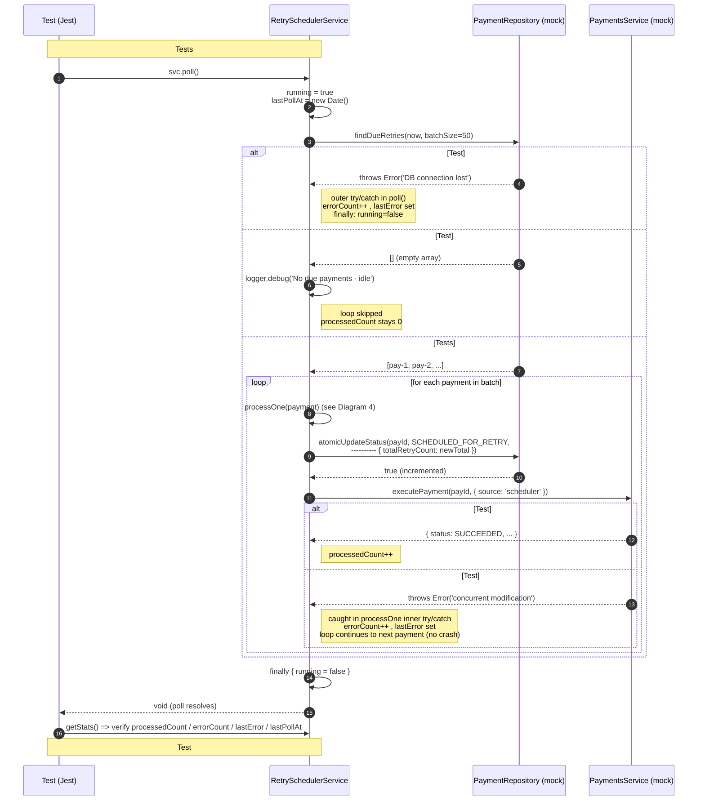
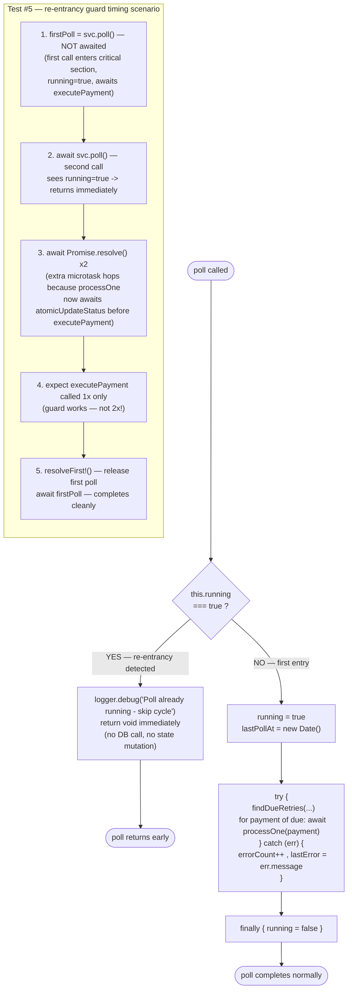
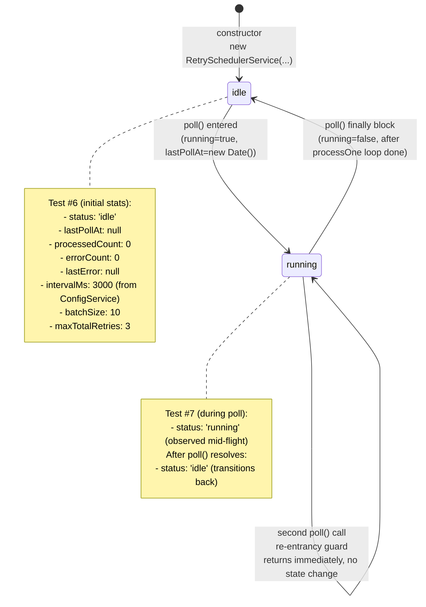
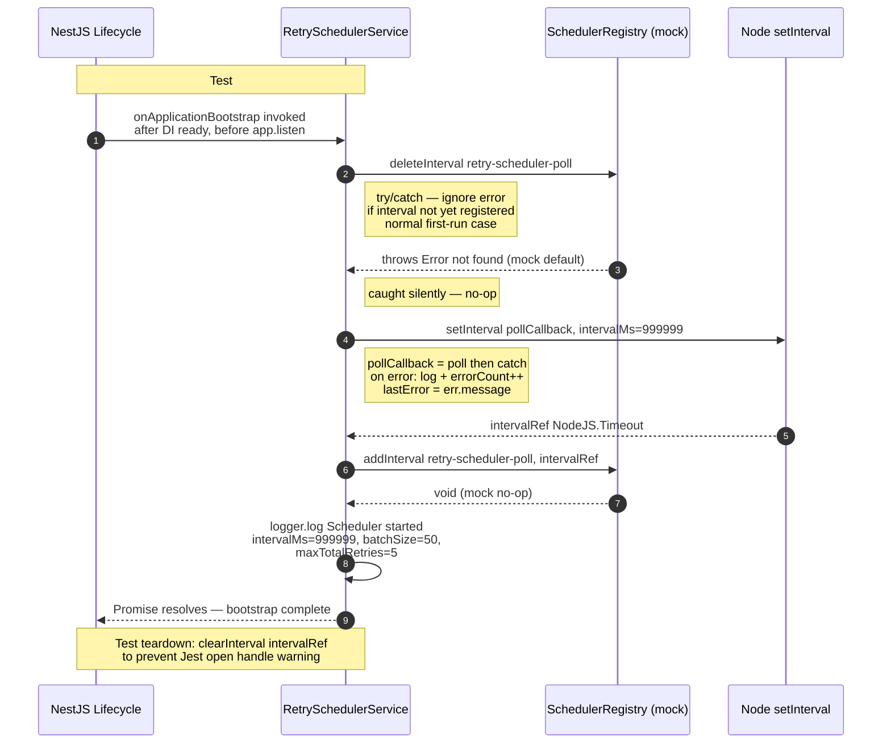
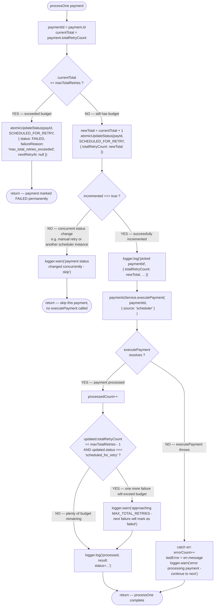

# Scenario: retry-scheduler.service.spec.ts

> **Source**: `apps/payment-api/tests/modules/retry-scheduler/retry-scheduler.service.spec.ts`
> **Tests**: 8 tests, 3 describe blocks (`poll`, `getStats`, `onApplicationBootstrap`)
> **Implementation**: `apps/payment-api/src/modules/retry-scheduler/retry-scheduler.service.ts`

Scenario ini memvisualkan flow test untuk `RetrySchedulerService` — durable retry mechanism yang menjalankan poll periodik untuk memproses payment dengan status `scheduled_for_retry`.

---

## Diagram 1 — RetrySchedulerService - poll (Tests #1-#5)

Cover tests:
- #1 `does nothing when no due payments`
- #2 `processes due payments via executePayment(source=scheduler)`
- #3 `continues to next payment when one fails (does NOT crash)`
- #4 `catches DB query error without crashing`
- #5 `skips cycle when already running (re-entrancy guard)`

### Setup

```ts
// makeMockRepo — returns configurable due payments
function makeMockRepo(duePayments: Payment[] = []) {
  return {
    findDueRetries: jest.fn(async () => duePayments),
    atomicUpdateStatus: jest.fn(async () => true), // always succeed (no concurrent mod)
  } as unknown as PaymentRepository;
}

// makeMockPaymentsService — default returns SUCCEEDED
function makeMockPaymentsService() {
  return {
    executePayment: jest.fn(async () => makePayment({ status: PaymentStatus.SUCCEEDED })),
  } as unknown as PaymentsService;
}

// makeConfigService — defaults: SCHEDULER_INTERVAL_MS=5000, BATCH_SIZE=50, MAX_TOTAL_RETRIES=5
// makeSchedulerRegistry — addInterval/deleteInterval mocks (deleteInterval throws 'not found')

// makePayment — status: SCHEDULED_FOR_RETRY, attemptCount: 3, totalRetryCount: 1, nextRetryAt: past
```

Source instance:
```ts
new RetrySchedulerService(paymentsService, paymentsRepo, configService, schedulerRegistry);
```

### Flow — poll() sequence diagram



### Flow — re-entrancy guard flowchart (Test #5)



### Key assertions

- **Test #1**: `processedCount === 0`, `errorCount === 0`, `lastPollAt !== null` (timestamp recorded even when idle)
- **Test #2**: `executePayment` called **2 times** with exact args `('pay-1', { source: 'scheduler' })` and `('pay-2', { source: 'scheduler' })`; `processedCount === 2`
- **Test #3**: `executePayment` called **3 times** (loop tidak stop pada failure ke-2); `processedCount === 2` (1 failed, 2 succeeded); `errorCount === 1`; `lastError === 'concurrent modification'`
- **Test #4**: `findDueRetries` throws → caught in `poll()` outer try/catch; `errorCount === 1`; `lastError === 'DB connection lost'`; tidak crash
- **Test #5**: second `poll()` call selama first in-flight → `executePayment` dipanggil **1 kali saja** (bukan 2x); guard bekerja dengan skip cycle

### Common pitfalls

- **Extra microtask yield di Test #5**: After `await svc.poll()` (second call), test perlu `await Promise.resolve()` **dua kali** sebelum assert. Kenapa? Karena `processOne` sekarang `await atomicUpdateStatus` **sebelum** `executePayment` — ini menambah satu async hop di critical path. Tanpa extra yield, first poll belum sampai ke `executePayment` ketika second poll masuk, sehingga guard mungkin tidak ter-trigger dengan benar.
- **Mock `atomicUpdateStatus` default `true`**: Kalau lupa set return value `true`, `processOne` akan `return` early karena `!incremented`, dan `executePayment` tidak akan dipanggil → `toHaveBeenCalledTimes(0)` padahal expect `2`. Selalu override `atomicUpdateStatus` ke `async () => true` di mock repo (lihat `makeMockRepo`).
- **`deleteInterval` mock throws `'not found'`**: Pada test `onApplicationBootstrap`, mock `deleteInterval` sengaja throws untuk simulasi first-run. Jangan lupa try/catch di implementation. Untuk test `poll`, mock ini tidak di-call jadi tidak relevant.
- **`poll()` outer catch vs `processOne` inner catch**: `findDueRetries` error ditangkap di `poll()` (outer), sedangkan `executePayment` error ditangkap di `processOne` (inner). Keduanya update `errorCount` dan `lastError` — tapi `processOne` inner catch tetap melanjutkan loop, sedangkan `poll()` outer catch men-terminate cycle.
- **`source: 'scheduler'` context flag**: `executePayment` menerima `{ source: 'scheduler' }` untuk membedakan dari manual retry (`{ source: 'manual' }`) dan initial create (`{ source: 'api' }`). Assertion harus exact match object literal — bukan deepEqual dengan extra keys.
- **`lastError` string exact**: Test #3 dan #4 assert `lastError === 'concurrent modification'` dan `'DB connection lost'` secara exact string. Kalau `err.message` punya prefix/suffix, test fail. Jangan wrap error di implementation.

### PLAN1 reference

- **Section 10.2 (line 525-533)** — RetryScheduler flow:
  ```
  RetryScheduler
     +--> find due payment
     +--> execute payment flow again
     +--> increment durable retry count
     +--> if exceeds MAX_TOTAL_RETRIES -> failed
  ```
  Test #1-#5 verify "find due payment" dan "execute payment flow again" steps. Test bonus (Diagram 4) verify "increment durable retry count" dan MAX_TOTAL_RETRIES gate.

- **Section 12 (line 604-610)** — Concurrency semantics:
  > Scheduler versi ini ditujukan untuk single-instance payment-api.
  >
  > Future production evolution dapat mempertimbangkan row locking (`FOR UPDATE SKIP LOCKED`), queue, atau distributed scheduler.

  Re-entrancy guard (Test #5) adalah concurrency safety net untuk single-instance — bukan distributed lock, tapi cukup untuk mencegah setInterval overlap di Node.js event loop. Implementation rely pada `running` boolean flag di memory, bukan DB lock.

---

## Diagram 2 — RetrySchedulerService - getStats (Tests #6-#7)

Cover tests:
- #6 `returns initial stats before any poll`
- #7 `returns running status during poll`

### Setup

```ts
// Test #6 — initial state with custom config
const svc = new RetrySchedulerService(
  makeMockPaymentsService(),
  makeMockRepo([]),
  makeConfigService({ SCHEDULER_INTERVAL_MS: 3000, SCHEDULER_BATCH_SIZE: 10, MAX_TOTAL_RETRIES: 3 }),
  makeSchedulerRegistry(),
);
// No poll() called yet — query getStats() directly

// Test #7 — running state observed mid-poll
const paymentsService = makeMockPaymentsService();
(paymentsService.executePayment as ReturnType<typeof jest.fn>).mockImplementation(async () => {
  await pollGate; // gate holds poll() in-flight
  return makePayment({ status: PaymentStatus.SUCCEEDED });
});
const pollPromise = svc.poll(); // not awaited
expect(svc.getStats().status).toBe('running');
resolvePoll();
await pollPromise;
expect(svc.getStats().status).toBe('idle');
```

### Flow — state diagram idle ↔ running



### Key assertions

- **Test #6**: Initial stats snapshot:
  - `status === 'idle'`
  - `lastPollAt === null` (belum pernah poll)
  - `processedCount === 0`, `errorCount === 0`, `lastError === null`
  - `intervalMs === 3000`, `batchSize === 10`, `maxTotalRetries === 3` (semua dari ConfigService override)
- **Test #7**: State transition observable:
  - `status === 'running'` selama `pollPromise` belum resolve (gate holds executePayment)
  - Setelah `resolvePoll()` + `await pollPromise`: `status === 'idle'` (kembali ke idle)

### Common pitfalls

- **Config values fallback ke default**: Kalau `ConfigService.get('SCHEDULER_INTERVAL_MS')` returns `undefined`, implementation fallback ke `DEFAULT_INTERVAL_MS = 5000`. Test #6 expect `3000` — pastikan override diset via `makeConfigService({ SCHEDULER_INTERVAL_MS: 3000, ... })`, bukan rely ke env vars.
- **`pollGate` race condition**: Test #7 harus `const pollPromise = svc.poll()` **tanpa await** dulu, kemudian sync assert `status === 'running'`. Kalau tidak sengaja `await svc.poll()`, test akan hang karena `pollGate` tidak pernah resolve sebelum `resolvePoll()` dipanggil.
- **`getStats()` return fresh object setiap call**: Implementation return object literal baru setiap invoke (no caching). Test boleh call multiple times dan expect different values across calls (e.g., `running` → `idle`).
- **`running` flag tidak ter-reset kalau process crash**: Implementation rely ke `finally` block. Kalau ada `process.exit()` atau unhandled rejection, `running` bisa stuck `true` → semua poll berikutnya di-skip. Tapi di test environment, ini tidak terjadi karena `poll().catch()` di `setInterval` callback.

### PLAN1 reference

- Tidak ada PLAN1 reference untuk getStats — ini pure implementation detail (observability endpoint, bukan domain behavior). getStats adalah internal introspection untuk dashboard / health check.
- Section 13 (Observability) menyebutkan "scheduler poll" event yang harus di-log — getStats adalah in-memory mirror dari log events tersebut, tapi tidak ada assertion di PLAN1 yang specify shape-nya.

---

## Diagram 3 — RetrySchedulerService - onApplicationBootstrap (Test #8)

Cover test:
- #8 `registers interval via SchedulerRegistry`

### Setup

```ts
const schedulerRegistry = makeSchedulerRegistry();
let intervalRef: ReturnType<typeof setInterval> | undefined;

// Capture interval ref supaya bisa clearInterval di teardown (prevent Jest open handle)
(schedulerRegistry.addInterval as ReturnType<typeof jest.fn>).mockImplementation(
  (_name: string, ref: ReturnType<typeof setInterval>) => {
    intervalRef = ref;
  },
);

const svc = new RetrySchedulerService(
  makeMockPaymentsService(),
  makeMockRepo([]),
  makeConfigService({ SCHEDULER_INTERVAL_MS: 999999 }), // long interval supaya tidak trigger poll during test
  schedulerRegistry,
);

await svc.onApplicationBootstrap();

expect(schedulerRegistry.addInterval).toHaveBeenCalledTimes(1);
expect(schedulerRegistry.deleteInterval).toHaveBeenCalledTimes(1);

if (intervalRef) clearInterval(intervalRef); // cleanup
```

### Flow — NestJS lifecycle → SchedulerRegistry sequence diagram



### Key assertions

- `schedulerRegistry.addInterval` dipanggil **1 kali** dengan args `('retry-scheduler-poll', intervalRef)`
- `schedulerRegistry.deleteInterval` dipanggil **1 kali** dengan arg `'retry-scheduler-poll'` (sebelum addInterval — defensive cleanup)
- `intervalRef` adalah valid NodeJS.Timeout yang bisa di-`clearInterval()` di test teardown
- Bootstrap tidak throw meski `deleteInterval` throws `'not found'` (try/catch swallowing)

### Common pitfalls

- **Jest open handle warning**: Kalau lupa `clearInterval(intervalRef)` di akhir test, Jest akan hang atau warning "open handles". Solusi: capture `intervalRef` via `mockImplementation` di `addInterval`, lalu `clearInterval(intervalRef)` di akhir.
- **`intervalMs` harus large**: Set `SCHEDULER_INTERVAL_MS: 999999` (long) supaya interval tidak trigger poll selama test berjalan. Kalau pakai default `5000`, interval bisa fire di tengah test lain dan pollute stats / trigger unexpected `executePayment` calls.
- **`deleteInterval` mock throws 'not found'**: Implementation call `deleteInterval` dulu untuk cleanup nama yang sama (re-bootstrap scenario). Mock default throws → implementation harus try/catch. Kalau lupa try/catch, bootstrap throw → semua test di module fail.
- **`addInterval` mock implementation harus capture ref**: Default `jest.fn()` tidak store ref. Kalau tidak capture, `intervalRef` tetap `undefined` di test scope → `clearInterval` di-skip → open handle.

### PLAN1 reference

- **Section 12 (line 586-610)** — Scheduler configuration:
  ```
  SCHEDULER_INTERVAL_MS=5000
  MAX_TOTAL_RETRIES=5

  Poller:
  SELECT scheduled_for_retry
  WHERE next_retry_at <= NOW()

  Untuk versi single-instance demo, scheduler locking kompleks tidak diwajibkan.
  ```
  Test #8 verify bahwa `setInterval` ter-register dengan `intervalMs` dari ConfigService — implementasi dari "SCHEDULER_INTERVAL_MS=5000" config. Tidak ada assertion di PLAN1 tentang SchedulerRegistry API spesifik (NestJS `@nestjs/schedule` adalah implementation choice, PLAN1 tidak specify).

---

## Diagram 4 (Bonus) — processOne() deep dive flowchart

> Diagram ini memberikan context untuk tests #1-#5 (terutama #2 dan #3). `processOne` adalah private method yang dipanggil per-payment di dalam `poll()` loop.

### Setup

```ts
// processOne dipanggil internal oleh poll(), tidak di-test secara direct.
// Untuk test isolated behavior, gunakan makePayment dengan override:
//   - totalRetryCount: 1 (default, di bawah maxTotalRetries=5)
//   - status: SCHEDULED_FOR_RETRY
//   - nextRetryAt: past (sudah due)
//
// Untuk test MAX_TOTAL_RETRIES boundary, override:
//   - totalRetryCount: 5 (>= maxTotalRetries) → mark as FAILED
//   - totalRetryCount: 4 (= max - 1) → trigger "approaching" warning after success
//
// Untuk test concurrent modification, override atomicUpdateStatus:
//   - atomicUpdateStatus: async () => false → processOne returns early, skip executePayment
```

### Flow — processOne() decision flowchart



### Key assertions

- **MAX_TOTAL_RETRIES gate** (Test boundary `currentTotal >= max`):
  - Status transition: `SCHEDULED_FOR_RETRY` → `FAILED`
  - `failureReason` set ke `'max_total_retries_exceeded'`
  - `nextRetryAt` cleared ke `null` (no more retries)
  - `executePayment` **tidak dipanggil** (early return)
- **Increment path** (Tests #2, #3 happy + failure):
  - `atomicUpdateStatus` dipanggil dengan `{ totalRetryCount: currentTotal + 1 }`
  - Kalau returns `true` → `executePayment` dipanggil dengan `{ source: 'scheduler' }`
  - Kalau returns `false` → `executePayment` **tidak dipanggil** (concurrent mod skip)
- **Inner try/catch** (Test #3 `concurrent modification`):
  - `executePayment` throw → caught di processOne inner catch
  - `errorCount++`, `lastError = err.message`
  - `processedCount` **tidak di-increment** (failed attempt)
  - Loop di `poll()` tetap lanjut ke payment berikutnya
- **Approaching warning** (boundary `totalRetryCount >= max - 1`):
  - Hanya fire kalau `executePayment` resolves **dan** result status masih `scheduled_for_retry`
  - Berguna untuk alerting (payment stuck in retry loop)

### Common pitfalls

- **Increment BEFORE executePayment, not AFTER**: Implementation increment `totalRetryCount` di `atomicUpdateStatus` **sebelum** call `executePayment`. Ini berarti kalau `executePayment` throw, counter tetap sudah increment — next scheduler cycle akan lihat `totalRetryCount` yang lebih besar. PLAN1 §10.2 specify urutan ini ("increment durable retry count" → "execute payment flow again").
- **`atomicUpdateStatus` returns boolean, not Payment**: Implementation signature: `atomicUpdateStatus(id, fromStatus, patch): Promise<boolean>`. Test mock harus `jest.fn(async () => true)`, bukan return Payment object. Kalau mock return Payment, `if (!incremented)` akan selalu falsy (object is truthy) → guard tidak trigger → test concurrent mod skip fail.
- **`updated.totalRetryCount` vs `newTotal`**: Setelah `executePayment` resolves, `updated` adalah Payment object yang di-return oleh `executePayment` (dari `PaymentsService`). `updated.totalRetryCount` mungkin sama dengan `newTotal` (kalau service tidak re-modify) atau berbeda (kalau service ada logic tambahan). Approach warning meng-assert pada `updated.totalRetryCount`, bukan `newTotal`.
- **`source: 'scheduler'` exact match**: Context object literal `{ source: 'scheduler' }`. Test #2 assert exact `toHaveBeenCalledWith('pay-1', { source: 'scheduler' })`. Kalau implementation pass extra key (e.g., `{ source: 'scheduler', attempt: N }`), test fail.

### PLAN1 reference

- **Section 10.2 (line 529-533)** — RetryScheduler increment + MAX_TOTAL_RETRIES:
  ```
  RetryScheduler
     +--> find due payment
     +--> execute payment flow again
     +--> increment durable retry count
     +--> if exceeds MAX_TOTAL_RETRIES -> failed
  ```
  Flowchart ini memvisualkan 4 steps tersebut secara exact:
  1. `find due payment` → dari `poll()` (Diagram 1)
  2. `increment durable retry count` → `atomicUpdateStatus({ totalRetryCount: newTotal })`
  3. `execute payment flow again` → `executePayment(paymentId, { source: 'scheduler' })`
  4. `if exceeds MAX_TOTAL_RETRIES -> failed` → first decision diamond di flowchart

- **Section 11.1 (line 551)** — `total_retry_count` column definition:
  > `total_retry_count` int | durable retry cycles
  Field ini yang di-increment oleh scheduler. Nama column `total_retry_count` di DB → camelCase `totalRetryCount` di entity.

---

## Related docs

- [TEST_MAINTENANCE_RULES.md](../../TEST_MAINTENANCE_RULES.md) — rule test maintenance + decision framework
- [TASK-test-sync-failures.md](../tasks/TASK-test-sync-failures.md) — bug analysis 7 failures yang inspire diagrams ini (terutama extra microtask yield issue di Test #5)
- [TASK-16-test-scenario-diagrams.md](../tasks/TASK-16-test-scenario-diagrams.md) — task plan yang create scenario diagrams ini
- [PLAN1 Section 10.2 (line 497-534)](../PLAN1_Cockatiel_Retry_Failure_Scenario.md) — Payment API flow + RetryScheduler flow
- [PLAN1 Section 12 (line 586-610)](../PLAN1_Cockatiel_Retry_Failure_Scenario.md) — Scheduler config + concurrency semantics
- [idempotency-scenario.md](./idempotency-scenario.md) — cross-reference untuk Idempotency-Key invariant (yang dipakai oleh executePayment di scheduler)
