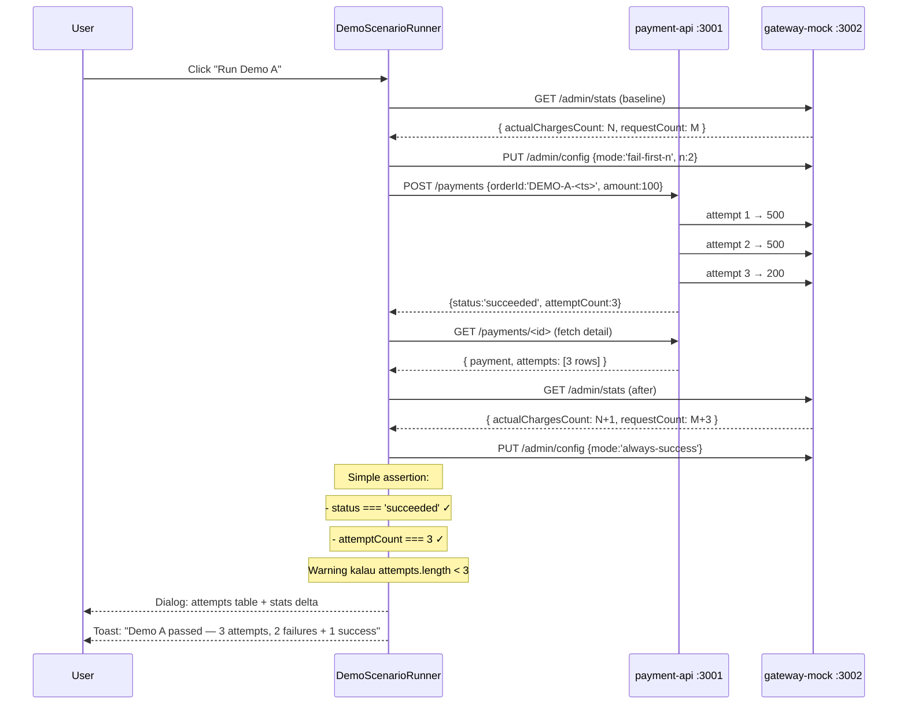
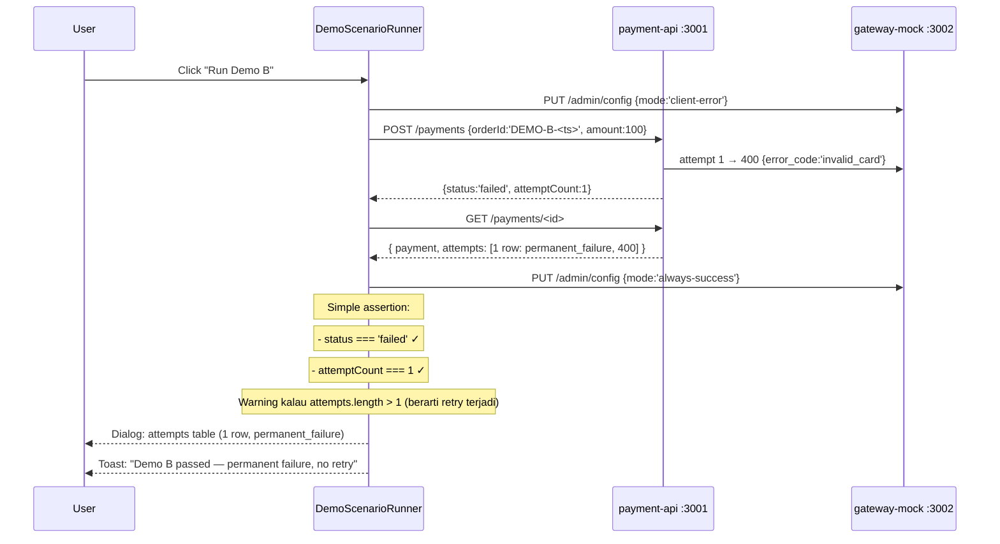
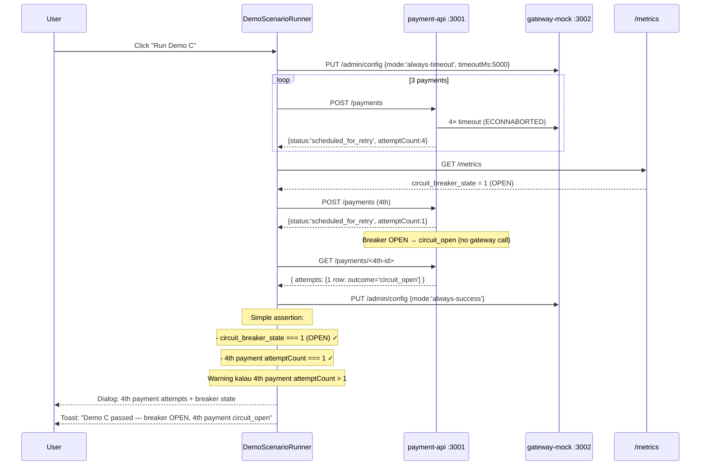
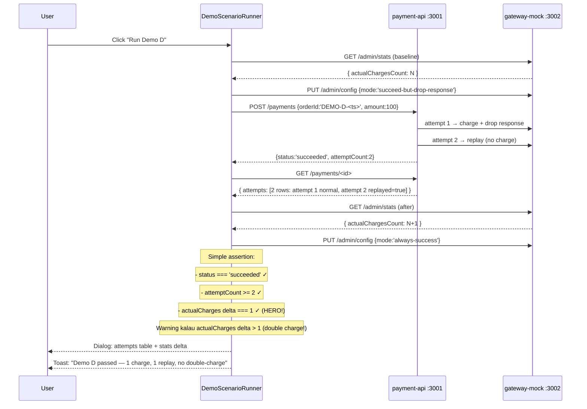
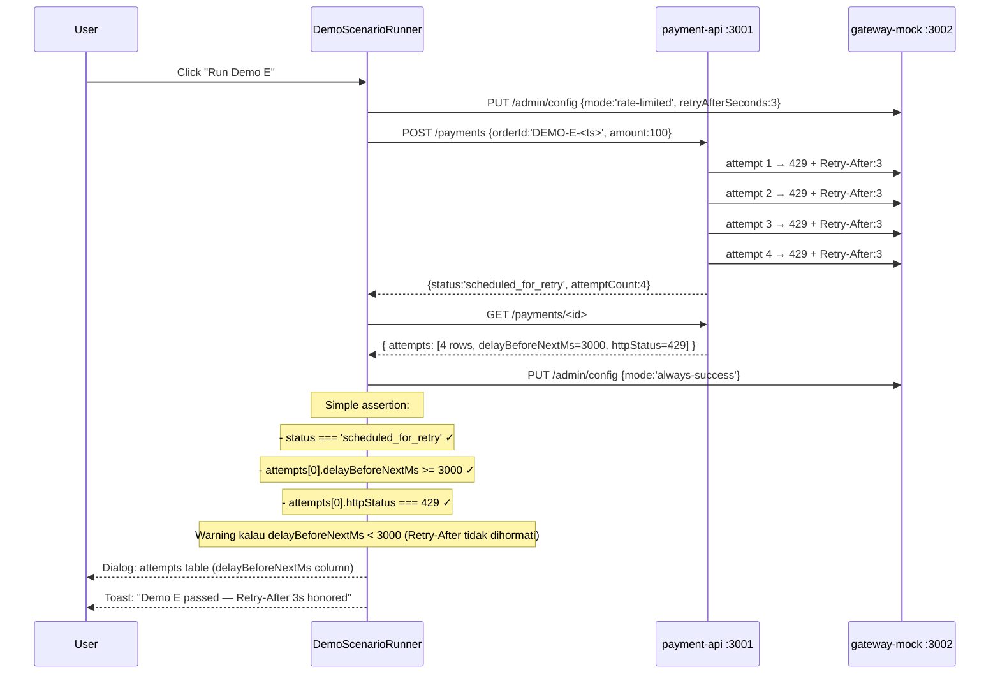

# TASK-13a — Vue Frontend Improvements (5 Sub-tasks)

> **Parent**: [TASK-13-vue-frontend.md](./TASK-13-vue-frontend.md)
> **Depends on**: TASK-13 (Vue dashboard sudah ada), TASK-14 (E2E tests PASS)
> **Estimated effort**: M (~4-6 jam untuk semua sub-tasks)

---

## Daftar Sub-task

| Task ID | Issue | Priority | Effort |
|---|---|---|---|
| TASK-13a-01 | Verify Tailwind + PrimeVue coexistence (Tailwind tetap dipakai) | Low | S |
| TASK-13a-02 | Perbaiki chart visibility + options (legend, colors, responsive) | Medium | S |
| TASK-13a-03 | Ganti global registration ke auto-import (unplugin-vue-components) | High | M |
| TASK-13a-04 | Perbaiki DemoScenarioRunner: Opsi C (Hybrid — display + simple assertion + warning) | High | M |
| TASK-13a-05 | Perbaiki ESLint: fix 14 errors + 153 warnings | High | S |

---

## TASK-13a-01: Verify Tailwind + PrimeVue Coexistence

### Keputusan

Tailwind CSS v4 tetap dipakai bersanding dengan PrimeVue 4. Tidak dihapus.

### Yang Perlu Diverifikasi

1. **`@tailwindcss/postcss`** ada di devDependencies — tanpa ini, `@import "tailwindcss"` di `styles.css` tidak terproses
2. **`postcss.config.mjs`** ada dan benar — plugin `@tailwindcss/postcss` terdaftar
3. **Tailwind Preflight** tidak break PrimeVue styling — kalau ada masalah (button border hilang, input padding salah), disable Preflight
4. **Dark mode** tidak konflik — Tailwind pakai `.dark`, PrimeVue pakai `.app-dark` (sudah berbeda selector)
5. **z-index** tidak konflik — Tailwind `z-50` vs PrimeVue modal/dialog z-index

### Files to check (read-only, no changes unless issue found)

- `apps/frontend-vue/package.json` — verify deps
- `apps/frontend-vue/postcss.config.mjs` — verify config
- `apps/frontend-vue/src/styles.css` — verify `@import "tailwindcss"`

### Solusi kalau ada konflik

Disable Tailwind Preflight di `styles.css`:
```css
@import "tailwindcss/utilities";
@import "tailwindcss/components";
/* Skip: @import "tailwindcss/preflight"; — biar PrimeVue yang handle reset */
```

Atau untuk Tailwind v4:
```css
@layer base {
  /* kosong — tidak ada Tailwind reset */
}
```

---

## TASK-13a-02: Perbaiki Chart Visibility

### Masalah

Chart di `MetricsView.vue` pakai Chart.js default options tanpa customization. Masalah:
- Warna kontras rendah (terutama dark mode)
- Tidak ada legend
- Tidak ada responsive sizing
- Pie chart labels tidak terlihat
- Bar chart labels terpotong

### Solusi

Update `MetricsView.vue` dengan custom Chart.js options:

```typescript
const chartOptions = {
  responsive: true,
  maintainAspectRatio: false,
  plugins: {
    legend: {
      position: 'bottom',
      labels: { color: 'var(--text-color)' }
    }
  },
  scales: {  // untuk Bar chart
    y: {
      beginAtZero: true,
      ticks: { color: 'var(--text-color-secondary)' },
      grid: { color: 'var(--surface-border)' }
    },
    x: {
      ticks: { color: 'var(--text-color-secondary)' },
      grid: { color: 'var(--surface-border)' }
    }
  }
};
```

### Files to change

- `apps/frontend-vue/src/views/MetricsView.vue` — tambah chart options

---

## TASK-13a-03: Ganti Global Registration ke Auto-Import

### Masalah

`main.ts` register 14 PrimeVue components secara global:

```typescript
app.component('Card', Card);       // ← ESLint error: reserved name
app.component('Button', Button);   // ← ESLint error: reserved name
// ... 12 more
```

**Masalah**:
- 14 ESLint errors: `vue/multi-word-component-names` + `vue/no-reserved-component-names`
- Bundle size: semua components di-load, bahkan yang tidak dipakai
- Tidak tree-shakeable

### Solusi

Pakai `unplugin-vue-components` + `@primevue/auto-import-resolver`:

```bash
pnpm add -D unplugin-vue-components @primevue/auto-import-resolver
```

Update `vite.config.ts`:
```typescript
import Components from 'unplugin-vue-components/vite';
import { PrimeVueResolver } from '@primevue/auto-import-resolver';

export default defineConfig({
  plugins: [
    vue(),
    Components({
      resolvers: [
        PrimeVueResolver({
          prefix: '',  // no prefix: <Card> not <PvCard>
        }),
      ],
    }),
  ],
  // ...
});
```

Hapus semua `app.component()` calls dari `main.ts`. Components akan auto-import saat dipakai di template.

### Files to change

- `apps/frontend-vue/package.json` — tambah 2 devDependencies
- `apps/frontend-vue/vite.config.ts` — tambah Components plugin
- `apps/frontend-vue/src/main.ts` — hapus 14 app.component() calls + import statements

---

## TASK-13a-04: Perbaiki DemoScenarioRunner — Opsi C (Hybrid)

### Pendekatan: Opsi C (Hybrid)

> **Display data + simple assertion + warning kalau tidak match**

DemoScenarioRunner setelah `POST /payments`:
1. **Fetch payment detail** (`GET /payments/:id`) → dapat attempts array
2. **Fetch gateway stats** (`GET /admin/stats`) → delta before/after
3. **Simple assertion**: status + attemptCount (kasar, bukan exhaustive)
4. **Display evidence** di dialog: attempts table + stats delta
5. **Warning** (toast warn, bukan fail) kalau data tidak match ekspektasi

### Kenapa Opsi C?

- **Tidak duplikasi E2E test** — assertion kasar (status + attemptCount), bukan exhaustive (outcome per attempt, trace ID, dll)
- **User lihat evidence** — attempts table + gateway stats delta tampil di dialog
- **Ada indikator pass/fail** — simple assertion untuk feedback cepat
- **Warning untuk anomali** — toast warn kalau data tidak match (misal: expected 3 attempts, got 1)

---

### Masalah di Kode Saat Ini

#### Bug 1: Demo A gateway mode salah

```typescript
// SEKARANG (bug):
await setMode('always-success');  // ← langsung sukses, tidak ada retry!
const payment = await createAndWait(`DEMO-A-${Date.now()}`, 100);
if (payment.status !== 'succeeded') throw new Error(...);
// payment.status=succeeded TAPI attemptCount=1 (tidak ada retry)
```

Demo A seharusnya membuktikan **retry bekerja** — gateway harus `fail-first-n=2` (2 attempts pertama gagal, ke-3 sukses).

#### Bug 2: Demo C tidak ada assertion

```typescript
// SEKARANG:
for (let i = 0; i < 3; i++) {
  try { await createAndWait(`DEMO-C-${Date.now()}-${i}`, 100); } catch {}  // ← swallow error!
}
await setMode('always-success');
toast.add({ severity: 'success', summary: 'Demo C passed', detail: 'Circuit breaker triggered after 3 timeouts' });
// ← TANPA assertion! Tidak cek breaker state via metrics
```

#### Bug 3: Demo D toast bilang "1 actual charge" tanpa verify

```typescript
// SEKARANG:
toast.add({ detail: `Idempotency worked! ${payment.attemptCount} attempts, 1 actual charge` });
// ↑ "1 actual charge" adalah hardcoded text, BUKAN data dari /admin/stats
```

#### Bug 4: Demo E tidak ada assertion

```typescript
// SEKARANG:
const payment = await createAndWait(`DEMO-E-${Date.now()}`, 100);
toast.add({ summary: 'Demo E passed', detail: 'Retry-After respected' });
// ← TANPA assertion! Tidak cek delayBeforeNextMs atau delta timing
```

---

### Solusi: Opsi C per Demo

#### Demo A: Transient Retry (fail-first-n=2)



#### Demo B: Permanent Failure (client-error)



#### Demo C: Circuit Breaker (always-timeout)



#### Demo D: Idempotency / Anti Double-Charge (HERO)



#### Demo E: Retry-After (rate-limited)



---

### Evidence Dialog (Opsi C)

Setelah setiap demo selesai, tampilkan Dialog berisi:

```
┌─────────────────────────────────────────────┐
│ Demo A: Transient Retry — Result            │
├─────────────────────────────────────────────┤
│ Payment Status: ✅ succeeded                 │
│ Attempt Count: 3                             │
│ Trace ID: a1b2c3d4... (consistent)          │
│                                              │
│ ┌─────────────────────────────────────────┐  │
│ │ # │ Outcome          │ HTTP │ Duration │  │
│ │ 1 │ retryable_failure│ 500  │ 15ms     │  │
│ │ 2 │ retryable_failure│ 500  │ 12ms     │  │
│ │ 3 │ success          │ 200  │ 8ms      │  │
│ └─────────────────────────────────────────┘  │
│                                              │
│ Gateway Stats (delta):                       │
│   Requests: +3                               │
│   Actual charges: +1                          │
│                                              │
│ ⚠️ Warning: None                              │
│                                              │
│              [Close]                         │
└─────────────────────────────────────────────┘
```

### Assertion Logic per Demo (simple, bukan exhaustive)

| Demo | Assert (pass/fail) | Warning (toast warn, tidak fail) |
|---|---|---|
| A | `status === 'succeeded'` + `attemptCount >= 3` | `attempts.length < 3` → "Expected ≥3 attempts, got N" |
| B | `status === 'failed'` + `attemptCount === 1` | `attempts.length > 1` → "Expected 1 attempt, got N (retry happened?)" |
| C | `breaker_state === 1` (OPEN) + 4th `attemptCount === 1` | 4th `attemptCount > 1` → "Breaker may not have OPENed" |
| D | `status === 'succeeded'` + `actualCharges delta === 1` | `actualCharges delta > 1` → "DOUBLE CHARGE DETECTED!" |
| E | `status === 'scheduled_for_retry'` + `attempts[0].delayBeforeNextMs >= 3000` | `delayBeforeNextMs < 3000` → "Retry-After not honored" |

### Files to change

- `apps/frontend-vue/src/components/DemoScenarioRunner.vue` — rewrite dengan Opsi C
- `apps/frontend-vue/src/api/payments.ts` — tambah `getPaymentById` call (sudah ada)
- `apps/frontend-vue/src/api/gateway.ts` — tambah `getGatewayStats` call (sudah ada)

---

## TASK-13a-05: Perbaiki ESLint (14 Errors + 153 Warnings)

### Masalah

ESLint config sudah ada (`eslint.config.mjs`) tapi ada:

| Issue | Count | Cause |
|---|---|---|
| `vue/multi-word-component-names` | 7 | Global registration di main.ts |
| `vue/no-reserved-component-names` | 4 | Button, Select, Dialog, Textarea — reserved HTML |
| `vue/max-attributes-per-line` | ~60 | Formatting |
| `vue/attribute-hyphenation` | ~5 | `optionLabel` → `option-label` |
| `vue/attributes-order` | ~5 | Urutan attributes |
| `vue/singleline-html-element-content-newline` | ~10 | `<h2>` content |
| `@typescript-eslint/no-explicit-any` | ~5 | `any` type usage |
| `@typescript-eslint/no-unused-vars` | ~3 | Unused variables |

### Solusi

1. **TASK-13a-03** (auto-import) akan resolve 14 errors dari global registration
2. Run `eslint --fix` untuk auto-fix 119 warnings (formatting)
3. Manual fix untuk sisanya:
   - `optionLabel` → `option-label`
   - Hapus unused variables
   - Ganti `any` dengan proper types

### Files to change

- Setelah TASK-13a-03 selesai: run `pnpm exec eslint src/ --fix`
- Manual fix di beberapa `.vue` files

---

## Urutan Eksekusi

```
TASK-13a-03 (auto-import)  →  resolve 14 ESLint errors
TASK-13a-01 (verify Tailwind)  →  check coexistence (read-only)
TASK-13a-05 (ESLint fix)  →  run --fix + manual fix
TASK-13a-02 (chart options)  →  update MetricsView
TASK-13a-04 (DemoScenarioRunner Opsi C)  →  rewrite dengan hybrid approach
```

TASK-13a-03 harus duluan karena resolve ESLint errors yang block `--fix`.

---

## Compliance dengan PLAN1

| PLAN1 Requirement | Status |
|---|---|
| Section 17.2: PrimeVue 4 + Aura preset | ✅ Tetap dipakai |
| Section 17.2: Tailwind CSS | ✅ Tetap dipakai bersanding |
| Section 17.2: DataTable, Card, Button, Toast, Dialog, Select, InputText, InputNumber, Tag, Timeline, Chart | ✅ Semua tetap, hanya cara import yang berubah |
| Section 17.2: Pinia + Vue Router + axios | ✅ Tidak berubah |
| Section 18: Demo scenario A-E | ✅ Diperbaiki dengan Opsi C (Hybrid) |

Tidak ada perubahan pada backend atau API contract. Semua perubahan murni frontend.
