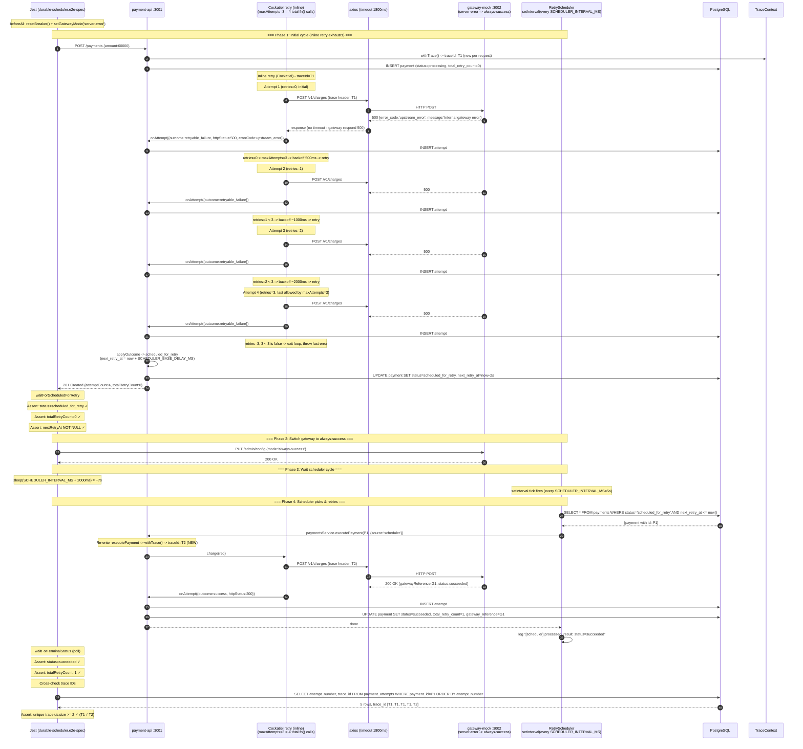

# TASK-14a-durable-scheduler - Skenario 6: Durable Retry via @nestjs/schedule

> **Parent**: [TASK-14a-e2e-verification.md](./TASK-14a-e2e-verification.md)
> **Spec file**: `apps/payment-api/tests/e2e/payments.durable-scheduler.e2e-spec.ts`

---

## 1. Apa yang Diuji

Verifikasi bahwa **RetryScheduler** (interval `@nestjs/schedule`) benar-benar mempick up payment dengan `status=scheduled_for_retry` dan mengeksekusi ulang dengan **trace ID baru** (beda cycle dari initial request).

⚠️ **Penting - Cockatiel v4 `maxAttempts` semantics**: `maxAttempts=3` artinya "maksimal 3 RETRY" (bukan total attempts). Jadi phase 1 (inline retry) menghasilkan **4 total fn() calls** = 1 initial + 3 retries. Lihat `TASK-14a-circuit-breaker.md` section 1.A untuk penjelasan detail.

**Alur 4 phase**:
1. Set gateway ke `server-error` -> semua charge dapat HTTP 500
2. `createPayment` -> Cockatiel inline retry exhausts (4 attempts, semua 500) -> payment masuk `scheduled_for_retry`, `totalRetryCount=0`
3. Switch gateway ke `always-success` (tanpa restart payment-api)
4. Tunggu scheduler cycle (`SCHEDULER_INTERVAL_MS` = 5000ms) -> scheduler picks payment -> charge sukses -> status=`succeeded`, `totalRetryCount=1`

**Assertion utama**:
- Phase 1: `status=scheduled_for_retry`, `totalRetryCount=0`, `nextRetryAt` NOT NULL
- Phase 4: `status=succeeded`, `totalRetryCount=1`
- Trace IDs di `payment_attempts` **berbeda** antara inline cycle (phase 1, trace=T1) dan scheduler cycle (phase 4, trace=T2) - minimal 2 trace IDs
- **Total audit rows = 5** (4 inline attempts dengan T1 + 1 scheduler attempt dengan T2)

---

## 2. Cara Run Test Ini Saja

```bash
cd apps/payment-api
mkdir -p ../logs/e2e

pnpm test:e2e:durable-scheduler 2>&1 | tee ../logs/e2e/S6-durable-scheduler-$(date +%s).log
```

**Atau tanpa named script**:
```bash
pnpm exec jest --config ./tests/e2e/jest-e2e.json --runInBand \
  tests/e2e/payments.durable-scheduler.e2e-spec.ts
```

---

## 3. Visualisasi Alur (Input -> Database)



### Catatan tentang outcome: `retryable_failure` (bukan `timeout`)

Berbeda dengan skenario 3 (always-timeout) yang menghasilkan `outcome='timeout'`, skenario 6 (server-error) menghasilkan **`outcome='retryable_failure'`**. Alasannya:

- Gateway mock `server-error` merespons **HTTP 500 dengan body error** (bukan tidur 5s)
- Axios terima respons -> tidak ada `ECONNABORTED` (no timeout)
- `errorCode` = `upstream_error` (dari body gateway)
- `classifyOutcome()` di `payments.service.ts:281`:
  - Bukan success, bukan circuit_open, bukan permanent (500 bukan 4xx)
  - Bukan `ETIMEDOUT`/`ECONNABORTED` (errorCode = `upstream_error`, bukan axios error code)
  - -> fallback ke `RETRYABLE_FAILURE`

Untuk perbandingan lengkap klasifikasi outcome, lihat `TASK-14a-circuit-breaker.md` section 3 "Catatan tentang perbedaan outcome: timeout vs retryable_failure".

---

## 4. Prekondisi (sebelum test mulai)

```
☐ PostgreSQL running + migrated
☐ payment-api :3001 listening
☐ gateway-mock :3002 listening
☐ Breaker CLOSED (resetBreaker())
☐ SCHEDULER_INTERVAL_MS=5000 diset di env (default code: 5000)
☐ SCHEDULER_BASE_DELAY_MS=2000 diset di env (default code: 30000 - TERLALU LAMBAT untuk test!)
   ⚠️ TANPA env ini, next_retry_at akan di-set ke now+30s, test akan timeout
   karena waitForScheduledForRetry(30000) tidak cukup menunggu
☐ Tidak ada payment lain dengan status=scheduled_for_retry (bisa ikut terpick scheduler)
   -> bersihkan via `DELETE FROM payments WHERE status='scheduled_for_retry'` sebelum test
☐ Tidak ada payment lain dengan status=processing (scheduler tidak pick, tapi bisa ganggu assertion)
```

### Env yang harus diset di apps/payment-api/.env

```env
SCHEDULER_INTERVAL_MS=5000
SCHEDULER_BASE_DELAY_MS=2000
MAX_TOTAL_RETRIES=5
```

---

## 5. Verifikasi Manual per Lapis

### L1: HTTP response
`status=succeeded`, `totalRetryCount=1` di akhir.

### L2: DB state - krusial untuk trace ID verification
```sql
SELECT attempt_number, outcome, http_status, error_code, trace_id, created_at
FROM payment_attempts
WHERE payment_id = '<id dari test>'
ORDER BY attempt_number;
```

**Yang diharapkan** (5 baris total - 4 inline + 1 scheduler):
| attempt_number | outcome            | http_status | error_code     | trace_id | created_at          |
|----------------|--------------------|-------------|----------------|----------|---------------------|
| 1              | retryable_failure  | 500         | upstream_error | T1       | t0                  |
| 2              | retryable_failure  | 500         | upstream_error | T1       | t0 + ~500ms         |
| 3              | retryable_failure  | 500         | upstream_error | T1       | t0 + ~1500ms        |
| 4              | retryable_failure  | 500         | upstream_error | T1       | t0 + ~3500ms        |
| 5              | success            | 200         | NULL           | T2       | t0 + ~7s (scheduler)|

**Kunci**:
- 4 baris pertama trace_id = T1 (sama, inline cycle, Cockatiel v4 maxAttempts=3 = 4 total fn() calls)
- Baris ke-5 trace_id = T2 (beda, scheduler cycle)
- `attempts[4].created_at - attempts[0].created_at >= SCHEDULER_INTERVAL_MS` (bukti scheduler delay, bukan inline retry)
- `attempts[4].outcome = 'success'`, `http_status=200`, `error_code=NULL` (gateway switched ke always-success)
- `attempts[0..3].outcome = 'retryable_failure'`, `http_status=500`, `error_code='upstream_error'` (gateway masih server-error)

### L3: Metrics counter
```bash
curl -s http://localhost:3001/metrics | grep -E '^(retry_attempts_total|scheduler_)'
```

**Yang diharapkan**:
- `retry_attempts_total{outcome="failure"}` naik **4** (inline cycle: 4 attempts gagal)
- `retry_attempts_total{outcome="success"}` naik **1** (scheduler cycle: 1 attempt sukses)
- (Opsional) `scheduler_cycles_total` naik 1 - kalau metric ini ada

### L4: Gateway mock stats
```bash
curl -s http://localhost:3002/admin/stats
```
- Setelah phase 1: `serverErrorCount=4`, `requestCount=4`, `successCount=0`
- Setelah phase 4: `serverErrorCount=4`, `successCount=1`, `requestCount=5`

### L5: Log scheduler
Cari di `logs/e2e/payment-api-*.log`:
```
[RetrySchedulerService] Scheduler started: intervalMs=5000, batchSize=50, maxTotalRetries=5
[RetrySchedulerService] [scheduler] picked 1 payment(s) due for retry
[RetrySchedulerService] [scheduler] picked paymentId {paymentId:P1, totalRetryCount:0, nextRetryAt:...}
[RetrySchedulerService] [scheduler] processed, result: status=succeeded {paymentId:P1, newStatus:succeeded, totalRetryCount:1}
```

**Yang membedakan dari skenario 1 (transient)**:
- Skenario 1: semua attempts dalam 1 trace ID (inline retry sukses di attempt 3)
- Skenario 6 (ini): 2 trace IDs berbeda karena inline exhausted (4 attempts) -> scheduler picks up cycle baru

---

## 6. Pass Criteria Checklist

```
☐ Jest output: "Tests: 1 passed"
☐ DB: payment.status='succeeded', total_retry_count=1
☐ DB: 5 baris di payment_attempts (4 inline + 1 scheduler)
☐ DB: trace_id unik >= 2 (T1 di 4 baris inline, T2 di 1 baris scheduler)
☐ DB: attempts[4].created_at - attempts[0].created_at >= SCHEDULER_INTERVAL_MS
☐ DB: attempts[0..3].outcome='retryable_failure', http_status=500, error_code='upstream_error'
☐ DB: attempts[4].outcome='success', http_status=200, error_code=NULL
☐ Metrics: retry_attempts_total{outcome=success} naik 1
☐ Metrics: retry_attempts_total{outcome=failure} naik 4 (bukan 3 - Cockatiel v4)
☐ Log: ada "Scheduler started: intervalMs=5000"
☐ Log: ada "[scheduler] picked 1 payment(s) due for retry"
☐ Log: ada "[scheduler] processed, result: status=succeeded"
☐ Test selesai dalam < 60 detik
```

---

## 7. Common Failure Modes & Troubleshooting

| Gejala | Kemungkinan cause | Fix |
|---|---|---|
| Test timeout 90s, payment masih `scheduled_for_retry` | Scheduler tidak jalan - `@nestjs/schedule` belum terinisialisasi | Cek `app.module.ts` - `ScheduleModule.forRoot()` harus ada di imports |
| Test timeout 90s, payment masih `scheduled_for_retry`, scheduler log jalan | `SCHEDULER_BASE_DELAY_MS` tidak diset -> default 30000 -> `next_retry_at` = now+30s | Set `SCHEDULER_BASE_DELAY_MS=2000` di `.env` |
| `totalRetryCount=0` padahal scheduler sudah pick | Scheduler tidak increment counter setelah retry | Cek `payments.service.ts` `applyOutcome` line 178-181 - harus `totalRetryCount: nextTotal` |
| `trace_id` sama di 5 baris (semua T1) | TraceContext pakai AsyncLocalStorage yang tidak reset antar cycle | Cek `withTrace()` di `trace-context.ts` - harus wrap dengan NEW context untuk setiap scheduler cycle |
| `attempts.length=4` (tidak ada attempt ke-5) | Scheduler tidak mempick payment, atau `next_retry_at` di-set ke masa depan terlalu jauh | Cek `SCHEDULER_BASE_DELAY_MS` - harus cukup pendek (< 10s). Verifikasi via `SELECT next_retry_at FROM payments WHERE id=...` |
| `attempts.length=3` (Cockatiel hanya 3 attempts inline) | Test expectation atau code baca `maxAttempts` sebagai total attempts, padahal Cockatiel v4 = "max retries" | Pastikan code pakai Cockatiel v4 dengan `maxAttempts=3` = 4 total fn() calls. Lihat `TASK-14a-circuit-breaker.md` section 1.A |
| Scheduler pick up payment LAIN selain P1 | Ada payment scheduled_for_retry lain di DB | Bersihkan DB sebelum test: `DELETE FROM payments WHERE status='scheduled_for_retry'` |
| Payment masuk `failed` (bukan `succeeded`) padahal gateway sudah `always-success` | Gateway switch tidak sempat propagasi sebelum scheduler tick | Test sudah handle dengan `sleep(SCHEDULER_INTERVAL_MS + 2000)` - pastikan `SCHEDULER_INTERVAL_MS=5000` (bukan lebih) |
| Outcome `timeout` padahal expect `retryable_failure` | Salah set gateway mode - pakai `always-timeout` (skenario 3) bukan `server-error` (skenario 6) | Test pakai `setGatewayMode('server-error')`. Verifikasi via `GET /admin/config` |

---

## 8. Catatan Edge Case

- **Scheduler `setInterval` interval**: `SCHEDULER_INTERVAL_MS=5000` artinya setiap 5 detik. Test butuh tidur ~7s (`interval + 2s buffer`) supaya scheduler sempat tick. Buffer penting karena `setInterval` tidak deterministik tepat 5s.
- **`SCHEDULER_BASE_DELAY_MS`** mengatur kapan `next_retry_at` di-set setelah inline exhaust. Default code 30s - **terlalu lama untuk test**. Set ke 1-3s di env test (`SCHEDULER_BASE_DELAY_MS=2000`) supaya scheduler bisa pick cepat. Tanpa env ini, `next_retry_at = now + 30s`, scheduler tidak akan pick dalam 30s pertama -> `waitForTerminalStatus(30000)` timeout.
- **Trace ID per cycle**: skenario 6 adalah satu-satunya yang **assert trace ID berbeda**. Skenario 1 assert trace ID **sama** (inline retry sukses, 1 trace). Jangan tertukar.
- **`source: 'scheduler'` vs `'api'`**: di `ExecuteOptions`. Scheduler harus pass `source: 'scheduler'` supaya audit bisa membedakan. Cek `RetrySchedulerService` line 96-98 - `paymentsService.executePayment(id, {source:'scheduler'})`.
- **Race condition**: kalau gateway switch ke `always-success` terjadi SETELAH scheduler tick pertama, scheduler akan tetap dapat 500 dan re-schedule. Test handle ini dengan `sleep(SCHEDULER_INTERVAL_MS + 2000)` supaya minimal 1 tick terjadi setelah switch.
- **Multiple scheduler instances** (tidak ada di test, tapi di produksi): kalau 2 instance payment-api jalan, scheduler bisa dobel-process payment yang sama -> perlu distributed lock (Redis SETNX). Tidak diuji di skenario ini.
- **Total audit rows = 5** (bukan 4): 4 inline attempts (T1) + 1 scheduler attempt (T2). Ini berbeda dari doc versi sebelumnya yang menyebut 4 baris - itu salah, karena Cockatiel v4 `maxAttempts=3` = 4 total fn() calls di phase 1, bukan 3.
- **Outcome `retryable_failure`** (bukan `timeout`): karena gateway `server-error` merespons HTTP 500 (bukan tidur 5s seperti `always-timeout`). Lihat section 3 "Catatan tentang outcome".
