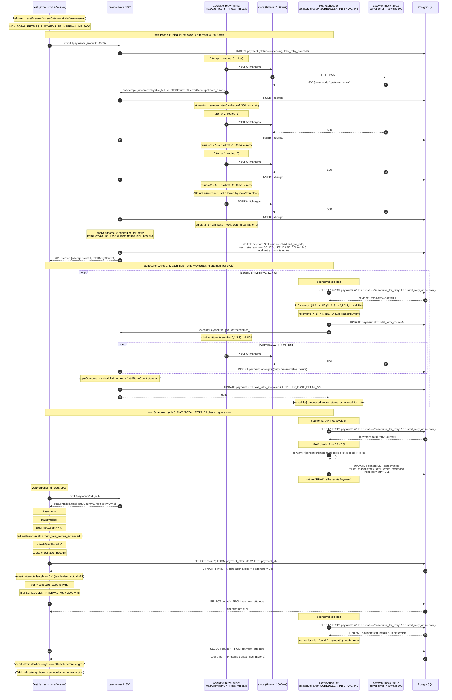

# TASK-14a-exhaustion - Skenario 7: Total Retry Exhaustion (MAX_TOTAL_RETRIES)

> **Parent**: [TASK-14a-e2e-verification.md](./TASK-14a-e2e-verification.md)
> **Spec file**: `apps/payment-api/tests/e2e/payments.exhaustion.e2e-spec.ts`

---

## 1. Apa yang Diuji

Gateway mock diset mode `server-error` (selalu 500). Payment akan terus retry sampai **`MAX_TOTAL_RETRIES` (default 5) tercapai**, lalu berhenti dan ditandai `failed` dengan `nextRetryAt=NULL`. Verifikasi bahwa **scheduler tidak melanjutkan retry** setelah exhaustion.

⚠️ **Penting - Cockatiel v4 `maxAttempts` semantics**: `maxAttempts=3` artinya "maksimal 3 RETRY" (bukan total attempts). Jadi per cycle ada **4 total fn() calls** = 1 initial + 3 retries. Lihat `TASK-14a-circuit-breaker.md` section 1.A untuk penjelasan detail.

⚠️ **Penting - totalRetryCount increment location (post-fix)**: Setelah fix bug `totalRetryCount=1` di Phase 1 (lihat worklog Task ID 14a-fix-totalRetryCount), increment dipindahkan dari `payments.service.ts applyOutcome()` ke `retry-scheduler.service.ts processOne()`. Konsekuensinya:
- Phase 1 (inline exhaust, source='api'): `totalRetryCount=0` (tidak di-increment)
- Scheduler cycle 1: increment 0->1 BEFORE executePayment
- Scheduler cycle N: increment (N-1)->N BEFORE executePayment
- MAX_TOTAL_RETRIES check juga di scheduler, BUKAN di applyOutcome

**Assertion utama**:
- `finalPayment.status === 'failed'`
- `finalPayment.totalRetryCount >= MAX_TOTAL_RETRIES` (5)
- `finalPayment.failureReason` match `/max_total_retries_exceeded|total_retry_exhausted/`
- `finalPayment.nextRetryAt === null` (tidak dijadwalkan lagi)
- `payment_attempts.length >= 6` (test assertion) - actual ~24 (4 initial + 5 scheduler × 4 attempts)
- Setelah tidur 1 cycle scheduler (`SCHEDULER_INTERVAL_MS + 2s`), **tidak ada attempt baru** - `attemptsAfter.length === attemptsBefore.length`

---

## 2. Cara Run Test Ini Saja

```bash
cd apps/payment-api
mkdir -p ../logs/e2e

# Test ini panjang (sampai 240s timeout), sabar
pnpm test:e2e:exhaustion 2>&1 | tee ../logs/e2e/S7-exhaustion-$(date +%s).log
```

**Atau tanpa named script**:
```bash
pnpm exec jest --config ./tests/e2e/jest-e2e.json --runInBand \
  tests/e2e/payments.exhaustion.e2e-spec.ts
```

---

## 3. Visualisasi Alur (Input -> Database)



### Catatan tentang outcome: `retryable_failure` (bukan `timeout`)

Sama seperti skenario 6 (durable-scheduler), outcome di phase 1 dan scheduler cycles adalah **`retryable_failure`** (bukan `timeout`):

- Gateway mock `server-error` merespons **HTTP 500 dengan body error** (bukan tidur 5s)
- Axios terima respons -> tidak ada `ECONNABORTED` (no timeout)
- `errorCode` = `upstream_error` (dari body gateway)
- `classifyOutcome()` di `payments.service.ts:281`:
  - Bukan success, bukan circuit_open, bukan permanent (500 bukan 4xx)
  - Bukan `ETIMEDOUT`/`ECONNABORTED` (errorCode = `upstream_error`, bukan axios error code)
  - -> fallback ke `RETRYABLE_FAILURE`

Untuk perbandingan lengkap klasifikasi outcome, lihat `TASK-14a-circuit-breaker.md` section 3 "Catatan tentang perbedaan outcome: timeout vs retryable_failure".

### Catatan tentang MAX_TOTAL_RETRIES check location (post-fix)

Sebelum fix bug `totalRetryCount=1` di Phase 1, MAX_TOTAL_RETRIES check ada di `payments.service.ts applyOutcome()`. Setelah fix, check dipindahkan ke `retry-scheduler.service.ts processOne()`:

```typescript
// retry-scheduler.service.ts processOne()
if (currentTotal >= this.maxTotalRetries) {
  // -> mark as FAILED, return (no executePayment)
}
const newTotal = currentTotal + 1;
await atomicUpdateStatus(paymentId, SCHEDULED_FOR_RETRY, { totalRetryCount: newTotal });
// -> then executePayment
```

Ini sesuai PLAN1 section 10.2 Flow:
```
POST /payments -> retry exhausted -> scheduled_for_retry   (NO increment)
RetryScheduler -> execute -> increment durable retry count  (increment HERE)
```

Konsekuensi:
- Phase 1: totalRetryCount=0 (sesuai PLAN1)
- Scheduler cycles 1-5: increment terjadi 5 kali (0->1->2->3->4->5)
- Scheduler cycle 6: MAX check triggers, mark as FAILED (tidak execute)
- Total execute cycles: 1 (Phase 1) + 5 (scheduler cycles 1-5) = 6 cycles × 4 attempts = 24 attempts

---

## 4. Prekondisi (sebelum test mulai)

```
☐ PostgreSQL running + migrated
☐ payment-api :3001 listening
☐ gateway-mock :3002 listening
☐ Breaker CLOSED (resetBreaker())
☐ MAX_TOTAL_RETRIES=5 diset di env
☐ SCHEDULER_INTERVAL_MS=5000 diset di env
☐ SCHEDULER_BASE_DELAY_MS=2000 diset di env (default code 30000 - TERLALU LAMBAT untuk test!)
   ⚠️ TANPA env ini, next_retry_at akan di-set ke now+30s, test akan timeout
☐ DB bersih dari payment lain dengan status=scheduled_for_retry
☐ Budget waktu: test butuh sampai 240s
```

### Env yang harus diset di apps/payment-api/.env

```env
MAX_TOTAL_RETRIES=5
SCHEDULER_INTERVAL_MS=5000
SCHEDULER_BASE_DELAY_MS=2000
BREAKER_FAILURE_THRESHOLD=3
BREAKER_COOLDOWN_MS=10000
```

---

## 5. Verifikasi Manual per Lapis

### L1: HTTP response
`status=failed`, `totalRetryCount >= 5`, `nextRetryAt=null`.

### L2: DB state - krusial
```sql
SELECT attempt_number, outcome, http_status, error_code, trace_id, created_at
FROM payment_attempts
WHERE payment_id = '<id dari test>'
ORDER BY attempt_number;
```

**Yang diharapkan** (~24 baris total):
- 4 attempts di Phase 1 (trace_id=T1, outcome=retryable_failure, http_status=500, error_code=upstream_error)
- 4 attempts di scheduler cycle 1 (trace_id=T2, outcome=retryable_failure)
- 4 attempts di scheduler cycle 2 (trace_id=T3, outcome=retryable_failure)
- 4 attempts di scheduler cycle 3 (trace_id=T4, outcome=retryable_failure)
- 4 attempts di scheduler cycle 4 (trace_id=T5, outcome=retryable_failure)
- 4 attempts di scheduler cycle 5 (trace_id=T6, outcome=retryable_failure)
- Total: **24 rows** (6 cycles × 4 attempts per cycle)

**TotalRetryCount progression**:
| Scheduler cycle | totalRetryCount BEFORE execute | totalRetryCount AFTER execute |
|---|---|---|
| (Phase 1, source='api') | 0 | 0 (tidak di-increment di applyOutcome) |
| Cycle 1 | 0 -> 1 (increment di scheduler) | 1 |
| Cycle 2 | 1 -> 2 | 2 |
| Cycle 3 | 2 -> 3 | 3 |
| Cycle 4 | 3 -> 4 | 4 |
| Cycle 5 | 4 -> 5 | 5 |
| Cycle 6 | 5 (>=5, MAX check triggers) | 5 (mark as FAILED, no execute) |

**Yang penting**:
- `payment.next_retry_at = NULL` (terminal, tidak dijadwalkan lagi)
- `payment.failure_reason = 'max_total_retries_exceeded'`
- `payment.total_retry_count = 5`
- Trace ID berbeda di setiap scheduler cycle (T1, T2, T3, T4, T5, T6 - 6 unique trace IDs)

### L3: Metrics counter
```bash
curl -s http://localhost:3001/metrics | grep -E '^retry_(attempts_total|exhausted)'
```

**Yang diharapkan**:
- `retry_attempts_total{outcome="failure"}` naik **≥ 24** (6 cycles × 4 attempts per cycle)
- (Opsional) `retry_exhausted_total` naik 1

### L4: Gateway mock stats
```bash
curl -s http://localhost:3002/admin/stats
```
- `requestCount` naik ~24 (jumlah attempts ke gateway)
- `serverErrorCount` naik ~24 (semua dapat 500)
- `actualChargesCount = 0` (tidak pernah sukses)

### L5: Log scheduler - krusial untuk "verify no more retries"
Cari di `logs/e2e/payment-api-*.log`:

**Selama scheduler cycles 1-5**:
```
[RetrySchedulerService] [scheduler] picked 1 payment(s) due for retry
[RetrySchedulerService] [scheduler] picked paymentId {paymentId:P1, totalRetryCount:N, nextRetryAt:...}
[RetrySchedulerService] [scheduler] processed, result: status=scheduled_for_retry
```

**Saat scheduler cycle 6 (MAX check triggers)**:
```
[RetrySchedulerService] [scheduler] picked 1 payment(s) due for retry
[RetrySchedulerService] WARN [scheduler] max_total_retries_exceeded -> failed {paymentId:P1, totalRetryCount:5, max:5}
```

**Setelah exhaustion (scheduler idle)**:
```
[RetrySchedulerService] No due payments - idle
```

---

## 6. Pass Criteria Checklist

```
☐ Jest output: "Tests: 1 passed"
☐ DB: payment.status='failed'
☐ DB: payment.total_retry_count >= MAX_TOTAL_RETRIES (5)
☐ DB: payment.next_retry_at IS NULL
☐ DB: payment.failure_reason contains 'max_total_retries_exceeded' or 'total_retry_exhausted'
☐ DB: payment_attempts.length >= 6 (test lenient; actual ~24)
☐ ⭐ Setelah tidur SCHEDULER_INTERVAL_MS+2s: attempts count TIDAK bertambah (scheduler berhenti)
☐ Log: ada baris "max_total_retries_exceeded -> failed" dari scheduler
☐ Log: setelah exhaustion, ada "No due payments - idle"
☐ Test selesai dalam < 240 detik
```

---

## 7. Common Failure Modes & Troubleshooting

| Gejala | Kemungkinan cause | Fix |
|---|---|---|
| Test timeout 240s | Scheduler tidak pick up payment -> totalRetryCount tidak naik | Cek `SCHEDULER_BASE_DELAY_MS` - kalau 30s, scheduler tunggu 30s baru pick. Set ke 2s untuk test |
| `totalRetryCount < 5` padahal test pass | Assertion pakai `>=` jadi lulus walau cuma 2 | Sebenarnya OK, tapi kalau < 5 berarti scheduler tidak loop. Cek log scheduler cron tick |
| `totalRetryCount=0` setelah Phase 1 (test expect 0) | ✅ Ini benar setelah fix bug increment di applyOutcome | Tidak perlu fix - ini compliance PLAN1 section 10.2 |
| `totalRetryCount=1` setelah Phase 1 | Bug lama: increment masih di `payments.service.ts applyOutcome()` | Sync fix dari sandbox: `retry-scheduler.service.ts` punya increment + MAX check |
| `nextRetryAt` tidak NULL setelah fail | MAX check tidak set `nextRetryAt=null` | Cek `retry-scheduler.service.ts processOne()` line 102-106 - harus set `nextRetryAt: null` |
| Attempts bertambah SETELAH exhaustion | Scheduler tidak check `totalRetryCount >= MAX` sebelum retry | Cek `retry-scheduler.service.ts processOne()` line 97-108 - harus short-circuit kalau `currentTotal >= maxTotalRetries` |
| `failureReason` kosong | Logic exhaustion tidak set reason | Cek `retry-scheduler.service.ts processOne()` line 104 - harus set `failureReason: 'max_total_retries_exceeded'` |
| `attempts.length=3` (Cockatiel hanya 3 attempts inline) | Test expectation atau code baca `maxAttempts` sebagai total attempts, padahal Cockatiel v4 = "max retries" | Pastikan code pakai Cockatiel v4 dengan `maxAttempts=3` = 4 total fn() calls. Lihat `TASK-14a-circuit-breaker.md` section 1.A |
| Breaker OPEN menghalangi retry | Skenario 3 belum direset, atau `BREAKER_FAILURE_THRESHOLD=3` terlalu rendah | `resetBreaker()` di beforeAll wajib. Atau set `BREAKER_FAILURE_THRESHOLD=100` di env test supaya breaker tidak OPEN selama test |
| Hanya 4 attempts (tidak scheduler cycle) | Scheduler tidak jalan / belum register | Cek `app.module.ts` - `ScheduleModule.forRoot()` harus ada |
| Outcome `timeout` padahal expect `retryable_failure` | Salah set gateway mode - pakai `always-timeout` (skenario 3) bukan `server-error` (skenario 7) | Test pakai `setGatewayMode('server-error')`. Verifikasi via `GET /admin/config` |

---

## 8. Catatan Edge Case

- **Cockatiel v4 `maxAttempts` semantics**: `maxAttempts=3` = 4 total fn() calls per cycle (1 initial + 3 retries). Bukan 3 attempts. Lihat `TASK-14a-circuit-breaker.md` section 1.A untuk penjelasan detail dengan source code reference.
- **`MAX_TOTAL_RETRIES` vs `maxAttempts`**:
  - `MAX_TOTAL_RETRIES` (5) = jumlah scheduler cycles yang diizinkan (increment 0->1->2->3->4->5)
  - `maxAttempts` (3) di Cockatiel = "max retries" per cycle = 4 total fn() calls per cycle
  - Total HTTP calls = (1 initial cycle + 5 scheduler cycles) × 4 attempts per cycle = **24 attempts**
  - Scheduler cycle ke-6 tidak execute (MAX check triggers di awal processOne)
- **`totalRetryCount` increment location (post-fix)**: increment terjadi di `retry-scheduler.service.ts processOne()` BEFORE executePayment, BUKAN di `payments.service.ts applyOutcome()`. Ini compliance PLAN1 section 10.2. Konsekuensi:
  - Phase 1 (source='api'): totalRetryCount stays 0
  - Scheduler cycle N (source='scheduler'): increment (N-1)->N before execute
- **MAX_TOTAL_RETRIES check location (post-fix)**: check `currentTotal >= maxTotalRetries` ada di `retry-scheduler.service.ts processOne()`, BUKAN di `payments.service.ts applyOutcome()`. Saat check triggers, scheduler langsung mark as FAILED tanpa call executePayment.
- **Breaker interaction**: gateway mode `server-error` menghasilkan 500 beruntun. Setelah 3 failures (threshold breaker), circuit breaker akan OPEN. Attempt berikutnya dapat `circuit_open` (bukan 500). Ini bisa mempengaruhi jumlah attempts di audit - outcome bercampur antara `retryable_failure` dan `circuit_open`. Test tidak assert outcome spesifik per attempt, hanya total count.
  - **Solusi**: set `CIRCUIT_BREAKER_THRESHOLD=100` di env test supaya breaker tidak OPEN selama test. Atau reset breaker di antara cycle (tapi tidak praktis).
- **`SCHEDULER_BASE_DELAY_MS`**: kalau default 30s, test butuh 5 × 30s = 150s hanya untuk delay antar cycle. Set ke 1-3s di env test supaya test selesai < 60s.
- **Race condition di assertion terakhir** (verify no more retries):
  - Test tidur `SCHEDULER_INTERVAL_MS + 2000` (7s) setelah dapat status=failed
  - Scheduler tick berikutnya akan query: `WHERE status='scheduled_for_retry' AND next_retry_at <= now()` - payment sudah `failed`, tidak akan terpick
  - **Kalau attempts masih bertambah**, kemungkinan ada payment LAIN yang scheduled_for_retry di DB -> bersihkan sebelum test
- **Failure reason bisa beda format** antara implementation (`max_total_retries_exceeded` vs `total_retry_exhausted`). Test pakai regex `/max_total_retries_exceeded|total_retry_exhausted/` supaya robust terhadap kedua variasi. Aktual: `max_total_retries_exceeded` (di-set di `retry-scheduler.service.ts` line 104).
- **Untuk demo**: skenario ini menunjukkan sistem **tidak infinite loop**. Tanpa `MAX_TOTAL_RETRIES`, payment yang gagal terus akan diretry selamanya -> pemborosan resource & biaya gateway. Tunjukkan log `[scheduler] max_total_retries_exceeded -> failed` sebagai bukti.
