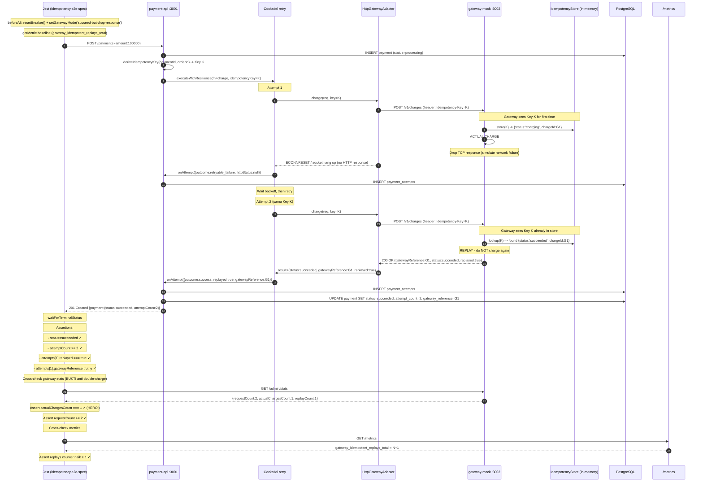

# TASK-14a-idempotency - Skenario 4 (HERO): Anti Double-Charge (succeed-but-drop-response)

> **Parent**: [TASK-14a-e2e-verification.md](./TASK-14a-e2e-verification.md)
> **Spec file**: `apps/payment-api/tests/e2e/payments.idempotency.e2e-spec.ts`
> **⚠️ HERO SCENARIO**: jika ini fail, plan DoD section 22 gagal. **WAJIB lulus**.

---

## 1. Apa yang Diuji

Gateway mock diset mode `succeed-but-drop-response`:
- Request charge pertama: gateway **mencatat ke idempotency store** + **actually charge** (real charge) + **drop response** (tcp disconnect)
- Client (Cockatiel retry) tidak terima response -> timeout -> retry
- Request charge ke-2 (dengan **Idempotency-Key sama**): gateway **tidak charge ulang**, tapi balas result yang sama dengan sebelumnya (replay)
- Client dapat `status=succeeded` dengan `gatewayReference` yang sama

**Assertion HERO**:
- `finalPayment.status === 'succeeded'`
- `finalPayment.attemptCount >= 2` (minimal 1 retry)
- `attempts[1].replayed === true` (attempt ke-2 adalah replay)
- `attempts[1].gatewayReference` truthy
- **`gateway stats.actualChargesCount === 1`** (HANYA 1 real charge, tidak double)
- `gateway stats.requestCount >= 2` (request ke gateway ≥ 2, tapi hanya 1 yang charge)
- `gateway_idempotent_replays_total` counter naik ≥ 1

---

## 2. Cara Run Test Ini Saja

```bash
cd apps/payment-api
mkdir -p ../logs/e2e

pnpm test:e2e:idempotency 2>&1 | tee ../logs/e2e/S4-idempotency-$(date +%s).log

pnpm test:e2e:idempotency 2>&1 | Tee-Object -FilePath "..\logs\e2e\S4-idempotency-$(Get-Date -Format 'yyyyMMdd-HHmmss').log"
```

**Atau tanpa named script**:
```bash
pnpm exec jest --config ./tests/e2e/jest-e2e.json --runInBand \
  tests/e2e/payments.idempotency.e2e-spec.ts
```

---

## 3. Visualisasi Alur (Input -> Database)



---

## 4. Prekondisi (sebelum test mulai)

```
☐ PostgreSQL running + migrated
☐ payment-api :3001 listening
☐ gateway-mock :3002 listening
☐ Gateway idempotency store KOSONG (restart gateway mock kalau ragu)
☐ Breaker CLOSED (resetBreaker() di beforeAll akan handle)
☐ getMetric baseline diambil SEBELUM createPayment
```

---

## 5. Verifikasi Manual per Lapis

### L1: HTTP response
`status=succeeded`, `attemptCount >= 2`, `gatewayReference` truthy.

### L2: DB state
```sql
SELECT p.id, p.status, p.attempt_count, p.gateway_reference,
       pa.attempt_number, pa.outcome, pa.replayed, pa.gateway_reference, pa.error_code
FROM payments p
JOIN payment_attempts pa ON pa.payment_id = p.id
WHERE p.order_id = 'E2E-S4-HERO-<timestamp>'
ORDER BY pa.attempt_number;
```

**Yang diharapkan**:
| status | attempt_count | gateway_reference | attempt_number | outcome            | replayed | gateway_reference |
|--------|----------------|--------------------|----------------|--------------------|----------|--------------------|
| succeeded | 2 | G1 | 1 | retryable_failure | false | NULL |
| succeeded | 2 | G1 | 2 | success            | **true** | **G1** |

**Kunci**: `attempts[1].replayed = true` dan `attempts[1].gateway_reference = G1` (sama dengan payment.gateway_reference). Kalau replayed=false tapi actualChargesCount=2 -> BUG (gateway double charge).

### L3: Metrics counter
```bash
curl -s http://localhost:3001/metrics | grep -E '^gateway_idempotent'
```

**Yang diharapkan**:
```
gateway_idempotent_replays_total <N+1>   # naik 1 dari baseline
gateway_idempotent_keys_total <M>         # jumlah keys yang tersimpan
```

### L4: Gateway mock stats (HERO assertion)
```bash
curl -s http://localhost:3002/admin/stats
```

**Yang diharapkan** (PALING PENTING):
```json
{
  "requestCount": 2,            // 2 request ke /v1/charges
  "actualChargesCount": 1,      // ⚠️ HANYA 1 real charge (HERO!)
  "replayCount": 1,             // 1 replay dari idempotency store
  "clientErrorCount": 0,
  "serverErrorCount": 0
}
```

**Kalau `actualChargesCount=2` -> BUG KRITIS. Pelanggan double-charge. Ini yang harus dicegah.**

### L5: Log
Cari di `logs/e2e/gateway-mock-*.log`:
```
[charges] POST /v1/charges (Idempotency-Key=K) - first time, charging...
[charges] ACTUAL CHARGE executed {chargeId:G1}
[charges] dropping response (simulated)
[charges] POST /v1/charges (Idempotency-Key=K) - REPLAY, not charging
[charges] returning cached result {chargeId:G1, status:succeeded, replayed:true}
```

Cari di `logs/e2e/payment-api-*.log`:
```
[retry] attempt 1 -> ECONNRESET (no response)
[retry] attempt 2 -> 200 OK {replayed:true}
[audit] attempt #2 marked as replayed {gateway_reference:G1}
[payments] payment succeeded {gateway_reference:G1}
```

---

## 6. Pass Criteria Checklist

```
☐ Jest output: "Tests: 1 passed"
☐ DB: payment.status='succeeded', attempt_count >= 2
☐ DB: attempts[1].replayed === true
☐ DB: attempts[1].gateway_reference truthy (sama dengan payment.gateway_reference)
☐ ⭐ Gateway stats: actualChargesCount === 1 (HERO! TIDAK boleh 2)
☐ Gateway stats: requestCount >= 2
☐ Metrics: gateway_idempotent_replays_total naik >= 1
☐ Log gateway: ada baris "REPLAY, not charging"
☐ Log payment-api: ada baris "replayed:true"
☐ Test selesai dalam < 30 detik
```

---

## 7. Common Failure Modes & Troubleshooting

| Gejala | Kemungkinan cause | Fix |
|---|---|---|
| `actualChargesCount = 2` (DOUBLE CHARGE!) | Idempotency-Key tidak dikirim di header, atau gateway tidak check store | Cek `HttpGatewayAdapter.charge()` - pastikan `Idempotency-Key` header dipassing. Cek gateway mock `charges.controller.ts` - pastikan baca header dan lookup store |
| `replayed = false` di attempt 2 | Gateway balas 200 tanpa flag `replayed` | Cek `charges.service.ts` di gateway mock - response harus include `replayed: true` saat replay |
| `attemptCount = 1` (tidak retry) | Cockatiel tidak retry karena error classification salah - ECONNRESET harus `retryable` | Cek `classifyError` di `packages/resilience` - network error harus `kind: 'retryable'` |
| `gatewayReference = null` di attempt 2 | Idempotency store return cached tanpa gatewayReference | Cek gateway mock `idempotency-store.ts` - store harus simpan full result, bukan hanya status |
| Test timeout 90s | Idempotency store tidak menyimpan entry pertama -> gateway charge ulang terus | Tidak ada retry limit efektif -> timeout. Debug: cek apakah `actualChargesCount` naik terus di setiap attempt |
| Breaker OPEN menghalangi retry | Skenario 3 belum direset sebelum skenario 4 | `resetBreaker()` di `beforeAll` harus jalan. Verifikasi via `circuit_breaker_state` metric = 0 |

---

## 8. Catatan Edge Case - Penting untuk Demo

- **Idempotency-Key derivation**: key harus diturunkan dari `(paymentId, orderId)` - bukan random per attempt. Kalau random, gateway akan lihat sebagai request baru dan double-charge. Cek `deriveIdempotencyKey()` di `payments/gateway/idempotency-key.ts`.
- **Idempotency store di gateway mock** adalah **in-memory** - hilang saat restart. Untuk produksi, harus pakai Redis atau DB persistent. Test tidak boleh restart gateway mid-test.
- **Mode `succeed-but-drop-response` selalu drop response pertama**. Kalau test pakai retry dengan maxAttempts=2, hanya 1 drop terjadi. Kalau maxAttempts=3, attempt ke-3 juga akan drop (loop) - bisa bikin test gagal. Konfigurasi default aman.
- **`actualChargesCount` adalah counter di MockState** - tidak reset kecuali `POST /admin/reset` dipanggil atau gateway restart. `beforeAll` tidak panggil reset, jadi counter bisa carry-over dari test sebelumnya. **Verifikasi delta, bukan nilai absolut** - kecuali kalau bersih-bersih dulu.
- **Untuk demo ke stakeholder**: skenario ini paling persuasif. Tunjukkan `actualChargesCount=1` di gateway stats bersamaan dengan `requestCount=2` di payment-api log -> bukti nyata anti double-charge bekerja.
