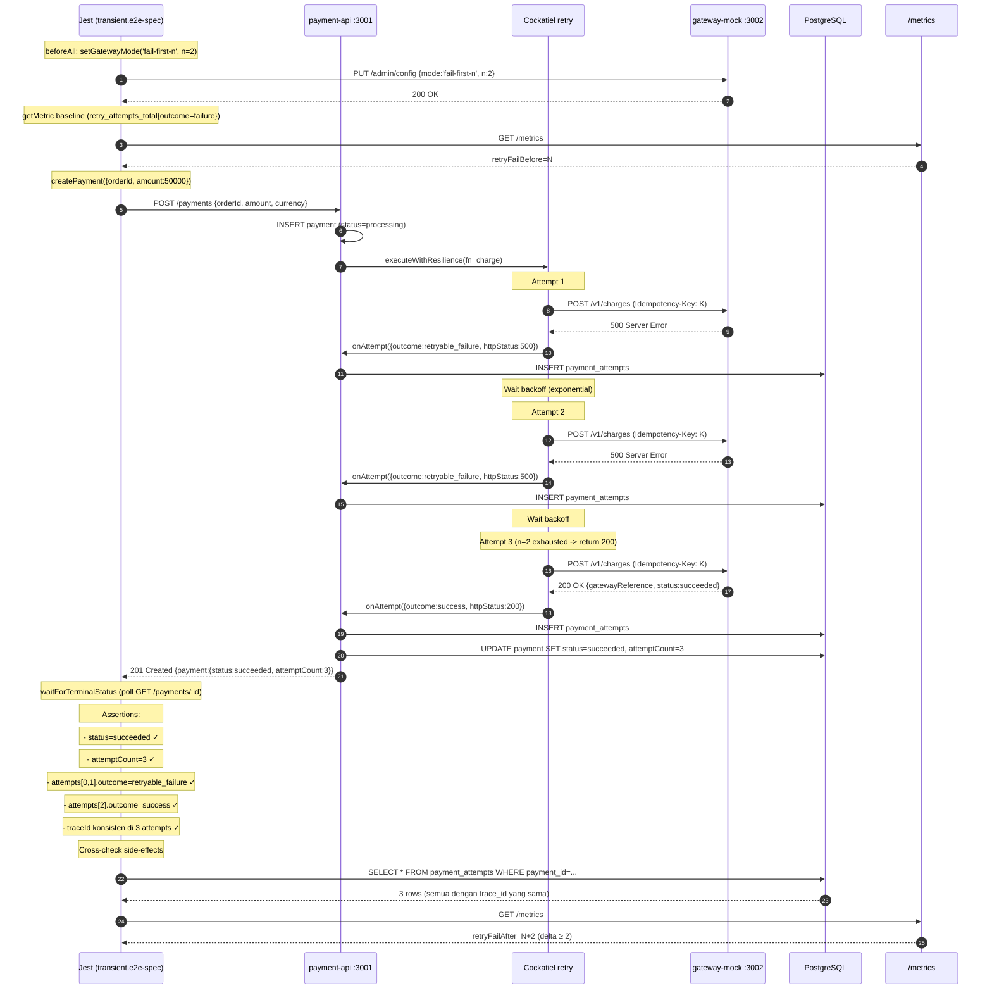

# TASK-14a-transient - Skenario 1: Transient Failure (fail-first-n=2)

> **Parent**: [TASK-14a-e2e-verification.md](./TASK-14a-e2e-verification.md)
> **Spec file**: `apps/payment-api/tests/e2e/payments.transient.e2e-spec.ts`

---

## 1. Apa yang Diuji

Gateway mock diset mode `fail-first-n` dengan `n=2`, artinya 2 request pertama balas `500 Server Error`, request ke-3 balas `200 OK`. Cockatiel retry policy harus **otomatis retry 2×** dan akhirnya sukses di attempt ke-3.

**Assertion utama**:
- `finalPayment.status === 'succeeded'`
- `finalPayment.attemptCount === 3`
- 3 attempts di audit trail: `[retryable_failure, retryable_failure, success]`
- Trace ID **sama** di 3 attempts (satu request user, tidak di-split scheduler)
- `retry_attempts_total{outcome="failure"}` naik ≥ 2

---

## 2. Cara Run Test Ini Saja

```bash
cd apps/payment-api
mkdir -p ../logs/e2e

# Run + log ke file
pnpm test:e2e:transient 2>&1 | tee ../logs/e2e/S1-transient-$(date +%s).log

pnpm test:e2e:transient 2>&1 | Tee-Object -FilePath "..\logs\e2e\S1-transient-$(Get-Date -Format 'yyyyMMdd-HHmmss').log"
```

**Atau tanpa named script**:
```bash
pnpm exec jest --config ./tests/e2e/jest-e2e.json --runInBand \
  tests/e2e/payments.transient.e2e-spec.ts
```

---

## 3. Visualisasi Alur (Input -> Database)



---

## 4. Prekondisi (sebelum test mulai)

```
☐ PostgreSQL running + migrated
☐ payment-api :3001 listening (curl http://localhost:3001/health -> 200)
☐ gateway-mock :3002 listening (curl http://localhost:3002/admin/config -> 200)
☐ DB bersih dari payment dengan orderId `E2E-S1-*` (optional - beforeAll cleanDb() akan handle)
```

---

## 5. Verifikasi Manual per Lapis

### L1: HTTP response
Otomatis oleh Jest. Lihat output test: jika assertion gagal, Jest akan tampilkan diff.

### L2: DB state - queryAttempts
```sql
SELECT attempt_number, outcome, http_status, trace_id, gateway_reference, duration_ms
FROM payment_attempts
WHERE payment_id = '<ID dari test output>'
ORDER BY attempt_number ASC;
```

**Yang diharapkan**:
| attempt_number | outcome           | http_status | trace_id | gateway_reference |
|----------------|-------------------|-------------|----------|-------------------|
| 1              | retryable_failure | 500         | T1       | NULL              |
| 2              | retryable_failure | 500         | T1       | NULL              |
| 3              | success           | 200         | T1       | NOT NULL          |

`trace_id` di 3 baris harus **sama persis** (kalau beda -> scheduler ikut campur, itu bug).

### L3: Metrics counter
```bash
curl -s http://localhost:3001/metrics | grep -E '^retry_attempts_total'
```

**Yang diharapkan**:
```
retry_attempts_total{outcome="failure"} <N+2>   # naik 2 dari baseline
retry_attempts_total{outcome="success"} <N+1>   # naik 1
```

### L4: Gateway mock stats (opsional untuk skenario ini)
```bash
curl -s http://localhost:3002/admin/stats
```
Cek `requestCount` naik 3 dan `successCount` naik 1. `actualChargesCount` naik 1 (di skenario ini tidak ada idempotensi replay).

### L5: Log Cockatiel di `logs/e2e/payment-api-*.log`
Cari baris:
```
[retry] attempt 1 of 3 -> HttpError 500
[retry] attempt 2 of 3 -> HttpError 500
[retry] attempt 3 of 3 -> success
```
Atau format yang dipakai `@retry-failure/resilience` - lihat implementasinya.

---

## 6. Pass Criteria Checklist

```
☐ Jest output: "Tests: 1 passed"
☐ DB: 3 baris di payment_attempts dengan trace_id sama
☐ DB: payment.status='succeeded', attempt_count=3
☐ Metrics: retry_attempts_total{outcome=failure} naik ≥ 2
☐ Log: ada minimal 2 baris retry event dari Cockatiel
☐ Tidak ada "Jest did not exit" warning
☐ Test selesai dalam < 30 detik (kalau lebih -> backoff terlalu lama, cek konfigurasi retry)
```

---

## 7. Common Failure Modes & Troubleshooting

| Gejala | Kemungkinan cause | Fix |
|---|---|---|
| Test timeout 60s tanpa assertion jalan | Gateway mode tidak ter-set (masih `always-success`) | Cek `beforeAll` -> pastikan `setGatewayMode('fail-first-n', {n:2})` dipanggil sebelum `createPayment` |
| `attemptCount = 1` padahal expect 3 | Cockatiel tidak retry karena error classification salah - mungkin 500 dianggap permanent | Cek `classifyError` di `packages/resilience` - 500 harus return `retryable` |
| `trace_id` beda di attempts | Scheduler ikut retry, bukan Cockatiel inline | Pastikan `nextRetryAt` masih NULL selama inline retry. Scheduler hanya boleh pick up kalau status=`scheduled_for_retry` |
| Test pass tapi metrics counter tidak naik | `ObservabilityModule` tidak di-import di `PaymentsModule` -> `MetricsService` undefined -> `this.metrics?.incRetryAttempt()` no-op | Cek `PaymentsModule` imports: tambah `ObservabilityModule` dari `'../observability'`. Lihat section 9 Bug History |
| `ECONNREFUSED localhost:3002` | Gateway mock belum start | `cd apps/payment-gateway-mock && pnpm start:dev` |
| `Jest did not exit` | DataSource tidak di-destroy di `afterAll` | Pastikan `closeDb()` dipanggil - sudah ada di `afterAll`. `closeDb()` sekarang pakai `dataSource.destroy()` (bukan `pgClient.end()`) |

---

## 8. Catatan Edge Case

- **Jika `MAX_TOTAL_RETRIES < 2`** (mis. 1), Cockatiel retry hanya boleh sekali -> test akan fail karena attemptCount=2. Default konfigurasi: `MAX_TOTAL_RETRIES=5`, aman.
- **Jika backoff Cockatiel = 1s fixed**, test akan selesai ~5s. Kalau exponential (default), bisa sampai 10-15s. Sesuaikan timeout Jest (`60000` di test sudah aman).
- Gateway mock **mode tidak auto-reset**. Kalau skenario 1 diikuti skenario 2 tanpa `resetGatewayToHealthy()`, mode `fail-first-n` akan terus aktif -> skenario 2 akan fail. `afterAll` di test ini sudah handle dengan `resetGatewayToHealthy()`.

---

## 9. Bug History: Metrics Counter Tidak Naik (FIXED)

### Gejala

Test S1 fail pada assertion:
```
expect(retryFailAfter - retryFailBefore).toBeGreaterThanOrEqual(2);
// Received: 0
```

`retry_attempts_total{outcome="failure"}` counter tidak naik meskipun 3 attempts tercatat di `payment_attempts` table.

### Akar Masalah

**2 bug berurutan**:

#### Bug 1: `incRetryAttempt` tidak dipanggil di `attachAuditCallback`

Di `payments.service.ts` `attachAuditCallback()`, setelah `audit.recordAttempt(input)` sukses, method `this.metrics?.incRetryAttempt()` **tidak pernah dipanggil**. Audit row tersimpan (INSERT query terlihat di log), tapi metrics counter tidak ter-increment.

**Fix**: Tambah call ke `incRetryAttempt` setelah `audit.recordAttempt`:
```typescript
try {
  await this.audit.recordAttempt(input);

  // Increment retry_attempts_total metric
  const isSuccess = input.outcome === AttemptOutcome.SUCCESS;
  const paymentStatus = isSuccess ? 'succeeded' : 'processing';
  this.metrics?.incRetryAttempt(
    isSuccess ? 'success' : 'failure',
    paymentStatus,
  );
} catch (err) {
  this.logger.error(...);
}
```

**File**: `apps/payment-api/src/modules/payments/payments.service.ts`

#### Bug 2: `ObservabilityModule` tidak di-import di `PaymentsModule` (ROOT CAUSE)

Setelah Bug 1 diperbaiki, counter **masih kosong**. Penyebab sebenarnya: `PaymentsModule` tidak meng-import `ObservabilityModule`, sehingga `MetricsService` tidak ter-inject ke `PaymentsService`.

```typescript
// payments.module.ts SEBELUM (bug):
@Module({
  imports: [
    TypeOrmModule.forFeature([Payment]),
    GatewayModule,
    AuditModule,
    // ⚠️ TIDAK ADA ObservabilityModule!
  ],
  ...
})

// payments.module.ts SESUDAH (fix):
@Module({
  imports: [
    TypeOrmModule.forFeature([Payment]),
    GatewayModule,
    AuditModule,
    ObservabilityModule,  // ← TAMBAH INI
  ],
  ...
})
```

Karena `@Optional() private readonly metrics?: MetricsService` di `PaymentsService` constructor, ketika `MetricsService` tidak tersedia, `this.metrics` = `undefined`. Akibatnya `this.metrics?.incRetryAttempt()` menjadi no-op (optional chaining).

**File**: `apps/payment-api/src/modules/payments/payments.module.ts`

### Verifikasi Setelah Fix

Metrics endpoint menunjukkan counter naik dengan benar:
```
retry_attempts_total{outcome="failure",payment_status="processing"} 2
retry_attempts_total{outcome="success",payment_status="succeeded"} 1
payments_current_status{status="succeeded"} 1
```

### Impact ke Test Lain

Bug 2 berdampak ke **semua test** yang mengandalkan metrics assertion (S1, S3, S5, S6, S7). Setelah fix, semua metrics counter berfungsi dengan benar.

---
