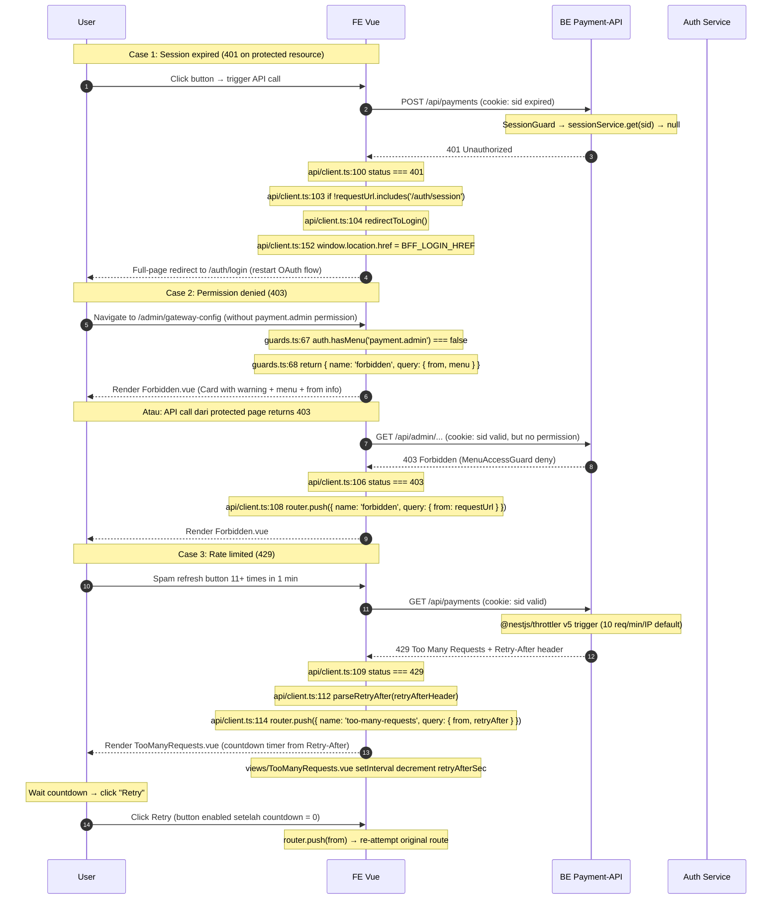
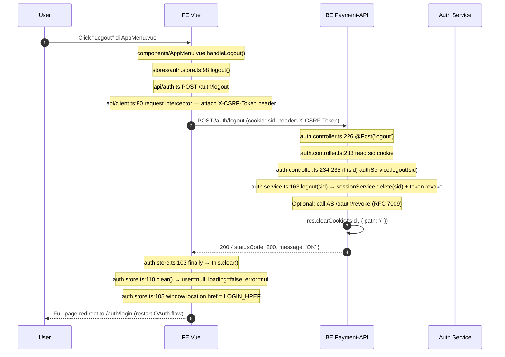

# Auth Flow Sequence Diagram — Batch 8

> **Tujuan**: Visualisasi end-to-end OAuth2 + PKCE + BFF flow yang sudah diimplementasi di AUTH-20 + AUTH-21 + AUTH-22.
> **Tujuan kedua**: Tiap step punya referensi `file:line` supaya kamu bisa tambah `log.debug` di titik yang tepat untuk debugging.

## File ini

- **Lokasi**: `apps/frontend-vue/src/views/...` (Vue SPA) + `apps/payment-api/src/auth/...` (BFF) + `apps/auth-mock/src/modules/oauth/...` (Auth Service)
- **Diagram format**: Mermaid (rendered by GitHub, VS Code, dan Markdown viewer lainnya)

---

## Diagram 1: Full Happy Path (Login → Protected Resource)

```mermaid
sequenceDiagram
    autonumber
    participant U as User (Browser)
    participant FE as FE Vue (port 5173)
    participant BFF as BE Payment-API / BFF (port 3001)
    participant AS as Auth Service (auth-mock, port 4001)

    Note over U,FE: User buka app
    U->>FE: Buka http://localhost:5173/payments

    Note over FE: router/guards.ts:45 beforeEach jalan
    Note over FE: guards.ts:55 !auth.user && !auth.loading
    FE->>FE: auth.fetchSession()
    Note over FE: stores/auth.store.ts:73 fetchSession()

    Note over FE,BFF: api/client.ts:72 apiClient GET /auth/session
    Note over FE,BFF: withCredentials=true (cookie sid ikut)
    FE->>BFF: GET /auth/session

    Note over BFF: auth.controller.ts:88 @Get('session')
    Note over BFF: auth.controller.ts:92 parseSessionCookie(req)
    alt sid cookie missing
        BFF-->>FE: 200 { user: null }
        Note over FE: auth.store.ts:84 this.user = null
    else sid cookie ada + session valid
        BFF->>BFF: auth.controller.ts:95 sessionService.get(sid)
        BFF->>BFF: auth.controller.ts:99 cacheRepository.findCachedUser(userId)
        BFF-->>FE: 200 { user: { userId, username, roleId, isSuperAdmin } }
        Note over FE: auth.store.ts:78 this.user = user
    end

    alt user masih null (not logged in)
        Note over FE: guards.ts:59 !auth.user → redirect
        Note over FE: guards.ts:62 window.location.href = BFF_LOGIN_HREF
        FE->>BFF: GET /auth/login (full-page navigation)
        Note over BFF: auth.controller.ts:122 @Get('login')
        Note over BFF: auth.controller.ts:133 authService.startLogin()
        Note over BFF: auth.service.ts:75 generate PKCE + state
        Note over BFF: auth.service.ts:75 build authorize URL
        BFF->>BFF: Set-Cookie: oauth_state, oauth_verifier (HttpOnly, 5min)
        BFF-->>U: 302 Location: http://localhost:4001/oauth/authorize?...

        U->>AS: GET /oauth/authorize?client_id=...&redirect_uri=...&code_challenge=...
        Note over AS: oauth.controller.ts:130 @Get('authorize')
        Note over AS: oauth.controller.ts:132 validateClient(client_id, redirect_uri)
        Note over AS: oauth.controller.ts:148 getAuthSession(req) — check auth_sid cookie
        alt not logged in
            AS-->>U: 200 Render login.ejs (EJS template)
            Note over U: User isi username + password
            U->>AS: POST /oauth/authorize (username, password)
            Note over AS: oauth.controller.ts:218 @Post('authorize')
            Note over AS: oauth.controller.ts:222 users.validateCredentials(username, password)
            alt credentials valid
                Note over AS: oauth.controller.ts:236 createAuthSession(res, user)
                Note over AS: oauth.service.ts:141 set auth_sid cookie
                alt single role
                    Note over AS: oauth.controller.ts:238 issueCodeAndRedirect(res, code, ...)
                    Note over AS: oauth.service.ts:155 generate authorization code (60s TTL)
                    AS-->>U: 302 Location: http://localhost:3001/auth/callback?code=...&state=...
                else multi role
                    AS-->>U: 200 Render select-role.ejs
                    Note over U: User pilih role
                    U->>AS: POST /oauth/select-role
                    AS-->>U: 302 Location: /auth/callback?code=...&state=...
                end
            else credentials invalid
                AS-->>U: 401 Render login.ejs with error "Username atau password salah"
            end
        else already logged in (auth_sid cookie valid)
            Note over AS: Skip login form
            AS-->>U: 302 Location: /auth/callback?code=...&state=...
        end

        U->>BFF: GET /auth/callback?code=...&state=...
        Note over BFF: auth.controller.ts:163 @Get('callback')
        Note over BFF: auth.controller.ts:181-183 Read code, state, oauth_state, oauth_verifier
        Note over BFF: auth.controller.ts:185 Verify all 4 values present
        Note over BFF: auth.controller.ts:194 authService.handleCallback(code, state, expectedState, codeVerifier)

        Note over BFF,AS: auth.service.ts:98 handleCallback()
        BFF->>AS: POST /oauth/token (grant_type=authorization_code, code, code_verifier, redirect_uri)
        Note over AS: token.controller.ts:63 @Post('token')
        Note over AS: token.controller.ts:65 grant_type=authorization_code
        Note over AS: Verify PKCE (code_verifier → S256 hash vs code_challenge)
        Note over AS: Verify code masih valid + not consumed (one-time use)
        Note over AS: Issue access_token (15m) + id_token (15m, OIDC) + refresh_token (8h)
        AS-->>BFF: 200 { access_token, id_token, refresh_token, token_type: Bearer, expires_in: 900 }

        Note over BFF: Verify JWT signature via JWKS (jose v5)
        Note over BFF: Extract sub, username, roleId dari JWT
        BFF->>AS: GET /api/v1/me/permissions (Bearer access_token)
        Note over AS: internal.controller.ts handle /api/v1/me/permissions
        Note over AS: Lookup user + role + permissions
        AS-->>BFF: 200 { user, role, permissionCodes: [...] }

        Note over BFF: auth.service.ts Create session (sid, userId, roleId, username, accessToken, refreshToken)
        Note over BFF: sessionService.create(sid, session)
        Note over BFF: cacheRepository.upsertCachedUser (DRY — username dari cached_users)
        BFF->>BFF: Set-Cookie: sid (HttpOnly, SameSite=Lax, 8h, path=/)
        BFF->>BFF: Clear oauth_state + oauth_verifier cookies
        BFF-->>U: 302 Location: / (frontend root)

        Note over U,FE: User balik ke SPA
        U->>FE: GET http://localhost:5173/
        Note over FE: router/guards.ts:45 beforeEach jalan lagi
        Note over FE: guards.ts:55 !auth.user && !auth.loading
        FE->>FE: auth.fetchSession()
        FE->>BFF: GET /auth/session (cookie: sid)
        Note over BFF: auth.controller.ts:95 sessionService.get(sid) → session valid
        BFF-->>FE: 200 { user: { userId, username, roleId, isSuperAdmin } }
        Note over FE: auth.store.ts:78 this.user = user
        Note over FE: guards.ts:74 return true → allow navigation
        FE-->>U: Render Dashboard + AppMenu (dinamis berdasarkan permissionCodes)
    end

    Note over U,FE: User klik menu /payments di AppMenu.vue
    U->>FE: Click "Lihat Payment"
    Note over FE: components/AppMenu.vue:171 menuItems (filtered by auth.hasMenu)
    Note over FE: router.push('/payments')
    Note over FE: guards.ts:45 beforeEach jalan
    Note over FE: guards.ts:67 auth.hasMenu('payment.read')
    alt hasMenu true
        Note over FE: guards.ts:74 return true
        FE->>BFF: GET /api/payments (cookie: sid, X-CSRF-Token jika non-GET)
        Note over BFF: Payment endpoint with SessionGuard + MenuAccessGuard
        Note over BFF: SessionGuard verify sid cookie → session valid
        Note over BFF: MenuAccessGuard verify 'payment.read' in permissionCodes
        BFF-->>FE: 200 { payments: [...] }
        FE-->>U: Render PaymentsView.vue
    else hasMenu false
        Note over FE: guards.ts:68 return redirect to /forbidden
        FE-->>U: Render Forbidden.vue (with from + menu query)
    end
```



---

## Diagram 2: Error Flows (401, 403, 429)



---

## Diagram 3: Logout Flow



---

## File Reference — Lokasi Tambah `log.debug`

Berikut adalah titik-titik strategis untuk tambah `log.debug` sesuai kebutuhan debugging:

### Frontend (Vue SPA)

| File | Line | Konteks | Saran log.debug |
|---|---|---|---|
| `apps/frontend-vue/src/router/guards.ts` | 46 | `to.meta.public === true` (skip guard) | `console.debug('[guard] public route, skip', to.path)` |
| `apps/frontend-vue/src/router/guards.ts` | 55 | `!auth.user && !auth.loading` (fetch needed) | `console.debug('[guard] no user, fetchSession start')` |
| `apps/frontend-vue/src/router/guards.ts` | 59 | `!auth.user` (still null after fetch) | `console.warn('[guard] still no user, redirect to BFF login')` |
| `apps/frontend-vue/src/router/guards.ts` | 67 | menu check | `console.debug('[guard] menu check', requiredMenu, auth.hasMenu(requiredMenu))` |
| `apps/frontend-vue/src/api/client.ts` | 80 | request interceptor start | `console.debug('[api] request', config.method, config.url)` |
| `apps/frontend-vue/src/api/client.ts` | 87 | CSRF header attached | `console.debug('[api] CSRF header attached', config.url)` |
| `apps/frontend-vue/src/api/client.ts` | 100 | 401 response | `console.warn('[api] 401 received', requestUrl)` |
| `apps/frontend-vue/src/api/client.ts` | 106 | 403 response | `console.warn('[api] 403 forbidden', requestUrl)` |
| `apps/frontend-vue/src/api/client.ts` | 109 | 429 response | `console.warn('[api] 429 throttled', requestUrl, retryAfterHeader)` |
| `apps/frontend-vue/src/stores/auth.store.ts` | 74 | `this.loading = true` | `console.debug('[auth] fetchSession start')` |
| `apps/frontend-vue/src/stores/auth.store.ts` | 78 | `this.user = user` (success) | `console.info('[auth] session loaded', user.username)` |
| `apps/frontend-vue/src/stores/auth.store.ts` | 81 | `status !== 401` (error) | `console.error('[auth] fetchSession error', status, err)` |
| `apps/frontend-vue/src/stores/auth.store.ts` | 84 | `this.user = null` (no session) | `console.debug('[auth] no session, user=null')` |
| `apps/frontend-vue/src/views/Callback.vue` | onMounted | post-OAuth callback | `console.debug('[callback] fetchSession + redirect to', next)` |

### BFF (Payment-API)

| File | Line | Konteks | Saran log.debug |
|---|---|---|---|
| `apps/payment-api/src/auth/auth.controller.ts` | 92 | `parseSessionCookie(req)` | `this.logger.debug('[session] sid from cookie:', sid ? 'present' : 'missing')` |
| `apps/payment-api/src/auth/auth.controller.ts` | 95 | `sessionService.get(sid)` | `this.logger.debug('[session] lookup sid:', sid)` |
| `apps/payment-api/src/auth/auth.controller.ts` | 99 | `findCachedUser(userId)` | `this.logger.debug('[session] cached user lookup:', session.userId)` |
| `apps/payment-api/src/auth/auth.controller.ts` | 133 | `authService.startLogin()` | `this.logger.debug('[login] startLogin PKCE generated')` |
| `apps/payment-api/src/auth/auth.controller.ts` | 146 | `res.redirect(302, redirectUrl)` | `this.logger.debug('[login] redirect to:', redirectUrl)` |
| `apps/payment-api/src/auth/auth.controller.ts` | 181 | Read callback query/cookies | `this.logger.debug('[callback] code+state present:', !!code, !!state)` |
| `apps/payment-api/src/auth/auth.controller.ts` | 194 | `handleCallback(code, state, expectedState, codeVerifier)` | `this.logger.debug('[callback] exchange code for tokens')` |
| `apps/payment-api/src/auth/auth.controller.ts` | 202 | Set sid cookie | `this.logger.debug('[callback] set sid cookie, redirect to /')` |
| `apps/payment-api/src/auth/auth.service.ts` | 75 | `startLogin()` | `this.logger.debug('[auth-service] generate PKCE + state')` |
| `apps/payment-api/src/auth/auth.service.ts` | 98 | `handleCallback()` | `this.logger.debug('[auth-service] handleCallback start')` |

### Auth Service (auth-mock)

| File | Line | Konteks | Saran log.debug |
|---|---|---|---|
| `apps/auth-mock/src/modules/oauth/oauth.controller.ts` | 132 | `validateClient()` | `this.logger.debug('[authorize] validate client_id:', query.client_id)` |
| `apps/auth-mock/src/modules/oauth/oauth.controller.ts` | 148 | `getAuthSession(req)` | `this.logger.debug('[authorize] check existing auth_sid')` |
| `apps/auth-mock/src/modules/oauth/oauth.controller.ts` | 218 | `submitLogin()` | `this.logger.debug('[submitLogin] credentials submit for:', body.username)` |
| `apps/auth-mock/src/modules/oauth/oauth.controller.ts` | 236 | `createAuthSession(res, user)` | `this.logger.debug('[submitLogin] auth_sid set for user:', user.id)` |
| `apps/auth-mock/src/modules/oauth/oauth.controller.ts` | 238 | Single role → issue code | `this.logger.debug('[submitLogin] single role, issue code immediately')` |
| `apps/auth-mock/src/modules/oauth/oauth.service.ts` | 141 | `createAuthSession()` | `this.logger.debug('[oauth-svc] set auth_sid cookie, 8h TTL')` |
| `apps/auth-mock/src/modules/oauth/oauth.service.ts` | 155 | `issueCodeAndRedirect()` | `this.logger.debug('[oauth-svc] generate authorization code, 60s TTL')` |
| `apps/auth-mock/src/modules/oauth/token.controller.ts` | 63 | `@Post('token')` | `this.logger.debug('[token] grant_type:', body.grant_type)` |
| `apps/auth-mock/src/modules/oauth/token.controller.ts` | 65 | `grant_type === 'authorization_code'` | `this.logger.debug('[token] auth code exchange')` |
| `apps/auth-mock/src/modules/oauth/token.controller.ts` | 90 | `grant_type === 'refresh_token'` | `this.logger.debug('[token] refresh rotation')` |

---

## Catatan Penting

### Cookie Names

| Cookie | HttpOnly | SameSite | TTL | Set by | Tujuan |
|---|---|---|---|---|---|
| `oauth_state` | true | lax | 5 min | BFF `/auth/login` | CSRF protection (PKCE state) |
| `oauth_verifier` | true | lax | 5 min | BFF `/auth/login` | PKCE code_verifier (untuk token exchange) |
| `auth_sid` | true | lax | 8h | Auth Service `/oauth/authorize` (POST) | Sesi di auth-mock (skip login form kalau sudah login) |
| `sid` | true | lax | 8h | BFF `/auth/callback` | Session BFF (yang dipakai SessionGuard) |
| `XSRF-TOKEN` | false | lax | session | BFF `CsrfMiddleware` | CSRF double-submit (FE baca + kirim via header) |

### Port Configuration (sandbox)

| Service | Port | Env var |
|---|---|---|
| FE Vue | 5173 | Vite default |
| BFF Payment-API | 3001 | `PORT` |
| Auth Service (auth-mock) | 4001 | `AUTH_MOCK_PORT` |
| Mock Gateway | 3002 | (default, optional) |

### Alur Singkat (Ringkasan Tanpa Diagram)

```
1. User buka app → router/guards.ts:45 beforeEach
2. !auth.user → fetchSession() → GET /auth/session ke BFF
3. BFF cek sid cookie:
   - Missing → return { user: null }
   - Ada + valid → lookup cached_users → return user info
4. Kalau user null → guards.ts:62 redirect ke BFF /auth/login (full-page)
5. BFF generate PKCE + state → set oauth_state + oauth_verifier cookies → 302 ke auth-mock /oauth/authorize
6. Auth-mock render login.ejs (atau skip kalau auth_sid cookie valid)
7. User login → auth-mock issue authorization code → 302 balik ke BFF /auth/callback
8. BFF verify state + exchange code via POST /oauth/token → dapat JWT access+id+refresh
9. BFF verify JWT + GET /api/v1/me/permissions dari auth-mock → dapat permissionCodes
10. BFF create session (sid) + Set-Cookie sid → 302 ke / (frontend)
11. FE reload → guards.ts:45 jalan lagi → fetchSession → user loaded → allow navigation
12. User klik menu → guards.ts:67 hasMenu check → allow atau redirect /forbidden
13. API call via apiClient → 401/403/429 handled by response interceptor
```

---

## Cara Pakai Diagram Ini

1. **Buka di VS Code** dengan extension "Mermaid Preview" atau "Markdown Preview Mermaid Support"
2. **Buka di GitHub** — render otomatis di PR/issue/wiki
3. **Untuk debugging** — tambah `log.debug` di titik-titik sesuai tabel di atas
4. **Untuk testing** — pakai diagram ini sebagai checklist skenario E2E (AUTH-26)
