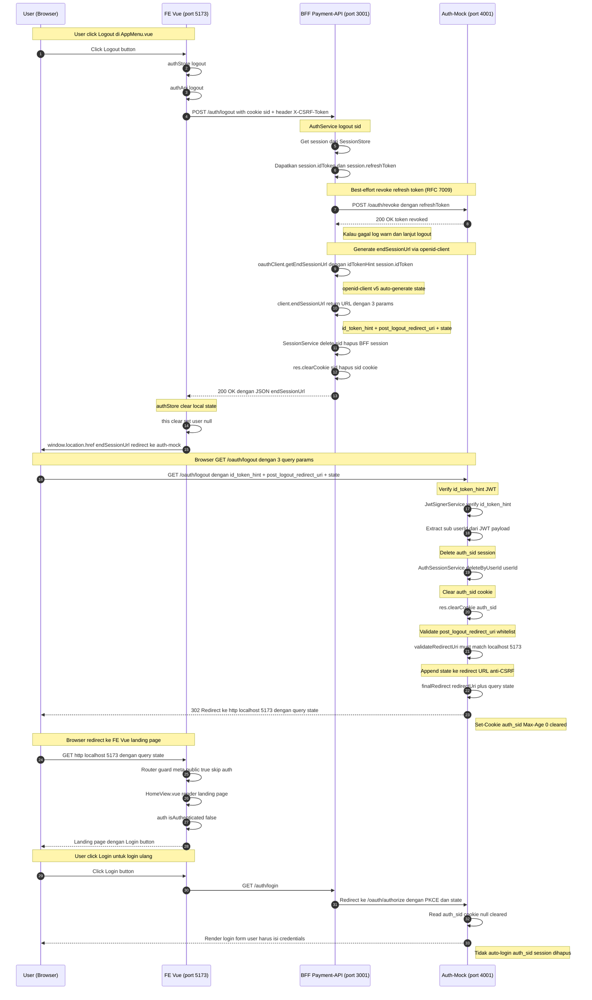

# AUTH-09a — Fix logout auto-login bug (RP-initiated logout via openid-client `endSessionUrl`)

> **Task ID**: AUTH-09a
> **Plan**: Plan 2 — Auth Integration (v1.2.2)
> **Depends on**: AUTH-09 (OAuth client), AUTH-17 (payment-api BFF), AUTH-20 (FE Vue auth store)
> **Estimated effort**: M (~2-3 jam)
> **Plan reference**: Section 5.5 (revoke), Section 9 (oauth-client.service.ts),
>   Section 10.7.9 (auth-mock auth_sid session), Section 11.5 (route guard),
>   Section 15.4 (discovery), OIDC Session Management 1.0 (RP-initiated logout),
>   RFC 7009 (token revocation), RFC 6749 (OAuth 2.0)

---

## Pre-Implementation Checklist

> Lihat [`docs/PRE_TASK_CHECKLIST.md`](../../PRE_TASK_CHECKLIST.md) untuk template lengkap.

Sebelum mulai coding, jawab:
- [ ] DRY: Sudah grep logic serupa?
- [ ] SOLID: 1 class = 1 responsibility?
- [ ] Naming: kebab-case + PascalCase?
- [ ] Error: status code akurat?
- [ ] Test: *.spec.ts (unit) vs *.integration.spec.ts (real deps)?
- [ ] Docs: JSDoc + plan reference?

---

## Goal

Fix bug **single sign-out problem** di OAuth2 + BFF pattern.

### Bug yang ditemukan

Saat user click "Logout" di FE Vue:
1. BFF `/auth/logout` menghapus BFF session (`sid` cookie domain `localhost:3001`)
2. BFF tidak bisa menghapus `auth_sid` cookie (domain `localhost:4001`) — cross-origin
3. FE redirect ke BFF `/auth/login` → auth-mock `/oauth/authorize`
4. Auth-mock baca `auth_sid` cookie → session masih valid → **auto-login** terjadi
5. User tidak benar-benar logout

### Solusi

**OIDC RP-initiated logout** menggunakan openid-client v5 native API `client.endSessionUrl()`:

1. BFF `/auth/logout` — back-channel revoke refresh token (RFC 7009, best-effort)
2. BFF return `endSessionUrl` ke FE
3. FE redirect browser ke auth-mock `/oauth/logout?id_token_hint=...&post_logout_redirect_uri=...`
4. Auth-mock `/oauth/logout` — verify `id_token_hint` (JWT), delete `auth_sid` session, clear cookie, redirect ke FE landing page

Plus: tambah **landing page** di FE Vue root `/` yang conditional render (Login button kalau not authenticated, Go to Dashboard button kalau authenticated).

---

## Scope

**In scope**:

### 1. Auth-mock — tambah endpoint `GET /oauth/logout` + expose di OIDC discovery

Endpoint menerima 3 parameter query per OIDC RP-initiated logout spec:

| Parameter | Required | Deskripsi |
|---|---|---|
| `id_token_hint` | ✅ WAJIB | JWT id_token yang diterima saat login. Auth-mock verify signature + extract `sub` (userId) untuk identify session yang harus dihapus |
| `post_logout_redirect_uri` | ⚠️ OPTIONAL | URL tujuan setelah logout. Default: `http://localhost:5173/`. Harus match whitelist (anti open-redirect) |
| `state` | ⚠️ OPTIONAL | Opaque value untuk anti-CSRF. openid-client v5 auto-generate. Diteruskan as-is ke `post_logout_redirect_uri` sebagai `?state=...` |

- `apps/auth-mock/src/modules/oauth/oauth.controller.ts` — tambah `@Get('logout')`:
  - Baca 3 parameter dari query: `id_token_hint`, `post_logout_redirect_uri`, `state`
  - Verify `id_token_hint` JWT signature via `JwtSignerService.verify()` (existing)
  - Extract `sub` (userId) dari payload
  - Delete semua `AuthSession` untuk userId tersebut dari `AuthSessionStore`
  - Clear `auth_sid` cookie (`Set-Cookie: auth_sid=; Max-Age=0; Path=/`)
  - Validate `post_logout_redirect_uri` whitelist (anti open-redirect)
  - Redirect 302 ke `post_logout_redirect_uri` + append `state` kalau ada
  - Return 400 kalau `id_token_hint` missing atau invalid
- `apps/auth-mock/src/modules/discovery/discovery.service.ts` — tambah `end_session_endpoint` field
- `apps/auth-mock/src/modules/discovery/discovery.controller.spec.ts` — update test untuk expect `end_session_endpoint`

### 2. Security package — tambah method `getEndSessionUrl()` di OAuthClientService

- `packages/security/src/oauth/oauth-client.service.ts` — tambah method:
  ```typescript
  async getEndSessionUrl(params: {
    idTokenHint: string;
    postLogoutRedirectUri: string;
    state?: string;
  }): Promise<string>
  ```
  - Call `client.endSessionUrl({ id_token_hint, post_logout_redirect_uri, state })` (openid-client v5 native)
  - `state` optional — kalau tidak diset, openid-client auto-generate random state
  - Return URL string (browser akan redirect ke sana)
- `packages/security/src/oauth/oauth-client.types.ts` — tambah type `EndSessionParams`

### 3. Security package — simpan `idToken` di Session + DB migration

OIDC RP-initiated logout spec butuh `id_token_hint` parameter = **id_token** yang diterima saat login (BUKAN access_token). Saat ini session object tidak simpan `idToken` — perlu tambah field di multiple layer:

**TokenSet type** (`packages/security/src/oauth/oauth-client.types.ts`):
- Tambah `idToken?: string` ke `TokenSet` interface

**OAuthClientService** (`packages/security/src/oauth/oauth-client.service.ts`):
- Update `toTokenSet()` untuk parse `ts.id_token` → `idToken`

**Session interface** (`packages/security/src/session-store/session-store.interface.ts`):
- Tambah `idToken: string` ke `Session` interface

**SessionEntity** (`packages/security/src/cache/session.entity.ts`):
- Tambah `@Column('text', { name: 'id_token', nullable: true }) id_token: string | null`

**DB Migration** (`apps/payment-api/src/database/migrations/`):
- NEW migration file: `AddIdTokenToSessions<migration-number>.ts`
- `ALTER TABLE sessions ADD COLUMN id_token TEXT` (nullable — backward compat)
- SQLite (sandbox): `synchronize: true` auto-create, tidak perlu run migration
- PostgreSQL (lokal/production): `synchronize: false`, WAJIB run `pnpm db:migrate`

**PostgresSessionStore** (`packages/security/src/session-store/postgres.store.ts`):
- Update `set()`: map `session.idToken` → `id_token` column
- Update `entityToSession()`: map `entity.id_token` → `session.idToken`

**MemorySessionStore** (`packages/security/src/session-store/memory-session.store.ts`):
- Tidak perlu schema change (memory Map simpan Session object as-is)
- Tapi pastikan `idToken` field ikut tersimpan saat `set()`

**RedisSessionStore** (`packages/security/src/session-store/redis-session.store.ts`):
- Update JSON serialization untuk include `idToken` field

**SessionService** (`packages/security/src/oauth/session.service.ts`):
- Update `create()`: simpan `input.tokens.idToken` ke `session.idToken`

### 4. BFF (payment-api) — update `/auth/logout` untuk return `endSessionUrl`

- `apps/payment-api/src/auth/auth.service.ts` — update `logout()` method:
  - Get session (untuk dapat **idToken**, bukan accessToken)
  - Best-effort revoke refresh token (existing, tetap best-effort)
  - Call `oauthClient.getEndSessionUrl({ idTokenHint: session.idToken, postLogoutRedirectUri: FRONTEND_URL })`
    (state auto-generated oleh openid-client)
  - Return `{ endSessionUrl }` ke controller
  - Kalau `getEndSessionUrl` fail → throw error, logout tidak complete
- `apps/payment-api/src/auth/auth.controller.ts` — update `@Post('logout')`:
  - Return `{ endSessionUrl }` di response body (selain clear sid cookie)
  - Return error 500 kalau `authService.logout()` throw

### 5. FE Vue — update logout flow + tambah landing page

- `apps/frontend-vue/src/stores/auth.store.ts` — update `logout()` action:
  - Call `authApi.logout()` → dapat `{ endSessionUrl }`
  - Clear local state (`this.user = null`)
  - `window.location.href = endSessionUrl` (redirect ke auth-mock logout)
  - Auth-mock akan redirect balik ke `FRONTEND_URL` (landing page)
- `apps/frontend-vue/src/api/auth.ts` — update `logout()` return type:
  - Return `Promise<{ endSessionUrl: string }>` (bukan `Promise<void>`)
- `apps/frontend-vue/src/views/HomeView.vue` — REWRITE jadi landing page:
  - Conditional render: kalau `!auth.isAuthenticated` → tombol "Login"
  - Kalau `auth.isAuthenticated` → tombol "Go to Dashboard"
  - Login button → `window.location.href = ${VITE_API_URL}/auth/login`
  - Go to Dashboard → `router.push('/dashboard')`
- `apps/frontend-vue/src/router/index.ts` — update route `/`:
  - `meta: { public: true }` (skip auth check, landing page accessible tanpa login)
  - Atau buat route baru `/dashboard` untuk authenticated view (pindah dari `/` ke `/dashboard`)

**Out of scope**:
- Back-channel logout (server-to-server session deletion) — tidak dipakai, cookie cleanup via front-channel
- Auth-mock logout endpoint untuk multi-device logout (hapus session di semua device) — future task
- SLO (Single Logout) via back-channel logout notification (OIDC Back-Channel Logout 1.0) — future task

---

## Files to create/modify

### Auth-mock
- `apps/auth-mock/src/modules/oauth/oauth.controller.ts` — UPDATE: tambah `@Get('logout')`
- `apps/auth-mock/src/modules/oauth/auth-session.service.ts` — UPDATE: tambah `deleteByUserId(userId)` method
- `apps/auth-mock/src/modules/discovery/discovery.service.ts` — UPDATE: tambah `end_session_endpoint`
- `apps/auth-mock/src/modules/discovery/discovery.controller.spec.ts` — UPDATE: expect `end_session_endpoint`

### Security package
- `packages/security/src/oauth/oauth-client.service.ts` — UPDATE: tambah `getEndSessionUrl()` method + update `toTokenSet()` parse `id_token`
- `packages/security/src/oauth/oauth-client.types.ts` — UPDATE: tambah `EndSessionParams` type + `idToken?` ke `TokenSet`
- `packages/security/src/session-store/session-store.interface.ts` — UPDATE: tambah `idToken: string` ke `Session` interface
- `packages/security/src/cache/session.entity.ts` — UPDATE: tambah `id_token` column (nullable, text)
- `packages/security/src/session-store/postgres.store.ts` — UPDATE: map `id_token` di set/get
- `packages/security/src/session-store/redis-session.store.ts` — UPDATE: include `idToken` di JSON serialization
- `packages/security/src/oauth/session.service.ts` — UPDATE: simpan `input.tokens.idToken` ke session
- `packages/security/tests/oauth-client.service.spec.ts` — UPDATE: test `getEndSessionUrl()`

### BFF (payment-api)
- `apps/payment-api/src/auth/auth.service.ts` — UPDATE: `logout()` return `endSessionUrl`, pakai `session.idToken` (bukan accessToken)
- `apps/payment-api/src/auth/auth.controller.ts` — UPDATE: `@Post('logout')` return `{ endSessionUrl }`
- `apps/payment-api/tests/auth/auth.controller.spec.ts` — UPDATE: expect `endSessionUrl` di response
- `apps/payment-api/src/database/migrations/` — NEW: migration file `AddIdTokenToSessions*.ts`
- `apps/payment-api/package.json` — sudah ada script `db:migrate` (tidak perlu tambah)

### FE Vue
- `apps/frontend-vue/src/stores/auth.store.ts` — UPDATE: `logout()` redirect ke `endSessionUrl`
- `apps/frontend-vue/src/api/auth.ts` — UPDATE: `logout()` return `{ endSessionUrl }`
- `apps/frontend-vue/src/views/HomeView.vue` — REWRITE: landing page dengan conditional Login/Dashboard
- `apps/frontend-vue/src/router/index.ts` — UPDATE: route `/` jadi public + tambah `/dashboard`

---

## Implementation steps

### Step 1: Auth-mock — tambah `deleteByUserId` di AuthSessionService

```typescript
// apps/auth-mock/src/modules/oauth/auth-session.service.ts
async deleteByUserId(userId: string): Promise<number> {
  let deleted = 0;
  for (const [sid, session] of this.sessions) {
    if (session.userId === userId) {
      this.sessions.delete(sid);
      deleted++;
    }
  }
  return deleted;
}
```

### Step 2: Auth-mock — tambah `end_session_endpoint` di discovery

```typescript
// apps/auth-mock/src/modules/discovery/discovery.service.ts
// Tambah ke DiscoveryDocument interface:
end_session_endpoint: string;

// Tambah ke buildDiscovery():
end_session_endpoint: `${issuer}/oauth/logout`,
```

### Step 3: Auth-mock — tambah `@Get('logout')` di OAuthController

```typescript
// apps/auth-mock/src/modules/oauth/oauth.controller.ts
@Get('logout')
async logout(
  @Query('id_token_hint') idTokenHint: string,
  @Query('post_logout_redirect_uri') postLogoutRedirectUri: string,
  @Query('state') state: string,
  @Req() req: Request,
  @Res() res: Response,
): Promise<void> {
  // 1. id_token_hint WAJIB — verify JWT + extract userId
  if (!idTokenHint) {
    return res.status(400).json({
      error: 'invalid_request',
      error_description: 'id_token_hint is required',
    });
  }

  // 2. Verify JWT signature via JwtSignerService
  const payload = await this.jwtSigner.verify(idTokenHint);
  const userId = payload.sub;

  // 3. Delete all AuthSession for userId
  const deleted = await this.oauth.getAuthSessionStore().deleteByUserId(userId);
  this.logger.debug(`Logout: deleted ${deleted} auth_sid sessions for userId=${userId}`);

  // 4. Clear auth_sid cookie
  res.clearCookie('auth_sid', { path: '/' });

  // 5. Validate post_logout_redirect_uri whitelist (anti open-redirect)
  const allowedRedirects = ['http://localhost:5173/', 'http://localhost:5173'];
  const redirectUri = allowedRedirects.includes(postLogoutRedirectUri)
    ? postLogoutRedirectUri
    : 'http://localhost:5173/';

  // 6. Append state kalau ada (anti-CSRF, diteruskan as-is per OIDC spec)
  const finalRedirect = state
    ? `${redirectUri}${redirectUri.includes('?') ? '&' : '?'}state=${encodeURIComponent(state)}`
    : redirectUri;

  res.redirect(302, finalRedirect);
}
```

### Step 4: Security package — tambah `getEndSessionUrl` di OAuthClientService

```typescript
// packages/security/src/oauth/oauth-client.service.ts
/**
 * Generate RP-initiated logout URL (OIDC Session Management 1.0).
 *
 * openid-client v5 native API — `client.endSessionUrl()` membangun URL
 * dengan parameter:
 *   - id_token_hint (JWT id_token dari login sebelumnya)
 *   - post_logout_redirect_uri (redirect target setelah logout)
 *   - state (auto-generated random string untuk anti-CSRF, diteruskan ke redirect)
 *   - client_id (auto-added oleh openid-client)
 *
 * @param params.idTokenHint - JWT access token atau id_token (string)
 * @param params.postLogoutRedirectUri - URL tujuan setelah logout (default: FRONTEND_URL)
 * @param params.state - Optional state untuk anti-CSRF (auto-generate kalau tidak diset)
 * @returns URL string untuk browser redirect
 */
async getEndSessionUrl(params: {
  idTokenHint: string;
  postLogoutRedirectUri: string;
  state?: string;
}): Promise<string> {
  const client = await this.getClient();
  return client.endSessionUrl({
    id_token_hint: params.idTokenHint,
    post_logout_redirect_uri: params.postLogoutRedirectUri,
    state: params.state,  // undefined → openid-client auto-generate
  });
}
```

### Step 4b: Security package — tambah `idToken` ke TokenSet + Session + DB migration

OIDC RP-initiated logout butuh `id_token_hint` = **id_token** (BUKAN access_token). Saat ini session tidak simpan `idToken`.

**4b.1 — TokenSet type:**
```typescript
// packages/security/src/oauth/oauth-client.types.ts
export interface TokenSet {
  accessToken: string;
  refreshToken?: string;
  idToken?: string;  // ← TAMBAH
  expiresAt: number;
  tokenType: 'Bearer';
  scope?: string;
}
```

**4b.2 — OAuthClientService.toTokenSet():**
```typescript
// packages/security/src/oauth/oauth-client.service.ts
private toTokenSet(ts: OidcTokenSet): TokenSet {
  // ... existing code ...
  return {
    accessToken: ts.access_token as string,
    refreshToken: ts.refresh_token,
    idToken: ts.id_token,  // ← TAMBAH
    expiresAt,
    tokenType: 'Bearer',
    scope: ts.scope,
  };
}
```

**4b.3 — Session interface:**
```typescript
// packages/security/src/session-store/session-store.interface.ts
export interface Session {
  // ... existing fields ...
  idToken: string;  // ← TAMBAH (untuk RP-initiated logout id_token_hint)
  accessToken: string;
  refreshToken: string;
  // ...
}
```

**4b.4 — SessionEntity (DB column):**
```typescript
// packages/security/src/cache/session.entity.ts
@Column('text', { name: 'id_token', nullable: true })
id_token: string | null = null;  // ← TAMBAH (nullable — backward compat)
```

**4b.5 — DB Migration file:**
```typescript
// apps/payment-api/src/database/migrations/AddIdTokenToSessions1700000000000.ts
import { MigrationInterface, QueryRunner } from 'typeorm';

export class AddIdTokenToSessions1700000000000 implements MigrationInterface {
  public async up(queryRunner: QueryRunner): Promise<void> {
    await queryRunner.query(
      `ALTER TABLE "sessions" ADD COLUMN "id_token" TEXT`,
    );
  }

  public async down(queryRunner: QueryRunner): Promise<void> {
    await queryRunner.query(
      `ALTER TABLE "sessions" DROP COLUMN "id_token"`,
    );
  }
}
```

**4b.6 — PostgresSessionStore:**
```typescript
// packages/security/src/session-store/postgres.store.ts
// Update set():
const entry: SessionEntity = {
  // ... existing fields ...
  id_token: session.idToken,  // ← TAMBAH
};
// Update entityToSession():
return {
  // ... existing fields ...
  idToken: entity.id_token ?? '',  // ← TAMBAH
};
```

**4b.7 — RedisSessionStore:**
```typescript
// packages/security/src/session-store/redis-session.store.ts
// JSON serialization sudah include semua Session fields secara otomatis
// (JSON.stringify(session)). Pastikan idToken field ada di Session interface.
// Tidak perlu code change jika pakai JSON.stringify/parse pattern.
```

**4b.8 — SessionService.create():**
```typescript
// packages/security/src/oauth/session.service.ts
const session: Session = {
  // ... existing fields ...
  idToken: input.tokens.idToken ?? '',  // ← TAMBAH
  accessToken: input.tokens.accessToken,
  refreshToken: input.tokens.refreshToken ?? '',
  // ...
};
```

**Run migration (PostgreSQL only):**
```bash
# SQLite (sandbox): synchronize=true → auto-create column, skip migration
# PostgreSQL (lokal/production): WAJIB run migration
cd apps/payment-api && pnpm db:migrate
```

### Step 5: BFF — update `authService.logout()` untuk return `endSessionUrl`

```typescript
// apps/payment-api/src/auth/auth.service.ts
async logout(sid: string): Promise<{ endSessionUrl: string }> {
  const session = await this.sessionService.get(sid);
  if (!session) {
    this.logger.debug(`Logout: session not found sid=${sid.substring(0, 8)}...`);
    throw new UnauthorizedException('Session not found');
  }

  // Best-effort revoke refresh token (RFC 7009)
  try {
    if (session.refreshToken) {
      await this.oauthClient.revoke(session.refreshToken, 'refresh_token');
    }
  } catch (err) {
    this.logger.warn(`Revoke failed (continuing logout): ${(err as Error).message}`);
  }

  // Generate endSessionUrl (MANDATORY — kalau fail, logout tidak complete)
  // OIDC RP-initiated logout spec: id_token_hint = id_token (BUKAN access_token)
  const endSessionUrl = await this.oauthClient.getEndSessionUrl({
    idTokenHint: session.idToken,
    postLogoutRedirectUri: process.env.FRONTEND_URL ?? 'http://localhost:5173',
  });

  // Delete BFF session
  await this.sessionService.delete(sid);
  this.logger.log(`Logout success sid=${sid.substring(0, 8)}...`);

  return { endSessionUrl };
}
```

### Step 6: BFF — update `@Post('logout')` controller

```typescript
// apps/payment-api/src/auth/auth.controller.ts
@Post('logout')
@HttpCode(200)
async logout(
  @Req() req: Request & { cookies?: Record<string, string> },
  @Res() res: Response,
): Promise<void> {
  const sid = req.cookies?.sid;
  if (!sid) {
    res.json({ statusCode: 200, message: 'OK (no session)' });
    return;
  }

  try {
    const { endSessionUrl } = await this.authService.logout(sid);
    res.clearCookie('sid', { path: '/' });
    res.json({ statusCode: 200, endSessionUrl });
  } catch (err) {
    res.status(500).json({
      statusCode: 500,
      message: 'Logout failed — please try again',
    });
  }
}
```

### Step 7: FE Vue — update `authApi.logout()` return type

```typescript
// apps/frontend-vue/src/api/auth.ts
async logout(): Promise<{ endSessionUrl: string }> {
  const { data } = await apiClient.post<{ endSessionUrl: string }>('/auth/logout');
  return data;
}
```

### Step 8: FE Vue — update `authStore.logout()` action

```typescript
// apps/frontend-vue/src/stores/auth.store.ts
async logout(): Promise<void> {
  try {
    const { endSessionUrl } = await authApi.logout();
    this.clear();
    // Redirect browser ke auth-mock /oauth/logout
    // Auth-mock akan: delete session + clear auth_sid cookie + redirect ke FE /
    window.location.href = endSessionUrl;
  } catch (err: unknown) {
    console.error('[auth] logout failed:', extractMessage(err, 'unknown error'));
    // Kalau logout gagal, tetap clear local state + redirect ke landing
    this.clear();
    window.location.href = '/';
  }
}
```

### Step 9: FE Vue — rewrite `HomeView.vue` jadi landing page

```vue
<!-- apps/frontend-vue/src/views/HomeView.vue -->
<template>
  <div class="landing-page">
    <Card>
      <template #title>Payment System</template>
      <template #content>
        <p>Cockatiel Retry-Failure Demo — Payment Processing with Resilience</p>
        <div v-if="auth.isAuthenticated">
          <p>Welcome, {{ auth.user?.username }}!</p>
          <Button label="Go to Dashboard" icon="pi pi-home" @click="goDashboard" />
        </div>
        <div v-else>
          <Button label="Login" icon="pi pi-sign-in" @click="handleLogin" />
        </div>
      </template>
    </Card>
  </div>
</template>
```

### Step 10: FE Vue — update router `/` jadi public + tambah `/dashboard`

```typescript
// apps/frontend-vue/src/router/index.ts
{
  path: '/',
  name: 'landing',
  component: () => import('../views/HomeView.vue'),
  meta: { public: true },  // ← landing page, accessible tanpa auth
},
{
  path: '/dashboard',
  name: 'dashboard',
  component: () => import('../views/DashboardView.vue'),  // ← pindah dari /
  meta: { menu: 'dashboard' },
},
```

---

## Acceptance criteria

### Auth-mock
- [ ] `GET /oauth/logout?id_token_hint=...&post_logout_redirect_uri=...&state=...` tersedia (3 parameter query per OIDC RP-initiated logout spec)
- [ ] Verify `id_token_hint` JWT signature via `JwtSignerService.verify()`
- [ ] Delete semua `AuthSession` untuk userId dari JWT `sub`
- [ ] Clear `auth_sid` cookie (`Set-Cookie: auth_sid=; Max-Age=0; Path=/`)
- [ ] Redirect 302 ke `post_logout_redirect_uri`
- [ ] Append `state` parameter ke redirect URL (diteruskan as-is dari query ke `?state=...`)
- [ ] Validate `post_logout_redirect_uri` whitelist (default: `http://localhost:5173/`)
- [ ] Return 400 kalau `id_token_hint` missing atau invalid
- [ ] `end_session_endpoint` terdaftar di OIDC discovery document
- [ ] `discovery.controller.spec.ts` expect `end_session_endpoint`

### Security package
- [ ] `getEndSessionUrl({ idTokenHint, postLogoutRedirectUri, state? })` method tersedia
- [ ] Pakai openid-client v5 native `client.endSessionUrl()`
- [ ] Return URL string dengan params `id_token_hint` + `post_logout_redirect_uri` + `state`
- [ ] `TokenSet` interface punya field `idToken?: string`
- [ ] `toTokenSet()` parse `ts.id_token` → `idToken`
- [ ] `Session` interface punya field `idToken: string`
- [ ] `SessionEntity` punya column `id_token` (nullable, text)
- [ ] `PostgresSessionStore` map `id_token` di set() + entityToSession()
- [ ] `RedisSessionStore` include `idToken` di JSON serialization
- [ ] `SessionService.create()` simpan `input.tokens.idToken` ke session
- [ ] `oauth-client.service.spec.ts` test `getEndSessionUrl()`

### BFF (payment-api)
- [ ] `POST /auth/logout` return `{ statusCode: 200, endSessionUrl }` di body
- [ ] `authService.logout()` pakai `session.idToken` sebagai `idTokenHint` (BUKAN accessToken)
- [ ] `authService.logout()` return `{ endSessionUrl }` ke controller
- [ ] Best-effort revoke refresh token (catch + warn, tidak fail)
- [ ] `getEndSessionUrl()` call mandatory — kalau fail, throw + return 500
- [ ] Clear `sid` cookie tetap jalan (sebelum return endSessionUrl)
- [ ] `auth.controller.spec.ts` expect `endSessionUrl` di response
- [ ] Migration file `AddIdTokenToSessions*.ts` tersedia di `src/database/migrations/`
- [ ] `pnpm db:migrate` sukses jalankan migration (PostgreSQL — lokal/production)

### FE Vue
- [ ] `authApi.logout()` return `Promise<{ endSessionUrl: string }>`
- [ ] `authStore.logout()` redirect browser ke `endSessionUrl`
- [ ] Landing page `HomeView.vue` — conditional Login/Go to Dashboard
- [ ] Route `/` jadi `meta: { public: true }`
- [ ] Route `/dashboard` baru untuk authenticated view
- [ ] Setelah logout, user mendarat di landing page `/` (via post_logout_redirect_uri)
- [ ] User click "Login" → BFF `/auth/login` → auth-mock → render login form (auth_sid cleared)

### End-to-end
- [ ] Login → dashboard → logout → landing page (tidak auto-login lagi)
- [ ] `pnpm typecheck` + `pnpm lint` lulus (semua workspaces)
- [ ] `pnpm test` lulus (security + payment-api unit tests)
- [ ] E2E via browser: login budi_santoso → dashboard → click Logout → landing page → click Login → login form muncul (tidak auto-login)

---

## Useful commands

```bash
# Install deps (kalau perlu)
cd /home/z/my-project/retry-failure && corepack pnpm install --no-frozen-lockfile

# Build semua packages
cd /home/z/my-project/retry-failure && corepack pnpm -r run build

# Typecheck + lint
cd /home/z/my-project/retry-failure && corepack pnpm -r run typecheck
cd /home/z/my-project/retry-failure && corepack pnpm -r run lint

# Run tests
cd /home/z/my-project/retry-failure && corepack pnpm --filter @retry-failure/security test
cd /home/z/my-project/retry-failure && corepack pnpm --filter payment-api test
cd /home/z/my-project/retry-failure && corepack pnpm --filter auth-mock test

# Start services untuk E2E verify
cd /home/z/my-project/retry-failure/apps/auth-mock && node dist/main.js &
cd /home/z/my-project/retry-failure/apps/payment-api && \
  AUTH_MODE=mock DB_TYPE=sqlite DB_PATH=./sandbox.db \
  SESSION_STORE=memory FRONTEND_URL=http://localhost:5173 \
  node dist/main.js &
cd /home/z/my-project/retry-failure/apps/frontend-vue && \
  VITE_API_URL=http://localhost:3001 \
  node node_modules/vite/bin/vite.js --port 5173 --host &

# Manual verify logout flow:
# 1. Open http://localhost:5173/ → landing page (Login button)
# 2. Click Login → OAuth flow → dashboard
# 3. Click Logout → redirect to auth-mock /oauth/logout → redirect to /
# 4. Landing page (Login button) — NOT auto-logged-in
```

---

## Sequence Diagram — Flow Logout (RP-initiated logout)



---

## Notes

### Kenapa Opsi A (front-channel dengan `endSessionUrl`)?

1. **openid-client native API** — `client.endSessionUrl()` sudah handle URL construction
2. **Cookie auth_sid di-clear** — auth-mock set `Set-Cookie: auth_sid=; Max-Age=0` via browser response
3. **OIDC Session Management 1.0 compliant** — standard RP-initiated logout
4. **Security** — `id_token_hint` verify JWT signature, bukan raw token di body
5. **Anti open-redirect** — `post_logout_redirect_uri` di-validate whitelist

### Kenapa back-channel revoke tetap best-effort?

RFC 7009 §2.2: "the authorization server responds with HTTP status code 200 if the token has been revoked successfully or if the client submitted an invalid token"

Revoke gagal tidak fatal — refresh token akan expired natural dalam 8h (TTL). Tapi `getEndSessionUrl()` **mandatory** — kalau gagal, logout tidak complete (sesuai jawaban user).

### Kenapa `post_logout_redirect_uri` perlu whitelist?

Anti **open redirect attack** — attacker bisa kirim link:
```
http://localhost:4001/oauth/logout?id_token_hint=...&post_logout_redirect_uri=https://evil.com
```
User click → auth-mock redirect ke `evil.com` → **phishing attack**.

Mitigasi: auth-mock validate `post_logout_redirect_uri` harus match whitelist (default: `http://localhost:5173/*`). Kalau tidak match → redirect ke default (`http://localhost:5173/`).

### Kenapa FE landing page jadi public?

Setelah logout, user mendarat di `http://localhost:5173/` (via `post_logout_redirect_uri`). Kalau `/` protected (require auth), router guard akan redirect ke BFF login lagi → infinite loop.

Solusi: `/` jadi `meta: { public: true }` — skip auth check. User lihat landing page dengan tombol Login. Kalau user click Login → BFF `/auth/login` → auth-mock → auth_sid sudah cleared → render login form.

### Plan reference

- OIDC Session Management 1.0: https://openid.net/specs/openid-connect-session-1_0.html
- RFC 7009 (OAuth 2.0 Token Revocation): https://datatracker.ietf.org/doc/html/rfc7009
- RFC 6749 (OAuth 2.0): https://datatracker.ietf.org/doc/html/rfc6749
- openid-client v5 docs: https://github.com/panva/node-openid-client
- PLAN2 Section 5.5 (revoke), Section 9 (oauth-client), Section 10.7.9 (auth_sid session), Section 15.4 (discovery)
