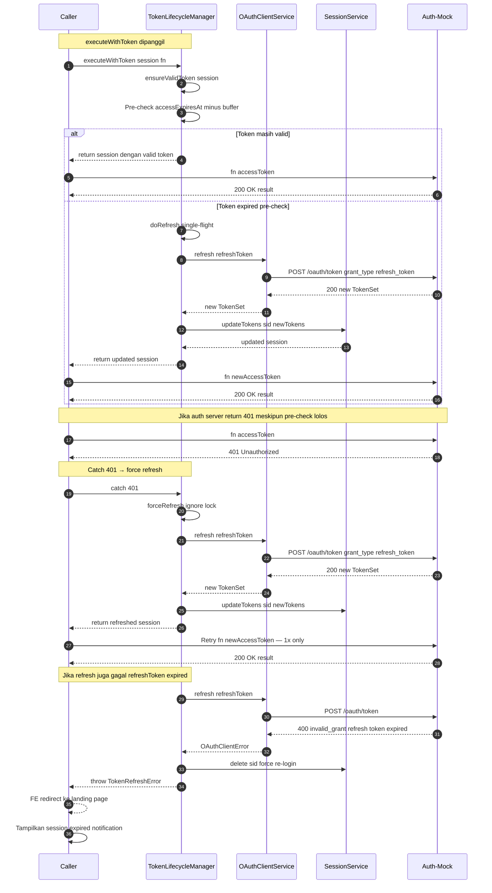

# AUTH-09b — Token Lifecycle Manager (auto-refresh + retry on 401)

> **Task ID**: AUTH-09b
> **Plan**: Plan 2 — Auth Integration (v1.2.2)
> **Depends on**: AUTH-09 (OAuth client), AUTH-09a (idToken + RP-initiated logout), AUTH-14 (LazySyncMiddleware)
> **Estimated effort**: L (~3-4 jam)
> **Plan reference**: Section 5.3 (Token Strategy — Access 15m / Refresh 8h),
>   Section 5.4 (refresh rotation), Section 8.2 (lazy sync), Section 8.7 (grace period)

---

## Pre-Implementation Checklist

> Lihat [`docs/PRE_TASK_CHECKLIST.md`](../../PRE_TASK_CHECKLIST.md) untuk template lengkap.

Sebelum mulai coding, jawab:
- [ ] DRY: Sudah grep logic serupa?
- [ ] SOLID: 1 class = 1 responsibility?
- [ ] Naming: kebab-case + PascalCase?
- [ ] Error: status code akurat?
- [ ] Test: *.spec.ts (unit)?
- [ ] Docs: JSDoc + plan reference?

---

## Goal

Implementasi `TokenLifecycleManager` — class yang manage full lifecycle
access token: pre-check expiry, auto-refresh, single-flight concurrency,
retry on 401, dan failure handling (delete session + notify user).

### Problem yang diatasi

Saat ini, `LazySyncMiddleware` dan `AuthService.switchRole()` langsung pakai
`session.accessToken` tanpa cek expired. Jika token expired (15 menit TTL),
call ke auth-mock gagal dengan 401.

Selain itu, pre-check `session.accessExpiresAt` TIDAK menjamin token valid
di auth server — bisa kena clock skew, early revocation, atau network latency.

### Solusi: TokenLifecycleManager

Class yang wrap semua call yang butuh accessToken:

1. **Pre-check**: `accessExpiresAt - buffer > now?` → token masih valid, pakai langsung
2. **Auto-refresh**: kalau pre-check expired → refresh via `oauthClient.refresh(refreshToken)`
3. **Single-flight**: concurrent requests share 1 refresh (anti reuse detection)
4. **Retry on 401**: kalau auth server bilang expired meskipun pre-check lolos → force refresh + retry 1x
5. **Failure handling**: kalau refresh juga gagal → delete session + throw error → FE redirect ke landing page

---

## Scope

**In scope**:

### 1. TokenLifecycleManager class (NEW)

- `packages/security/src/oauth/token-lifecycle-manager.ts` — NEW
  - Class dengan internal state: refresh lock per session, failure tracking
  - Method `executeWithToken<T>(session, fn)` — wrapper untuk eksekusi function yang butuh accessToken
  - Method `ensureValidToken(session)` — pre-check + refresh kalau perlu

**Flow `executeWithToken`:**
```
1. ensureValidToken(session) → session dengan token valid
   a. Pre-check: accessExpiresAt - BUFFER_MS > now?
      → Valid: return session (tidak perlu refresh)
      → Expired: lanjut ke step b
   b. Acquire refresh lock (single-flight per session)
      → Lock acquired: call oauthClient.refresh(refreshToken)
         → Success: update session (accessToken, refreshToken, accessExpiresAt, idToken)
         → Release lock + return updated session
         → Fail: release lock + throw TokenRefreshError
      → Lock held (another request refreshing): wait for result
         → Success: return updated session
         → Fail: throw TokenRefreshError (same error as original refresher)

2. Try: fn(session.accessToken) — execute original request
   → Success: return result
   → Catch 401 from auth server:
      a. Force refresh (ignore pre-check, ignore lock)
      b. If refresh success → retry fn(newAccessToken) — 1x only
      c. If refresh fail → throw TokenRefreshError
      d. If retry also 401 → throw TokenRefreshError (token still invalid after refresh)

3. TokenRefreshError handling (caller responsibility):
   - LazySyncMiddleware: log warning + use stale cache (non-blocking)
   - AuthService.switchRole: throw → controller return 401
   - SessionGuard: force re-login (delete session + 401)
```

### 2. SessionService — tambah `updateTokens` method

- `packages/security/src/oauth/session.service.ts` — UPDATE: tambah method
  ```typescript
  async updateTokens(sid: string, tokens: TokenSet): Promise<Session | null>
  ```
  - Update: `accessToken`, `refreshToken`, `accessExpiresAt`, `idToken`, `lastSyncAt`
  - Persist to store with refreshed TTL
  - Pattern sama dengan `updateOnSwitchRole()` tapi tanpa roleId/permissionCodes change

### 3. SessionStore — tambah `updateTokens` interface method

- `packages/security/src/session-store/session-store.interface.ts` — UPDATE
  ```typescript
  updateTokens(sid: string, accessToken: string, refreshToken: string, accessExpiresAt: number, idToken: string): Promise<void>;
  ```
- `packages/security/src/session-store/memory-session.store.ts` — UPDATE: implement
- `packages/security/src/session-store/redis-session.store.ts` — UPDATE: implement
- `packages/security/src/session-store/postgres.store.ts` — UPDATE: implement
- `packages/security/src/session-store/write-through.store.ts` — UPDATE: implement

### 4. Refactor callers — pakai TokenLifecycleManager

- `packages/security/src/sync/auth-sync.service.ts` — UPDATE:
  - Inject `TokenLifecycleManager`
  - Ganti `oauthClient.fetchPermissions(session.accessToken)` →
    `tokenManager.executeWithToken(session, (token) => oauthClient.fetchPermissions(token))`

- `apps/payment-api/src/auth/auth.service.ts` — UPDATE:
  - Inject `TokenLifecycleManager`
  - `switchRole()`: ganti direct `session.accessToken` → pakai `tokenManager.executeWithToken`
  - `logout()`: tidak perlu (pakai session.idToken, bukan accessToken)

### 5. FE Vue — handle token refresh failure

- `apps/frontend-vue/src/api/client.ts` — UPDATE:
  - Response interceptor: 401 dari endpoint SELAIN `/auth/session` → redirect ke landing page `/` (bukan BFF login lagi)
  - Tampilkan toast notification: "Session expired, please login again"

- `apps/frontend-vue/src/stores/auth.store.ts` — UPDATE:
  - Tambah `tokenRefreshError: string | null` state
  - Clear error saat user navigate away atau re-login

**Out of scope**:
- Refresh token rotation di auth-mock (sudah ada di AUTH-03)
- Multi-device session invalidation (sudah ada di AUTH-09a RP-initiated logout)
- Token revocation via back-channel (RFC 7009 — sudah ada di `/oauth/revoke`)

---

## Files to create/modify

### NEW files
- `packages/security/src/oauth/token-lifecycle-manager.ts` — TokenLifecycleManager class
- `packages/security/src/oauth/token-lifecycle-manager.types.ts` — types (TokenRefreshError, etc.)
- `packages/security/tests/token-lifecycle-manager.spec.ts` — unit tests

### UPDATE files
- `packages/security/src/oauth/session.service.ts` — tambah `updateTokens()` method
- `packages/security/src/session-store/session-store.interface.ts` — tambah `updateTokens` interface
- `packages/security/src/session-store/memory-session.store.ts` — implement `updateTokens`
- `packages/security/src/session-store/redis-session.store.ts` — implement `updateTokens`
- `packages/security/src/session-store/postgres.store.ts` — implement `updateTokens`
- `packages/security/src/session-store/write-through.store.ts` — implement `updateTokens`
- `packages/security/src/sync/auth-sync.service.ts` — pakai TokenLifecycleManager
- `packages/security/src/security.module.ts` — register TokenLifecycleManager as provider
- `apps/payment-api/src/auth/auth.service.ts` — pakai TokenLifecycleManager di switchRole
- `apps/frontend-vue/src/api/client.ts` — handle 401 redirect ke landing page
- `apps/frontend-vue/src/stores/auth.store.ts` — tambah tokenRefreshError state

---

## Implementation steps

### Step 1: TokenLifecycleManager types

```typescript
// packages/security/src/oauth/token-lifecycle-manager.types.ts

/** Buffer: refresh 30s sebelum token benar-benar expired */
export const REFRESH_BUFFER_MS = 30_000;

/** Error thrown saat refresh token gagal (expired, revoked, network error). */
export class TokenRefreshError extends Error {
  constructor(
    message: string,
    public readonly code: 'refresh_failed' | 'refresh_token_expired' | 'retry_401',
    public readonly cause?: unknown,
  ) {
    super(message);
    this.name = 'TokenRefreshError';
    Object.setPrototypeOf(this, new.target.prototype);
  }
}
```

### Step 2: TokenLifecycleManager class

```typescript
// packages/security/src/oauth/token-lifecycle-manager.ts
@Injectable()
export class TokenLifecycleManager {
  private readonly logger = new Logger('TokenLifecycleManager');

  /** Single-flight: per-session refresh promise. Key = sid. */
  private readonly refreshInFlight = new Map<string, Promise<TokenSet>>();

  constructor(
    private readonly oauthClient: OAuthClientService,
    private readonly sessionService: SessionService,
  ) {}

  /**
   * Ensure session has a valid access token.
   *
   * Pre-check: accessExpiresAt - buffer > now → still valid, return session.
   * If expired: refresh via refreshToken → update session → return updated.
   * Single-flight: concurrent calls for same session share 1 refresh.
   */
  async ensureValidToken(session: Session): Promise<Session> {
    // Pre-check: token masih valid (dengan 30s buffer)
    if (Date.now() < session.accessExpiresAt - REFRESH_BUFFER_MS) {
      return session;
    }

    // Token expired (atau akan expired dalam 30s) → refresh
    return this.doRefresh(session);
  }

  /**
   * Execute function with valid access token.
   *
   * 1. ensureValidToken → session dengan token valid
   * 2. Try fn(session.accessToken)
   * 3. Catch 401 → force refresh → retry 1x
   * 4. If still fails → throw TokenRefreshError
   */
  async executeWithToken<T>(
    session: Session,
    fn: (accessToken: string) => Promise<T>,
  ): Promise<T> {
    // Step 1: ensure valid token
    const validSession = await this.ensureValidToken(session);

    // Step 2: try execute
    try {
      return await fn(validSession.accessToken);
    } catch (err) {
      // Step 3: catch 401 → force refresh + retry
      if (!this.isUnauthorizedError(err)) throw err;

      this.logger.warn(
        `executeWithToken: got 401, forcing refresh sid=${session.sid.substring(0, 8)}...`,
      );

      // Force refresh (ignore pre-check, ignore single-flight lock)
      const refreshedSession = await this.forceRefresh(session);

      // Retry 1x with new token
      try {
        return await fn(refreshedSession.accessToken);
      } catch (retryErr) {
        // Step 4: still fails after refresh → throw
        if (this.isUnauthorizedError(retryErr)) {
          throw new TokenRefreshError(
            'Token still invalid after refresh',
            'retry_401',
            retryErr,
          );
        }
        throw retryErr;
      }
    }
  }

  /**
   * Single-flight refresh — only 1 refresh per session at a time.
   * Concurrent callers wait for the same promise.
   */
  private async doRefresh(session: Session): Promise<Session> {
    const sid = session.sid;

    // Check if refresh already in-flight
    const existing = this.refreshInFlight.get(sid);
    if (existing) {
      this.logger.debug(`doRefresh: waiting for in-flight refresh sid=${sid.substring(0, 8)}...`);
      const newTokens = await existing;
      return this.applyTokens(session, newTokens);
    }

    // Start new refresh
    const refreshPromise = this.oauthClient.refresh(session.refreshToken);
    this.refreshInFlight.set(sid, refreshPromise);

    try {
      const newTokens = await refreshPromise;
      return await this.applyTokens(session, newTokens);
    } catch (err) {
      // Refresh failed — delete session (force re-login)
      this.logger.warn(
        `doRefresh: refresh failed sid=${sid.substring(0, 8)}...: ${(err as Error).message} — deleting session`,
      );
      await this.sessionService.delete(sid);
      throw new TokenRefreshError(
        'Refresh token expired or revoked',
        'refresh_token_expired',
        err,
      );
    } finally {
      this.refreshInFlight.delete(sid);
    }
  }

  /**
   * Force refresh — ignore single-flight lock.
   * Used when 401 received from auth server (token invalid despite pre-check).
   */
  private async forceRefresh(session: Session): Promise<Session> {
    this.logger.warn(
      `forceRefresh: 401 received, forcing refresh sid=${session.sid.substring(0, 8)}...`,
    );

    try {
      const newTokens = await this.oauthClient.refresh(session.refreshToken);
      return await this.applyTokens(session, newTokens);
    } catch (err) {
      // Refresh also failed — delete session
      this.logger.warn(
        `forceRefresh: refresh also failed — deleting session sid=${session.sid.substring(0, 8)}...`,
      );
      await this.sessionService.delete(session.sid);
      throw new TokenRefreshError(
        'Refresh token expired or revoked',
        'refresh_token_expired',
        err,
      );
    }
  }

  /**
   * Apply new tokens to session + persist to store.
   */
  private async applyTokens(session: Session, tokens: TokenSet): Promise<Session> {
    const updated = await this.sessionService.updateTokens(session.sid, tokens);
    if (!updated) {
      throw new TokenRefreshError(
        'Session disappeared during token refresh',
        'refresh_failed',
      );
    }
    return updated;
  }

  /**
   * Check if error is 401 Unauthorized from auth server.
   */
  private isUnauthorizedError(err: unknown): boolean {
    if (err instanceof OAuthClientError) {
      return err.status === 401;
    }
    if (typeof err === 'object' && err !== null && 'response' in err) {
      const status = (err as { response?: { status?: number } }).response?.status;
      return status === 401;
    }
    return false;
  }
}
```

### Step 3: SessionService.updateTokens

```typescript
// packages/security/src/oauth/session.service.ts
async updateTokens(sid: string, tokens: TokenSet): Promise<Session | null> {
  const session = await this.store.get(sid);
  if (!session) return null;

  session.accessToken = tokens.accessToken;
  session.refreshToken = tokens.refreshToken ?? session.refreshToken;
  session.idToken = tokens.idToken ?? session.idToken;
  session.accessExpiresAt = tokens.expiresAt * 1000;
  session.lastSyncAt = Date.now();

  const ttlMs = session.refreshExpiresAt - Date.now();
  if (ttlMs > 0) {
    await this.store.set(sid, session, ttlMs);
  }
  return session;
}
```

### Step 4: SessionStore.updateTokens interface

```typescript
// packages/security/src/session-store/session-store.interface.ts
// Tambah ke SessionStore interface:
updateTokens(sid: string, accessToken: string, refreshToken: string, accessExpiresAt: number, idToken: string): Promise<void>;
```

Implement di MemorySessionStore, RedisSessionStore, PostgresSessionStore, WriteThroughSessionStore.

### Step 5: Refactor AuthSyncService

```typescript
// packages/security/src/sync/auth-sync.service.ts
constructor(
  private readonly oauthClient: OAuthClientService,
  private readonly cache: CacheRepository,
  @Inject(SESSION_STORE) private readonly sessionStore: SessionStore,
  private readonly tokenManager: TokenLifecycleManager,  // ← NEW
) {}

async syncSession(session: Session): Promise<SyncSessionResult> {
  // Gunakan tokenManager untuk ensure valid token + retry on 401
  const data = await this.tokenManager.executeWithToken(
    session,
    (token) => this.oauthClient.fetchPermissions(token),
  );
  // ... rest sama (upsert cached user + updateSync)
}
```

### Step 6: Refactor AuthService.switchRole

```typescript
// apps/payment-api/src/auth/auth.service.ts
// Ganti direct accessToken usage dengan tokenManager:
const result = await this.tokenManager.executeWithToken(
  session,
  (token) => this.oauthClient.switchRole(token, roleId),
);
```

### Step 7: FE Vue — handle 401 redirect ke landing page

```typescript
// apps/frontend-vue/src/api/client.ts
if (status === 401) {
  if (!requestUrl.includes(SESSION_PATH)) {
    console.warn('[api] 401 received — session expired, redirect to landing page');
    // Clear auth state + redirect ke landing page (bukan BFF login)
    // karena session sudah invalid, user harus login ulang manual
    window.location.href = '/';
  }
}
```

---

## Sequence Diagram — Token Lifecycle Manager



---

## Acceptance criteria

### TokenLifecycleManager
- [ ] `executeWithToken(session, fn)` method tersedia
- [ ] Pre-check: `accessExpiresAt - 30s buffer > now` → skip refresh
- [ ] Auto-refresh: kalau pre-check expired → call `oauthClient.refresh(refreshToken)`
- [ ] Single-flight: concurrent calls share 1 refresh (Map sid → Promise)
- [ ] Retry on 401: kalau auth server return 401 → force refresh + retry 1x
- [ ] Max retry 1x (anti infinite loop)
- [ ] Failure: kalau refresh gagal → delete session + throw TokenRefreshError
- [ ] Failure: kalau retry also 401 → throw TokenRefreshError code `retry_401`
- [ ] `TokenRefreshError` dengan code: `refresh_failed`, `refresh_token_expired`, `retry_401`

### SessionService
- [ ] `updateTokens(sid, tokens)` method tersedia
- [ ] Update: accessToken, refreshToken, accessExpiresAt, idToken, lastSyncAt
- [ ] Persist to store with refreshed TTL

### SessionStore
- [ ] `updateTokens` method di SessionStore interface
- [ ] Implement di MemorySessionStore
- [ ] Implement di RedisSessionStore
- [ ] Implement di PostgresSessionStore
- [ ] Implement di WriteThroughSessionStore

### Callers refactored
- [ ] `AuthSyncService.syncSession()` pakai `tokenManager.executeWithToken`
- [ ] `AuthService.switchRole()` pakai `tokenManager.executeWithToken`
- [ ] `AuthService.logout()` tetap pakai `session.idToken` (tidak perlu TokenLifecycleManager)

### FE Vue
- [ ] 401 dari BFF (bukan /auth/session) → redirect ke landing page `/`
- [ ] Tampilkan notification "Session expired, please login again"
- [ ] `auth.store.ts` clear state saat 401

### Quality gates
- [ ] `pnpm typecheck` lulus (semua workspaces)
- [ ] `pnpm lint` lulus (0 errors, 0 warnings)
- [ ] `pnpm --filter @retry-failure/security test` lulus
- [ ] `pnpm --filter payment-api test` lulus (unit tests)

---

## Useful commands

```bash
# Build
cd /home/z/my-project/retry-failure && corepack pnpm -r run build

# Typecheck + lint
cd /home/z/my-project/retry-failure && corepack pnpm -r run typecheck
cd /home/z/my-project/retry-failure && corepack pnpm -r run lint

# Run tests
cd /home/z/my-project/retry-failure && corepack pnpm --filter @retry-failure/security test
cd /home/z/my-project/retry-failure && corepack pnpm --filter payment-api test
```

---

## Notes

### Kenapa class, bukan helper function?

1. **State management** — single-flight (Map sid → Promise), failure tracking
2. **Concurrency control** — only 1 refresh per session, concurrent callers wait
3. **Retry state** — track "sudah retry 1x atau belum" (anti infinite loop)
4. **DI injectable** — NestJS DI, bisa inject OAuthClientService + SessionService

### Kenapa 30s buffer?

Access token TTL 15 menit (900s). Buffer 30s berarti refresh mulai dari menit ke-14:30.
Mencegah race condition: token valid saat pre-check, tapi expired saat sampai auth server
(network latency + clock skew).

### Kenapa delete session saat refresh gagal?

Kalau refreshToken expired/revoked, session tidak bisa di-refresh lagi. User harus login
ulang. Delete session = force SessionGuard return 401 → FE redirect ke landing page.

### Kenapa retry max 1x?

Anti infinite loop: refresh → retry → 401 → refresh → retry → 401 → ...
Max 1x retry cukup untuk handle kasus "token expired di auth server meskipun
pre-check lolos". Kalau setelah refresh+retry masih 401, berarti ada masalah
lain (token revoked, auth server issue, dll).

### Plan reference

- PLAN2 Section 5.3 (Token Strategy), Section 5.4 (refresh rotation),
  Section 8.2 (lazy sync), Section 8.7 (grace period)
- RFC 6749 §6 (Refreshing Access Token)
- RFC 6749 §5.2 (invalid_grant error)
- openid-client v5 `client.refresh(refreshToken)`
