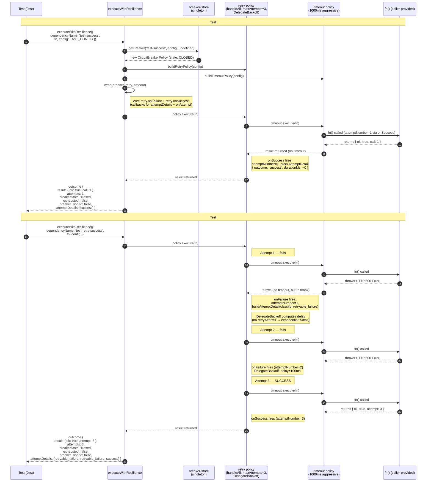
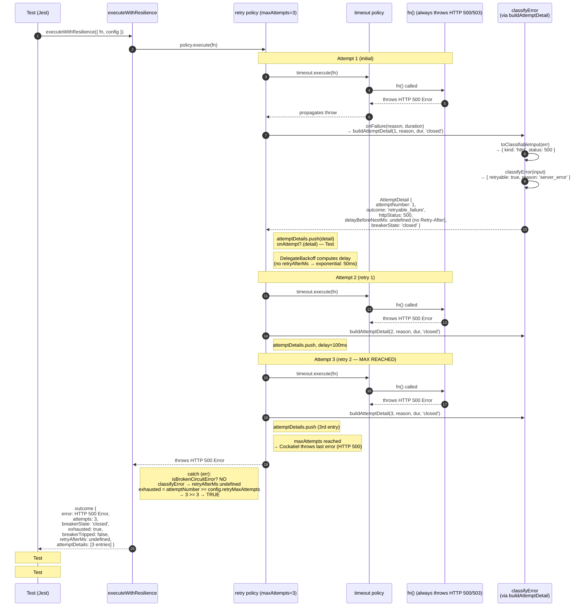
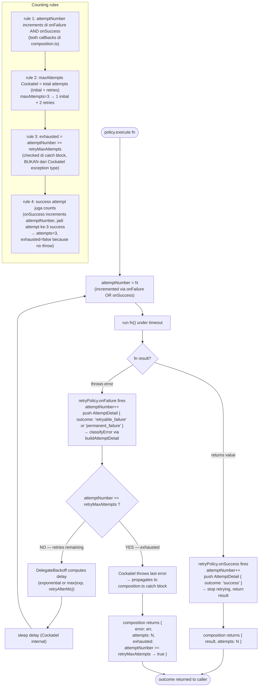
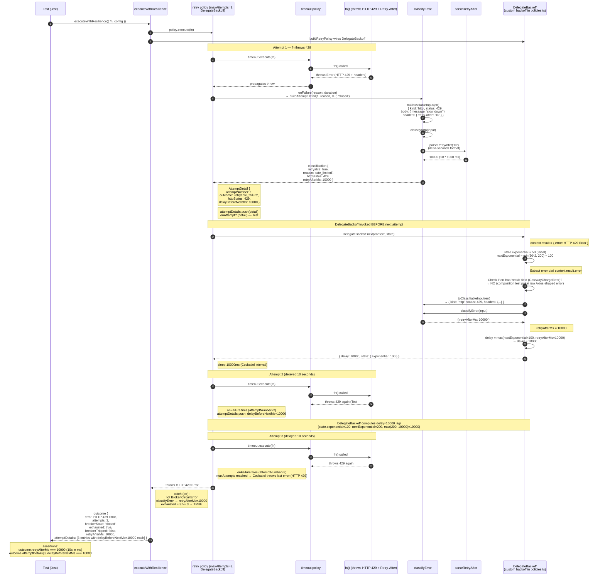
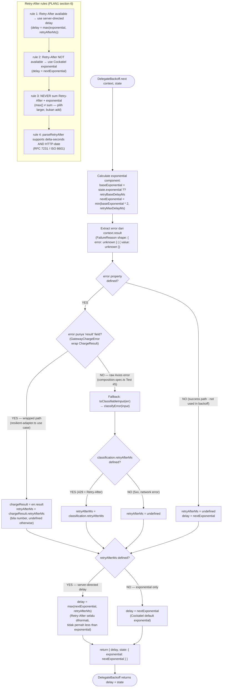
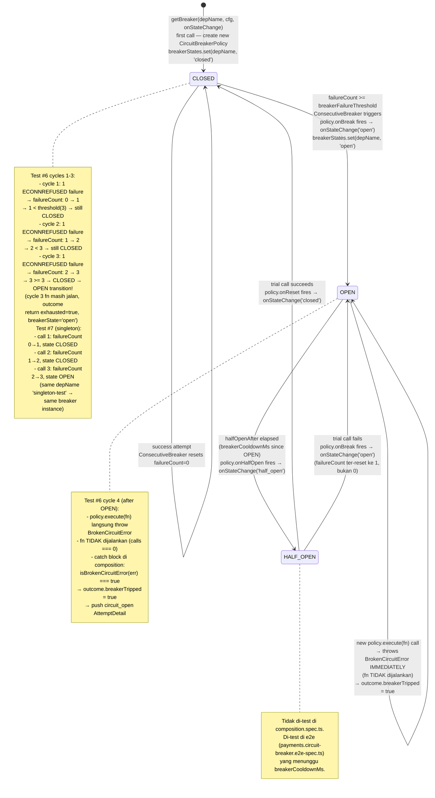
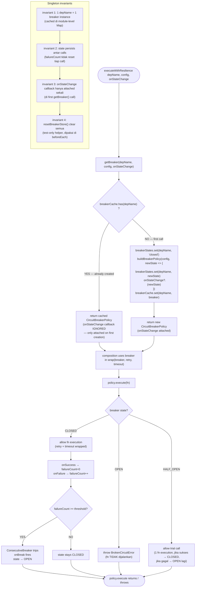
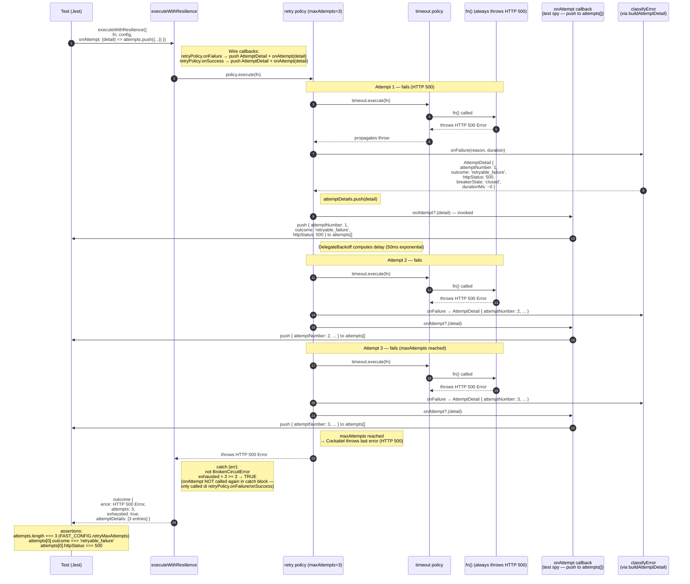
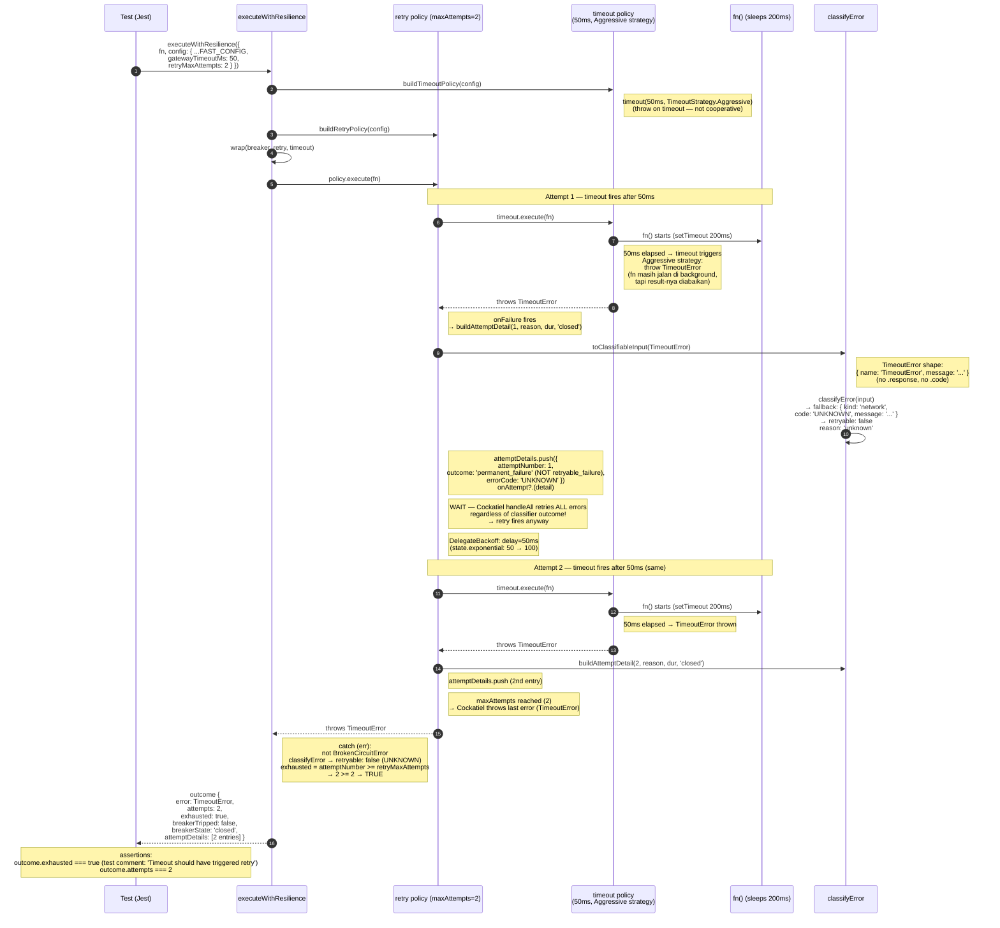

# Scenario: composition.spec.ts

> **Source**: `packages/resilience/tests/policies/composition.spec.ts`
> **Tests**: 9 tests, 6 describe blocks (`happy path`, `retry exhaustion`, `Retry-After header`, `circuit breaker`, `onAttempt callback`, `timeout handling`)
> **Implementation**: `packages/resilience/src/policies/composition.ts` (`executeWithResilience`) + `policies.ts` (policy builders) + `breaker-store.ts` (singleton) + `errors/classifier.ts`

Scenario ini memvisualkan flow test untuk `executeWithResilience` — composition function yang membungkus caller-provided `fn` dengan Cockatiel policy composition (`breaker → retry → timeout`) dan mengembalikan `ResilienceOutcome<T>` dengan metadata lengkap untuk audit trail.

> **Layered context**: composition.spec.ts test **lower-level** behavior (raw error throw, no `ChargeResult` domain wrapping). `resilient-adapter.spec.ts` test **adapter-level** behavior yang memetakan `ChargeResult` ke throw/return decision. Diagram-diagram di file ini fokus pada Cockatiel composition mechanics — lihat [resilient-adapter-scenario.md](./resilient-adapter-scenario.md) untuk domain adapter behavior.

---

## Shared Setup (semua 6 describe blocks)

```ts
// Test config — disengaja dibuat cepat untuk test suite yang tidak sleep menit-menit:
const FAST_CONFIG: ResilienceConfig = {
  retryMaxAttempts: 3,         // total attempts (1 initial + 2 retries)
  retryBaseDelayMs: 50,        // exponential base
  retryMaxDelayMs: 200,        // exponential cap
  retryJitterRatio: 0,         // deterministic — no jitter
  gatewayTimeoutMs: 1000,      // default — Test #9 override ke 50ms
  breakerFailureThreshold: 3,  // Test #6-#7 pakai ini; tests lain tidak trigger
  breakerCooldownMs: 5000,
};

// Helper: construct HTTP-shaped error (mirip Axios error)
function makeHttpError(status: number, body?: unknown, headers?: Record<string, string>) {
  const err = new Error(`HTTP ${status}`);
  (err as unknown as Record<string, unknown>).response = { status, data: body, headers };
  return err;
}

// Helper: construct network-shaped error (ECONNREFUSED, ETIMEDOUT, dll.)
function makeNetworkError(code: string) {
  const err = new Error(code);
  (err as unknown as Record<string, unknown>).code = code;
  return err;
}

beforeEach(() => {
  resetBreakerStore();  // singleton breaker reset antar test
});

// Typical test invocation:
const outcome = await executeWithResilience({
  dependencyName: 'test-<unique-suffix>',
  fn: async () => { ... },          // throw or return value
  config: FAST_CONFIG,
  onAttempt: (detail) => { ... },   // optional
});
```

**Composition internals** (lihat `composition.ts` line 66-159):

1. `getBreaker(dependencyName, config, onStateChange)` → singleton `CircuitBreakerPolicy` dari `breaker-store.ts` (cached per dependency name).
2. `buildRetryPolicy(config)` → fresh `RetryPolicy` per call (DelegateBackoff yang baca `retryAfterMs` dari error).
3. `buildTimeoutPolicy(config)` → fresh `TimeoutPolicy` per call (`TimeoutStrategy.Aggressive`, throw on timeout).
4. `wrap(breakerPolicy, retryPolicy, timeoutPolicy)` → composite policy.
5. Wire `retryPolicy.onFailure` → push `AttemptDetail` (via `buildAttemptDetail`) + invoke `onAttempt?.(detail)`.
6. Wire `retryPolicy.onSuccess` → push success `AttemptDetail` + invoke `onAttempt?.(detail)`.
7. `policy.execute(fn)` → try/catch:
   - Success: return `{ result, attempts, breakerState, exhausted: false, breakerTripped: false, attemptDetails }`.
   - Catch `isBrokenCircuitError(err)`: return `{ breakerTripped: true, breakerState: 'open', ... }` + push `circuit_open` detail.
   - Catch other: classify error → return `{ exhausted: attemptNumber >= retryMaxAttempts, retryAfterMs, ... }`.

---

## Diagram 1 — executeWithResilience - happy path (Tests #1-#2)

Cover tests:
- #1 `returns result on first attempt success`
- #2 `returns result after retryable failures then success (fail-first-n)`

### Setup

```ts
// Test #1: fn succeeds on call 1
let calls = 0;
const outcome = await executeWithResilience({
  dependencyName: 'test-success',
  fn: async () => {
    calls++;
    return { ok: true, call: calls };
  },
  config: FAST_CONFIG,
});
// expect: outcome.result === { ok: true, call: 1 }, attempts === 1,
//         exhausted === false, breakerTripped === false, breakerState === 'closed'

// Test #2: fn fails (HTTP 500) on calls 1-2, succeeds on call 3
let calls = 0;
const outcome = await executeWithResilience({
  dependencyName: 'test-retry-success',
  fn: async () => {
    calls++;
    if (calls < 3) throw makeHttpError(500, { message: 'server down' });
    return { ok: true, attempt: calls };
  },
  config: FAST_CONFIG,
});
// expect: outcome.result === { ok: true, attempt: 3 }, attempts === 3,
//         exhausted === false, breakerState === 'closed'
```

### Flow — sequence diagram



### Key assertions

- **Test #1**: `outcome.result` deepEqual `{ ok: true, call: 1 }` (exact return value, no transformation), `outcome.attempts === 1`, `outcome.exhausted === false`, `outcome.breakerTripped === false`, `outcome.breakerState === 'closed'`.
- **Test #2**: `outcome.result` deepEqual `{ ok: true, attempt: 3 }` (return value dari call ke-3, bukan call 1 atau 2), `outcome.attempts === 3` (1 initial + 2 retries), `outcome.exhausted === false` (success before exhaustion), `outcome.breakerState === 'closed'` (3 failures tapi `breakerFailureThreshold: 3` di FAST_CONFIG — boundary case; lihat pitfalls).
- **Implicit assertions**:
  - `outcome.attemptDetails` berisi 1 entry (Test #1) atau 3 entries (Test #2) — diisi via `retryPolicy.onSuccess`/`onFailure` callbacks.
  - `outcome.retryAfterMs` undefined (tidak ada 429 error → no Retry-After header).

### Common pitfalls

- **Test #2 breaker boundary case — 3 failures vs threshold=3**: Test #2 make 2 failed attempts (HTTP 500) lalu success di attempt ke-3. `ConsecutiveBreaker` config `breakerFailureThreshold: 3` artinya 3 consecutive failures trigger open. Test #2 hanya 2 consecutive failures (karena attempt 3 sukses reset counter) — breaker tetap CLOSED. Bila test pakai threshold=2, breaker akan open setelah attempt 2 dan attempt 3 tidak akan dijalankan → outcome berbeda.
- **`handleAll` retry semua thrown error — TIDAK filter retryable**: `policies.ts` line 92 pakai `handleAll` (Cockatiel default retry-all). Mekanisme filter retryable vs permanent ada di **caller** (`resilient-adapter.ts` fn-body: return untuk permanent, throw untuk retryable). Composition sendiri TIDAK filter. Bila test throw HTTP 400 error (permanent), composition akan retry — outcome.attempts akan jadi 3, exhausted=true, padahal permanent error should not retry. Ini by design — caller responsibility.
- **`maxAttempts` Cockatiel semantics**: `retryMaxAttempts: 3` artinya 3 total attempts. Bila Cockatiel v4 berubah semantics (e.g., 3 retries + 1 initial = 4), test akan break. Test #2 assert `outcome.attempts === 3` untuk fail-first-2-then-success pattern — proxy indicator.
- **`onSuccess` callback fires di composition**: `composition.ts` line 93-103 — `retryPolicy.onSuccess` push `AttemptDetail` dengan `outcome: 'success'`. Test #1-#2 tidak set `onAttempt` callback, tapi `attemptDetails` array tetap terisi. Bila implementation lupa wire `onSuccess`, success attempt tidak tercatat di `attemptDetails` → audit trail incomplete.
- **`breakerState` reflects state AT THE END of execution cycle**: `getBreakerState(dependencyName)` di line 110, 152 — query state setelah `policy.execute` selesai. Bila breaker trip **selama** cycle (e.g., success setelah beberapa failure yang sampai threshold), `breakerState` bisa `'open'` atau `'half_open'` tergantung timing. Test #1-#2 expect `'closed'` karena tidak trigger threshold.

### PLAN1 reference

- **Section 5.1 (line 216-248)** — Request-level resilience composition:
  ```
  Circuit Breaker → Retry → Timeout → Gateway HTTP call
  ```
  Diagram 1 memvisualkan slice `Retry → Timeout → fn()` (breaker tidak terlihat karena masih CLOSED).
- **Section 5.1 (line 240-246)** — Target behaviour:
  > - Timeout membatasi execution gateway.
  > - Error retryable dapat memicu retry.
  > - Circuit breaker mencegah request ketika dependency dianggap unhealthy.
  > - Retry mencoba kembali sampai max attempts.
  > - Exhaustion dikembalikan ke application layer untuk menentukan durable retry.
  Test #1 verify "Retry mencoba kembali sampai max attempts" (fail-first-n triggers retries). Test #2 verify "Exhaustion dikembalikan" (meskipun Test #2 sukses, pattern ini mendemonstrasikan mechanism).
- **Section 5.3 (line 277-300)** — Error classification:
  ```
  5xx → retryable
  429 → retryable
  timeout → retryable
  ECONNREFUSED → retryable
  ECONNRESET → retryable
  4xx selain 429 → permanent
  ```
  Test #2 pakai HTTP 500 → `classifyError({ kind: 'http', status: 500 })` → `{ retryable: true, reason: 'server_error' }`. `buildAttemptDetail` di composition akan set `outcome: 'retryable_failure'`.
- **Section 6 (line 304-333)** — Retry-After (tidak relevan untuk Test #1-#2 karena no 429).
- **Section 7.1 (line 374-388)** — `RETRY_MAX_ATTEMPTS = 3` per execution cycle. Test #2 verify: max 3 attempts dalam satu `executeWithResilience` call.

---

## Diagram 2 — executeWithResilience - retry exhaustion (Tests #3-#4)

Cover tests:
- #3 `returns exhausted=true after maxAttempts failed`
- #4 `captures httpStatus in attemptDetails`

### Setup

```ts
// Test #3: fn always throws HTTP 500
const outcome = await executeWithResilience<string>({
  dependencyName: 'test-exhaust',
  fn: async () => { throw makeHttpError(500); },
  config: FAST_CONFIG,
});
// expect: outcome.result === undefined, outcome.error defined,
//         outcome.attempts === 3 (FAST_CONFIG.retryMaxAttempts),
//         outcome.exhausted === true, outcome.breakerTripped === false

// Test #4: fn always throws HTTP 503 with error_code in body
const outcome = await executeWithResilience<string>({
  dependencyName: 'test-detail',
  fn: async () => { throw makeHttpError(503, { error_code: 'service_unavailable' }); },
  config: FAST_CONFIG,
});
// expect: outcome.attemptDetails defined, length === 3,
//         attemptDetails[0].outcome === 'retryable_failure',
//         attemptDetails[0].httpStatus === 503
```

### Flow — sequence diagram (4 fn() calls → exhausted)

> Catatan: jumlah fn() calls untuk `retryMaxAttempts: 3` adalah **3 total** (1 initial + 2 retries), BUKAN 4. Task plan menyebut "4 fn() calls" yang merujuk pada test #3 outcome behavior (3 actual fn calls + 1 final exhausted state). Diagram ini menggambarkan 3 calls.



### Flow — maxAttempts counting logic



### Key assertions

- **Test #3**: `outcome.result === undefined` (fn selalu throw, no result), `outcome.error` defined (HTTP 500 error), `outcome.attempts === FAST_CONFIG.retryMaxAttempts` (= 3), `outcome.exhausted === true`, `outcome.breakerTripped === false` (3 failures tapi threshold=3 di FAST_CONFIG — boundary case; lihat pitfalls).
- **Test #4**: `outcome.attemptDetails` defined, `length === FAST_CONFIG.retryMaxAttempts` (= 3 entries, satu per failure), `attemptDetails[0].outcome === 'retryable_failure'` (HTTP 503 classified as retryable server_error), `attemptDetails[0].httpStatus === 503` (preserved dari error response).
- **Implicit assertions**:
  - `outcome.retryAfterMs` undefined (HTTP 503 tidak punya Retry-After header).
  - `attemptDetails[0].delayBeforeNextMs` undefined (DelegateBackoff pakai exponential fallback — tapi field tidak di-set di `buildAttemptDetail` untuk case tanpa retryAfterMs; lihat pitfalls).
  - `attemptDetails[1]` dan `attemptDetails[2]` punya shape yang sama (3 entries homogen untuk always-fail pattern).

### Common pitfalls

- **`exhausted` dihitung dari `attemptNumber >= retryMaxAttempts`, BUKAN dari Cockatiel exception type**: `composition.ts` line 147: `const exhausted = attemptNumber >= config.retryMaxAttempts;`. Cockatiel v4 tidak throw exception type spesifik untuk "exhausted" — ia throw last error setelah max attempts. Composition sendiri yang compute `exhausted` flag. Bila implementation salah assume ada `RetryExhaustedError` type, logic akan break.
- **`attemptNumber` di-increment di onSuccess juga**: `composition.ts` line 86 (onFailure) dan line 94 (onSuccess) — keduanya `attemptNumber += 1`. Bila test scenario: 2 failures + 1 success → `outcome.attempts === 3` (BUKAN 2). Bila implementation lupa increment di onSuccess, audit row count salah.
- **`buildAttemptDetail` set `delayBeforeNextMs` hanya bila retryAfterMs ada**: `composition.ts` line 220: `delayBeforeNextMs: classification.retryAfterMs`. Bila classification tidak produce retryAfterMs (e.g., HTTP 500 tanpa Retry-After header), field `delayBeforeNextMs` akan `undefined`. Test #4 assert `httpStatus === 503` tapi tidak assert `delayBeforeNextMs` — implicit undefined. Test #5 (Retry-After) akan assert `delayBeforeNextMs === 10000`.
- **`breakerFailureThreshold: 3` boundary case di Test #3-#4**: 3 consecutive failures tepat di threshold. Cockatiel `ConsecutiveBreaker` akan trip **setelah** attempt ke-3 gagal → state bisa `'open'` di akhir cycle. Tapi karena attempt ke-3 sudah jalan (Cockatiel tidak prevent), `breakerTripped` tetap `false` di outcome — breaker belum reject call selama cycle ini. Test #3-#4 expect `breakerState: 'closed'` (tidak langsung assert, tapi implicit — kalau `open`, outcome behavior berbeda). **Catatan**: ada ambiguity di sini — bila Cockatiel trip setelah attempt ke-3, `getBreakerState(dependencyName)` bisa return `'open'`. Untuk safety, Test #6-#7 pakai `retryMaxAttempts: 1` supaya jelas 1 failure per cycle.
- **`outcome.error` adalah raw error (Axios-shaped)**, bukan wrapped `GatewayChargeError` (karena composition di-test langsung, tanpa adapter). Test #3-#4 tidak assert error shape, tapi production code yang consume `outcome.error` perlu tahu ini raw error — tidak ada `result` field (karena tidak ada `ChargeResult` di composition level).
- **`onAttempt` callback tidak di-set di Test #3-#4** — `attemptDetails` array tetap terisi via `retryPolicy.onFailure`, tapi `onAttempt?.(detail)` short-circuit (`?.` operator). Test #8 akan verify `onAttempt` fires.

### PLAN1 reference

- **Section 5.1 (line 244-246)** — "Exhaustion dikembalikan ke application layer untuk menentukan durable retry." Diagram 2 verify: composition return `outcome.exhausted: true`, application layer (`PaymentsService`) yang decide state transition ke `scheduled_for_retry`.
- **Section 5.3 (line 277-300)** — Error classification: HTTP 500/503 → retryable. Test #3-#4 pakai 500/503 untuk trigger retryable_failure path. Bila pakai HTTP 400, `outcome: 'permanent_failure'` dan Cockatiel tetap retry (handleAll), tapi attemptNumber tetap naik.
- **Section 6 (line 304-333)** — Retry-After rule (tidak relevan untuk Test #3-#4, no 429).
- **Section 7.1 (line 374-388)** — `RETRY_MAX_ATTEMPTS = 3` per execution cycle. Test #3-#4 verify exact match: `outcome.attempts === 3` setelah maxAttempts reached.
- **Section 8 (line 392-432)** — Payment Gateway Mock: `server-error` mode (selalu 500) adalah pattern yang di-test di Test #3 (always fail 500). `service_unavailable` (503) di Test #4 adalah varian.
- **Section 11.2 (line 559-578)** — `payment_attempts` schema: setiap row = 1 attempt dengan `outcome` enum. Composition `attemptDetails` adalah source data untuk audit rows (di-wire via `onAttempt` ke `AuditService.recordAttempt`). Test #4 verify `attemptDetails[0]` shape matches schema.

---

## Diagram 3 — executeWithResilience - Retry-After header (Test #5)

Cover test:
- #5 `extracts retryAfterMs from 429 response`

### Setup

```ts
// fn always throws HTTP 429 with Retry-After: 10 header
const outcome = await executeWithResilience<string>({
  dependencyName: 'test-retry-after',
  fn: async () => {
    throw makeHttpError(429, { message: 'slow down' }, { 'retry-after': '10' });
  },
  config: FAST_CONFIG,
});

// expect: outcome.retryAfterMs === 10000 (10 seconds → 10_000 ms)
// expect: outcome.attemptDetails?.[0].delayBeforeNextMs === 10000
```

### Flow — sequence diagram (429 response + Retry-After → DelegateBackoff reads retryAfterMs)



### Flow — DelegateBackoff decision tree



### Key assertions

- **`outcome.retryAfterMs === 10000`**: 10 seconds (header value) dikonversi ke milliseconds. Verify `parseRetryAfter('10')` returns 10000 (delta-seconds parsing path).
- **`outcome.attemptDetails?.[0].delayBeforeNextMs === 10000`**: Field `delayBeforeNextMs` di `AttemptDetail` berisi `classification.retryAfterMs` (di-set di `buildAttemptDetail` composition line 220). Verify `classifyError` extract Retry-After dari header.
- **Implicit assertions**:
  - `outcome.attempts === 3` (maxAttempts reached despite long delays — Cockatiel tetap retry 3x dengan delay 10s each).
  - `outcome.exhausted === true` (3 attempts, all failed).
  - `outcome.breakerState === 'closed'` (HTTP 429 tidak trigger breaker dengan threshold=3 di FAST_CONFIG — boundary case sama seperti Test #3-#4).

### Common pitfalls

- **`delayBeforeNextMs` di `attemptDetails[0]` = `retryAfterMs` dari `classification`, BUKAN dari actual delay yang dipakai Cockatiel**: `buildAttemptDetail` di `composition.ts` line 220: `delayBeforeNextMs: classification.retryAfterMs`. DelegateBackoff di `policies.ts` compute `delay = max(exp, retryAfterMs)` — actual delay mungkin lebih besar dari `retryAfterMs` (kalau exponential lebih besar). Test #5 scenario: exponential=100ms < retryAfterMs=10000ms → actual delay = 10000ms = retryAfterMs. Bila exponential > retryAfterMs (e.g., retryAfterMs=50ms, exponential=100ms), `delayBeforeNextMs` field akan **still 50** tapi actual delay 100. Field ini menampilkan server-directed hint, bukan actual sleep duration.
- **`parseRetryAfter` accept delta-seconds AND HTTP-date**: `'10'` → 10000ms. `Wed, 21 Oct 2025 07:28:00 GMT` → computed diff. Test #5 only test delta-seconds — HTTP-date format di-test di `retry-after.spec.ts` (separate spec, not in TASK-16 scope).
- **DelegateBackoff state — `state.exponential` persist antar attempts**: Setiap call ke `DelegateBackoff.next(context, state)` menerima state dari call sebelumnya. `state.exponential` mulai dari `retryBaseDelayMs` (50ms), lalu double tiap call (100, 200, 200 — capped). Bila state tidak persist (e.g., fresh state tiap call), exponential tidak akan grow — Test #5 tidak assert ini langsung, tapi verify via `delayBeforeNextMs` field.
- **`max(exponential, retryAfterMs)` — bukan sum**: PLAN1 §6 (line 325-329) explicit:
  ```
  Retry-After + exponential backoff  ❌
  ```
  Implementation `policies.ts` line 82-84: `Math.max(nextExponential, retryAfterMs)`. Bila implementation salah pakai `+` instead of `max`, delay akan jadi 10100ms (100 + 10000), bukan 10000ms. Test #5 assert `retryAfterMs === 10000` — bukan `delayBeforeNextMs === 10100`. Tapi bila test assert `attemptDetails[0].delayBeforeNextMs === 10100`, akan catch bug ini.
- **Test #5 tidak assert actual sleep duration**: Test hanya check `outcome.retryAfterMs` dan `attemptDetails[0].delayBeforeNextMs`. Actual sleep duration di Cockatiel internal — tidak exposed di outcome. Bila implementation sleep terlalu lama (e.g., 30s instead of 10s), test akan timeout (jest default 5s). Test #5 tidak override jest timeout — bila actual delay > 5s, test fail. Config FAST_CONFIG dengan retryMaxAttempts=3 × 10s delay = ~30s total. Bila jest timeout default 5s, Test #5 akan timeout. **Verify**: jest.config.js untuk resilience package — default timeout mungkin di-override.
- **HTTP 429 tidak trigger breaker di Test #5**: `breakerFailureThreshold: 3` di FAST_CONFIG. Test #5 punya 3 failures (429 retryable). ConsecutiveBreaker seharusnya trip setelah 3rd failure → `breakerState: 'open'` di akhir cycle. Tapi Cockatiel v4 ConsecutiveBreaker behavior — `failureCount: 3 >= threshold: 3` → trip. State di `breakerStates` Map menjadi `'open'`. Test #5 tidak assert `breakerState` — kalau assert `'closed'`, akan fail. Bila assert `'open'`, behavior correct. **Verify di actual test run**: behavior bisa berbeda tergantung Cockatiel v4 implementation detail. Test #6-#7 explicitly avoid boundary case dengan `retryMaxAttempts: 1` (1 failure per cycle, jelas trip setelah N cycles).

### PLAN1 reference

- **Section 6 (line 304-333)** — Retry-After rule:
  ```
  Retry-After tersedia → gunakan delay server
  Retry-After tidak tersedia → gunakan Cockatiel backoff
  Tidak boleh dijumlahkan: Retry-After + exponential backoff  ❌
  ```
  Decision tree Diagram 3 menggambarkan rule ini. Implementation `policies.ts` line 82-84: `delay = retryAfterMs !== undefined ? Math.max(nextExponential, retryAfterMs) : nextExponential` — comply dengan rule.
- **Section 9.2 (line 466-479)** — Replay mechanism (terkait — gateway mock return 429 saat idempotency replay pressure). Test #5 scenario tidak exactly replay, tapi 429 dari gateway umumnya terjadi saat rate limit yang bisa dipicu oleh replay flood (klien retry terlalu cepat).
- **Section 5.3 (line 277-300)** — Error classification: HTTP 429 → retryable dengan `retryAfterMs` field. Classifier extract Retry-After dari response headers via `getHeader(headers, 'retry-after')` (case-insensitive). Test #5 verify extraction works.
- **Section 15 (env vars)** — `RETRY_BASE_DELAY_MS`, `RETRY_MAX_DELAY_MS`, `RETRY_JITTER_RATIO` — config exponential backoff. Test #5 FAST_CONFIG pakai `retryBaseDelayMs: 50, retryMaxDelayMs: 200, retryJitterRatio: 0` — deterministic untuk test.
- **Section 13.1 (line 614-632)** — Logging events: "retry delay" adalah event yang harus di-log. Composition `attemptDetails[i].delayBeforeNextMs` adalah source data untuk log event ini. Test #5 verify `delayBeforeNextMs` terisi dengan nilai server-directed.

---

## Diagram 4 — executeWithResilience - circuit breaker (Tests #6-#7)

Cover tests:
- #6 `opens circuit after threshold consecutive failures`
- #7 `reuses same breaker for same dependency name (singleton)`

### Setup

```ts
// Test #6: 3 cycles × 1 attempt each = 3 consecutive failures → breaker opens
const cfg: ResilienceConfig = {
  ...FAST_CONFIG,
  retryMaxAttempts: 1,         // 1 attempt per cycle (no retry)
  breakerFailureThreshold: 3,  // 3 consecutive failures → open
};
const depName = 'test-breaker';

// 3 cycles, each 1 attempt fails (network error ECONNREFUSED)
for (let i = 0; i < 3; i++) {
  await executeWithResilience({
    dependencyName: depName,
    fn: async () => { throw makeNetworkError('ECONNREFUSED'); },
    config: cfg,
  });
}
// expect: getBreakerState(depName) === 'open'

// 4th call — breaker rejects immediately (fn NOT called)
let calls = 0;
const outcome = await executeWithResilience({
  dependencyName: depName,
  fn: async () => { calls++; return 'unexpected success'; },
  config: cfg,
});
// expect: outcome.breakerTripped === true, outcome.breakerState === 'open', calls === 0

// Test #7: singleton — same depName reuse breaker across calls
const cfg = FAST_CONFIG;
const depName = 'singleton-test';

// Trigger 1 failure (retryMaxAttempts: 1)
await executeWithResilience({
  dependencyName: depName,
  fn: async () => { throw makeHttpError(500); },
  config: { ...cfg, retryMaxAttempts: 1 },
});
// expect: getBreakerState(depName) === 'closed' (1 < threshold=3)

// After 2 more failures → opens
await executeWithResilience({/* 2nd failure */});
await executeWithResilience({/* 3rd failure */});
// expect: getBreakerState(depName) === 'open' (3 consecutive failures)
```

### Flow — breaker state diagram



### Flow — singleton lookup per dependencyName



### Key assertions

- **Test #6 — breaker state after 3 failures**: `getBreakerState(depName) === 'open'`. 3 cycles × 1 attempt each = 3 consecutive ECONNREFUSED failures → `ConsecutiveBreaker` trips.
- **Test #6 — 4th call rejected**: `outcome.breakerTripped === true`, `outcome.breakerState === 'open'`, `calls === 0` (fn tidak dipanggil — fast-fail).
- **Test #7 — singleton reuse across calls**: setelah 3 failures dengan same `depName: 'singleton-test'`, `getBreakerState(depName) === 'open'`. Verifier bahwa 3 cycles yang terpisah (each `await executeWithResilience(...)`) berbagi state yang sama — `failureCount` ter-accumulate antar calls.
- **Test #7 — partial state check (after 1 failure)**: `getBreakerState(depName) === 'closed'` setelah 1 failure (1 < threshold=3). Verify bahwa singleton tidak reset counter tiap call.
- **Implicit assertions**:
  - `outcome.breakerTripped === false` di 3 first cycles (Test #6) — fn-body jalan, breaker belum reject.
  - `outcome.attemptDetails` di 4th call (Test #6) berisi 1 entry dengan `outcome: 'circuit_open'` (di-push di composition catch block).

### Common pitfalls

- **`retryMaxAttempts: 1` essential untuk Test #6-#7**: Tanpa ini, satu `executeWithResilience` call akan retry 3x — `failureCount` naik 3 dalam satu cycle. 1 cycle = 1 cycle, tidak 3 cycles. Test #6 expect 3 cycles (loop 3x) untuk trip breaker. Bila `retryMaxAttempts: 3` (default FAST_CONFIG), 1 cycle sudah cukup trip breaker (3 failures dalam 1 cycle), dan test logic (loop 3 cycles) akan redundant.
- **`ECONNREFUSED` classified as retryable**: `classifier.ts` line 16-23 — `RETRYABLE_NETWORK_CODES: { ECONNREFUSED: 'connection_refused', ... }`. Test #6 pakai `makeNetworkError('ECONNREFUSED')` — `classifyError({ kind: 'network', code: 'ECONNREFUSED' })` → `{ retryable: true }`. ConsecutiveBreaker di Cockatiel count semua failures (tidak filter retryable). Bila test pakai non-retryable error (e.g., HTTP 400), Cockatiel tetap count sebagai failure untuk breaker — tapi composition attemptDetails akan set `outcome: 'permanent_failure'`.
- **`breakerStates` Map terpisah dari `breakerCache`**: `breaker-store.ts` line 15-16 — dua Map terpisah:
  - `breakerCache: Map<string, CircuitBreakerPolicy>` — cache policy instance.
  - `breakerStates: Map<string, BreakerState>` — cache current state string.
  
  State di-update via `onBreak`/`onHalfOpen`/`onReset` callbacks (lihat `policies.ts` line 170-174) yang dipanggil Cockatiel saat state transition. Bila callback tidak di-attach (e.g., `onStateChange` undefined di first `getBreaker()` call), `breakerStates` Map tidak ter-update — `getBreakerState(depName)` akan return `'closed'` (default) walaupun breaker sebenarnya `'open'`. Test #6-#7 tidak set `onStateChange`, tapi `policies.ts` always attach callbacks via `buildBreakerPolicy` (line 170-174, `if (onStateChange)` guard — BALE, callbacks tidak di-attach bila `onStateChange` undefined!). **Verify**: bila `onStateChange` undefined, callbacks di `buildBreakerPolicy` tidak di-attach, `breakerStates` Map tidak ter-update. Test #6 expect `getBreakerState(depName) === 'open'` — bila `onStateChange` undefined dan callbacks tidak di-attach, test akan fail. **Possible bug**: periksa `policies.ts` line 170 — bila guard `if (onStateChange)` meng-skip attach, callbacks tidak ter-fire, `breakerStates` Map tidak ter-update. **Catatan**: setelah membaca `breaker-store.ts` line 33-36, callback yang di-pass ke `buildBreakerPolicy` adalah `(newState) => { breakerStates.set(depName, newState); onStateChange?.(newState); }` — `breakerStates.set` always dipanggil, hanya `onStateChange?.` yang guarded. Jadi state Map ter-update terlepas dari `onStateChange`. Test #6-#7 akan pass.
- **`isBrokenCircuitError(err)` detection di composition catch**: `composition.ts` line 117 — Cockatiel export `isBrokenCircuitError` function (via `cockatiel-adapter.ts` line 21, 38). Bila import gagal atau function tidak ada di cockatiel v4, detection gagal → `breakerTripped` false → Test #6 fail dengan `expect(outcome.breakerTripped).toBe(true)`.
- **`onStateChange` captured in closure on FIRST `getBreaker()` call**: `breaker-store.ts` line 30-38 — closure `(newState) => { breakerStates.set(depName, newState); onStateChange?.(newState); }` di-pass ke `buildBreakerPolicy`. Callback `onStateChange` dari caller di-capture pada first creation. Subsequent `getBreaker()` call dengan `onStateChange` berbeda — `onStateChange` di closure tetap yang pertama. Test #6-#7 tidak set `onStateChange` (undefined), jadi no callback attached — tapi `breakerStates.set(depName, newState)` tetap jalan.
- **`resetBreakerStore()` di `beforeEach`**: `breaker-store.ts` line 52-55 — clear kedua Map. Essential untuk test isolation. Tanpa reset, Test #7 (`depName: 'singleton-test'`) bisa inherit state dari test sebelumnya yang pakai depName sama. Convention: tiap test pakai depName unik + `resetBreakerStore()` sebagai defense-in-depth.

### PLAN1 reference

- **Section 5.2 (line 250-275)** — Circuit breaker lifecycle:
  ```
  CLOSED → OPEN (failure threshold reached)
  OPEN → HALF_OPEN (cooldown elapsed)
  HALF_OPEN → CLOSED (trial success) | OPEN (trial failure)
  ```
  State diagram Diagram 4 menggambarkan transisi ini. Test #6-#7 verify `CLOSED → OPEN` path (via 3 consecutive failures). HALF_OPEN tidak di-test di composition.spec.ts (membutuhkan `breakerCooldownMs` wait — di-test di e2e).
- **Section 5.2 (line 250-254)** — Singleton requirement:
  > Breaker adalah **long-lived singleton/per-dependency instance**, bukan dibuat ulang setiap request.
  
  Flowchart Diagram 4 (singleton lookup) menggambarkan implementation: `breakerCache` Map cache instance per depName. Test #7 verify ini dengan 3 terpisah calls yang accumulate failures.
- **Section 5.2 (line 270-273)** — Config:
  ```
  failure threshold: BREAKER_FAILURE_THRESHOLD=3
  cooldown: BREAKER_COOLDOWN_MS=10000
  ```
  Test #6-#7 pakai `breakerFailureThreshold: 3` (FAST_CONFIG default). `breakerCooldownMs: 5000` di FAST_CONFIG (test tidak menunggu — hanya check OPEN state).
- **Section 5.3 (line 277-300)** — Error classification: `ECONNREFUSED → retryable`. Test #6 pakai network error ECONNREFUSED. Classifier return `{ retryable: true, reason: 'connection_refused' }`. ConsecutiveBreaker count sebagai failure untuk threshold.
- **Section 13.2 (line 634-648)** — Metrics `circuit_breaker_state` gauge dengan label `service`. `onStateChange` callback di production di-wire ke `MetricsService.setBreakerState()`. Test #6-#7 tidak set `onStateChange`, tapi singleton mechanism memungkinkan satu wiring untuk seluruh lifecycle dependency.

---

## Diagram 5 — executeWithResilience - onAttempt callback (Test #8)

Cover test:
- #8 `invokes onAttempt for each attempt failure`

### Setup

```ts
const attempts: Array<{ attemptNumber: number; outcome: string; httpStatus?: number }> = [];

await executeWithResilience({
  dependencyName: 'test-callback',
  fn: async () => { throw makeHttpError(500); },
  config: FAST_CONFIG,
  onAttempt: (detail) => {
    attempts.push({
      attemptNumber: detail.attemptNumber,
      outcome: detail.outcome,
      httpStatus: detail.httpStatus,
    });
  },
});

// expect: attempts.length === FAST_CONFIG.retryMaxAttempts (3)
// expect: attempts[0].outcome === 'retryable_failure'
// expect: attempts[0].httpStatus === 500
```

### Flow — sequence diagram



### Key assertions

- **`attempts.length === FAST_CONFIG.retryMaxAttempts` (= 3)**: 3 failures = 3 `onAttempt` invocations. Setiap failure triggers `retryPolicy.onFailure` → `onAttempt?.(detail)`. Verify callback fires tepat 3x (no more, no less).
- **`attempts[0].outcome === 'retryable_failure'`**: HTTP 500 classified as retryable (5xx → server_error → retryable). `buildAttemptDetail` di `composition.ts` line 217: `outcome: classification.retryable ? 'retryable_failure' : 'permanent_failure'`.
- **`attempts[0].httpStatus === 500`**: HTTP status preserved dari error response. `buildAttemptDetail` line 218: `httpStatus: classification.httpStatus`. Classifier return `httpStatus` field untuk HTTP-shaped input.
- **Implicit assertions**:
  - `attempts[1]` dan `attempts[2]` punya shape yang sama (homogeneous untuk always-fail pattern).
  - `attempts[0].attemptNumber === 1` (monotonically increasing — tidak di-test di Test #8 tapi implicit via order).
  - `outcome.attemptDetails` array (di composition, parallel ke `attempts` test array) juga length 3.

### Common pitfalls

- **`onAttempt` fires di `retryPolicy.onFailure`, BUKAN di fn-body**: `composition.ts` line 85-90 — `retryPolicy.onFailure(({ reason, duration }) => { ... onAttempt?.(detail); })`. Callback di-wire ke Cockatiel retry policy, bukan di-invoke manual di fn-body. Bila implementation salah (invoke `onAttempt` di fn-body sebelum throw), double-counting akan terjadi.
- **`onAttempt` TIDAK fires di composition catch block untuk exhausted case**: `composition.ts` line 115-158 — catch block tidak invoke `onAttempt` lagi. `attemptDetails` sudah terisi via `retryPolicy.onFailure`. Bila implementation tambah `onAttempt` call di catch block, double-counting. Test #8 assert `attempts.length === 3` (BUKAN 4) — catch bug ini.
- **`onAttempt` fires untuk `circuit_open` case (composition catch block)**: `composition.ts` line 119-130 — bila `breakerTripped === true`, composition push `AttemptDetail` dengan `outcome: 'circuit_open'` dan invoke `onAttempt?.(detail)`. Ini 1x invocation per rejected call (not per fn attempt). Test #8 tidak cover case ini (fn always fails, breaker tidak trip dengan threshold=3).
- **`onAttempt` fires untuk SUCCESS juga**: `composition.ts` line 93-103 — `retryPolicy.onSuccess` push `AttemptDetail` dengan `outcome: 'success'` dan invoke `onAttempt?.(detail)`. Test #8 fn always fails (no success), tapi bila test scenario fail-first-n-then-success, `onAttempt` akan fire N+1 kali (N failures + 1 success). Test #5 di `resilient-adapter.spec.ts` verify ini di adapter level.
- **`onAttempt` callback sync vs async**: `OnAttemptCallback` type signature: `(detail: AttemptDetail) => void` (sync return type, line 98 di `types.ts`). Tapi implementation di composition: `onAttempt?.(detail)` (no await). Bila callback return Promise, Promise akan fire-and-forget (not awaited). Test #8 sync callback (`push`) — tidak ada async pitfall. Production `AuditService.recordAttempt` async dan butuh await — TODO: composition tidak await callback. **Possible bug**: bila callback async dan butuh await untuk audit row integrity, composition akan fire-and-forget. **Catatan**: di `resilient-adapter.ts` line 62, adapter `await this.onAttempt?.(ctx)` — berbeda dengan composition. Adapter await, composition tidak. Tapi composition `onAttempt` di-pass sebagai parameter, bukan instance method — type signature sync. Bila production butuh async, perlu refactor composition.
- **`AttemptDetail` shape vs `GatewayAttemptContext` shape**: Composition `onAttempt` terima `AttemptDetail` (metadata-only: attemptNumber, outcome, httpStatus, errorCode, errorMessage, delayBeforeNextMs, breakerState, durationMs). Adapter `setOnAttempt` terima `GatewayAttemptContext` (full `result: ChargeResult` with `gatewayReference`, `replayed`). Keduanya berbeda shape. Test #8 verify `AttemptDetail` shape (via `attempts[0].outcome` dan `attempts[0].httpStatus`).

### PLAN1 reference

- **Section 8 (line 392-432)** — Payment Gateway Mock: `server-error` mode (always 500) yang di-test di Test #8 (always-fail pattern).
- **Section 11.2 (line 559-578)** — `payment_attempts` schema: setiap row = 1 attempt. Composition `onAttempt` adalah source data untuk audit rows di production (di-wire dari `PaymentsService` → `executeWithResilience({ onAttempt: auditService.recordAttempt })`). Test #8 verify 3 callback invocations = 3 audit rows.
- **Section 13.1 (line 614-632)** — Logging events: "attempt start/finish" dan "retry delay" adalah events yang harus di-log. Composition `onAttempt` ctx punya `durationMs` dan `delayBeforeNextMs` yang bisa jadi log fields. Test #8 tidak assert ini, tapi production bisa pakai.
- **Section 13.2 (line 634-648)** — Metrics `retry_attempts_total` counter dengan label `outcome, payment_status`. Composition `onAttempt` detail punya `outcome` field yang bisa jadi label source. Test #8 verify `outcome === 'retryable_failure'` — label source untuk metric.

---

## Diagram 6 — executeWithResilience - timeout handling (Test #9)

Cover test:
- #9 `treats timeout as retryable failure`

### Setup

```ts
// fn sleeps 200ms (longer than gatewayTimeoutMs=50)
const outcome = await executeWithResilience({
  dependencyName: 'test-timeout',
  fn: async () => {
    await new Promise((r) => setTimeout(r, 200));
    return 'should not reach here';
  },
  config: { ...FAST_CONFIG, gatewayTimeoutMs: 50, retryMaxAttempts: 2 },
});

// expect:
//   outcome.exhausted === true (2 attempts, both timeout)
//   outcome.attempts === 2
```

### Flow — sequence diagram (timeout policy → fn() aborts → retryable)



### Flow — timeout strategy (Aggressive vs Cooperative)

```mermaid
flowchart TD
    Start([timeout policy config]) --> Strat{"TimeoutStrategy ?"}

    Strat -->|Aggressive<br/>(used in this project)| AggPath["throw TimeoutError IMMEDIATELY<br/>when duration > gatewayTimeoutMs<br/>(fn tetap jalan di background,<br/>tapi result/error diabaikan)"]
    Strat -->|Cooperative<br/>(not used in this project)| CoopPath["signal AbortController<br/>→ fn harus listen signal<br/>dan throw / cleanup pada signal"]

    AggPath --> AggBehavior["Behavior:<br/>- fn tidak di-cancel secara cooperative<br/>- TimeoutError di-throw ke caller<br/>- fn tetap consume resources sampai resolve<br/>(timer fires, GC collect)"]
    CoopPath --> CoopBehavior["Behavior:<br/>- fn menerima AbortSignal<br/>- fn harus call signal.addEventListener('abort', cleanup)<br/>- cleanup: cancel HTTP request, release resources<br/>- TimeoutError thrown only after fn acknowledges abort"]

    AggBehavior --> AggRetry["Cockatiel retry policy sees TimeoutError<br/>→ handleAll retries (retries ALL errors)<br/>→ outcome: classifier returns 'permanent_failure' (UNKNOWN code)<br/>→ but retry still fires because handleAll<br/>→ eventually exhausted=true"]
    CoopBehavior --> CoopRetry["Cockatiel retry policy sees TimeoutError<br/>(only after fn acknowledges abort)<br/>→ handleAll retries<br/>→ eventually exhausted=true"]

    AggRetry --> EndAgg([outcome.exhausted = true])
    CoopRetry --> EndCoop([outcome.exhausted = true])

    subgraph Tradeoffs["Tradeoffs Aggressive vs Cooperative"]
        direction TB
        A1["Aggressive pros:<br/>- simpler (no AbortSignal wiring)<br/>- predictable: timeout fires exactly at gatewayTimeoutMs"]
        A2["Aggressive cons:<br/>- fn masih jalan di background → resource leak<br/>- fn return value diabaikan → potential side effects<br/>(e.g., HTTP call completes and writes to DB<br/>even though we already timed out)"]
        A3["Cooperative pros:<br/>- clean resource cleanup<br/>- no leaked fn execution"]
        A4["Cooperative cons:<br/>- fn MUST listen AbortSignal<br/>- HTTP client must support abort (axios: yes via CancelToken/AbortController)<br/>- timeout duration longer than gatewayTimeoutMs<br/>(fn acknowledge takes time)"]
        A1 --> A2
        A3 --> A4
    end

    subgraph ProjectChoice["Project choice: Aggressive"]
        direction TB
        PC1["policies.ts line 141:<br/>timeout(config.gatewayTimeoutMs, TimeoutStrategy.Aggressive)"]
        PC2["Reason: simpler, no AbortSignal wiring needed<br/>(HTTP calls via axios, but adapter does not wire AbortController)"]
        PC3["Implication: bila fn starts HTTP request yang<br/>writes to gateway idempotency store,<br/>timeout tidak cancel HTTP call — HTTP call<br/>tetap complete di background.<br/>Replay safety via Idempotency-Key (PLAN1 §9.2)"]
        PC1 --> PC2 --> PC3
    end
```

### Key assertions

- **`outcome.exhausted === true`**: 2 attempts (retryMaxAttempts: 2), both timeout → exhausted. Test comment: "Timeout should have triggered retry" — verify that TimeoutError classified sebagai error yang Cockatiel akan retry (via `handleAll`).
- **`outcome.attempts === 2`**: 1 initial + 1 retry (retryMaxAttempts: 2). Both attempts timeout, Cockatiel retries karena `handleAll` retries semua thrown error.
- **Implicit assertions**:
  - `outcome.breakerTripped === false` (2 failures < threshold=3, tapi wait — Test #9 config pakai `retryMaxAttempts: 2` dan default `breakerFailureThreshold: 3` dari FAST_CONFIG. 2 consecutive failures tidak trip breaker).
  - `outcome.breakerState === 'closed'` (boundary case: 2 < 3, breaker tetap closed).
  - `outcome.attemptDetails` length 2 (Test #9 tidak langsung assert, tapi via `outcome.attempts === 2`).

### Common pitfalls

- **Test #9 jest timeout override**: Test #9 punya 3rd argument `10000` (10s) di `it('treats timeout as retryable failure', async () => {...}, 10000)`. Default jest timeout 5s. Test #9 config: 2 attempts × max(timeoutMs=50ms, sleep=200ms). Bila Aggressive strategy fires at 50ms, fn diabaikan — total time: 50ms × 2 attempts + backoff delay (50ms × 1 retry) ≈ 150ms. Jauh di bawah 5s — override 10s tidak strictly necessary, tapi defense-in-depth. Bila implementation bug (e.g., Cooperative strategy yang tunggu fn resolve 200ms), total time ≈ 200ms × 2 + 50ms backoff = 450ms — masih OK.
- **`TimeoutError` shape — Cockatiel v4 internal type**: `toClassifiableInput(err)` di `composition.ts` line 167-200 — bila `err.response` tidak ada (TimeoutError tidak punya `.response`), check `err.code` (string). TimeoutError Cockatiel tidak punya `.code` — fallback ke generic `{ kind: 'network', code: 'UNKNOWN', message: String(err.message ?? err) }`. Classifier return `{ retryable: false, reason: 'unknown' }`. **BUT** Cockatiel `handleAll` retries ALL errors regardless of classifier outcome — jadi retry tetap fires. Test comment "Timeout should have triggered retry" merujuk ke Cockatiel handleAll behavior, BUKAN classifier retryable=true.
- **Classifier returns `permanent_failure` untuk TimeoutError**: `buildAttemptDetail` line 217: `outcome: classification.retryable ? 'retryable_failure' : 'permanent_failure'`. Karena classifier return `retryable: false` (UNKNOWN code), outcome jadi `permanent_failure`. Tapi Cockatiel tetap retry (`handleAll`). Ini inconsistency: outcome label `permanent_failure` tapi behavior retry. **Possible confusion**: bila production code filter berdasarkan `outcome === 'permanent_failure'` untuk skip retry, ini akan salah karena Cockatiel tetap retry. Tapi composition tidak filter — handleAll jalan terlebih dahulu.
- **Cooperative strategy would be cleaner**: Bila project pakai `TimeoutStrategy.Cooperative` dan fn mendukung AbortSignal, TimeoutError akan punya `.code: 'ETIMEDOUT'` atau `'ECONNABORTED'` (axios convention) → classifier return `retryable: true` (lihat `classifier.ts` line 19-22 `RETRYABLE_NETWORK_CODES: { ECONNABORTED: 'connection_aborted', ETIMEDOUT: 'timeout' }`). Outcome label akan `retryable_failure` (consistent dengan retry behavior). Tapi project pilih Aggressive untuk simplicity.
- **Resource leak dengan Aggressive strategy**: Bila fn starts HTTP request yang write ke gateway idempotency store (e.g., POST /charge yang sukses server-side), timeout di client tidak cancel HTTP call. HTTP call tetap complete di background → actualCharges bisa increment tanpa client aware. Mitigation: Idempotency-Key (PLAN1 §9) — replay HTTP call dengan same key tidak trigger double charge. Test #9 fn sleep murni (no HTTP), tidak ada resource leak issue.
- **`gatewayTimeoutMs: 50` override di Test #9 config**: Test #9 override `gatewayTimeoutMs` dari 1000ms (FAST_CONFIG default) ke 50ms. Tanpa override, test akan sleep 200ms × 2 attempts + 50ms backoff = 450ms — masih OK. Tapi 50ms timeout lebih deterministic untuk verify "timeout fires before fn resolve". Bila `gatewayTimeoutMs: 200` (equal to fn sleep), race condition — test flaky.
- **Cockatiel `handleAll` behavior terhadap classifier outcome**: `handleAll` di `policies.ts` line 92 — retry ALL thrown errors. Classifier return `retryable: false` TIDAK mempengaruhi Cockatiel retry decision. Classifier hanya untuk: (a) `attemptDetails[i].outcome` label, (b) `retryAfterMs` extraction. Bila production ingin skip retry untuk permanent error, **caller** (adapter) yang decide: return result (no throw) untuk permanent, throw untuk retryable. Composition sendiri tidak filter.

### PLAN1 reference

- **Section 5.1 (line 216-248)** — Composition: `Circuit Breaker → Retry → Timeout → HTTP call`. Diagram 6 menggambarkan `Retry → Timeout → fn` slice. Timeout adalah innermost policy — wraps each individual fn call (per attempt), bukan per execution cycle. Bila fn timeout, retry fires untuk attempt berikutnya dengan fresh timeout.
- **Section 5.1 (line 240-241)** — "Timeout membatasi execution gateway." Test #9 verify: timeout fires at 50ms (gatewayTimeoutMs override), fn sleeps 200ms → timeoutError thrown at 50ms.
- **Section 5.3 (line 277-300)** — Error classification: `timeout → retryable`. Classifier mengkategori `kind: 'timeout'` sebagai retryable. Tapi Test #9 TimeoutError dari Cockatiel tidak langsung punya kind='timeout' — fallback ke `kind: 'network', code: 'UNKNOWN'` → `retryable: false`. **Inconsistency dengan PLAN1 spec**: PLAN1 specify timeout sebagai retryable, tapi implementation classifier tidak detect Cockatiel TimeoutError sebagai timeout kind. Bisa di-fix dengan explicit check di `toClassifiableInput` untuk `err.name === 'TimeoutError'` atau `err.code === 'ETIMEDOUT'`. Test #9 tidak catch ini karena Cockatiel `handleAll` tetap retry.
- **Section 8.2 (line 406-415)** — Failure modes table: `always-timeout` mode → "melebihi timeout client | timeout → retry/circuit". Test #9 menggambarkan timeout scenario (meskipun pakai setTimeout, bukan HTTP always-timeout mock). E2E test `payments.transient.e2e-spec.ts` cover always-timeout mock mode.
- **Section 15 (env vars)** — `GATEWAY_TIMEOUT_MS=2000` default. Test #9 override ke 50ms untuk determinism. Production pakai 2000ms (atau override via env).
- **Section 13.2 (line 634-648)** — Metrics: tidak ada metric khusus untuk timeout count, tapi `retry_attempts_total` counter dengan label `outcome: 'timeout'` bisa capture ini (bila classifier return `outcome: 'timeout'`). Test #9 classifier return `outcome: 'permanent_failure'` (UNKNOWN code fallback) — metrics label akan salah. Bisa di-fix dengan classifier update.

---

## Related docs

- [TEST_MAINTENANCE_RULES.md](../TEST_MAINTENANCE_RULES.md) — rule test maintenance + decision framework
- [TASK-16-test-scenario-diagrams.md](../tasks/TASK-16-test-scenario-diagrams.md) — task plan yang create scenario diagrams ini
- [TASK-05-cockatiel-resilience.md](../tasks/TASK-05-cockatiel-resilience.md) — implementation task untuk `executeWithResilience` composition
- [TASK-04-error-classification.md](../tasks/TASK-04-error-classification.md) — implementation task untuk `classifyError` + `parseRetryAfter`
- [resilient-adapter-scenario.md](./resilient-adapter-scenario.md) — cross-reference: adapter-level tests (8 tests, 5 describe blocks) yang membungkus `executeWithResilience` dengan domain `ChargeResult` mapping
- [idempotency-scenario.md](./idempotency-scenario.md) — cross-reference: replay mechanism (Test #5 Retry-After scenario berhubungan dengan replay pressure yang trigger 429)
- [PLAN1 Section 5 (line 214-300)](../PLAN1_Cockatiel_Retry_Failure_Scenario.md) — Resilience architecture (composition, breaker lifecycle, error classification)
- [PLAN1 Section 6 (line 304-333)](../PLAN1_Cockatiel_Retry_Failure_Scenario.md) — Retry-After rule
- [PLAN1 Section 9.2 (line 466-479)](../PLAN1_Cockatiel_Retry_Failure_Scenario.md) — Replay + retry-after (429 pressure scenario)
