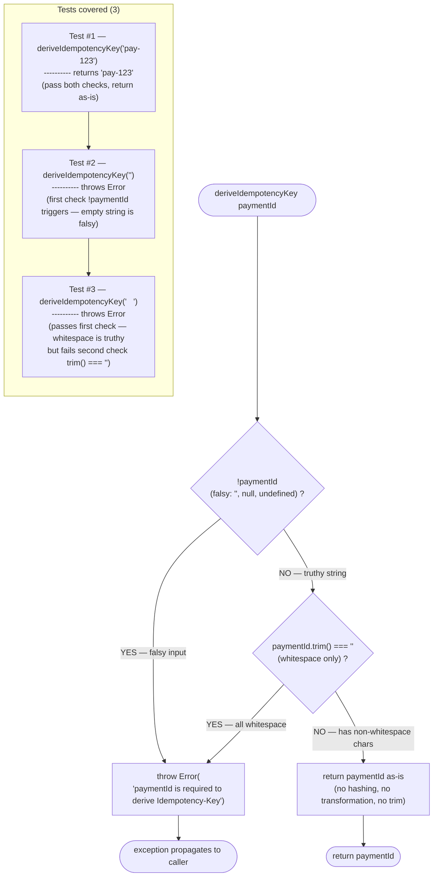
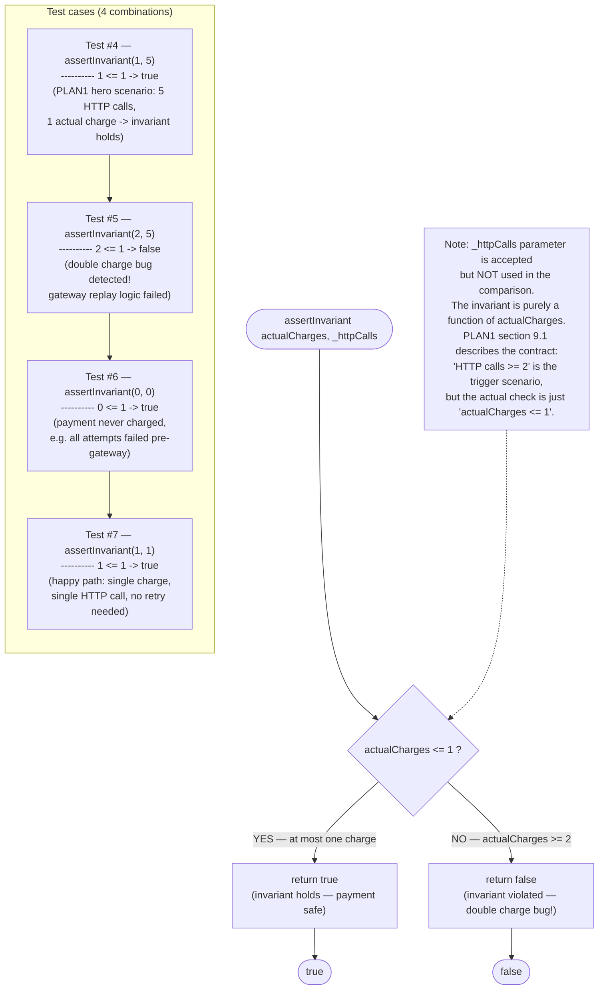
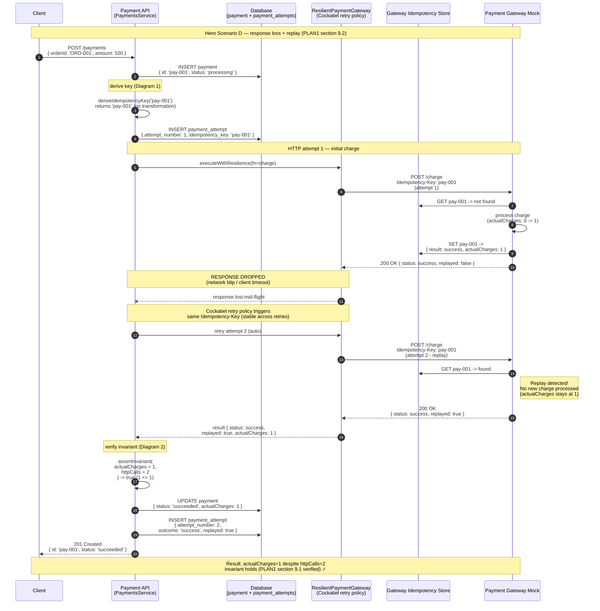

# Scenario: idempotency.spec.ts

> **Source**: `apps/payment-api/tests/modules/payments/idempotency.spec.ts`
> **Tests**: 7 tests, 2 describe blocks (`deriveIdempotencyKey`, `assertInvariant (plan section 9.1)`)
> **Implementation**: `apps/payment-api/src/modules/payments/idempotency.ts` (re-export `deriveIdempotencyKey` dari `gateway/idempotency-key.ts`)

> **Catatan**: TASK-16 plan menyebut "6 tests" — file aktual berisi **7 tests** (3 untuk `deriveIdempotencyKey`, 4 untuk `assertInvariant`). Task plan mengelompokkan "throws on empty/whitespace" sebagai 1 logical scenario, padahal di source code keduanya adalah test case terpisah.

Scenario ini memvisualkan flow test untuk dua pure function idempotency:
1. `deriveIdempotencyKey(paymentId)` — derivation Idempotency-Key dari payment ID
2. `assertInvariant(actualCharges, httpCalls)` — validate domain invariant `actualCharges <= 1`

---

## Diagram 1 — deriveIdempotencyKey (Tests #1-#3)

Cover tests:
- #1 `returns paymentId as-is`
- #2 `throws on empty string`
- #3 `throws on whitespace`

### Setup

```ts
// Source implementation (apps/payment-api/src/modules/gateway/idempotency-key.ts):
export function deriveIdempotencyKey(paymentId: string): string {
  if (!paymentId || paymentId.trim() === '') {
    throw new Error('paymentId is required to derive Idempotency-Key');
  }
  return paymentId;
}

// Pure function — no mocks needed, no DI, no state.
// Test imports directly:
import { deriveIdempotencyKey } from '../../../src/modules/payments/idempotency';
// (re-exported from gateway/idempotency-key.ts via payments/idempotency.ts)
```

### Flow — deriveIdempotencyKey validation flowchart



### Key assertions

- **Test #1**: `deriveIdempotencyKey('pay-123')` returns `'pay-123'` — exact string equality, no transformation (no hashing, no trim, no encoding). Key insight: function adalah identity function untuk valid input.
- **Test #2**: `deriveIdempotencyKey('')` throws Error. Implementation: `!paymentId` evaluates `!''` → `true` → throw.
- **Test #3**: `deriveIdempotencyKey('   ')` throws Error. Implementation: `!paymentId` evaluates `!'   '` → `false` (whitespace string is truthy), tapi `paymentId.trim() === ''` evaluates `''.trim() === ''` → `true` → throw.
- Error message exact: `'paymentId is required to derive Idempotency-Key'`. Test hanya assert `.toThrow()` tanpa specific message — tapi implementation konsisten dengan message ini.

### Common pitfalls

- **Empty string vs whitespace-only — dua code path berbeda**: Empty string (`''`) catched oleh `!paymentId` (truthy/falsy check). Whitespace-only (`'   '`) bypasses first check (truthy) dan catched oleh `.trim() === ''`. Test #2 dan #3 verify dua path ini secara terpisah — jangan combine jadi satu test case.
- **Tidak ada hashing / encoding**: PLAN1 §9 (line 440) specify `Idempotency-Key: <payment.id>` — payment ID dipakai langsung sebagai key, **tidak** di-hash SHA-256 atau encode base64. Kalau implementation lupa ini dan hash, Test #1 akan fail karena `deriveIdempotencyKey('pay-123')` tidak return `'pay-123'` exact.
- **`.trim()` tidak memodifikasi return value**: Function hanya check `.trim() === ''` untuk validation, tapi return `paymentId` (original, untrimmed). Jadi `deriveIdempotencyKey('  pay-123  ')` akan return `'  pay-123  '` (dengan whitespace). Tidak ada test case untuk ini — bisa ditambah kalau edge case dianggap penting.
- **`null` / `undefined` handling**: Type signature `(paymentId: string)` secara TypeScript tidak mencegah runtime `null`/`undefined`. Implementation handle via `!paymentId` falsy check. Test hanya cover empty string — bisa tambah test untuk `null` dan `undefined` kalau defensive coding di-test.
- **Re-export path**: `idempotency.spec.ts` import dari `'../../../src/modules/payments/idempotency'` yang re-export `deriveIdempotencyKey` dari `'../gateway/idempotency-key'`. Kalau lupa re-export, test fail dengan `TypeError: deriveIdempotencyKey is not a function`.

### PLAN1 reference

- **Section 9 (line 435-448)** — Idempotency header:
  ```http
  Idempotency-Key: <payment.id>
  ```
  Key stabil sepanjang:
  - initial request
  - Cockatiel retry attempts
  - scheduler retry cycle
  - manual retry

  Test #1 verify bahwa key = `payment.id` as-is (sesuai `<payment.id>` placeholder di spec). Test #2 dan #3 verify input validation — payment ID kosong/whitespace tidak boleh menghasilkan key kosong (akan break gateway idempotency store).

---

## Diagram 2 — assertInvariant (Tests #4-#7)

Cover tests:
- #4 `actualCharges=1, httpCalls=5 -> true (invariant hold)`
- #5 `actualCharges=2, httpCalls=5 -> false (invariant violated)`
- #6 `actualCharges=0, httpCalls=0 -> true`
- #7 `actualCharges=1, httpCalls=1 -> true`

### Setup

```ts
// Source implementation (apps/payment-api/src/modules/payments/idempotency.ts):
export function assertInvariant(actualCharges: number, _httpCalls: number): boolean {
  return actualCharges <= 1;
}

// Pure function — no mocks needed.
// Note: _httpCalls parameter accepted tapi TIDAK digunakan dalam comparison.
// Underscore prefix (_) adalah TypeScript convention untuk "intentionally unused".
// Parameter tetap ada untuk:
//   1. Documentation — invariant adalah fungsi dari (actualCharges, httpCalls)
//   2. Future evolution — kalau nambah rule "httpCalls >= 2 implies actualCharges <= 1"
//   3. Caller API stability — caller pass both values tanpa perlu tahu implementasi detail

import { assertInvariant } from '../../../src/modules/payments/idempotency';
```

### Flow — assertInvariant decision matrix



### Truth table — all combinations

> Truth table eksplisit untuk semua 4 kombinasi yang di-test. PLAN1 §9.1 menyebut "HTTP calls >= 2" sebagai skenario di mana invariant harus tetap hold — Test #4 dan #5 cover skenario tersebut secara berlawanan (1 charge OK vs 2 charge violation).

| Test # | `actualCharges` | `httpCalls` | `actualCharges <= 1` | `assertInvariant` returns | Invariant status | Interpretation |
|---|---|---|---|---|---|---|
| #4 | 1 | 5 | `1 <= 1` → true | `true` | **holds** | PLAN1 hero scenario D — replay (5 HTTP calls, 1 actual charge) — idempotency works |
| #5 | 2 | 5 | `2 <= 1` → false | `false` | **violated** | Double charge bug! Gateway replay logic failed — payment charged twice despite same Idempotency-Key |
| #6 | 0 | 0 | `0 <= 1` → true | `true` | **holds** | Payment never reached gateway (all attempts failed pre-charge) — no charge, invariant trivially holds |
| #7 | 1 | 1 | `1 <= 1` → true | `true` | **holds** | Happy path — single charge, single HTTP call, no retry needed |

**Edge cases NOT in tests** (untuk dokumentasi):

| `actualCharges` | `httpCalls` | Expected | Reason |
|---|---|---|---|
| 0 | 5 | `true` | All 5 attempts failed before charge — invariant holds trivially |
| -1 | 5 | `true` | Negative charges (impossible in practice) — implementation accept any `<= 1` |
| 100 | 100 | `false` | Catastrophic double-charge bug — invariant violated |
| `NaN` | 5 | `false` | `NaN <= 1` is `false` — implementation tidak guard against NaN input |

### Key assertions

- **Test #4 (`assertInvariant(1, 5) === true`)** — verify PLAN1 §9.1 invariant: **1 actual charge** walaupun **5 HTTP calls** (replay scenario). Ini adalah kontrak core idempotency: replay HTTP calls tidak boleh menghasilkan charge ganda.
- **Test #5 (`assertInvariant(2, 5) === false`)** — invariant violation: 2 actual charges dari 5 HTTP calls. Implementation harus detect dan return `false` supaya caller bisa throw / log / alert.
- **Test #6 (`assertInvariant(0, 0) === true`)** — edge case: payment gagal total, tidak ada charge sama sekali. Invariant trivially hold (0 <= 1).
- **Test #7 (`assertInvariant(1, 1) === true`)** — happy path: 1 charge, 1 HTTP call. Tidak ada replay. Invariant hold.

### Common pitfalls

- **`_httpCalls` parameter tidak dipakai**: Implementation: `return actualCharges <= 1;` — parameter `_httpCalls` accepted tapi ignored (underscore prefix convention). Kalau test assume invariant check melibatkan `httpCalls` (e.g., `httpCalls >= 2 implies actualCharges <= 1`), test akan salah pass. Implementasi aktual sederhana: `actualCharges <= 1` saja.
- **Comparison operator `<=` bukan `<`**: Invariant adalah `actualCharges <= 1` (less-than-or-equal). Kalau implementation pakai `< 1`, Test #4 (`actualCharges=1`) akan return `false` padahal expected `true`. Edge case `actualCharges === 1` harus return `true` (satu charge sah).
- **TypeScript `number` includes `NaN`**: Implementation tidak guard against `NaN`. `NaN <= 1` evaluates `false` di JavaScript (NaN comparison always false). Jadi `assertInvariant(NaN, 5)` akan return `false`. Tidak ada test untuk ini — bisa tambah kalau defensive coding di-test.
- **Test #4 vs Test #7 — perbedaan `httpCalls`**: Test #4 (`httpCalls=5`) dan Test #7 (`httpCalls=1`) sama-sama expect `true` karena `actualCharges=1`. Ini sengaja — menunjukkan bahwa `httpCalls` parameter tidak mempengaruhi result. Kalau future implementation mengubah logic untuk consider `httpCalls`, kedua test ini akan catch regression.
- **Test #5 harus return `false`, bukan throw**: Invariant violation bukan exception — function return `false` supaya caller bisa decide action (log warning, throw, alert, dll). Kalau implementation `throw` ketika violated, Test #5 akan fail (expect `.toBe(false)` bukan `.toThrow()`).

### PLAN1 reference

- **Section 9.1 (line 450-464)** — Target invariant:
  ```
  Untuk satu payment:

  actualCharges <= 1

  Walaupun:

  HTTP calls >= 2

  pada skenario response loss.
  ```
  Truth table Test #4 dan #5 secara langsung menguji kontrak ini:
  - Test #4 verify "walaupun HTTP calls >= 2 (5 calls), actualCharges <= 1 (1 charge) -> invariant hold"
  - Test #5 verify "kalau actualCharges > 1 (2 charges) -> invariant violated" (regression test untuk bug yang break idempotency)

- **Section 9.2 (line 466-479)** — Replay mechanism:
  ```
  Jika gateway sudah mencatat charge sukses:

  same Idempotency-Key
      |
      v
  gateway returns original result
      |
      +-- replayed: true
  ```
  Diagram 3 (bonus) memvisualkan flow ini end-to-end. `assertInvariant` adalah post-condition yang di-verify setelah replay — gateway store ensure `actualCharges` tetap 1 walaupun HTTP call berikutnya datang dengan key yang sama.

---

## Diagram 3 (Bonus) — Idempotency end-to-end flow

> Diagram ini adalah cross-reference untuk **hero scenario D** (response loss + replay). Test aktual untuk flow ini ada di `resilient-adapter.spec.ts` ("passes replayed=true"), tapi narasi end-to-end paling relevan untuk dimasukkan di sini karena menunjukkan bagaimana `deriveIdempotencyKey` dan `assertInvariant` bekerja sama di lifecycle payment yang sebenarnya.

### Setup

```ts
// Tidak ada test di idempotency.spec.ts untuk end-to-end flow ini.
// Test isolated untuk pure functions (Diagram 1 + Diagram 2) sudah cover unit behavior.
//
// End-to-end flow di-test di:
//   - apps/payment-api/tests/modules/gateway/resilient-adapter.spec.ts
//     test: "passes replayed=true"
//   - apps/payment-api/tests/e2e/* (scenario D - response loss)
//
// Diagram ini disertakan untuk context — menunjukkan kedua pure function
// dipanggil di mana di payment lifecycle, dan bagaimana invariant dijaga
// meski HTTP call di-drop dan di-replay.
```

### Flow — payment create → HTTP attempt 1 (drop) → HTTP attempt 2 (replay)



### Key assertions

- **Idempotency-Key stabil**: Key yang sama (`pay-001`) dipakai di **kedua** HTTP attempts. Tidak ada derivation ulang di retry — Cockatiel retry policy reuse key yang sudah di-derive di attempt 1.
- **`actualCharges` tetap 1**: Gateway idempotency store detect replay via key lookup, return cached result tanpa process charge baru. `actualCharges` counter di gateway tidak increment.
- **`replayed: true` flag**: Response attempt 2 menyertakan `replayed: true` untuk indikasi bahwa result berasal dari cache, bukan fresh charge. Caller bisa log/metric ini secara terpisah.
- **Invariant holds**: `assertInvariant(1, 2) === true` — verify di API layer setelah attempt 2 resolve. Invariant dijaga oleh kombinasi: (a) deriveIdempotencyKey yang menghasilkan key stabil, (b) gateway store yang detect replay.
- **Audit trail**: Dua `payment_attempt` rows tercatat di DB — satu dengan `replayed: false` (attempt 1) dan satu dengan `replayed: true` (attempt 2). `httpCalls=2` di audit trail, `actualCharges=1` di gateway store — keduanya konsisten dengan invariant.

### Common pitfalls

- **`replayed: true` flag tidak otomatis berarti invariant hold**: Flag `replayed` adalah indikator response caching, **bukan** bukti `actualCharges <= 1`. Misal: gateway bisa return `replayed: true` tapi actualCharges tetap 2 kalau store logic buggy. `assertInvariant` adalah check independen yang harus selalu dijalankan post-charge.
- **Cockatiel retry policy reuse key — bukan re-derive**: Idempotency-Key di-derive **sekali** di awal `PaymentsService.executePayment`, lalu dipass ke `ResilientPaymentGateway` yang me-return Cockatiel-wrapped function. Cockatiel retry policy memanggil function yang sama (closure capture key) — tidak re-call `deriveIdempotencyKey`. Kalau implementation re-derive, key tetap sama (function pure), tapi ada overhead yang tidak perlu.
- **Gateway store TTL / expiry**: Jika gateway idempotency store punya TTL (e.g., 24 jam), replay setelah TTL akan dianggap fresh charge. `actualCharges` bisa jadi 2. Tidak ada test untuk TTL expiry di demo — bisa tambah kalau production scenario perlu.
- **`httpCalls` counter source of truth**: Counter `httpCalls` bisa dari: (a) Cockatiel `attemptDetails` array length, (b) audit trail `payment_attempts` rows count, (c) gateway mock log. Pastikan konsisten — kalau counter mismatch, `assertInvariant(actualCharges, httpCalls)` bisa misleading. Test #4 expect `httpCalls=5`, tapi real implementation mungkin count differently (e.g., exclude timeout retries dari HTTP call count).
- **`actualCharges` counter sync dengan gateway**: Counter `actualCharges` di-ambil dari gateway response (`gatewayReference.actualCharges` atau similar). Kalau gateway store tidak persist actualCharges dan hanya return boolean `success`, API tidak bisa verify invariant. Gateway mock di project ini memang return `actualCharges` field explicit.

### PLAN1 reference

- **Section 9 (line 435-448)** — Idempotency-Key stability:
  > Key stabil sepanjang:
  > - initial request
  > - Cockatiel retry attempts
  > - scheduler retry cycle
  > - manual retry

  Diagram 3 memvisualkan "initial request" + "Cockatiel retry attempts" — dua dari empat lifecycle stages yang share key yang sama. Untuk "scheduler retry cycle", lihat [retry-scheduler-service-scenario.md Diagram 4](./retry-scheduler-service-scenario.md#diagram-4-bonus--processone-deep-dive-flowchart) — scheduler juga reuse key yang sama (via `executePayment({ source: 'scheduler' })`).

- **Section 9.1 (line 450-464)** — Target invariant `actualCharges <= 1` walau `HTTP calls >= 2`:
  Diagram 3 verify ini end-to-end — 2 HTTP calls (attempt 1 + attempt 2), 1 actual charge (gateway store detect replay). Invariant holds.

- **Section 9.2 (line 466-479)** — Replay mechanism:
  ```
  Jika gateway sudah mencatat charge sukses:
  same Idempotency-Key -> gateway returns original result -> replayed: true
  ```
  Diagram 3 sequence diagram menggambarkan exact flow ini:
  - Step 8-10: GW checks idempotency store, finds cached result, returns `replayed: true`
  - Step 11: API receives replayed response, `actualCharges` stays at 1

---

## Related docs

- [TEST_MAINTENANCE_RULES.md](../TEST_MAINTENANCE_RULES.md) — rule test maintenance + decision framework
- [TASK-16-test-scenario-diagrams.md](../tasks/TASK-16-test-scenario-diagrams.md) — task plan yang create scenario diagrams ini
- [PLAN1 Section 9 (line 435-479)](../PLAN1_Cockatiel_Retry_Failure_Scenario.md) — Idempotency-Key header + invariant + replay mechanism
- [retry-scheduler-service-scenario.md](./retry-scheduler-service-scenario.md) — cross-reference: scheduler juga reuse Idempotency-Key (`{ source: 'scheduler' }` calls `executePayment` yang reuse key yang sama)
- [resilient-adapter-scenario.md](./resilient-adapter-scenario.md) — cross-reference: actual test untuk `replayed: true` passthrough ada di spec `resilient-adapter.spec.ts` test #8
- [TASK-06-gateway-adapter.md](../tasks/TASK-06-gateway-adapter.md) — task plan untuk `deriveIdempotencyKey` implementation (di-re-export dari `gateway/idempotency-key.ts`)
