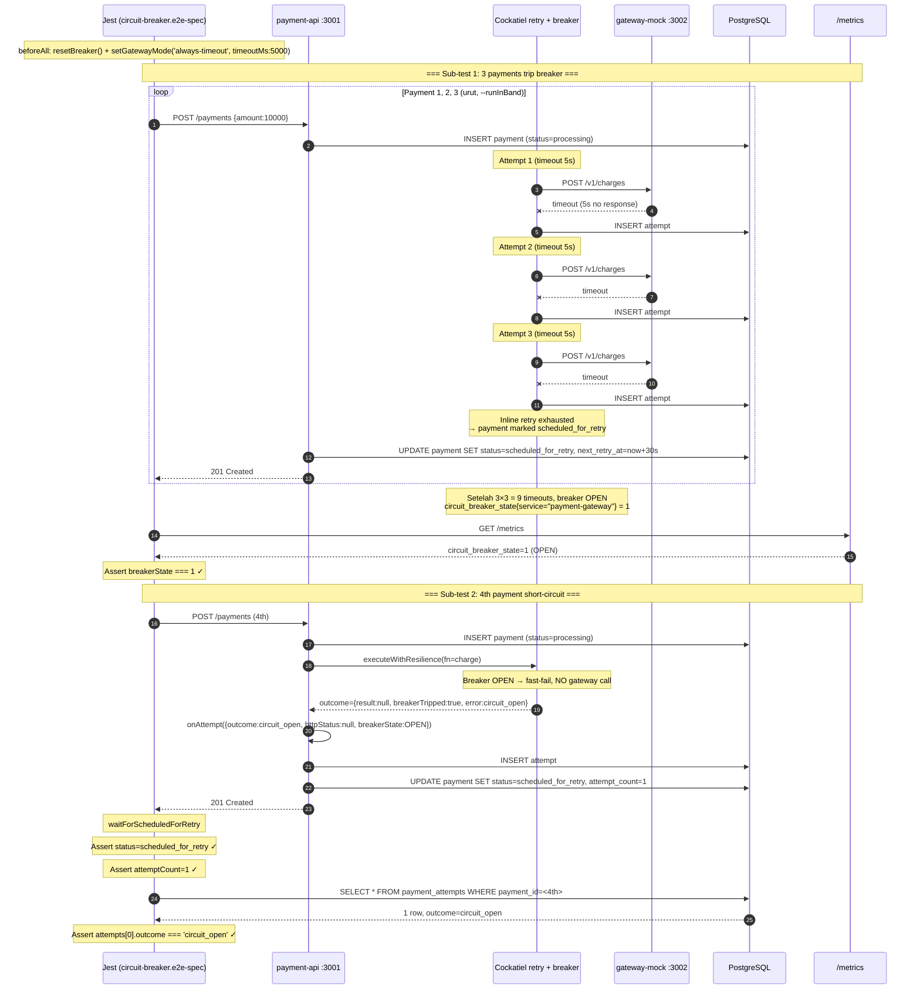

# TASK-14a-circuit-breaker — Skenario 3: Circuit Breaker (always-timeout)

> **Parent**: [TASK-14a-e2e-verification.md](./TASK-14a-e2e-verification.md)
> **Spec file**: `apps/payment-api/tests/e2e/payments.circuit-breaker.e2e-spec.ts`

---

## 1. Apa yang Diuji

Gateway mock diset mode `always-timeout` (timeout 5s). Setiap request charge akan timeout. Cockatiel circuit breaker akan OPEN setelah threshold (3 failures). 

**Dua sub-test**:
1. **3 payments pertama**: masing-masing gagal timeout 3× (sesuai `maxAttempts` inline), status akhir `scheduled_for_retry`, `attemptCount=3`. Setelah payment ke-3, breaker OPEN.
2. **Payment ke-4**: karena breaker OPEN, attempt pertama langsung short-circuit dengan outcome=`circuit_open` (tidak memanggil gateway). `attemptCount=1`.

**Assertion utama**:
- 3 payment pertama: `status=scheduled_for_retry`, `attemptCount=3`
- Payment ke-4: `status=scheduled_for_retry`, `attemptCount=1`, attempt.outcome=`circuit_open`
- `circuit_breaker_state{service="payment-gateway"} = 1` (OPEN) setelah 3 payment

---

## 2. Cara Run Test Ini Saja

```bash
cd apps/payment-api
mkdir -p ../logs/e2e

pnpm test:e2e:circuit-breaker 2>&1 | tee ../logs/e2e/S3-circuit-breaker-$(date +%s).log

pnpm test:e2e:circuit-breaker 2>&1 | Tee-Object -FilePath "..\logs\e2e\S3-circuit-breaker-$(Get-Date -Format 'yyyyMMdd-HHmmss').log"
```

**Atau tanpa named script**:
```bash
pnpm exec jest --config ./tests/e2e/jest-e2e.json --runInBand \
  tests/e2e/payments.circuit-breaker.e2e-spec.ts
```

---

## 3. Visualisasi Alur (Input → Database)



---

## 4. Prekondisi (sebelum test mulai)

```
☐ PostgreSQL running + migrated
☐ payment-api :3001 listening
☐ gateway-mock :3002 listening
☐ Breaker dalam kondisi CLOSED sebelum test (resetBreaker() di beforeAll akan handle, butuh 11s cooldown)
☐ Tidak ada payment lain dengan status=scheduled_for_retry (bisa mengganggu scheduler)
```

**Penting**: `resetBreaker()` butuh **11 detik** cooldown + 1 payment sukses untuk reset state. Jangan skip ini, atau test bisa fail karena breaker masih OPEN dari test sebelumnya.

---

## 5. Verifikasi Manual per Lapis

### L1: HTTP response
Sub-test 1: 3 payments dengan `status=scheduled_for_retry`, `attemptCount=3`.
Sub-test 2: payment ke-4 dengan `status=scheduled_for_retry`, `attemptCount=1`.

### L2: DB state
```sql
-- Payment 1-3: masing-masing 3 attempts retryable_failure
SELECT payment_id, attempt_number, outcome, http_status, duration_ms, breaker_state
FROM payment_attempts
WHERE payment_id IN ('<id1>', '<id2>', '<id3>', '<id4>')
ORDER BY payment_id, attempt_number;
```

**Yang diharapkan**:
| payment_id | attempt_number | outcome            | http_status | breaker_state |
|------------|-----------------|--------------------|-------------|---------------|
| id1        | 1               | retryable_failure  | NULL        | CLOSED        |
| id1        | 2               | retryable_failure  | NULL        | CLOSED        |
| id1        | 3               | retryable_failure  | NULL        | CLOSED→OPEN   |
| id2        | 1               | retryable_failure  | NULL        | OPEN          |
| ...        | ...             | ...                | ...         | ...           |
| id4        | 1               | circuit_open       | NULL        | OPEN          |

**Kunci**: payment ke-4 hanya 1 baris dengan outcome=`circuit_open` — tidak ada gateway call.

### L3: Metrics counter
```bash
curl -s http://localhost:3001/metrics | grep -E '^circuit_breaker'
```

**Yang diharapkan**:
```
circuit_breaker_state{service="payment-gateway"} 1     # OPEN
circuit_breaker_opened_total{service="payment-gateway"} 1
```

### L4: Gateway mock stats
```bash
curl -s http://localhost:3002/admin/stats
```
`requestCount` naik **9** (3 payments × 3 attempts), bukan 10. Payment ke-4 tidak call gateway karena breaker OPEN.

### L5: Log Cockatiel
Cari di log:
```
[circuit-breaker] state transition CLOSED → OPEN (failures=3)
[circuit-breaker] short-circuit: skipping gateway call
[retry] attempt 1 → circuit_open (no gateway call)
```

---

## 6. Pass Criteria Checklist

```
☐ Jest output: "Tests: 2 passed"
☐ Sub-test 1: 3 payments dengan attemptCount=4, status=scheduled_for_retry
☐ Sub-test 2: payment ke-4 dengan attemptCount=1, outcome=circuit_open
☐ DB: payment ke-4 hanya 1 baris di payment_attempts (bukan 4)
☐ Metrics: circuit_breaker_state=1 (OPEN)
☐ Gateway stats: requestCount naik 12 (bukan 16) — bukti breaker short-circuit payment ke-4
☐ Log: ada "circuit breaker OPEN" transition
☐ Test selesai dalam < 60 detik
```

---

## 7. Penjelasan Timeout di Test Code

Test scenario 3 menggunakan **6 jenis timeout berlapis**. Tanpa memahami semuanya, angka-angka di test code terlihat magis. Berikut inventory lengkap dari yang paling dalam (Cockatiel internal) ke yang paling luar (Jest).

### 7.1 Inventory 6 Timeout

#### Timeout #1: `RETRY_BASE_DELAY_MS` (env, default 500ms)

- **Lokasi**: Cockatiel `ExponentialBackoff` di `packages/resilience/src/policies/policies.ts`
- **Fungsi**: Delay antar retry attempt dalam 1 payment cycle.
- **Timing aktual**:
  - Attempt 1 → wait 500ms → Attempt 2
  - Attempt 2 → wait ~1000ms (exponential) → Attempt 3
  - Attempt 3 → wait ~2000ms → Attempt 4
- **Total backoff per payment**: ~3.5s

#### Timeout #2: `GATEWAY_TIMEOUT_MS` (env, default 2000ms)

- **Lokasi**: Cockatiel `timeoutPolicy` di `composition.ts` + axios `timeout: 1800ms` di `http-adapter.ts`
- **Fungsi**: Per-attempt HTTP timeout. Jika gateway tidak merespons dalam 2s, Cockatiel akan memunculkan `TaskCancelledError`.
- **Axios timeout diatur ke 1800ms** (200ms lebih awal) supaya:
  1. Axios terlebih dahulu memicu timeout
  2. fn body menyelesaikan eksekusi
  3. Audit row tersimpan tepat waktu (sebelum Cockatiel melanjutkan ke retry berikutnya)
- **Tanpa axios timeout**: race condition (bug yang telah diperbaiki sebelumnya) → audit row tertinggal → `attemptCount=0` di DB

#### Timeout #3: Gateway mock `timeoutMs: 5000`

- **Lokasi**: `setGatewayMode('always-timeout', { timeoutMs: 5000 })` di test line 60
- **Fungsi**: Gateway mock tidur 5 detik sebelum merespons.
- **Karena `GATEWAY_TIMEOUT_MS=2000`**: client (axios) terlebih dahulu timeout di 1.8s → attempt dianggap gagal → memicu retry Cockatiel
- **Gateway mock tidak pernah mengirim respons** ke client (responsnya datang di 5s, client sudah timeout di 1.8s)

#### Timeout #4: `BREAKER_COOLDOWN_MS` (env, default 10000ms)

- **Lokasi**: Cockatiel `CircuitBreakerPolicy` `halfOpenAfter` di `policies.ts`
- **Fungsi**: Setelah breaker OPEN, tunggu 10 detik sebelum boleh HALF_OPEN (trial call).
- **Di test**: helper `resetBreaker()` di `tests/e2e/helpers/breaker.ts` line 7 menggunakan `setTimeout(11000)` — 11 detik — supaya cooldown berlalu + 1s buffer, lalu membuat 1 payment sukses untuk memicu `onReset` → breaker CLOSED.

#### Timeout #5: `waitForScheduledForRetry(id, 30000)` (test line 72, 83)

- **Lokasi**: Helper `payments.ts` line 63-71
- **Fungsi**: Polling loop — cek `GET /payments/:id` setiap 200ms, sampai status berubah menjadi `scheduled_for_retry` atau timeout 30 detik.
- **Tanpa ini**: test tidak tahu kapan payment selesai diproses (Cockatiel asynchronous).
- **Kenapa 30 detik?** Karena 1 payment butuh:
  - 4 attempts × ~1.8s (axios timeout) = 7.2s
  - 3 backoff delays (500ms + 1000ms + 2000ms) = 3.5s
  - Total ~11s per payment
  - 30s = margin aman 3x

#### Timeout #6: Jest test timeout (test line 79, 90)

- **Sub-test 1**: `120000` (120 detik)
- **Sub-test 2**: `60000` (60 detik)
- **Fungsi**: Jest-level safety net. Jika semua timeout di atas somehow hang, Jest akan menghentikan test setelah 120s/60s.
- **Kenapa 120s untuk sub-test 1?** Karena:
  - `resetBreaker()` di beforeAll: 11s cooldown + 1 payment sukses (~0.1s) = ~11s
  - 3 payments × ~11s = 33s
  - Buffer safety: 3x = 99s → dibulatkan menjadi 120s
- **Kenapa sub-test 2 cuma 60s?** Karena payment ke-4 langsung mendapatkan `circuit_open` (breaker OPEN, fast-fail, no gateway call). Total processing: <1s. 60s = safety margin besar.

### 7.2 Tabel Mapping: Timeout ↔ Step Diagram ↔ Audit Row

| Timeout | Lokasi di Test | Step di Mermaid (section 3) | Audit Row Effect |
|---|---|---|---|
| `RETRY_BASE_DELAY_MS=500` | Cockatiel internal | "Wait backoff" antara Attempt 1→2, 2→3, 3→4 | Delay antar INSERT payment_attempts |
| `GATEWAY_TIMEOUT_MS=2000` (axios 1800ms) | Cockatiel + http-adapter | `AX--x RB: timeout at 1800ms` | 1 INSERT per attempt (outcome='timeout') |
| Gateway mock `timeoutMs:5000` | `setGatewayMode(...)` line 60 | `GW: sleep 5s` (tidak pernah sampai client) | Tidak langsung — hanya supaya axios timeout fire |
| `BREAKER_COOLDOWN_MS=10000` | resetBreaker helper | Tidak ada di sub-test 1 diagram (hanya pada reset) | Setelah 10s, breaker HALF_OPEN → trial call |
| `waitForScheduledForRetry(30000)` | line 72, 83 | Test menunggu step "UPDATE payment SET status=scheduled_for_retry" selesai | Setelah ini, test bisa query `payment_attempts` yang sudah complete |
| Jest `120000/60000` | line 79, 90 | Safety net untuk seluruh diagram | Kill test jika diagram tidak complete dalam waktu |

### 7.3 Kenapa Timeout Berlapis?

Test ini **tidak bisa sinkron** karena:

1. **Cockatiel asynchronous**: Retry + backoff terjadi di background. Test tidak bisa langsung `expect` setelah `createPayment()` karena payment masih `processing`.
2. **State transition async**: Payment status `processing → scheduled_for_retry` membutuhkan waktu (4 attempts × 1.8s + 3 backoffs). Test harus polling.
3. **Breaker state async**: Breaker OPEN tidak instant — butuh 3 payments × 4 failures = 12 cumulative. Test harus menjalankan 3 payments dulu sebelum expect metric=1.
4. **Audit insert async**: `AuditService.recordAttempt` memanggil `attemptRepo.save()` yang asynchronous. Walaupun sudah di-`await` di `onAttempt` callback, ada jendela kecil antara "fn body selesai" dan "audit row tersimpan di DB". `waitForScheduledForRetry` polling memberi waktu ini.

### 7.4 Hubungan dengan Visualisasi Alur (Mermaid)

Diagram mermaid di section 3 adalah **blueprint** yang menjelaskan **kenapa** test butuh timeout tertentu:

- Setiap kotak "Attempt N" di diagram = ±1.8s + backoff → butuh `waitForScheduledForRetry(30000)` supaya test tidak timeout sebelum 4 attempts selesai
- Step "Breaker OPEN → fast-fail" di sub-test 2 = instant → butuh Jest `60000` (bukan 120000) karena tidak ada 4 attempts
- `BREAKER_COOLDOWN_MS=10000` di reset = butuh `setTimeout(11000)` di helper supaya breaker bisa transition HALF_OPEN → CLOSED via trial call

**Inti**: Diagram mermaid dan test code saling menjelaskan. Diagram menunjukkan **alur logika** (apa yang terjadi), test code menunjukkan **alur waktu** (berapa lama setiap step). Tanpa diagram, angka-angka timeout di test terlihat magis. Tanpa test code, diagram hanya sketsa tanpa verifikasi konkret.

---

## 8. Algoritma Test Script Walkthrough

Section ini berbeda dari diagram di section 3 — diagram menjelaskan **apa yang terjadi di sistem**; section ini menjelaskan **apa yang dilakukan test code** untuk memverifikasi sistem tersebut. Pseudocode algoritmik, bukan pengulangan diagram.

### 8.1 Algoritma `beforeAll` (setup)

```
function beforeAll():
  1. ensureDbConnected()
     └── pg client connect ke PostgreSQL (satu koneksi untuk semua test di file ini)

  2. resetBreaker()                                    # helpers/breaker.ts
     ├── resetGatewayToHealthy()                       # PUT /admin/config {mode:'always-success'}
     ├── sleep(11000)                                   # tunggu BREAKER_COOLDOWN_MS + 1s buffer
     ├── createPayment()                                # POST /payments (gateway healthy → success)
     ├── waitForTerminalStatus(id, 30000)               # polling sampai status=succeeded
     └── assert getMetric('circuit_breaker_state') === 0 # verify breaker CLOSED
         └── if not 0: throw "Breaker not CLOSED after reset"

  3. setGatewayMode('always-timeout', {timeoutMs: 5000})
     └── PUT /admin/config {mode:'always-timeout', timeoutMs:5000}

  # State setelah beforeAll:
  # - Breaker CLOSED (verified via metric)
  # - Gateway mode = always-timeout (sleep 5s per request)
  # - DB kosong dari payment lama (optional, tidak dilakukan di scenario 3)
```

### 8.2 Algoritma Sub-test 1: "3 payments → all scheduled_for_retry + breaker OPEN"

```
function test_sub1():
  for i in 1..3:                                       # sequential, await each
    1. payment = createPayment({                       # POST /payments
         orderId: `E2E-S3-${i}-${Date.now()}`,
         amount: 10000,
         currency: 'IDR'
       })

    2. finalPayment = waitForScheduledForRetry(payment.id, 30000)
       # Polling loop internal:
       # while elapsed < 30000:
       #   detail = GET /payments/:id
       #   if detail.payment.status === 'scheduled_for_retry': return
       #   sleep(200)
       # throw if timeout

    3. assert finalPayment.status === 'scheduled_for_retry'
    4. assert finalPayment.attemptCount === 4          # Cockatiel v4: maxAttempts=3 = 4 total fn() calls

  # Setelah 3 payments (12 cumulative failures), breaker OPEN
  5. breakerState = getMetric('circuit_breaker_state', {service:'payment-gateway'})
     └── GET /metrics, parse Prometheus text, filter label

  6. assert breakerState === 1                          # 1 = OPEN, 0 = CLOSED, 2 = HALF_OPEN
```

**Algoritma penting di sub-test 1**:
- Loop **sequential** (bukan `Promise.all`) — supaya urutan failure deterministik dan breaker trip tepat di payment ke-3 (bukan paralel yang bisa trip di payment ke-1).
- `waitForScheduledForRetry` adalah **active polling** dengan interval 200ms — bukan event-driven. Ini sederhana tapi tidak optimal untuk test yang sangat panjang.
- Assertion `attemptCount === 4` di dalam loop, bukan di luar — supaya kalau payment ke-2 gagal, test fail cepat dengan pesan yang spesifik.

### 8.3 Algoritma Sub-test 2: "4th payment → circuit_open in first attempt"

```
function test_sub2():
  1. payment = createPayment({                          # POST /payments
       orderId: `E2E-S3-4-${Date.now()}`,
       amount: 10000,
       currency: 'IDR'
     })

  2. finalPayment = waitForScheduledForRetry(payment.id, 30000)
     # Internal payment-api flow (setelah fix circuit_open):
     # - executeWithResilience → policy.execute(fn)
     # - Breaker OPEN → throw BrokenCircuitError (instant, ~0ms)
     # - outcome.breakerTripped === true
     # - adapter manually invoke onAttempt({outcome:'circuit_open', breakerState:'open', durationMs:0})
     # - AuditService.recordAttempt() → INSERT 1 row
     # - applyOutcome() → UPDATE payment SET status=scheduled_for_retry
     # Total: <1s

  3. assert finalPayment.status === 'scheduled_for_retry'
  4. assert finalPayment.attemptCount === 1             # NOT 4 — breaker short-circuited

  5. attempts = queryAttempts(payment.id)               # SELECT * FROM payment_attempts WHERE payment_id=...
     └── direct pg query (bukan via HTTP API)

  6. assert attempts.length === 1                       # 1 audit row, bukan 4
  7. assert attempts[0].outcome === 'circuit_open'      # NOT 'timeout'
```

**Algoritma penting di sub-test 2**:
- Tidak ada loop — cuma 1 payment.
- `queryAttempts` pakai **direct pg query** (bukan via HTTP API). Sebabnya: kita perlu verifikasi struktur audit row yang spesifik (`outcome`, `breaker_state`), bukan hanya `attemptCount` yang di-expose di API response.
- Assertion ganda: `attemptCount === 1` di HTTP response **dan** `attempts.length === 1` di DB. Kalau keduanya konsisten, sistem benar. Kalau beda, ada bug caching atau race condition.

### 8.4 Algoritma `afterAll` (cleanup)

```
function afterAll():
  1. resetGatewayToHealthy()
     └── PUT /admin/config {mode:'always-success'}

  2. resetBreaker()                                     # same as beforeAll step 2
     ├── resetGatewayToHealthy()                        # (idempotent, gateway already healthy)
     ├── sleep(11000)                                   # tunggu cooldown
     ├── createPayment() + waitForTerminalStatus()      # trigger onReset → breaker CLOSED
     └── assert metric === 0

  3. closeDb()
     └── pg client disconnect (supaya Jest bisa exit bersih)
```

**Kenapa resetBreaker di afterAll?** Supaya scenario test lain (4 idempotency, 5 retry-after, dst.) yang mungkin jalan setelahnya tidak terpengaruh breaker OPEN. Tanpa ini, test berikutnya bisa false-fail karena dapat `circuit_open` di attempt pertama.

### 8.5 Apakah Section Ini Pengulangan Diagram?

**Tidak**. Section 3 (mermaid) dan section 8 (algoritma) berbeda fokus:

| Aspek | Section 3: Mermaid Diagram | Section 8: Algoritma Walkthrough |
|---|---|---|
| **Yang dijelaskan** | Sistem yang sedang dites (payment-api, gateway-mock, DB) | Test code yang memverifikasi sistem |
| **Aktivitas** | Cockatiel retry, breaker transition, audit insert | createPayment, polling, assert, query DB |
| **Tujuan** | Memahami **apa yang terjadi** di sistem | Memahami **bagaimana test memverifikasi** sistem |
| **Audience** | Orang yang ingin paham flow payment | Orang yang ingin paham struktur test code |
| **Contoh konten** | "AX→GW: HTTP POST" → "AX--x RB: timeout" | "waitForScheduledForRetry polling 200ms" → "assert attemptCount === 4" |

**Bagian yang tidak ada di diagram tapi ada di algoritma**:
- Kenapa loop sequential (bukan paralel) di sub-test 1
- Kenapa `queryAttempts` pakai direct pg query (bukan HTTP)
- Kenapa resetBreaker di afterAll
- Kenapa assertion ganda (HTTP response + DB query)
- Timing aktual per-step (diagram hanya urutan, algoritma berisi durasi)

**Bagian yang tidak ada di algoritma tapi ada di diagram**:
- Internal Cockatiel callback wiring (`onFailure`, `onSuccess`)
- Axios internal retry behavior
- Audit row INSERT SQL detail
- Payment state machine transition detail

**Kesimpulan**: Diagram dan algoritma saling melengkapi. Diagram untuk **pemahaman konseptual**, algoritma untuk **pemahaman implementasi test**. Untuk maintenance di masa depan, baca keduanya.

---

## 9. Common Failure Modes & Troubleshooting

| Gejala | Kemungkinan cause | Fix |
|---|---|---|
| Sub-test 1: payment 2 atau 3 dapat `attemptCount=1` | Breaker OPEN lebih awal dari threshold | Cek konfigurasi `CIRCUIT_BREAKER_THRESHOLD` — harus ≥ 3 |
| Sub-test 2: payment ke-4 dapat `attemptCount=3` (bukan 1) | Breaker tidak OPEN setelah 9 failures | Cek `CIRCUIT_BREAKER_THRESHOLD` total — kalau threshold=10, payment ke-4 masih bisa lewat. Pastikan threshold=3 |
| Sub-test 2: outcome bukan `circuit_open` | `mapOutcome` di `resilient-adapter.ts` tidak handle `breakerTripped` | Cek method `mapOutcome()` — harus return `errorCode: 'circuit_open'` |
| Breaker tidak reset di afterAll | `resetBreaker()` di afterAll tidak dipanggil / gagal | Test sudah panggil. Kalau gagal, cek `breaker.ts` helper — butuh 11s cooldown |
| Timeout test 120s | Timeout gateway terlalu lama (5s × 9 = 45s + cooldown 11s ≈ 56s, masih aman) | Kurangi `timeoutMs` gateway mock jadi 2s kalau ingin cepat |
| Payment ke-4 status=failed (bukan scheduled_for_retry) | State machine tidak handle transition `processing → scheduled_for_retry` saat circuit_open | Cek `state-machine.ts` — `circuit_open` harus diizinkan masuk ke scheduled_for_retry |

---

## 10. Catatan Edge Case

- **Cooldown breaker**: kalau test berjalan > 30s, breaker bisa otomatis HALF_OPEN dan attempt ke-4 akan call gateway lagi. Konfigurasi default `CIRCUIT_BREAKER_COOLDOWN_MS` harus > 60s untuk test ini aman.
- **3 payments di sub-test 1 dijalankan sequential** (loop await), bukan paralel — supaya urutan timeout deterministik. `--runInBand` di Jest sudah memastikan tidak ada paralelisme.
- **Total gateway calls = 12** (3 payments × 4 attempts per payment, per Cockatiel v4 maxAttempts=3 = 4 total fn() calls). Ini berbeda dari plan awal yang menyebut 9 (3×3) — Cockatiel v4 maxAttempts adalah "max retries", bukan "total attempts". Payment ke-4 tidak call gateway (breaker OPEN short-circuit), jadi total requestCount di gateway mock naik 12, bukan 16.
- **Reset breaker di afterAll** wajib, supaya skenario berikutnya (4, 5, 6, 7) tidak terpengaruh state OPEN.
- **Payment ke-4 tetap dischedule untuk retry** (`status=scheduled_for_retry`) — bukan terminal `failed`. Ini karena circuit_open dianggap transient (mungkin nanti breaker udah close lagi). Scheduler akan retry di cycle berikutnya.
