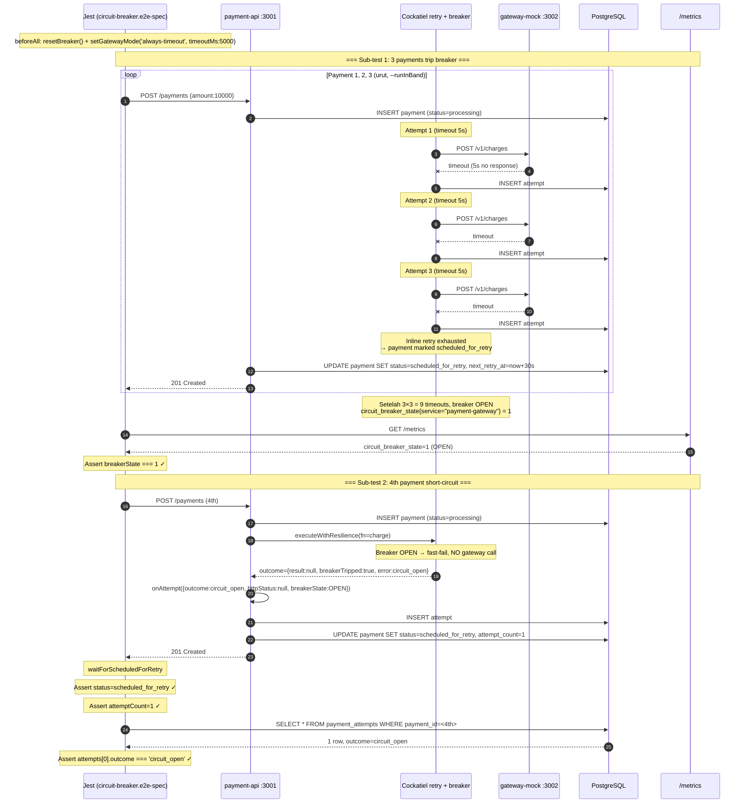

# TASK-14a-circuit-breaker — Skenario 3: Circuit Breaker (always-timeout)

> **Parent**: [TASK-14a-e2e-verification.md](./TASK-14a-e2e-verification.md)
> **Spec file**: `apps/payment-api/tests/e2e/payments.circuit-breaker.e2e-spec.ts`

---

## 1. Apa yang Diuji

Gateway mock diset mode `always-timeout` (timeout 5s). Setiap request charge akan timeout. Cockatiel circuit breaker akan OPEN setelah threshold (3 failures). 

**Dua sub-test**:
1. **3 payments pertama**: masing-masing gagal timeout 3× (sesuai `maxAttempts` inline), status akhir `scheduled_for_retry`, `attemptCount=3`. Setelah payment ke-3, breaker OPEN.
2. **Payment ke-4**: karena breaker OPEN, attempt pertama langsung short-circuit dengan outcome=`circuit_open` (tidak memanggil gateway). `attemptCount=1`.

**Assertion utama**:
- 3 payment pertama: `status=scheduled_for_retry`, `attemptCount=3`
- Payment ke-4: `status=scheduled_for_retry`, `attemptCount=1`, attempt.outcome=`circuit_open`
- `circuit_breaker_state{service="payment-gateway"} = 1` (OPEN) setelah 3 payment

---

## 2. Cara Run Test Ini Saja

```bash
cd apps/payment-api
mkdir -p ../logs/e2e

pnpm test:e2e:circuit-breaker 2>&1 | tee ../logs/e2e/S3-circuit-breaker-$(date +%s).log

pnpm test:e2e:circuit-breaker 2>&1 | Tee-Object -FilePath "..\logs\e2e\S3-circuit-breaker-$(Get-Date -Format 'yyyyMMdd-HHmmss').log"
```

**Atau tanpa named script**:
```bash
pnpm exec jest --config ./tests/e2e/jest-e2e.json --runInBand \
  tests/e2e/payments.circuit-breaker.e2e-spec.ts
```

---

## 3. Visualisasi Alur (Input → Database)



---

## 4. Prekondisi (sebelum test mulai)

```
☐ PostgreSQL running + migrated
☐ payment-api :3001 listening
☐ gateway-mock :3002 listening
☐ Breaker dalam kondisi CLOSED sebelum test (resetBreaker() di beforeAll akan handle, butuh 11s cooldown)
☐ Tidak ada payment lain dengan status=scheduled_for_retry (bisa mengganggu scheduler)
```

**Penting**: `resetBreaker()` butuh **11 detik** cooldown + 1 payment sukses untuk reset state. Jangan skip ini, atau test bisa fail karena breaker masih OPEN dari test sebelumnya.

---

## 5. Verifikasi Manual per Lapis

### L1: HTTP response
Sub-test 1: 3 payments dengan `status=scheduled_for_retry`, `attemptCount=3`.
Sub-test 2: payment ke-4 dengan `status=scheduled_for_retry`, `attemptCount=1`.

### L2: DB state
```sql
-- Payment 1-3: masing-masing 3 attempts retryable_failure
SELECT payment_id, attempt_number, outcome, http_status, duration_ms, breaker_state
FROM payment_attempts
WHERE payment_id IN ('<id1>', '<id2>', '<id3>', '<id4>')
ORDER BY payment_id, attempt_number;
```

**Yang diharapkan**:
| payment_id | attempt_number | outcome            | http_status | breaker_state |
|------------|-----------------|--------------------|-------------|---------------|
| id1        | 1               | retryable_failure  | NULL        | CLOSED        |
| id1        | 2               | retryable_failure  | NULL        | CLOSED        |
| id1        | 3               | retryable_failure  | NULL        | CLOSED→OPEN   |
| id2        | 1               | retryable_failure  | NULL        | OPEN          |
| ...        | ...             | ...                | ...         | ...           |
| id4        | 1               | circuit_open       | NULL        | OPEN          |

**Kunci**: payment ke-4 hanya 1 baris dengan outcome=`circuit_open` — tidak ada gateway call.

### L3: Metrics counter
```bash
curl -s http://localhost:3001/metrics | grep -E '^circuit_breaker'
```

**Yang diharapkan**:
```
circuit_breaker_state{service="payment-gateway"} 1     # OPEN
circuit_breaker_opened_total{service="payment-gateway"} 1
```

### L4: Gateway mock stats
```bash
curl -s http://localhost:3002/admin/stats
```
`requestCount` naik **9** (3 payments × 3 attempts), bukan 10. Payment ke-4 tidak call gateway karena breaker OPEN.

### L5: Log Cockatiel
Cari di log:
```
[circuit-breaker] state transition CLOSED → OPEN (failures=3)
[circuit-breaker] short-circuit: skipping gateway call
[retry] attempt 1 → circuit_open (no gateway call)
```

---

## 6. Pass Criteria Checklist

```
☐ Jest output: "Tests: 2 passed"
☐ Sub-test 1: 3 payments dengan attemptCount=3, status=scheduled_for_retry
☐ Sub-test 2: payment ke-4 dengan attemptCount=1, outcome=circuit_open
☐ DB: payment ke-4 hanya 1 baris di payment_attempts (bukan 3)
☐ Metrics: circuit_breaker_state=1 (OPEN)
☐ Gateway stats: requestCount naik 9 (bukan 12) — bukti breaker short-circuit payment ke-4
☐ Log: ada "circuit breaker OPEN" transition
☐ Test selesai dalam < 90 detik (3 payments × 3 timeout 5s + cooldown)
```

---

## 7. Common Failure Modes & Troubleshooting

| Gejala | Kemungkinan cause | Fix |
|---|---|---|
| Sub-test 1: payment 2 atau 3 dapat `attemptCount=1` | Breaker OPEN lebih awal dari threshold | Cek konfigurasi `CIRCUIT_BREAKER_THRESHOLD` — harus ≥ 3 |
| Sub-test 2: payment ke-4 dapat `attemptCount=3` (bukan 1) | Breaker tidak OPEN setelah 9 failures | Cek `CIRCUIT_BREAKER_THRESHOLD` total — kalau threshold=10, payment ke-4 masih bisa lewat. Pastikan threshold=3 |
| Sub-test 2: outcome bukan `circuit_open` | `mapOutcome` di `resilient-adapter.ts` tidak handle `breakerTripped` | Cek method `mapOutcome()` — harus return `errorCode: 'circuit_open'` |
| Breaker tidak reset di afterAll | `resetBreaker()` di afterAll tidak dipanggil / gagal | Test sudah panggil. Kalau gagal, cek `breaker.ts` helper — butuh 11s cooldown |
| Timeout test 120s | Timeout gateway terlalu lama (5s × 9 = 45s + cooldown 11s ≈ 56s, masih aman) | Kurangi `timeoutMs` gateway mock jadi 2s kalau ingin cepat |
| Payment ke-4 status=failed (bukan scheduled_for_retry) | State machine tidak handle transition `processing → scheduled_for_retry` saat circuit_open | Cek `state-machine.ts` — `circuit_open` harus diizinkan masuk ke scheduled_for_retry |

---

## 8. Catatan Edge Case

- **Cooldown breaker**: kalau test berjalan > 30s, breaker bisa otomatis HALF_OPEN dan attempt ke-4 akan call gateway lagi. Konfigurasi default `CIRCUIT_BREAKER_COOLDOWN_MS` harus > 60s untuk test ini aman.
- **3 payments di sub-test 1 dijalankan sequential** (loop await), bukan paralel — supaya urutan timeout deterministik. `--runInBand` di Jest sudah memastikan tidak ada paralelisme.
- **Total gateway calls = 9** (3×3) — angka ini penting untuk membedakan dengan skenario 4 (idempotensi) di mana actualChargesCount harus 1, bukan requestCount.
- **Reset breaker di afterAll** wajib, supaya skenario berikutnya (4, 5, 6, 7) tidak terpengaruh state OPEN.
- **Payment ke-4 tetap dischedule untuk retry** (`status=scheduled_for_retry`) — bukan terminal `failed`. Ini karena circuit_open dianggap transient (mungkin nanti breaker udah close lagi). Scheduler akan retry di cycle berikutnya.
