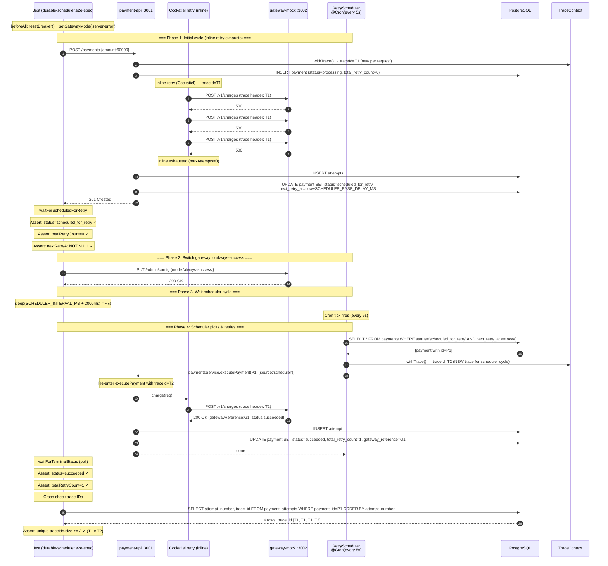

# TASK-14a-durable-scheduler — Skenario 6: Durable Retry via @nestjs/schedule

> **Parent**: [TASK-14a-e2e-verification.md](./TASK-14a-e2e-verification.md)
> **Spec file**: `apps/payment-api/tests/e2e/payments.durable-scheduler.e2e-spec.ts`

---

## 1. Apa yang Diuji

Verifikasi bahwa **RetryScheduler** (cron `@nestjs/schedule`) benar-benar mempick up payment dengan `status=scheduled_for_retry` dan mengeksekusi ulang dengan **trace ID baru** (beda cycle dari initial request).

**Alur 4 phase**:
1. Set gateway ke `server-error` → semua charge dapat 500
2. `createPayment` → Cockatiel inline retry exhausts → payment masuk `scheduled_for_retry`, `totalRetryCount=0`
3. Switch gateway ke `always-success` (tanpa restart payment-api)
4. Tunggu scheduler cycle (`SCHEDULER_INTERVAL_MS` = 5000ms) → scheduler picks payment → charge sukses → status=`succeeded`, `totalRetryCount=1`

**Assertion utama**:
- Phase 1: `status=scheduled_for_retry`, `totalRetryCount=0`, `nextRetryAt` NOT NULL
- Phase 4: `status=succeeded`, `totalRetryCount=1`
- Trace IDs di `payment_attempts` **berbeda** antara inline cycle (phase 1) dan scheduler cycle (phase 4) — minimal 2 trace IDs

---

## 2. Cara Run Test Ini Saja

```bash
cd apps/payment-api
mkdir -p ../logs/e2e

pnpm test:e2e:durable-scheduler 2>&1 | tee ../logs/e2e/S6-durable-scheduler-$(date +%s).log
```

**Atau tanpa named script**:
```bash
pnpm exec jest --config ./tests/e2e/jest-e2e.json --runInBand \
  tests/e2e/payments.durable-scheduler.e2e-spec.ts
```

---

## 3. Visualisasi Alur (Input → Database)



---

## 4. Prekondisi (sebelum test mulai)

```
☐ PostgreSQL running + migrated
☐ payment-api :3001 listening + SCHEDULER_INTERVAL_MS=5000 diset di env
☐ gateway-mock :3002 listening
☐ Breaker CLOSED (resetBreaker())
☐ Tidak ada payment lain dengan status=scheduled_for_retry (bisa ikut terpick scheduler)
   → bersihkan via `DELETE FROM payments WHERE status='scheduled_for_retry'` sebelum test
```

---

## 5. Verifikasi Manual per Lapis

### L1: HTTP response
`status=succeeded`, `totalRetryCount=1` di akhir.

### L2: DB state — krusial untuk trace ID verification
```sql
SELECT attempt_number, outcome, trace_id, created_at
FROM payment_attempts
WHERE payment_id = '<id dari test>'
ORDER BY attempt_number;
```

**Yang diharapkan** (minimal 4 baris):
| attempt_number | outcome            | trace_id | created_at          |
|----------------|--------------------|----------|---------------------|
| 1              | retryable_failure  | T1       | t0                  |
| 2              | retryable_failure  | T1       | t0 + backoff1       |
| 3              | retryable_failure  | T1       | t0 + backoff1+2     |
| 4              | success            | T2       | t0 + ~5s (scheduler)|

**Kunci**:
- 3 baris pertama trace_id = T1 (sama, inline cycle)
- Baris ke-4 trace_id = T2 (beda, scheduler cycle)
- `attempts[3].created_at - attempts[0].created_at >= SCHEDULER_INTERVAL_MS` (bukti scheduler delay, bukan inline retry)

### L3: Metrics counter
```bash
curl -s http://localhost:3001/metrics | grep -E '^(retry_attempts_total|scheduler_)'
```

**Yang diharapkan**:
- `retry_attempts_total{outcome="failure"}` naik 3 (inline cycle)
- `retry_attempts_total{outcome="success"}` naik 1 (scheduler cycle)
- (Opsional) `scheduler_cycles_total` naik 1 — kalau metric ini ada

### L4: Gateway mock stats
```bash
curl -s http://localhost:3002/admin/stats
```
- Setelah phase 1: `serverErrorCount=3`, `requestCount=3`
- Setelah phase 4: `serverErrorCount=3`, `successCount=1`, `requestCount=4`

### L5: Log scheduler
Cari di `logs/e2e/payment-api-*.log`:
```
[RetryScheduler] cron tick — querying scheduled payments
[RetryScheduler] found 1 payment(s) ready for retry
[RetryScheduler] executing payment {id:P1, source:'scheduler'}
[TraceContext] new traceId=T2 (scheduler cycle)
[payments] retry attempt #4 for payment P1 → succeeded
[RetryScheduler] execution completed {paymentId:P1, status:succeeded, duration:120ms}
```

**Yang membedakan dari skenario 1 (transient)**:
- Skenario 1: semua attempts dalam 1 trace ID (inline retry sukses)
- Skenario 6 (ini): 2 trace IDs berbeda karena ada scheduler cycle

---

## 6. Pass Criteria Checklist

```
☐ Jest output: "Tests: 1 passed"
☐ DB: payment.status='succeeded', total_retry_count=1
☐ DB: minimal 4 baris di payment_attempts
☐ DB: trace_id unik >= 2 (T1 di 3 baris inline, T2 di baris scheduler)
☐ DB: attempts[3].created_at - attempts[0].created_at >= SCHEDULER_INTERVAL_MS
☐ Metrics: retry_attempts_total{outcome=success} naik 1
☐ Log: ada "RetryScheduler cron tick"
☐ Log: ada "new traceId" (bukan reuse T1)
☐ Test selesai dalam < 60 detik
```

---

## 7. Common Failure Modes & Troubleshooting

| Gejala | Kemungkinan cause | Fix |
|---|---|---|
| Test timeout 90s, payment masih `scheduled_for_retry` | Scheduler tidak jalan — `@nestjs/schedule` belum terinisialisasi, atau `RetrySchedulerService` tidak ada di providers module | Cek `app.module.ts` — `ScheduleModule.forRoot()` dan `RetrySchedulerModule` harus ada di imports |
| `totalRetryCount=0` padahal scheduler sudah pick | Scheduler tidak increment counter setelah retry | Cek `RetrySchedulerService.executePending()` — harus increment `totalRetryCount` |
| `trace_id` sama di 4 baris (semua T1) | TraceContext pakai AsyncLocalStorage yang tidak reset antar cycle | Cek `withTrace()` di `trace-context.ts` — harus wrap dengan NEW context untuk setiap scheduler cycle, bukan reuse parent trace |
| `attempts.length=3` (tidak ada attempt ke-4) | Scheduler tidak mempick payment, atau `next_retry_at` di-set ke masa depan terlalu jauh | Cek `SCHEDULER_BASE_DELAY_MS` — harus cukup pendek (< 10s) supaya `next_retry_at <= now()` saat scheduler tick |
| Scheduler pick up payment LAIN selain P1 | Ada payment scheduled_for_retry lain di DB | Bersihkan DB sebelum test: `DELETE FROM payments WHERE status='scheduled_for_retry'` |
| Payment masuk `failed` (bukan `succeeded`) padahal gateway sudah `always-success` | Gateway switch tidak sempat propagasi, atau ada cache mode di adapter | Cek apakah `setGatewayMode` synchronous. Verifikasi via `GET /admin/config` setelah PUT |

---

## 8. Catatan Edge Case

- **Scheduler `@Cron` interval**: `SCHEDULER_INTERVAL_MS=5000` artinya setiap 5 detik. Test butuh tidur ~7s (`interval + 2s buffer`) supaya scheduler sempat tick. Buffer penting karena cron tidak deterministik tepat 5s.
- **`SCHEDULER_BASE_DELAY_MS`** mengatur kapan `next_retry_at` di-set setelah inline exhaust. Default 30s — **terlalu lama untuk test**. Set ke 1-3s di env test (`SCHEDULER_BASE_DELAY_MS=2000`) supaya scheduler bisa pick cepat. Kalau default 30s, scheduler tick tidak akan pick payment sampai 30s berlalu → test timeout.
- **Trace ID per cycle**: skenario 6 adalah satu-satunya yang **assert trace ID berbeda**. Skenario 1 assert trace ID **sama** (inline retry sukses, 1 trace). Jangan tertukar.
- **`source: 'scheduler'` vs `'api'`**: di `ExecuteOptions`. Scheduler harus pass `source: 'scheduler'` supaya audit bisa membedakan. Cek `RetrySchedulerService` — `paymentsService.executePayment(id, {source:'scheduler'})`.
- **Race condition**: kalau gateway switch ke `always-success` terjadi SETELAH scheduler tick pertama, scheduler akan tetap dapat 500 dan re-schedule. Test handle ini dengan `sleep(SCHEDULER_INTERVAL_MS + 2000)` supaya minimal 1 tick terjadi setelah switch.
- **Multiple scheduler instances** (tidak ada di test, tapi di produksi): kalau 2 instance payment-api jalan, scheduler bisa dobel-process payment yang sama → perlu distributed lock (Redis SETNX). Tidak diuji di skenario ini.
