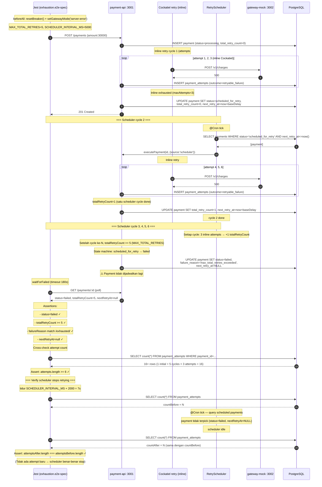

# TASK-14a-exhaustion — Skenario 7: Total Retry Exhaustion (MAX_TOTAL_RETRIES)

> **Parent**: [TASK-14a-e2e-verification.md](./TASK-14a-e2e-verification.md)
> **Spec file**: `apps/payment-api/tests/e2e/payments.exhaustion.e2e-spec.ts`

---

## 1. Apa yang Diuji

Gateway mock diset mode `server-error` (selalu 500). Payment akan terus retry sampai **`MAX_TOTAL_RETRIES` (default 5) tercapai**, lalu berhenti dan ditandai `failed` dengan `nextRetryAt=NULL`. Verifikasi bahwa **scheduler tidak melanjutkan retry** setelah exhaustion.

**Assertion utama**:
- `finalPayment.status === 'failed'`
- `finalPayment.totalRetryCount >= MAX_TOTAL_RETRIES` (5)
- `finalPayment.failureReason` match `/max_total_retries_exceeded|total_retry_exhausted/`
- `finalPayment.nextRetryAt === null` (tidak dijadwalkan lagi)
- `payment_attempts.length >= 6` (1 initial + 5 retries)
- Setelah tidur 1 cycle scheduler (`SCHEDULER_INTERVAL_MS + 2s`), **tidak ada attempt baru** — `attemptsAfter.length === attemptsBefore.length`

---

## 2. Cara Run Test Ini Saja

```bash
cd apps/payment-api
mkdir -p ../logs/e2e

# Test ini panjang (sampai 240s timeout), sabar
pnpm test:e2e:exhaustion 2>&1 | tee ../logs/e2e/S7-exhaustion-$(date +%s).log
```

**Atau tanpa named script**:
```bash
pnpm exec jest --config ./tests/e2e/jest-e2e.json --runInBand \
  tests/e2e/payments.exhaustion.e2e-spec.ts
```

---

## 3. Visualisasi Alur (Input → Database)



---

## 4. Prekondisi (sebelum test mulai)

```
☐ PostgreSQL running + migrated
☐ payment-api :3001 listening + MAX_TOTAL_RETRIES=5 + SCHEDULER_INTERVAL_MS=5000 + SCHEDULER_BASE_DELAY_MS=2000 (atau nilai kecil)
☐ gateway-mock :3002 listening
☐ Breaker CLOSED (resetBreaker())
☐ DB bersih dari payment lain dengan status=scheduled_for_retry
☐ Budget waktu: test butuh sampai 240s
```

---

## 5. Verifikasi Manual per Lapis

### L1: HTTP response
`status=failed`, `totalRetryCount >= 5`, `nextRetryAt=null`.

### L2: DB state — krusial
```sql
SELECT attempt_number, outcome, created_at, trace_id
FROM payment_attempts
WHERE payment_id = '<id dari test>'
ORDER BY attempt_number;
```

**Yang diharapkan** (minimal 6 baris, biasanya 15-18 tergantung konfigurasi):
- Total = 1 (initial) + 5 × 3 (cycles) = 16 attempts
- Atau: 1 (initial) + (MAX - 1) × 3 = 13 attempts (kalau scheduler tidak count initial)

**Yang penting**:
- `payment.next_retry_at = NULL` (terminal, tidak dijadwalkan lagi)
- `payment.failure_reason` mengandung `max_total_retries_exceeded` atau `total_retry_exhausted`

### L3: Metrics counter
```bash
curl -s http://localhost:3001/metrics | grep -E '^retry_(attempts_total|exhausted)'
```

**Yang diharapkan**:
- `retry_attempts_total{outcome="failure"}` naik ≥ 15 (5 cycles × 3 attempts)
- (Opsional) `retry_exhausted_total` naik 1

### L4: Gateway mock stats
```bash
curl -s http://localhost:3002/admin/stats
```
- `requestCount` naik ~15-16 (jumlah attempts)
- `serverErrorCount` naik ~15-16
- `actualChargesCount = 0` (tidak pernah sukses)

### L5: Log scheduler — krusial untuk "verify no more retries"
Cari di `logs/e2e/payment-api-*.log`:
```
[RetryScheduler] cron tick — querying scheduled payments
[RetryScheduler] found 0 payment(s) ready for retry  ← SETELAH exhaustion
```

Dan cari baris penanda exhaustion:
```
[payments] total retry exhausted {paymentId:P1, totalRetryCount:5}
[payments] transition scheduled_for_retry → failed {reason:max_total_retries_exceeded}
```

---

## 6. Pass Criteria Checklist

```
☐ Jest output: "Tests: 1 passed"
☐ DB: payment.status='failed'
☐ DB: payment.total_retry_count >= MAX_TOTAL_RETRIES (5)
☐ DB: payment.next_retry_at IS NULL
☐ DB: payment.failure_reason contains 'max_total_retries_exceeded' or 'total_retry_exhausted'
☐ DB: payment_attempts.length >= 6 (minimal 1 initial + 5 retries)
☐ ⭐ Setelah tidur SCHEDULER_INTERVAL_MS+2s: attempts count TIDAK bertambah (scheduler berhenti)
☐ Log: ada baris "total retry exhausted"
☐ Test selesai dalam < 240 detik
```

---

## 7. Common Failure Modes & Troubleshooting

| Gejala | Kemungkinan cause | Fix |
|---|---|---|
| Test timeout 240s | Scheduler tidak pick up payment → totalRetryCount tidak naik | Cek `SCHEDULER_BASE_DELAY_MS` — kalau 30s, scheduler tunggu 30s baru pick. Set ke 2s untuk test |
| `totalRetryCount < 5` padahal test pass | Assertion pakai `>=` jadi lulus walau cuma 2 | Sebenarnya OK, tapi kalau < 5 berarti scheduler tidak loop. Cek log scheduler cron tick |
| `nextRetryAt` tidak NULL setelah fail | State machine tidak handle transition `scheduled_for_retry → failed` saat `totalRetryCount >= MAX` | Cek `state-machine.ts` dan `payments.service.ts` — saat detect exhaustion, harus set `nextRetryAt=null` |
| Attempts bertambah SETELAH exhaustion | Scheduler tidak check `totalRetryCount >= MAX` sebelum retry | Cek `RetrySchedulerService.executePending()` — harus short-circuit kalau `totalRetryCount >= maxTotalRetries` |
| `failureReason` kosong | Logic exhaustion tidak set reason | Cek `payments.service.ts` saat transition ke failed → set `failure_reason='max_total_retries_exceeded'` |
| Breaker OPEN menghalangi retry | Skenario 3 belum direset | `resetBreaker()` di beforeAll wajib. Setelah 9-15 failures, breaker pasti OPEN kalau threshold=3 |
| Hanya 3 attempts (tidak scheduler cycle) | Scheduler tidak jalan / belum register | Cek `app.module.ts` — `ScheduleModule.forRoot()` harus ada |

---

## 8. Catatan Edge Case

- **Breaker interaction**: gateway mode `server-error` menghasilkan 500 beruntun. Setelah 3 failures (threshold breaker), circuit breaker akan OPEN. Attempt berikutnya dapat `circuit_open` (bukan 500). Ini bisa mempengaruhi jumlah attempts di audit — outcome bercampur antara `retryable_failure` dan `circuit_open`. Test tidak assert outcome spesifik per attempt, hanya total count.
  - **Solusi**: set `CIRCUIT_BREAKER_THRESHOLD` cukup tinggi (mis. 100) di env test supaya breaker tidak OPEN selama test. Atau reset breaker di antara cycle (tapi tidak praktis).
- **`MAX_TOTAL_RETRIES` vs `MAX_ATTEMPTS`**:
  - `MAX_TOTAL_RETRIES` (5) = jumlah scheduler cycles (initial + 5 retries)
  - `MAX_ATTEMPTS` di Cockatiel (3) = jumlah inline attempts per cycle
  - Total HTTP calls = `MAX_TOTAL_RETRIES × MAX_ATTEMPTS` atau `1 + (MAX_TOTAL_RETRIES × MAX_ATTEMPTS - 1)` tergantung initial cycle ikut dihitung atau tidak.
- **`SCHEDULER_BASE_DELAY_MS`**: kalau default 30s, test butuh 5 × 30s = 150s hanya untuk delay antar cycle. Set ke 1-3s di env test supaya test selesai < 60s.
- **Race condition di assertion terakhir** (verify no more retries):
  - Test tidur `SCHEDULER_INTERVAL_MS + 2000` (7s) setelah dapat status=failed
  - Scheduler tick berikutnya akan query: `WHERE status='scheduled_for_retry' AND next_retry_at <= now()` — payment sudah `failed`, tidak akan terpick
  - **Kalau attempts masih bertambah**, kemungkinan ada payment LAIN yang scheduled_for_retry di DB → bersihkan sebelum test
- **Failure reason bisa beda format** antara implementation (`max_total_retries_exceeded` vs `total_retry_exhausted`). Test pakai regex `/max_total_retries_exceeded|total_retry_exhausted/` supaya robust terhadap kedua variasi.
- **Untuk demo**: skenario ini menunjukkan sistem **tidak infinite loop**. Tanpa `MAX_TOTAL_RETRIES`, payment yang gagal terus akan diretry selamanya → pemborosan resource & biaya gateway. Tunjukkan log `total retry exhausted` sebagai bukti.
