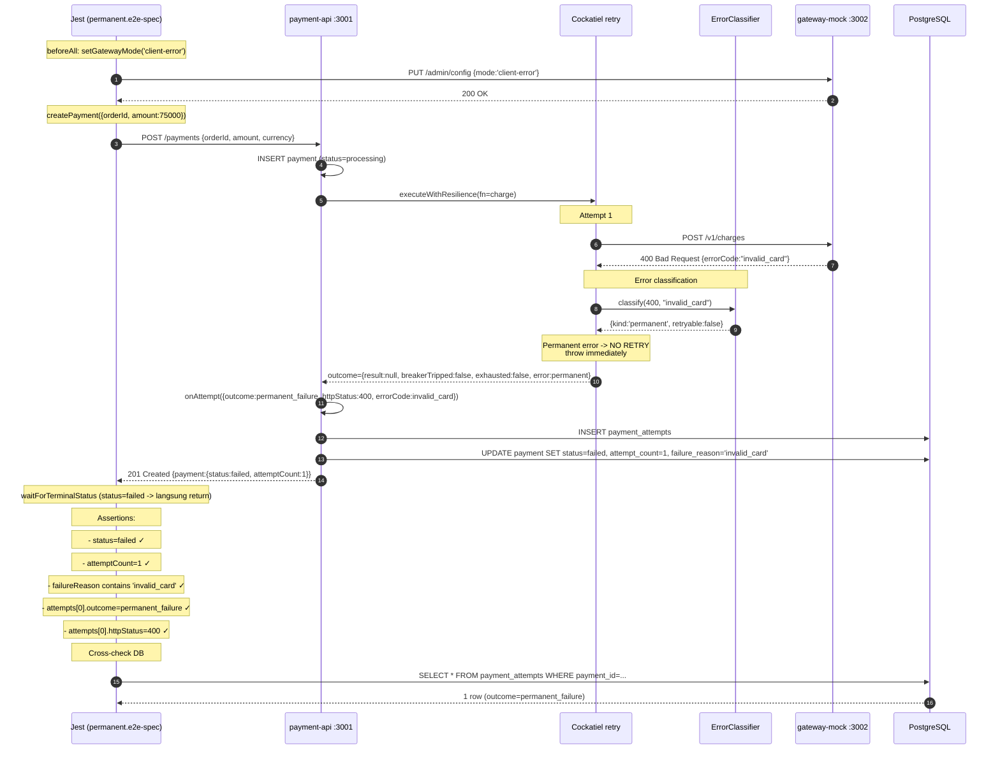

# TASK-14a-permanent - Skenario 2: Permanent Failure (client-error)

> **Parent**: [TASK-14a-e2e-verification.md](./TASK-14a-e2e-verification.md)
> **Spec file**: `apps/payment-api/tests/e2e/payments.permanent.e2e-spec.ts`

---

## 1. Apa yang Diuji

Gateway mock diset mode `client-error` -> selalu balas `400 Bad Request` dengan body `{errorCode: "invalid_card", message: "Card number invalid"}`. Cockatiel **tidak boleh retry** karena error 4xx diklasifikasikan sebagai `permanent_failure`. Payment langsung gagal dengan `attemptCount=1`.

**Assertion utama**:
- `finalPayment.status === 'failed'`
- `finalPayment.attemptCount === 1`
- `finalPayment.failureReason` mengandung `'Card number invalid'` (errorMessage dari gateway body, BUKAN errorCode)
- 1 attempt di audit: outcome=`permanent_failure`, httpStatus=400
- Tidak ada retry (Cockatiel harus fast-fail)

> **Catatan tentang failureReason**: `failureReason` di-set dari `result.errorMessage ?? result.errorCode` di `payments.service.ts:146`. Gateway mock balas body dengan `error_code='invalid_card'` dan `message='Card number invalid'`. `mapError()` di http-adapter.ts ekstrak keduanya, tapi karena `errorMessage` truthy, `failureReason = 'Card number invalid'`. Assertion harus match `errorMessage`, bukan `errorCode`.

---

## 2. Cara Run Test Ini Saja

```bash
cd apps/payment-api
mkdir -p ../logs/e2e

pnpm test:e2e:permanent 2>&1 | tee ../logs/e2e/S2-permanent-$(date +%s).log

pnpm test:e2e:permanent 2>&1 | Tee-Object -FilePath "..\logs\e2e\S2-permanent-$(Get-Date -Format 'yyyyMMdd-HHmmss').log"
```

**Atau tanpa named script**:
```bash
pnpm exec jest --config ./tests/e2e/jest-e2e.json --runInBand \
  tests/e2e/payments.permanent.e2e-spec.ts
```

---

## 3. Visualisasi Alur (Input -> Database)



---

## 4. Prekondisi (sebelum test mulai)

```
☐ PostgreSQL running + migrated
☐ payment-api :3001 listening
☐ gateway-mock :3002 listening
☐ Gateway tidak dalam mode lain (beforeAll akan set ke client-error)
```

---

## 5. Verifikasi Manual per Lapis

### L1: HTTP response
Otomatis oleh Jest. Test pass jika semua assertion hijau.

### L2: DB state
```sql
SELECT p.id, p.status, p.attempt_count, p.failure_reason,
       pa.attempt_number, pa.outcome, pa.http_status, pa.error_code
FROM payments p
JOIN payment_attempts pa ON pa.payment_id = p.id
WHERE p.order_id = 'E2E-S2-<timestamp>';
```

**Yang diharapkan**:
| status | attempt_count | failure_reason      | attempt_number | outcome            | http_status | error_code   |
|--------|---------------|----------------------|----------------|--------------------|-------------|--------------|
| failed | 1             | Card number invalid  | 1              | permanent_failure  | 400         | invalid_card |

**Kunci**:
- `failure_reason` = `'Card number invalid'` (dari `errorMessage` body gateway, BUKAN `errorCode`)
- `error_code` di payment_attempts = `'invalid_card'` (dari `error_code` body gateway)
- `failureReason` di payments table pakai `errorMessage ?? errorCode`, jadi yang muncul adalah `errorMessage`
- **Hanya 1 baris di payment_attempts**. Kalau ada ≥ 2 -> Cockatiel melakukan retry padahal seharusnya tidak -> bug di permanent-no-retry logic (lihat section 9).

### L3: Metrics counter
```bash
curl -s http://localhost:3001/metrics | grep -E '^payments_(permanent_failures_total|current_status)'
```

**Yang diharapkan**:
- `payments_current_status{status="failed"}` naik 1
- Tidak ada peningkatan `retry_attempts_total` (kalau naik -> Cockatiel retry, itu bug)

### L4: Gateway mock stats
```bash
curl -s http://localhost:3002/admin/stats
```
`requestCount` naik 1, `clientErrorCount` naik 1, `actualChargesCount` tetap (tidak ada charge sukses).

### L5: Log Cockatiel
Cari di `logs/e2e/payment-api-*.log`:
```
[retry] error classified as permanent -> not retrying
[audit] payment_attempt inserted {outcome:permanent_failure, http_status:400}
[payments] payment failed permanently {reason:invalid_card}
```

Tidak boleh ada baris `[retry] attempt 2 of N` - kalau ada, berarti retry terjadi.

---

## 6. Pass Criteria Checklist

```
☐ Jest output: "Tests: 1 passed"
☐ DB: 1 baris di payment_attempts, outcome=permanent_failure, http_status=400
☐ DB: payment.status='failed', attempt_count=1, failure_reason contains 'invalid_card'
☐ Metrics: retry_attempts_total TIDAK naik (harus 0 increment)
☐ Log: tidak ada "[retry] attempt 2" event
☐ Test selesai dalam < 5 detik (kalau lebih -> ada retry tidak terduga)
```

---

## 7. Common Failure Modes & Troubleshooting

| Gejala | Kemungkinan cause | Fix |
|---|---|---|
| `attemptCount = 2 atau lebih` | Error 400 salah diklasifikasikan sebagai retryable | Cek `classifyError()` di `packages/resilience/src/errors/` - 4xx harus return `kind: 'permanent'` |
| `failureReason` kosong/null | Body parsing dari gateway gagal ekstrak `errorMessage` | Cek `HttpGatewayAdapter.mapError()` - pastikan baca `message` field dari body (BUKAN `error_code` - `failureReason` pakai `errorMessage ?? errorCode`) |
| Test timeout 30s | Status `failed` tidak terdeteksi oleh `waitForTerminalStatus` | Cek `payments.ts` helper - `['succeeded', 'failed'].includes(...)` sudah benar |
| Masih 500 bukan 400 | Gateway mock mode tidak terganti ke `client-error` | Cek `beforeAll` -> `setGatewayMode('client-error')`. Verifikasi via `GET /admin/config` |
| `ECONNREFUSED` | Service belum start | Start payment-api + gateway-mock |

---

## 8. Catatan Edge Case

- **Mode `client-error` tidak punya parameter** - selalu balas 400 dengan body yang sama. Tidak ada variasi.
- **`MAX_TOTAL_RETRIES` tidak relevan** di skenario ini karena Cockatiel tidak retry permanent error. Bahkan kalau MAX=0, behavior sama.
- **Penting**: test ini adalah **invers** dari skenario 1 - kalau skenario 1 pass tapi skenario 2 fail (atau sebaliknya), kemungkinan besar bug di `classifyError` (4xx vs 5xx classification).
- **Audit trail** harus menunjukkan **TIDAK ADA next_retry_at** - kalau ada, berarti payment dischedule untuk retry padahal seharusnya terminal.

---

## 9. Bug History: Permanent Error Di-Retry (FIXED)

### Gejala Sebelum Fix

Test S2 fail dengan:
```
expect(finalPayment.attemptCount).toBe(1) -> Received: 4
```

DB menunjukkan **4 baris payment_attempts**, semua dengan:
- `outcome='permanent_failure'`
- `http_status=400`
- `error_code='invalid_card'`
- `trace_id` sama (1 inline cycle, Cockatiel retry 4x)

Payment akhirnya `failed` dengan `attempt_count=4` (bukan 1).

### Akar Masalah

Di `resilient-adapter.ts` fn body (sebelum fix):
```typescript
if (innerResult.status === 'failed') {
  throw new GatewayChargeError(innerResult);  // ← throw untuk SEMUA error
}
```

Cockatiel pakai `handleAll` yang **retry semua error yang di-throw** - termasuk permanent error (400 invalid_card). Akibatnya, Cockatiel retry 4x (maxAttempts=3 = 4 total fn() calls).

**Kontradiksi dengan PLAN1**:
- PLAN1 section 5.3: "4xx selain 429 -> permanent" (no retry)
- PLAN1 section 14.2 Scenario 2: "1 attempt, payment = failed, no retry"
- PLAN1 section 5.1 acknowledges: `handleAll` retries all, tapi expect composition untuk membatalkan retry cycle via classifier

**Klasifikasi sudah benar, tapi tidak dipakai untuk kontrol retry**:
- `classifyError()` di `packages/resilience/src/errors/classifier.ts` sudah return `retryable: false` untuk 4xx
- Tapi classifier hanya dipakai untuk **audit** (di `composition.ts` `onFailure` callback)
- Tidak dipakai untuk **mengontrol retry behavior** di fn body `resilient-adapter.ts`

### Fix yang Diterapkan

Di `resilient-adapter.ts`:

1. **Import `classifyError` + `ClassifiableInput`** dari `@retry-failure/resilience`

2. **Tambah helper `classifyChargeResult(result)`**:
   - Convert `ChargeResult` -> `ClassifiableInput`
   - Jika `httpStatus === undefined` -> kind='network' (untuk ECONNRESET, ETIMEDOUT, dll)
   - Jika `httpStatus` ada -> kind='http' dengan status + body
   - Return classification dari `classifyError(input)`

3. **Modifikasi fn body**:
   ```typescript
   // SEBELUM (bug):
   if (innerResult.status === 'failed') {
     throw new GatewayChargeError(innerResult);  // throw untuk SEMUA
   }

   // SESUDAH (fix):
   if (innerResult.status === 'failed') {
     const classification = classifyChargeResult(innerResult);
     if (!classification.retryable) {
       return innerResult;  // permanent - return, Cockatiel won't retry
     }
     throw new GatewayChargeError(innerResult);  // retryable - throw for retry
   }
   ```

### Logika Fix

| Error type | httpStatus | errorCode | retryable? | Action |
|---|---|---|---|---|
| 4xx selain 429 (e.g., 400 invalid_card) | 400 | invalid_card | ❌ false | **return** (no throw) |
| 429 rate_limited | 429 | rate_limited | ✅ true | throw (retry) |
| 5xx server_error | 500 | upstream_error | ✅ true | throw (retry) |
| Network timeout | undefined | ECONNABORTED | ✅ true | throw (retry) |
| Network reset | undefined | ECONNRESET | ✅ true | throw (retry) |

**Key insight**: Cockatiel `handleAll` menganggap fn yang **return** sebagai "success" - jadi untuk permanent error, kita return (bukan throw), dan Cockatiel berhenti retry. Outcome mapping di `mapOutcome()` akan detect `result.status === 'failed'` dan return ChargeResult yang benar ke `applyOutcome()`.

### Flow Setelah Fix

```
1. http-adapter charge() -> gateway returns 400 {error_code:'invalid_card'}
2. mapError() returns ChargeResult{status:'failed', httpStatus:400, errorCode:'invalid_card'}
3. resilient-adapter fn body:
   - innerResult.status === 'failed' -> true
   - classifyChargeResult(innerResult) -> {retryable: false, reason:'client_error'}
   - !classification.retryable -> true -> return innerResult (DON'T throw)
4. Cockatiel sees fn returned -> "success" -> stops retrying
5. outcome.result = innerResult, outcome.attempts = 1
6. mapOutcome() returns {status:'failed', httpStatus:400, errorCode:'invalid_card', attempts:1}
7. payments.service.ts applyOutcome():
   - isPermanentFailure(result) -> true (httpStatus 400, 4xx selain 429)
   - transition to FAILED, attemptCount=1
```

### Impact ke Test Lain

| Test | Gateway mode | HTTP status | retryable? | Impact |
|---|---|---|---|---|
| S1 transient | fail-first-n | 500 | ✅ retryable | TIDAK terdampak (throw -> retry -> sukses attempt 3) |
| **S2 permanent** | **client-error** | **400** | **❌ permanent** | **FIX - sekarang attemptCount=1** |
| S3 circuit-breaker | always-timeout | timeout | ✅ retryable | TIDAK terdampak |
| S4 idempotency | succeed-but-drop | ECONNRESET | ✅ retryable | TIDAK terdampak |
| S5 retry-after | rate-limited | 429 | ✅ retryable | TIDAK terdampak |
| S6 durable | server-error | 500 | ✅ retryable | TIDAK terdampak |
| S7 exhaustion | server-error | 500 | ✅ retryable | TIDAK terdampak |

---

## 10. Algoritma Test Script Walkthrough

Section ini berbeda dari diagram di section 3 - diagram menjelaskan **apa yang terjadi di sistem**; section ini menjelaskan **apa yang dilakukan test code** untuk memverifikasi sistem tersebut. Pseudocode algoritmik, bukan pengulangan diagram.

### 10.1 Algoritma `beforeAll` (setup)

```
function beforeAll():
  1. ensureDbConnected()
     └── pg client connect ke PostgreSQL (satu koneksi untuk semua test di file ini)

  2. cleanDb()                                          # HAPUS payments lama
     ├── DELETE FROM payment_attempts
     └── DELETE FROM payments
     # Penting: supaya scheduler tidak interfere dengan payments dari test sebelumnya
     # (scheduler bisa pick payments scheduled_for_retry dan execute,
     #  yang akan menambah actualChargesCount di gateway mock - pollute assertion)

  3. setGatewayMode('client-error')
     └── PUT /admin/config {mode:'client-error'}
     # Gateway mock sekarang akan balas 400 {error_code:'invalid_card'} untuk semua request

  # State setelah beforeAll:
  # - DB kosong (clean)
  # - Gateway mode = client-error (always 400)
  # - Breaker tidak di-reset (test ini tidak butuh resetBreaker - tidak ada retry yang bisa trip breaker)
```

**Catatan**: Skenario 2 **tidak panggil `resetBreaker()`** di beforeAll, berbeda dari skenario lain (S3, S4, S5, S6, S7). Alasannya:
- S2 tidak ada retry yang bisa trip breaker (permanent error return, no throw)
- Breaker tidak akan OPEN selama test S2
- Jadi tidak perlu cooldown 11s untuk reset

### 10.2 Algoritma Test Body: "should fail with invalid_card, no retry (attemptCount=1)"

```
function test_body():
  1. payment = createPayment({                          # POST /payments
       orderId: `E2E-S2-${Date.now()}`,
       amount: 75000,
       currency: 'IDR'
     })

  2. { payment: finalPayment, attempts } = waitForTerminalStatus(payment.id, 15000)
     # waitForTerminalStatus polling loop:
     # while elapsed < 15000:
     #   detail = GET /payments/:id
     #   if detail.payment.status in ['succeeded', 'failed']: return detail
     #   sleep(200)
     # throw if timeout
     #
     # Untuk permanent error, payment langsung 'failed' (< 1s),
     # jadi waitForTerminalStatus return cepat (tidak perlu polling lama)

  3. assert finalPayment.status === 'failed'            # Payment gagal (bukan sukses)

  4. assert finalPayment.attemptCount === 1             # ⭐ KRITIS: hanya 1 attempt
     # Kalau 4 -> bug: Cockatiel retry permanent error (lihat section 9)

  5. assert finalPayment.failureReason contains 'Card number invalid'
     # failureReason di-set dari result.errorMessage ?? result.errorCode
     # Gateway mock balas body {error_code:'invalid_card', message:'Card number invalid'}
     # mapError() di http-adapter ekstrak errorCode='invalid_card' + errorMessage='Card number invalid'
     # Karena errorMessage truthy, failureReason = 'Card number invalid' (BUKAN 'invalid_card')

  6. assert attempts.length === 1                       # Hanya 1 audit row
     # Kalau >= 2 -> Cockatiel retry (bug)

  7. assert attempts[0].outcome === 'permanent_failure'  # Outcome classification
     # classifyOutcome() di payments.service.ts:
     #   - result.status === 'succeeded'? No
     #   - breakerState === 'open'? No (closed)
     #   - isPermanentFailure(result)? YES (httpStatus 400, 4xx selain 429)
     #   -> return PERMANENT_FAILURE

  8. assert attempts[0].httpStatus === 400              # HTTP status dari gateway

  9. Cross-check DB (verifikasi konsistensi HTTP API vs DB):
     dbAttempts = queryAttempts(payment.id)             # SELECT * FROM payment_attempts
     assert dbAttempts.length === 1                     # Sama dengan attempts.length dari API
     # Kalau beda -> bug caching atau race condition
```

### 10.3 Algoritma `afterAll` (cleanup)

```
function afterAll():
  1. resetGatewayToHealthy()
     └── PUT /admin/config {mode:'always-success'}
     # Penting supaya test berikutnya (S3, S4, dst.) tidak terjebak di mode client-error

  2. closeDb()
     └── pg client disconnect (supaya Jest bisa exit bersih)
```

**Catatan**: S2 **tidak panggil `resetBreaker()`** di afterAll (berbeda dari S3, S4). Alasannya sama: S2 tidak trip breaker, jadi tidak perlu reset.

### 10.4 Apakah Section Ini Pengulangan Diagram?

**Tidak**. Section 3 (mermaid) dan section 10 (algoritma) berbeda fokus:

| Aspek | Section 3: Mermaid Diagram | Section 10: Algoritma Walkthrough |
|---|---|---|
| **Yang dijelaskan** | Sistem yang sedang dites (payment-api, gateway-mock, DB) | Test code yang memverifikasi sistem |
| **Aktivitas** | Cockatiel retry decision, error classification, audit insert | createPayment, polling, assert, query DB |
| **Tujuan** | Memahami **apa yang terjadi** di sistem | Memahami **bagaimana test memverifikasi** sistem |
| **Audience** | Orang yang ingin paham flow payment | Orang yang ingin paham struktur test code |
| **Contoh konten** | "RB->GW: POST /v1/charges" -> "GW-->>RB: 400" | "waitForTerminalStatus polling 200ms" -> "assert attemptCount === 1" |

**Bagian yang tidak ada di diagram tapi ada di algoritma**:
- Kenapa `cleanDb()` di beforeAll (mencegah scheduler interference)
- Kenapa tidak panggil `resetBreaker()` di S2 (tidak ada retry -> breaker tidak trip)
- Kenapa `waitForTerminalStatus` cepat return (permanent error langsung failed)
- Kenapa assertion ganda (HTTP API + DB query untuk konsistensi)
- Timing aktual per-step (diagram hanya urutan, algoritma berisi durasi)

**Bagian yang tidak ada di algoritma tapi ada di diagram**:
- Internal Cockatiel callback wiring (`onFailure`, `onSuccess`)
- `classifyError()` internal logic (5xx vs 4xx vs network)
- Audit row INSERT SQL detail
- Payment state machine transition detail

**Kesimpulan**: Diagram dan algoritma saling melengkapi. Diagram untuk **pemahaman konseptual**, algoritma untuk **pemahaman implementasi test**. Untuk maintenance di masa depan, baca keduanya.

---

