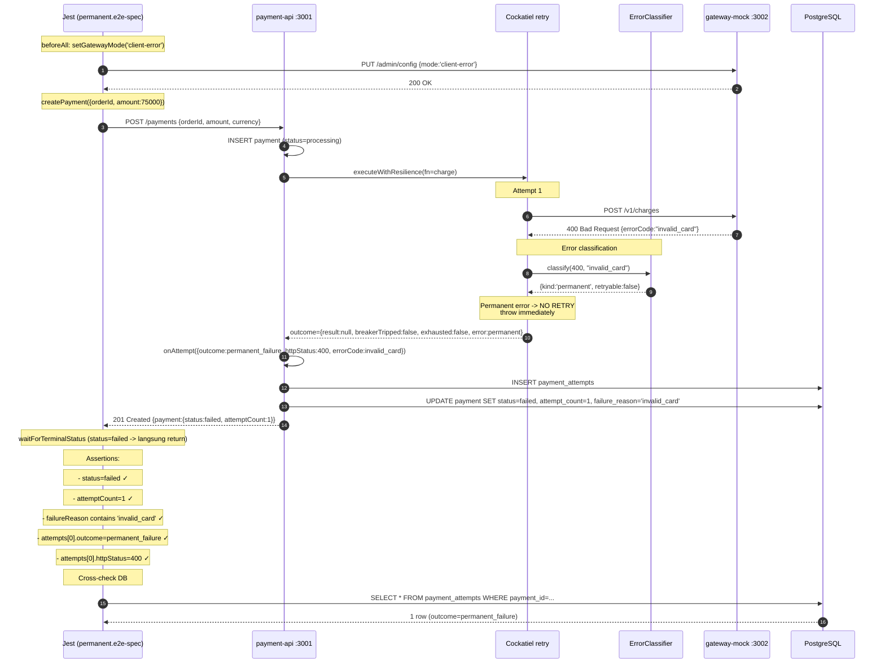

# TASK-14a-permanent — Skenario 2: Permanent Failure (client-error)

> **Parent**: [TASK-14a-e2e-verification.md](./TASK-14a-e2e-verification.md)
> **Spec file**: `apps/payment-api/tests/e2e/payments.permanent.e2e-spec.ts`

---

## 1. Apa yang Diuji

Gateway mock diset mode `client-error` -> selalu balas `400 Bad Request` dengan body `{errorCode: "invalid_card"}`. Cockatiel **tidak boleh retry** karena error 4xx diklasifikasikan sebagai `permanent_failure`. Payment langsung gagal dengan `attemptCount=1`.

**Assertion utama**:
- `finalPayment.status === 'failed'`
- `finalPayment.attemptCount === 1`
- `finalPayment.failureReason` mengandung `'invalid_card'`
- 1 attempt di audit: outcome=`permanent_failure`, httpStatus=400
- Tidak ada retry (Cockatiel harus fast-fail)

---

## 2. Cara Run Test Ini Saja

```bash
cd apps/payment-api
mkdir -p ../logs/e2e

pnpm test:e2e:permanent 2>&1 | tee ../logs/e2e/S2-permanent-$(date +%s).log
```

**Atau tanpa named script**:
```bash
pnpm exec jest --config ./tests/e2e/jest-e2e.json --runInBand \
  tests/e2e/payments.permanent.e2e-spec.ts
```

---

## 3. Visualisasi Alur (Input -> Database)



---

## 4. Prekondisi (sebelum test mulai)

```
☐ PostgreSQL running + migrated
☐ payment-api :3001 listening
☐ gateway-mock :3002 listening
☐ Gateway tidak dalam mode lain (beforeAll akan set ke client-error)
```

---

## 5. Verifikasi Manual per Lapis

### L1: HTTP response
Otomatis oleh Jest. Test pass jika semua assertion hijau.

### L2: DB state
```sql
SELECT p.id, p.status, p.attempt_count, p.failure_reason,
       pa.attempt_number, pa.outcome, pa.http_status, pa.error_code
FROM payments p
JOIN payment_attempts pa ON pa.payment_id = p.id
WHERE p.order_id = 'E2E-S2-<timestamp>';
```

**Yang diharapkan**:
| status | attempt_count | failure_reason | attempt_number | outcome            | http_status | error_code   |
|--------|---------------|----------------|----------------|--------------------|-------------|--------------|
| failed | 1             | invalid_card   | 1              | permanent_failure  | 400         | invalid_card |

**Hanya 1 baris di payment_attempts**. Kalau ada ≥ 2 -> Cockatiel melakukan retry padahal seharusnya tidak -> bug di `classifyError`.

### L3: Metrics counter
```bash
curl -s http://localhost:3001/metrics | grep -E '^payments_(permanent_failures_total|current_status)'
```

**Yang diharapkan**:
- `payments_current_status{status="failed"}` naik 1
- Tidak ada peningkatan `retry_attempts_total` (kalau naik -> Cockatiel retry, itu bug)

### L4: Gateway mock stats
```bash
curl -s http://localhost:3002/admin/stats
```
`requestCount` naik 1, `clientErrorCount` naik 1, `actualChargesCount` tetap (tidak ada charge sukses).

### L5: Log Cockatiel
Cari di `logs/e2e/payment-api-*.log`:
```
[retry] error classified as permanent -> not retrying
[audit] payment_attempt inserted {outcome:permanent_failure, http_status:400}
[payments] payment failed permanently {reason:invalid_card}
```

Tidak boleh ada baris `[retry] attempt 2 of N` — kalau ada, berarti retry terjadi.

---

## 6. Pass Criteria Checklist

```
☐ Jest output: "Tests: 1 passed"
☐ DB: 1 baris di payment_attempts, outcome=permanent_failure, http_status=400
☐ DB: payment.status='failed', attempt_count=1, failure_reason contains 'invalid_card'
☐ Metrics: retry_attempts_total TIDAK naik (harus 0 increment)
☐ Log: tidak ada "[retry] attempt 2" event
☐ Test selesai dalam < 5 detik (kalau lebih -> ada retry tidak terduga)
```

---

## 7. Common Failure Modes & Troubleshooting

| Gejala | Kemungkinan cause | Fix |
|---|---|---|
| `attemptCount = 2 atau lebih` | Error 400 salah diklasifikasikan sebagai retryable | Cek `classifyError()` di `packages/resilience/src/errors/` — 4xx harus return `kind: 'permanent'` |
| `failureReason` kosong/null | Body parsing dari gateway gagal ekstrak `errorCode` | Cek `HttpGatewayAdapter.mapResponse()` — pastikan baca `errorCode` field dari body |
| Test timeout 30s | Status `failed` tidak terdeteksi oleh `waitForTerminalStatus` | Cek `payments.ts` helper — `['succeeded', 'failed'].includes(...)` sudah benar |
| Masih 500 bukan 400 | Gateway mock mode tidak terganti ke `client-error` | Cek `beforeAll` -> `setGatewayMode('client-error')`. Verifikasi via `GET /admin/config` |
| `ECONNREFUSED` | Service belum start | Start payment-api + gateway-mock |

---

## 8. Catatan Edge Case

- **Mode `client-error` tidak punya parameter** — selalu balas 400 dengan body yang sama. Tidak ada variasi.
- **`MAX_TOTAL_RETRIES` tidak relevan** di skenario ini karena Cockatiel tidak retry permanent error. Bahkan kalau MAX=0, behavior sama.
- **Penting**: test ini adalah **invers** dari skenario 1 — kalau skenario 1 pass tapi skenario 2 fail (atau sebaliknya), kemungkinan besar bug di `classifyError` (4xx vs 5xx classification).
- **Audit trail** harus menunjukkan **TIDAK ADA next_retry_at** — kalau ada, berarti payment dischedule untuk retry padahal seharusnya terminal.
