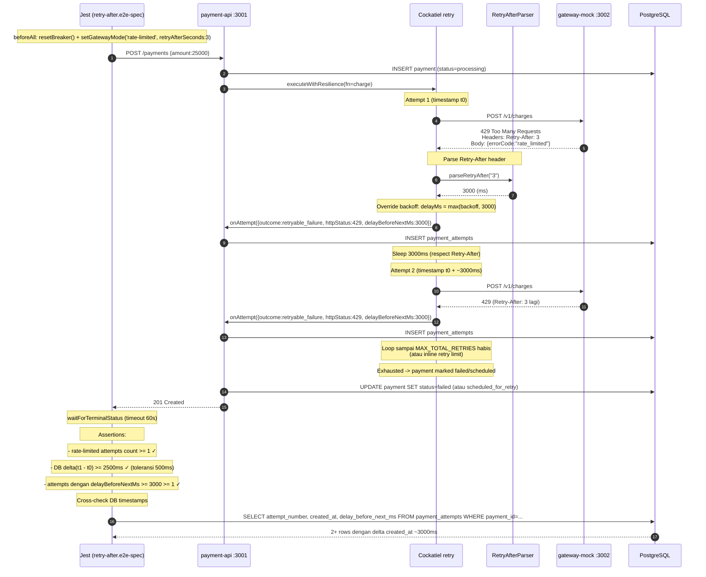

# TASK-14a-retry-after - Skenario 5: Server-Directed Retry (Retry-After header)

> **Parent**: [TASK-14a-e2e-verification.md](./TASK-14a-e2e-verification.md)
> **Spec file**: `apps/payment-api/tests/e2e/payments.retry-after.e2e-spec.ts`

---

## 1. Apa yang Diuji

Gateway mock diset mode `rate-limited` dengan `retryAfterSeconds=3`. Setiap request charge balas `429 Too Many Requests` dengan header `Retry-After: 3`. Cockatiel retry policy harus **menghormati header ini** - delay antar attempt ≥ 3000ms (bukan backoff default).

**Assertion utama**:
- Minimal 1 attempt dengan `httpStatus=429`
- Delay antar attempt (dari DB timestamps) ≥ 2500ms (toleransi 500ms)
- `attempts[i].delayBeforeNextMs >= 3000` (audit field mencatat Retry-After)
- Payment akhirnya sukses atau failed (test hanya verifikasi delay, bukan outcome terminal)

> **Catatan**: gateway mock mode `rate-limited` di test ini TIDAK auto-recover. Payment akan terus dapat 429 sampai `MAX_TOTAL_RETRIES` habis, lalu fail. Test hanya assert **delay timing**, bukan sukses.

---

## 2. Cara Run Test Ini Saja

```bash
cd apps/payment-api
mkdir -p ../logs/e2e

pnpm test:e2e:retry-after 2>&1 | tee ../logs/e2e/S5-retry-after-$(date +%s).log
```

**Atau tanpa named script**:
```bash
pnpm exec jest --config ./tests/e2e/jest-e2e.json --runInBand \
  tests/e2e/payments.retry-after.e2e-spec.ts
```

---

## 3. Visualisasi Alur (Input -> Database)



---

## 4. Prekondisi (sebelum test mulai)

```
☐ PostgreSQL running + migrated
☐ payment-api :3001 listening
☐ gateway-mock :3002 listening
☐ Breaker CLOSED (resetBreaker() di beforeAll)
☐ SCHEDULER_INTERVAL_MS diset di env payment-api (default 5000)
☐ MAX_TOTAL_RETRIES cukup untuk minimal 2 inline attempts (≥ 2)
```

---

## 5. Verifikasi Manual per Lapis

### L1: HTTP response
Test hanya assert delay timing & 429 attempts, tidak assert outcome terminal. Pass jika assertions delay terpenuhi.

### L2: DB state - krusial untuk skenario ini
```sql
SELECT attempt_number, outcome, http_status,
       EXTRACT(EPOCH FROM created_at) * 1000 AS created_ms,
       delay_before_next_ms,
       error_code
FROM payment_attempts
WHERE payment_id = '<id dari test>'
ORDER BY attempt_number;
```

**Yang diharapkan** (minimal 2 baris):
| attempt_number | outcome            | http_status | created_ms | delay_before_next_ms | error_code   |
|----------------|--------------------|-------------|------------|----------------------|--------------|
| 1              | retryable_failure  | 429         | t0         | 3000                 | rate_limited |
| 2              | retryable_failure  | 429         | t0+3000    | 3000                 | rate_limited |

**Kunci**:
- `delta = created_ms[1] - created_ms[0]` harus **≥ 2500ms** (toleransi 500ms dari 3000ms ekspektasi)
- `delay_before_next_ms` harus **3000** (atau ≥ 3000), bukan default backoff Cockatiel (mis. 1000ms)

### L3: Metrics counter
```bash
curl -s http://localhost:3001/metrics | grep -E '^(retry_after|retry_attempts)'
```

**Yang diharapkan**:
- `retry_attempts_total{outcome="failure"}` naik ≥ 1
- (Opsional) jika ada metric khusus `retry_after_observed_total`, naik ≥ 1

### L4: Gateway mock stats
```bash
curl -s http://localhost:3002/admin/stats
```
`rateLimitedCount` (atau `requestCount`) naik ≥ 2. Tidak ada `actualChargesCount` (mode rate-limited tidak pernah charge).

### L5: Log Cockatiel
Cari di `logs/e2e/payment-api-*.log`:
```
[retry] attempt 1 -> 429 Too Many Requests
[retry] Retry-After header: 3s -> overriding backoff
[retry] sleeping 3000ms before next attempt
[retry] attempt 2 -> 429 Too Many Requests
```

Tidak boleh ada `[retry] sleeping 1000ms` (default backoff) - kalau ada, berarti Retry-After header tidak diparse.

---

## 6. Pass Criteria Checklist

```
☐ Jest output: "Tests: 1 passed"
☐ DB: minimal 2 attempts dengan http_status=429
☐ DB: delta created_at antar attempt >= 2500ms (bukan ~1000ms default backoff)
☐ DB: delay_before_next_ms >= 3000 di minimal 1 attempt
☐ Log: ada "Retry-After" parsing event
☐ Test selesai dalam < 90 detik
```

---

## 7. Common Failure Modes & Troubleshooting

| Gejala | Kemungkinan cause | Fix |
|---|---|---|
| `delta < 2500ms` (~1000ms) | Retry-After header tidak diparse, Cockatiel pakai default backoff | Cek `parseRetryAfter()` di `packages/resilience/src/errors/` - harus baca header dari error object |
| `delay_before_next_ms = null` | Audit tidak record field ini | Cek `AuditService.recordAttempt()` - harus simpan `delayBeforeNextMs` dari `onAttempt` callback |
| Tidak ada 429 attempts (semua 200/500) | Mode gateway tidak ter-set ke `rate-limited` | Cek `beforeAll` -> `setGatewayMode('rate-limited', {retryAfterSeconds:3})`. Verifikasi via `GET /admin/config` |
| `httpStatus = null` padahal expect 429 | Network error (timeout) bukan HTTP 429 | Cek gateway mock `mode-handler.ts` mode rate-limited - harus balas 429 dengan body, bukan disconnect |
| Breaker OPEN sebelum delay sempat diukur | Skenario 3 belum direset | `resetBreaker()` di `beforeAll` wajib |
| Test timeout 90s | Cockatiel tidak menghormati Retry-After, jadi tidak retry, akhirnya timeout di `waitForTerminalStatus` | Sebenarnya bug di atas. Fix parser Retry-After |

---

## 8. Catatan Edge Case

- **Gateway mode `rate-limited` tidak auto-recover** - tidak ada "setelah N request lepas rate limit". Setiap request dapat 429. Test oleh karena itu tidak assert sukses, hanya timing.
- **Toleransi 500ms** di assertion (`>= 2500` padahal expect 3000) mengakomodasi:
  - Clock drift antara app server & DB server
  - Network latency minimal antar HTTP call
  - TypeScript `Date.now()` precision
- **`delayBeforeNextMs` di audit** harus **exact 3000** kalau parser benar, bukan ≥ 3000. Tapi test pakai `>= 3000` supaya kalau parser round-up (e.g., 3001 karena timer granularity), tetap pass.
- **Jika `MAX_TOTAL_RETRIES=0`** (tidak retry sama sekali), test akan fail karena tidak ada 2 attempts untuk diukur delta-nya. Pastikan `MAX_TOTAL_RETRIES >= 2` di env.
- **Retry-After value lain** (mis. `Retry-After: Wed, 21 Oct 2025 07:28:00 GMT` - HTTP date format) **tidak diuji** di skenario ini. Hanya numeric seconds. Kalau mau uji date format, buat skenario tambahan.
- **Mode `rate-limited` di gateway mock punya `retryAfterSeconds` parameter** - kalau tidak diset, default-nya mungkin 1s atau 0. Selalu pass explicit `retryAfterSeconds: 3` di `setGatewayMode`.
