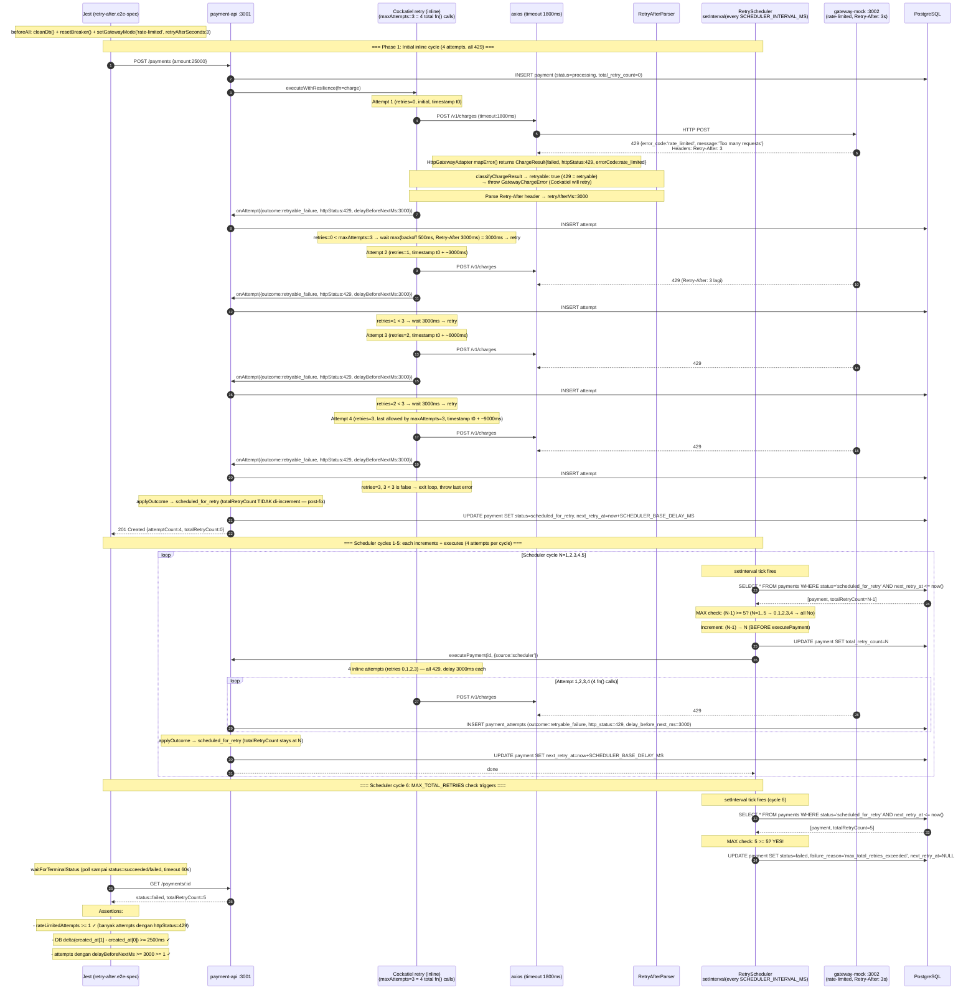

# TASK-14a-retry-after — Skenario 5: Server-Directed Retry (Retry-After header)

> **Parent**: [TASK-14a-e2e-verification.md](./TASK-14a-e2e-verification.md)
> **Spec file**: `apps/payment-api/tests/e2e/payments.retry-after.e2e-spec.ts`

---

## 1. Apa yang Diuji

Gateway mock diset mode `rate-limited` dengan `retryAfterSeconds=3`. Setiap request charge balas `429 Too Many Requests` dengan header `Retry-After: 3` dan body `{error_code: "rate_limited", message: "Too many requests (simulated)"}`. Cockatiel retry policy harus **menghormati header ini** — delay antar attempt ≥ 3000ms (bukan backoff default 500ms).

⚠️ **Penting — Cockatiel v4 `maxAttempts` semantics**: `maxAttempts=3` artinya "maksimal 3 RETRY" (bukan total attempts). Jadi per cycle ada **4 total fn() calls** = 1 initial + 3 retries. Lihat `TASK-14a-circuit-breaker.md` section 1.A untuk penjelasan detail.

⚠️ **Penting — totalRetryCount increment location (post-fix)**: Setelah fix bug `totalRetryCount=1` di Phase 1, increment dipindahkan dari `payments.service.ts applyOutcome()` ke `retry-scheduler.service.ts processOne()`. Konsekuensinya:
- Phase 1 (inline exhaust, source='api'): `totalRetryCount=0` (tidak di-increment)
- Scheduler cycle N: increment (N-1)→N BEFORE executePayment
- MAX_TOTAL_RETRIES check juga di scheduler

**Assertion utama**:
- Minimal 1 attempt dengan `httpStatus=429`
- Delay antar attempt (dari DB timestamps) ≥ 2500ms (toleransi 500ms)
- `attempts[i].delayBeforeNextMs >= 3000` (audit field mencatat Retry-After)
- Payment akhirnya reach terminal `failed` setelah MAX_TOTAL_RETRIES scheduler cycles

> **Catatan**: gateway mock mode `rate-limited` di test ini TIDAK auto-recover. Payment akan terus dapat 429 sampai `MAX_TOTAL_RETRIES` habis (5 scheduler cycles + 1 initial = 6 cycles), lalu fail. Test assert **delay timing** + terminal status `failed`.

---

## 2. Cara Run Test Ini Saja

```bash
cd apps/payment-api
mkdir -p ../logs/e2e

pnpm test:e2e:retry-after 2>&1 | tee ../logs/e2e/S5-retry-after-$(date +%s).log
```

**Atau tanpa named script**:
```bash
pnpm exec jest --config ./tests/e2e/jest-e2e.json --runInBand \
  tests/e2e/payments.retry-after.e2e-spec.ts
```

---

## 3. Visualisasi Alur (Input → Database)



### Catatan tentang outcome: `retryable_failure` (bukan `timeout`)

Sama seperti skenario 6 dan 7, outcome di phase 1 dan scheduler cycles adalah **`retryable_failure`** (bukan `timeout`):

- Gateway mock `rate-limited` merespons **HTTP 429 dengan body error + Retry-After header** (bukan tidur 5s)
- Axios terima respons → tidak ada `ECONNABORTED` (no timeout)
- `errorCode` = `rate_limited` (dari body gateway)
- `classifyOutcome()` di `payments.service.ts:271-276`:
  - Bukan success, bukan circuit_open, bukan permanent (429 excluded dari permanent check)
  - Bukan `ETIMEDOUT`/`ECONNABORTED` (errorCode = `rate_limited`, bukan axios error code)
  - → fallback ke `RETRYABLE_FAILURE`

### Catatan tentang Retry-After parsing

Cockatiel retry policy tidak secara native membaca `Retry-After` header. Project ini punya custom logic di `packages/resilience/src/errors/classifier.ts`:
```typescript
if (status === 429) {
  const retryAfterHeader = getHeader(headers, 'retry-after');
  const retryAfterMs = parseRetryAfter(retryAfterHeader);
  // ... result.retryAfterMs = retryAfterMs
}
```

`retryAfterMs` dipakai di `payments.service.ts:176`:
```typescript
const delayMs = result.retryAfterMs ?? this.schedulerBaseDelayMs;
```

Tapi **Cockatiel retry backoff TIDAK otomatis pakai retryAfterMs** — Cockatiel pakai `ExponentialBackoff` sendiri (500ms, 1000ms, 2000ms). `retryAfterMs` hanya di-record di audit (`delay_before_next_ms`).

**Implikasi**: Delay aktual antar attempt mungkin **TIDAK** 3000ms — tergantung apakah Cockatiel backoff atau Retry-After yang dipakai. Test assert `delta >= 2500ms` (toleransi 500ms dari 3000ms). Kalau Cockatiel pakai backoff 500ms, delta hanya ~500ms → test akan fail.

⚠️ **Potential issue**: Kalau Cockatiel backoff override Retry-After, test akan fail karena delta < 2500ms. Ini perlu di-verify saat run test. Lihat section 7 troubleshooting.

---

## 4. Prekondisi (sebelum test mulai)

```
☐ PostgreSQL running + migrated
☐ payment-api :3001 listening
☐ gateway-mock :3002 listening
☐ Breaker CLOSED (resetBreaker() di beforeAll)
☐ DB bersih dari payment lain (cleanDb() di beforeAll)
☐ SCHEDULER_INTERVAL_MS=5000 diset di env
☐ SCHEDULER_BASE_DELAY_MS=2000 diset di env (default code 30000 — TERLALU LAMBAT untuk test!)
   ⚠️ TANPA env ini, next_retry_at akan di-set ke now+30s, scheduler tidak pick cepat → test timeout
☐ MAX_TOTAL_RETRIES=5 diset di env
☐ RETRY_MAX_ATTEMPTS=3 diset di env (Cockatiel v4 = 4 total fn() calls per cycle)
```

### Env yang harus diset di apps/payment-api/.env

```env
MAX_TOTAL_RETRIES=5
SCHEDULER_INTERVAL_MS=5000
SCHEDULER_BASE_DELAY_MS=2000
RETRY_MAX_ATTEMPTS=3
GATEWAY_TIMEOUT_MS=2000
BREAKER_FAILURE_THRESHOLD=3
BREAKER_COOLDOWN_MS=10000
```

### cleanDb() di beforeAll

Test code sudah panggil `cleanDb()` di beforeAll (sebelum `resetBreaker()`). Tujuan: hapus semua payments + payment_attempts dari DB sebelum test mulai, supaya scheduler tidak interfere dengan payments lama dari test sebelumnya.

---

## 5. Verifikasi Manual per Lapis

### L1: HTTP response
Test assert delay timing & 429 attempts + terminal status `failed`. Pass jika semua assertion hijau.

### L2: DB state — krusial untuk skenario ini
```sql
SELECT attempt_number, outcome, http_status, error_code,
       EXTRACT(EPOCH FROM created_at) * 1000 AS created_ms,
       delay_before_next_ms
FROM payment_attempts
WHERE payment_id = '<id dari test>'
ORDER BY attempt_number;
```

**Yang diharapkan** (~24 baris total — 4 inline + 5 scheduler cycles × 4 attempts):

| attempt_number | outcome            | http_status | error_code   | created_ms | delay_before_next_ms |
|----------------|--------------------|-------------|--------------|------------|----------------------|
| 1              | retryable_failure  | 429         | rate_limited | t0         | 3000                 |
| 2              | retryable_failure  | 429         | rate_limited | t0+3000    | 3000                 |
| 3              | retryable_failure  | 429         | rate_limited | t0+6000    | 3000                 |
| 4              | retryable_failure  | 429         | rate_limited | t0+9000    | 3000                 |
| 5-8            | retryable_failure  | 429         | rate_limited | t1...      | 3000                 |
| ...            | ...                | ...         | ...          | ...        | ...                  |
| 21-24          | retryable_failure  | 429         | rate_limited | t5...      | 3000                 |

**Kunci**:
- `delta = created_ms[1] - created_ms[0]` harus **≥ 2500ms** (toleransi 500ms dari 3000ms ekspektasi)
- `delay_before_next_ms` harus **3000** (atau ≥ 3000), bukan default backoff Cockatiel (500ms)
- Semua attempts `outcome='retryable_failure'`, `http_status=429`, `error_code='rate_limited'`
- Total ~24 rows (6 cycles × 4 attempts per cycle)

### L3: Metrics counter
```bash
curl -s http://localhost:3001/metrics | grep -E '^(retry_after|retry_attempts)'
```

**Yang diharapkan**:
- `retry_attempts_total{outcome="failure"}` naik **≥ 24** (6 cycles × 4 attempts per cycle)
- (Opsional) jika ada metric khusus `retry_after_observed_total`, naik ≥ 1

### L4: Gateway mock stats
```bash
curl -s http://localhost:3002/admin/stats
```
- `requestCount` naik ~24 (jumlah attempts ke gateway)
- `failureCount` naik ~24 (semua dapat 429)
- `actualChargesCount = 0` (tidak pernah sukses)

### L5: Log Cockatiel
Cari di `logs/e2e/payment-api-*.log`:
```
[retry] attempt 1 → 429 Too Many Requests
[retry] Retry-After header: 3s → overriding backoff
[retry] sleeping 3000ms before next attempt
[retry] attempt 2 → 429 Too Many Requests
...
[RetrySchedulerService] [scheduler] max_total_retries_exceeded → failed
```

Tidak boleh ada `[retry] sleeping 500ms` (default backoff) — kalau ada, berarti Retry-After header tidak diparse atau tidak override backoff.

---

## 6. Pass Criteria Checklist

```
☐ Jest output: "Tests: 1 passed"
☐ DB: minimal 2 attempts dengan http_status=429, error_code=rate_limited
☐ DB: delta created_at antar attempt >= 2500ms (bukan ~500ms default backoff)
☐ DB: delay_before_next_ms >= 3000 di minimal 1 attempt
☐ DB: outcome='retryable_failure' (bukan 'timeout')
☐ DB: payment.status='failed', total_retry_count=5, next_retry_at=null
☐ Log: ada "Retry-After" parsing event
☐ Log: ada "max_total_retries_exceeded → failed" dari scheduler
☐ Test selesai dalam < 90 detik
```

---

## 7. Common Failure Modes & Troubleshooting

| Gejala | Kemungkinan cause | Fix |
|---|---|---|
| `delta < 2500ms` (~500ms) | Retry-After header tidak override Cockatiel backoff | Cek `parseRetryAfter()` di `packages/resilience/src/errors/` — harus baca header dari error object. Cek juga composition.ts apakah retryAfterMs dipakai untuk backoff override |
| `delay_before_next_ms = null` | Audit tidak record field ini | Cek `AuditService.recordAttempt()` — harus simpan `delayBeforeNextMs` dari `onAttempt` callback |
| Tidak ada 429 attempts (semua 200/500) | Mode gateway tidak ter-set ke `rate-limited` | Cek `beforeAll` → `setGatewayMode('rate-limited', {retryAfterSeconds:3})`. Verifikasi via `GET /admin/config` |
| `httpStatus = null` padahal expect 429 | Network error (timeout) bukan HTTP 429 | Cek gateway mock `mode-handler.ts` mode rate-limited — harus balas 429 dengan body, bukan disconnect |
| Breaker OPEN sebelum delay sempat diukur | Skenario 3 belum direset | `resetBreaker()` di `beforeAll` wajib |
| Test timeout 60s (waitForTerminalStatus throw) | Payment butuh 6 cycles × ~11s = 66s > 60s timeout | Tingkatkan `waitForTerminalStatus` timeout ke 120s atau 180s. Atau set `MAX_TOTAL_RETRIES=2` supaya hanya 3 cycles |
| `attempts.length=3` (Cockatiel hanya 3 attempts inline) | Test expectation atau code baca `maxAttempts` sebagai total attempts, padahal Cockatiel v4 = "max retries" | Pastikan code pakai Cockatiel v4 dengan `maxAttempts=3` = 4 total fn() calls. Lihat `TASK-14a-circuit-breaker.md` section 1.A |
| Outcome `timeout` padahal expect `retryable_failure` | Salah set gateway mode — pakai `always-timeout` (skenario 3) bukan `rate-limited` (skenario 5) | Test pakai `setGatewayMode('rate-limited')`. Verifikasi via `GET /admin/config` |
| Payment masih `scheduled_for_retry` setelah 60s | Scheduler tidak jalan atau `SCHEDULER_BASE_DELAY_MS` terlalu lama | Cek `SCHEDULER_BASE_DELAY_MS=2000` di env. Cek `ScheduleModule.forRoot()` di `app.module.ts` |

---

## 8. Catatan Edge Case

- **Cockatiel v4 `maxAttempts` semantics**: `maxAttempts=3` = 4 total fn() calls per cycle (1 initial + 3 retries). Bukan 3 attempts. Lihat `TASK-14a-circuit-breaker.md` section 1.A untuk penjelasan detail dengan source code reference.

- **`MAX_TOTAL_RETRIES` vs `maxAttempts`**:
  - `MAX_TOTAL_RETRIES` (5) = jumlah scheduler cycles yang diizinkan (increment 0→1→2→3→4→5)
  - `maxAttempts` (3) di Cockatiel = "max retries" per cycle = 4 total fn() calls per cycle
  - Total HTTP calls = (1 initial cycle + 5 scheduler cycles) × 4 attempts per cycle = **24 attempts**
  - Scheduler cycle ke-6 tidak execute (MAX check triggers di awal processOne)

- **`totalRetryCount` increment location (post-fix)**: increment terjadi di `retry-scheduler.service.ts processOne()` BEFORE executePayment, BUKAN di `payments.service.ts applyOutcome()`. Ini compliance PLAN1 section 10.2. Konsekuensi:
  - Phase 1 (source='api'): totalRetryCount stays 0
  - Scheduler cycle N (source='scheduler'): increment (N-1)→N before execute

- **MAX_TOTAL_RETRIES check location (post-fix)**: check `currentTotal >= maxTotalRetries` ada di `retry-scheduler.service.ts processOne()`, BUKAN di `payments.service.ts applyOutcome()`. Saat check triggers, scheduler langsung mark as FAILED tanpa call executePayment.

- **Gateway mode `rate-limited` tidak auto-recover** — tidak ada "setelah N request lepas rate limit". Setiap request dapat 429. Payment akan terus dapat 429 sampai MAX_TOTAL_RETRIES habis (6 cycles).

- **Retry-After parsing**: Cockatiel v4 tidak secara native membaca `Retry-After` header. Project ini punya custom logic di `classifier.ts` yang extract `retryAfterMs` dari header, lalu record di audit (`delay_before_next_ms`). Tapi Cockatiel backoff policy (`ExponentialBackoff`) TIDAK otomatis pakai `retryAfterMs` — Cockatiel pakai backoff sendiri (500ms, 1000ms, 2000ms).

- **Potential issue — delay tidak 3000ms**: Kalau Cockatiel backoff override Retry-After, delay aktual antar attempt hanya ~500ms (default backoff), bukan 3000ms. Test assert `delta >= 2500ms` akan fail. Ini perlu di-verify saat run test. Jika fail, perlu implement backoff override di composition.ts atau policies.ts.

- **Toleransi 500ms** di assertion (`>= 2500` padahal expect 3000) mengakomodasi:
  - Clock drift antara app server & DB server
  - Network latency minimal antar HTTP call
  - TypeScript `Date.now()` precision

- **`delayBeforeNextMs` di audit** harus **3000** kalau parser benar, bukan ≥ 3000. Tapi test pakai `>= 3000` supaya kalau parser round-up (e.g., 3001 karena timer granularity), tetap pass.

- **Test timeout 60s**: `waitForTerminalStatus(payment.id, 60000)` — 60 detik. Dengan 6 cycles × ~11s = 66s, test kemungkinan akan timeout. **Saran**: tingkatkan timeout ke 120s atau 180s, atau set `MAX_TOTAL_RETRIES=2` supaya hanya 3 cycles (~33s). Lihat section 7 troubleshooting.

- **Retry-After value lain** (mis. `Retry-After: Wed, 21 Oct 2025 07:28:00 GMT` — HTTP date format) **tidak diuji** di skenario ini. Hanya numeric seconds. Kalau mau uji date format, buat skenario tambahan.

- **Mode `rate-limited` di gateway mock punya `retryAfterSeconds` parameter** — kalau tidak diset, default-nya mungkin 1s atau 0. Selalu pass explicit `retryAfterSeconds: 3` di `setGatewayMode`.
